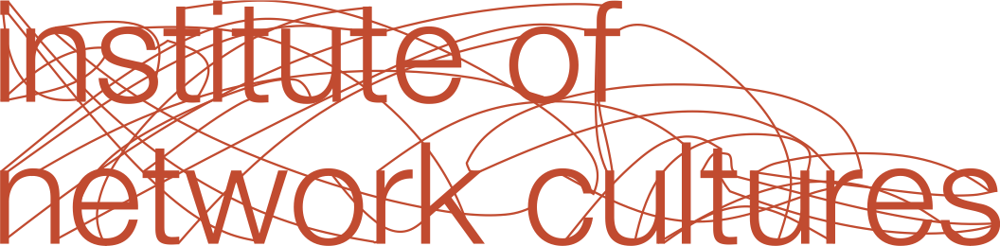

#Critical Meme Reader: Global Mutations of the Viral Image

###Edited by Chloë Arkenbout, Jack Wilson and Daniel de Zeeuw

INC Reader \#15

###**INC Reader \#15**

###**Critical Meme Reader: Global Mutations of the Viral Image**

Editors: Chloë Arkenbout, Jack Wilson, Daniel de Zeeuw

Copy editor: Geoff Hondroudakis

Cover Design: Marijn Bril

Design and EPUB development: Chloë Arkenbout

Printing and binding: GPS Group

Published by the Institute of Network Cultures, Amsterdam 2021

ISBN print: 9789492302762

ISBN EPUB: 9789492302779 

**Contact**

Institute of Network Cultures

Amsterdam University of Applied Sciences

Emai: <a href="mailto:info@networkcultures.org">info@networkcultures.org</a> / <a href="mailto:viralimageculture@networkcultures.org">viralimageculture@networkcultures.org</a>

Web: [www.networkcultures.org](http://www.networkcultures.org) / <a href="http://www.networkcultures.org/viralimageculture">www.networkcultures.org/viralimageculture</a>

Order a copy or download this publication for free at:
<a href="http://www.networkcultures.org/publications">www.networkcultures.org/publications</a>

Subscribe to the INC newsletters: <a href="http://www.networkcultures.org/newsletter">www.networkcultures.org/newsletter</a> / <a href="http://www.networkcultures.org/viralimageculture">www.networkcultures.org/viralimageculture</a>

This publication is licensed under the Creative Commons Attribution
NonCommercial ShareAlike 4.0 Unported (CC BY-NC-SA 4.0). To view a copy
of this license, visit <a href="http://www.creativecommons.org/licences/by-nc-sa/4.0/">www.creativecommons.org/licences/by-nc-sa/4.0/</a>.

#**Global Mutations of the Viral Image**

###Chloë Arkenbout, Jack Wilson and Daniël de Zeeuw 

Memes are bastards, and we love them for it. But memes are bastards in
the sense that they are born from two seemingly incompatible ontological
registers: an unholy matrimony of semiosis and virality, sense and
nonsense, signification and circulation. More on that later. First,
let's acknowledge that the meme is also an infantile and laughable term,
as are all words that repeat themselves. Yet—encountering its own
stupidity, and making this into its generative principle—it is *not*
ashamed; like any self-respecting idiot savant, it never ceases to
persist in its own convoluted wisdoms. ‘Insanity is doing the same thing
over and over again and expecting different results’, as Einstein’s
scientific earworm had it. Call us crazy then, but last time we checked,
isn’t there difference in repetition? Deleuzean mic-drop.

Notoriously, the meme screws with time, and in this it is pompously and
parodically postmodern. Take the memetic format of the animated reaction
image. Einstein smoking a pipe, *ad infinitum* (fig. 1); the video
timecode permanently skips from the seventh second to the eighth, to the
seventh, to the eighth, tik tok, a historical figure evacuated from
history. Has the viral image exorcized the Barthesian *punctum*? No:
because even when it purifies time from melancholy, it leaves the purely
formal mystery of time intact. And the subject, sucked into its vortex,
and true to its sado-masochistic genealogy, experiences joy at the
spectacle of its own decentering. Ha-Ha.

The meme also screws with narrative, or what could be called the
gentrification of time. A truck about to run into a giant traffic pole,
forever captured from multiple angles. The existential dread of
infinite, contagious suspense: the antithesis of comic relief. Nervous
laughter. Please let it end, a feeling intimately known by those
suffering from an involuntary imperative to repeat: obsessive compulsive
disorder. Wash your hands, turn off the gas, lock the door. Do it again.
They demand from the object a solution, namely to rescue them from the
abysmal tension that is ripping them apart. It’s a kind of magic. It’s a
kind of magic. Repetition without end. The curtain never falls on
everyday life as the substrate of the historical Event, which is
singular and unrepeatable. In the meme, the Event becomes fractured and
folded in a million little fragments scattered throughout asynchronous
time. The world, as Walter Benjamin held, is only slightly, nearly
imperceptibly changed after the arrival of the Messiah. Yet through it,
*everything* becomes different, and therein lies its revolutionary
thrust.

 

 

Memes are also tricksters, as they make us believe we control them while
it’s actually the other way around. Classic Zizek: ‘Memes, misperceived
by us, subjects, as means of our communication, effectively run the
show’.[^02introduction_1] Previous critiques of memetics by pious humanists for not
sufficiently taking agency and meaning-making into account fail to
perceive this radical *copernican turn* in modern scientific thought. To
reject memetics on the basis of its reduction of culture to genetic
principles of evolutionary biology *à la* Dawkins and his semi-religious
atheist followers (how ironic), while superficially legitimate, actually
throws out the meme with the bathwater.

Returning to the meme as the bastard offspring of two different
ontological registers, we could say the meme acts as a medial interface
between asignifying and signifying semiotic systems. For Felix Guattari
and later Maurizio Lazzarato in *Signs and Machines: Capitalism and the
Production of Subjectivity*, asignifying semiotics refers to an
operational system of signs that operates below and without any
reference to human subjectivity, sociality, representation, and
intersubjective meaning, and that extradiscursively acts on human and
non-human entities by controlling the parameters of their existence. In
this reading, the meme traverses and connects two assemblages of
domination: that of social subjection and machinic enslavement. Whereas
the former acts on the level of ideology and interpellation,[^02introduction_2] the
latter instead ‘operates at the level of deterritorialised codes and
non-representational signals where the individual becomes a cog of a
larger machine that reduces all singular content to an abstract value or
axiom’.[^02introduction_3]

The growing prevalence of machinic enslavement over mechanisms of social
subjection must in a large part be attributed to information and
computation technologies. As Gary Genosko notes, in developing his
theory of information, Claude Shannon radically disjoints the notion of
information from that of semantic content, and instead proposes a purely
technical definition.[^02introduction_4] Put dramatically, from a cybernetic
engineering perspective, the meaning of a message seemingly becomes
irrelevant, or at least expelled from the equation. It was this
theoretical challenge put forward by Shannon that Baudrillard took up in
his polemic with the media theorist Hans Magnus Enzensberger.
Questioning the latter’s emancipatory project of a socialist
appropriation of the media, Baudrillard argued that mass media undercuts
representation on a much deeper and more structural level. For him,
media obey a fundamentally different logic than *representation*, namely
that of *simulation*. This is a more radical notion than Debord’s
earlier critique of the society of the spectacle, in that the spectacle
still assumes an underlying reality from which it alienates its
audiences.

Is signification altogether superfluous, then? Does it still matter
*what* the image says, or merely *how* it circulates, e.g. how it is
effectively operationalized in an informational milieu? But perhaps we
should put the question differently: is there *jouissance* in
asignification? Is this perhaps the secret to the meme’s unlikely
success? Noting the traditional link between the image and the level of
representation and ideology, Bueno asks:

> But what if images could also be studied from the non-representational
> and asignifying standpoint of machinic enslavement? Would it be
> possible to forge the notion of asignifying images in similar terms to
> Guattari's concept of asignifying semiotics, that is, as a conceptual
> apparatus that helps grasping the machinic dimension of contemporary
> capitalism?[^02introduction_5]

This is also exactly the question memes pose to us. As Geoff
Hondroudakis argues in his contribution to this reader:

> The significance of circulation and exchange in memes—their
> evolutionary function as asignifying network symbionts—is precisely
> because they mediate signifying content with impersonal scales. The
> particular quality of the online memetic ecology is its inclusion of
> both registers. Meme culture is a process of mediation latticing the
> gulf between the scales of affect and identity, information, and
> social system. (add page no. in final reader)

As they metastasized from the digital periphery to the mainstream, memes
have seethed with mutant energy. From now on, any historical event will
be haunted by its memetic double—just as any pandemic will have its own
infodemic that will recursively act upon it—issuing in the kinds of
cross-contamination that Baudrillard already prefigured in the 1980s:
the convoluted age of simulacra, of epistemological crises associated
with postmodernity, and of a generalized informational obesity whose
gravitational pull bends reality to whatever ‘program’, in the multiple
senses of that term.

 

Enter: a 100 hour-long video of Nyan cat on YouTube. The perverse
delight of endless repetition, the way it tries to make no sense of
nonsense: co(s)mic sameness, semiotic entropy. Repeat a word long enough
and it loses all meaning, leaving a bad taste in your mouth. When
meaning is an effect of the inscription of difference, it makes sense
that repetition undoes sense. Only in laughter do we momentarily glimpse
our own non-knowledge, which is the closest we probably get to reckoning
with it.

Our laughter, then, is precisely our defence against our recognising
nothing. To stare too long at the meme is to see its R'lyehian semiotic
geometry and therein the birth spasms of an alien whose origin may be in
human cultural production but whose form now surpasses our capacities to
even comprehend. The single meme, then, has a concealing function
wherein horror is sublimated into humor, and we only become aware of
this process when it fails: the algorithmic grotesque of ‘BURIED ALIVE
Outdoor Playground Finger Family Song Nursery Rhymes Animation Education
Learning Video,’ ‘Double Pregnant FROZEN ELSA vs DOCTOR! w/ Spiderman vs
Joker Maleficent Hulk Baby - Superhero Fun’ and the myriad other
examples of recombinant YouTube Kids’ grotesquery, the dead eyes of
‘Momo,’ or the psychic terrorism of the ‘Blue Whale Challenge’ that
Anirban Baishya discusses in this collection:

> Memetic terror is an affective, networked fear of breaching. It
> replicates itself through exposure to repeated information,
> reverberating throughout digital infrastructures, as it interacts with
> personal devices, policy, and regulation, as well as users’ bodies.
> (add page no. in final reader)

These moments get their affective charge from witnessing—however
briefly—the seething incomprehensibility from which the meme emerges and
suffuses our being-in-the-world. In many ways, then, the manner in which
the meme covers—or reveals—an apparatus of pure terror is analogous to
the function of the spectres, zombies, and demons who emerge with the
arrival of the deterritorializing forces of global capitalism.[^02introduction_6]
Indeed, this is precisely the thesis of Leslie Braun’s reflection on how
infrastructures of networked communication, extractive capitalism, and
myth in the Democratic Republic of the Congo come to be articulated
together in a viral video of the mystical siren Mami Wata, apparently
captured by Chinese workers laying submarine internet cable.

What this constellation already alludes to is how, as arguably
synonymous with the internet as such, the meme revolves in the orbit of
what Peter Galison has called the ‘ontology of the enemy’.[^02introduction_7] We concur
with his claim that there is a problem with talking about ICT and the
web as if they were not embedded in a military way of organizing things.
This means that in the case of memes, as in the acronym 3C used to
denote military information systems, when we think the C for
communication we must always also at the same time think the other two
Cs: command and control. Paraphrasing Clausewitz’ famous dictum on
politics, we could say that digital communication is the continuation of
war by other means. Hence the vernacular notion of ‘meme warfare’. The
roots of current concerns over Russian disinformation campaigns must
arguably be sought here, in the convergence of military,
communicational, economic, and political apparatuses, rather than in a
supposed erosion, by corporate platforms or malicious deep state actors,
of an otherwise healthy digital democratic public sphere in the
Habermasian sense.

In a presentation at the 2011 Social Media for Defence Summit, the
DARPA-associated researcher Robert Finkelstein described the
possibilities of ‘military memetics’ and how this paradigm might be
deployed in domains as diverse as PSYOPS, counter-intelligence,
recruitment, public relations, and even nuclear deterrence.[^02introduction_8] While we
might take comfort in the feeling that the most successful of these
specific memetic efforts was likely the hysterical injunction to ‘Press
F to pay respects’ (fig. 4) in the video game and US military
recruitment tool *Call of Duty: Advanced Warfare*—that is, as far as we
know (who is to say that the psychic architectures of our corporate
platforms are not aspects of a PSYOP being done to us all?)—this
presentation speaks to the military history and darker side of the meme.
In its spontaneous evocation of laughter—which is classically understood
to bypass subjectivity by acting convulsively on the body itself—is a
prototypical instance of ‘influence’ as a tactical acting at a distance,
changing the psycho-physical makeup of the agents it targets. Acting at
a distance: isn’t that the very definition of media?

 

From state actors to insurgents, Memes have proven to be powerful
weapons in informational warfare. Indeed, even the canard that ‘the left
can’t meme’ is a meme unto itself, as Andy King tells us in her essay
‘Weapons of Mass Distraction: Far-right Culture-jamming Tactics in
Memetic Warfare’:

> The alt-right \[...\] have molded their image into that of an underdog
> – a convenient ploy to justify aggressive tactics such as spamming
> pro-choice Facebook groups with images of aborted fetuses, raiding
> subreddits and shitposting cringe compilations of angry feminists and
> liberals appearing to ‘cancel free speech’. Their outreach was far and
> wide – no corner of the internet was spared. (add page no. in final
> reader)

If we move, however, out from under the shadow of memes’ dark side, we
see that they can too be critical acts of positive political
intervention as well. As King says, memetic warfare is more immediate
and accessible than real-life protests; it is not susceptible to police
disruptions and pandemics. Memes are excellent networked objects for
challenging state narratives, executing counter-hegemonic strategies,
and creating a feeling of solidarity as humor is usually one of the few
things those in (abusive) political power cannot repress. For example,
Saeeda Saeed, an activist from Saudi Arabia, devised an Instant Meme
Noise Generator that spews out nonsensical insults to the top 10 Saudi
state-run Twitter accounts in an effort to drown out their posts,
directly influencing the online political discourse.

These counter-strategies, however, are not wholly bound to the online
domain and can have concrete, real-world effects. In ‘Your Feed is a
Battleground: A Field Report of Memetic Warefare in Turkey’, Särp Ozer
explains that memes portraying the former Minister of Finance and
Treasury—Berat Albayrak—as an incompetent dummy caused him so much
humiliation that it prompted his resignation. Memes, like those made by
Anahita Neghabat, a meme maker and activist who criticizes the
right-wing climate of Austria with her Instagram page
@ibiza\_austrian\_memes, highlights how memes are an essential aspect of
collective empowerment strategies that are used by marginalized actors
to build resilience through a process of self-affirmation.

So while we often think of this in terms of memes being used for
destruction, confusion and chaos, they are equally effective as tools in
designing a future we want to see – just as the Trans Bears do in their
futuristic meme worlds that explore what could happen if we used memes
to escape our the current moment. Rather than wallow in our present
nihilistic memescape, the Trans Bears deploy memes as science fiction
tools for speculative worldbuilding, as a means to envision scenarios
set in alternative places and times based on pluralistic, positive
visions. The potential for memes to have this effect beyond their media
context was there all along, but the intensification of their
circulation around the world has increased the speed of and potential
for this process to occur.

As Grant Bollmer’s chapter looks back upon the history of memes as a
means to reconfigure or present understanding of them, we conclude this
chapter in the same manner. Originally uploaded to the website
Newgrounds and popularized by Something Awful and 4chan, the classic
meme ‘all your base are belong to us’ turned twenty this year. Smells
like early 2000s teen spirit. In the gloomy vacuum left by the dot-com
crisis, the new digital frontier lay wide open for the taking. Bases
were taken, new properties claimed. Libertinism is the cryptocurrency of
youthful hubris. Platform or surveillance capitalism wasn’t really a
thing yet (although a lot of the pawns were being positioned in
strategic anticipation while we were enjoying cute cat videos on Google
Videos).

In the mid-2010s, the ‘us’ in ‘all your base’ was identified as a highly
media-literate culture of young white men oblivious to their own
privileged position in the larger web of things.[^02introduction_9] But as popular
culture has been absorbed into a kind of memetic spectrum, this category
of ‘us’ is revealed to have always been inhabited by a heterogeneity of
agents. While we can see this see this in Jacob Sujin Kuppermann’s
history of ‘Gopod’ on the Whole Earth ‘Lectronic Link, and İdil Galip’s
reflection on the grotesque on Instagram, another excellent example is
in Caspar Chan’s account of Pepe the Frog’s resurrection in Hong Kong.
No longer the worn out crypto-facist figure the alt-right and
all-too-credulous news media worked together to create, Pepe has become
a symbol of solidarity for protesters as the city heaved with protests
over 2020. In Pepe, as well as in the signs, phrases, and—really—the
entire event of the 6th of January 2021’s storming of the US Capitol
Building, we can see that memes have gone beyond the internet, beyond
discourse, and beyond the image.

In February 2021, a digital rendition of the famous Nyan Cat GIF meme
was sold as a non-fungible token (NFT) by its creator Chris Torres for
almost 600,000 USD. NFTs are—in theory—a mechanism of ‘owning’ artworks
whose digital basis initially foreclosed their monetisation. While what
this amounts to is essentially a certificate that says ‘I own this’ the
blockchain technology that NFTs depend on nevertheless interrupts the
messy copypasta of anonymous and collective vernacular creativity, whose
progressive potential lied in having done away with any distinction
between original and copy, authentic or fake, private ownership and
communal stock, author and audience. Blockchain operationalizes a
cryptolibertarian logic of singularity and property against the logic of
promiscuous multiplicity offered by meme culture. Yet, ironically, it is
precisely the precarious ‘hacker class’ of online influencers that may
benefit from blockchain tech and social media fame to claim ownership
and profit from their immaterial labors—a dilemma Clusterduck’s essay in
this reader explores.

What will become of memes, then, hinges on developments too elaborate,
unstable, and entangled to fully anticipate. In their conceptual
idiosyncrasy and their phenomenal evanescence, memes reflect the
socio-technical milieu in which they insert themselves. And as they
become woven into our communicative repertoires, the meme in all
likelihood will lose claim to its status as a unique cultural or digital
object. There will be a time when this meme reader will make people
smile nostalgically, and there will be a time when it will all seem all
so ridiculous and stupid. But, while we do not want to heroize memes,
they do, *for us now*, represent a critical moment when the
instrumentarium of a global media spectacle is looped and becomes a
self-consuming excess, and the life it implicates in its fundamental
irresponsibility suddenly bursts out in laughter. The question remains
what kind of laughter memes potentialize, and who is laughing: is it the
liberating, carnivalesque kind, or the grotesque kind that defers to
viral media in nihilistic embrace? Is it the kind of emancipatory
laughter of political activists, or that of authoritarian leaders and
their troll armies as they leverage memetic tactics to maliciously nudge
their subjects or incite violence against minorities? The different
artistic, theoretical, and political contributions collected in this
volume render different answers to these questions, and we hope you
enjoy them.

## References

Bueno, Claudio Celis. “Harun Farocki's Asignifying Images.” *tripleC*
15, no. 2 (2017): 740-54.
<a href="https://triple-c.at/index.php/tripleC/article/download/874/1040?inline=1">https://triple-c.at/index.php/tripleC/article/download/874/1040?inline=1</a>.

Comaroff, “Alien-Nation: Zombies, Immigrants, and Millennial
Capitalism.” *South Atlantic Quarterly* 101, no. 4 (October 1, 2002): 779–805. <a href="https://doi.org/10.1215/00382876-101-4-779">https://doi.org/10.1215/00382876-101-4-779</a>.

Finkelstein, Robert. 2011. “Tutorial: Military Memetics.” Paper
presented at *Social Media for Defence* *Summit*, Alexandria, VA,
October 24, 2011.

Galison, Peter. “The Ontology of the Enemy: Norbert Wiener and the
Cybernetic Vision.” *Critical Inquiry* 21, no. 1 (Autumn, 1994):
228-266.

Genosko, Gary. “Information and Asignification.” *Footprint* 8, no. 1
(Spring 2014): 13-28.

Huxtable, Simon. “Remembering a Problematic Past: TV Mystics,
*Perestroika* and the 1990s in Post-Soviet Media and Memory.” *European
Journal of Cultural Studies* 20, no. 3 (June 2017): 307–23.
<a href="https://doi.org/10.1177/1367549416682238">https://doi.org/10.1177/1367549416682238</a>.

Lazzarato, Maurizio. *Signs and Machines: Capitalism and the Production
of Subjectivity*. Translated by Joshua David Jordan. Los Angeles, CA:
Semiotext(e), 2014.

Phillips, Whitney and Ryan M. Milner. *You Are Here: A Field Guide for
Navigating Polarized Speech, Conspiracy Theories, and Our Polluted Media
Landscape.* Cambridge: MIT Press, 2020.

Žižek, Slavoj. *Organs without Bodies: Deleuze and Consequences.* New
York: Routledge, 2016.

[^02introduction_1]: Slavoj Žižek, *Organs without Bodies: Deleuze and Consequences*
    (New York: Routledge, 2016), 123.

[^02introduction_2]: Maurizio Lazzarato, [*Signs and Machines: Capitalism and the
    Production of Subjectivity*, trans. Joshua David Jordan,
    Semiotext(e) Foreign Agents Series (Los Angeles, CA: Semiotext(e),
    2014), <a href="http://39.](https://www.zotero.org/google-docs/?nObmdR)">39.](https://www.zotero.org/google-docs/?nObmdR)</a>

[^02introduction_3]: Claudio Celis Bueno, “Harun Farocki's Asignifying Images,”
    *tripleC* 15, no. 2 (2017): 742.
    <https://triple-c.at/index.php/tripleC/article/download/874/1040?inline=1>.

[^02introduction_4]: Gary Genosko, “Information and Asignification,” *Footprint* 8, no.
    1 (Spring 2014): 13.

[^02introduction_5]: Bueno, “Harun Farocki's Asignifying Images,” 743.

[^02introduction_6]: J. Comaroff, “Alien-Nation: Zombies, Immigrants, and Millennial
    Capitalism,” *South Atlantic Quarterly* 101, no. 4 (October 1,
    2002): 779–805, <a href="https://doi.org/10.1215/00382876-101-4-779">https://doi.org/10.1215/00382876-101-4-779</a>; Simon
    Huxtable, “Remembering a Problematic Past: TV Mystics, *Perestroika*
    and the 1990s in Post-Soviet Media and Memory,” *European Journal of
    Cultural Studies* 20, no. 3 (June 2017): 307–23,
    <a href="https://doi.org/10.1177/1367549416682238">https://doi.org/10.1177/1367549416682238</a>.

[^02introduction_7]: Peter Galison, “The Ontology of the Enemy: Norbert Wiener and the
    Cybernetic Vision,” *Critical Inquiry* 21, no. 1 (Autumn, 1994):
    228-266.

[^02introduction_8]: Robert Finkelstein, “Tutorial: Military Memetics” (Social Media
    for Defence Summit, Alexandria, VA, October 24, 2011).

[^02introduction_9]: Whitney Phillips and Ryan M. Milner, *You Are Here: A Field Guide
    for Navigating Polarized Speech, Conspiracy Theories, and Our
    Polluted Media Landscape* (Cambridge: MIT Press, 2020).

#**Wojak’s lament: Excess and Voyeurism Under Platform Capitalism**

###Anthony Glyn Burton

Those of us with faint memories of the early internet may remember it
making a different appeal: nobody needed to know who you were if you
didn’t want them to. This memory is made all the fainter with every
login to a platform and the uncanny accompaniment of feeling watched by
an unseen specter. But to call it being watched isn’t entirely accurate:
barring traumatic malfunction, human watching leaves an impression on a
negentropic memory, one retained over time through its relations and
contingencies and callable based on these unknowable strata. Platforms,
meanwhile, must account for these memories through bits, electricity,
and power bills: hence what begins as negentropy fuels the entropic
decay produced by the bunker hoards, hoards that make up the traces of
action we undertake in surveillance media. Thus, what appears to the
patrons of computational prosthesis as Turing’s hypothesis fulfilled—the
congruence of data storage and human memory—in reality leads to a
homogeneity that, paradoxically, extinguishes this very dream of capture
and reenactment. These bunkers contain the data and, in turn, the
empirical objects, network configurations, and algorithms that provide
the infrastructural basis of the contemporary web, and the fast-twitch
access to these bits in stasis is the backbone of platforms’
phantasmagoric liveliness. But the algorithmic workings on this well of
data present to each of us a highly customized experience with the
warmth of a dark cave: frozen images of the other comprise this
ostensibly personalized existence.

What political possibilities are foreclosed, and in turn, what
possibilities are opened up by the contrast between this datafied memory
and human memory? While platforms engineer a custom loneliness in order
to generate the activity upon which their economic models are based,
there exists a paradoxical means by which this valorization machine is
confounded: memes, particularly those that articulate common experience
through representation. By leaving an affective impression that exceeds
their circulation, memes like Wojak and NPCs open the possibility for
the articulation of belonging and political subjectivity that exceeds
the capture, extraction, and frozen identities of platform capitalism.

On one hand, these extractive processes are the primary engine by which
the circulation that makes up platformed experience functions, and their
infrastructures shape both the possibility of what can be said, how one
can reply, and what content is fit for circulation. On the other hand,
there is a trace left over by those memes that articulate something
beyond homophilic formatting and data capture. There is the impression
of there being someone else out there, someone who is like me but not
me. Instead of being reified into the commodity form through the
capture, extraction, and storage of information, the circulation of
memes articulates the presence of an other. This other goes beyond the
cardboard cutout version of the social world and leaves the affective
impression of belonging. By exceeding its capture, memery points to a
potential avenue for transcending the formatting and freezing of digital
life into mere bunker data.

## The Phantasmagoric Social: Excess, Memes, and Affective Identification

In an aside of Chapter 2 in Platform Capitalism, Nick Srnicek contests
Tiziana Terranova’s view that user output is labor, claiming that since
‘most of our social interactions do not enter into a valorization
process… it is hard to make the case that what they do is labor,
properly speaking… \[instead\] advertising platforms appropriate data as
a raw material’.[^03chapter1_1] But this view of what constitutes valorization
assumes all that can enter into this process is only labor itself,
freely brought to market. While commodity capital self-valorizes through
the extraction built into alienated labor, Srnicek’s note opens the
question of what alienation, if not labor’s, constitutes this ‘raw
material’ from which the phantasmagoric social is constructed? True to
its ghostly presence, this raw material is mined from the iterative
production of affect. With the ‘anxiety of enjoyment’, Jodi Dean names
the compulsion to continually post that is engineered by platforms and
their construction of the phantasmagoric social. Activity on social
platforms provides a facsimile of sociality that, instead of leaving us
with the sense of accomplishment of furthering social bonds, postpones
this very drive in a masturbatory, junkish enjoyment.[^03chapter1_2] It is this
very deferral of affective closure—the neverending loop of alienated
utterance and activity—that constitutes the ‘raw material’ valorized by
platforms. In this sense, then, these platforms are machines that
circulate affect yet cancel the potential for activation. The
circulation of affect is the stream from which platforms extract surplus
value. Despite it not being an instance of exploitation in the classical
sense, there remains a valorization with a one-sided benefit. The
extraction of user data from platform activity gets something from us
that we ourselves have no use for, and relies on the continual
construction of something new to observe, something activating to react
to, and in turn new data to hoard in the bunker, to justify its own
subterranean existence. Called upon to reanimate the very process that
once gave it life, this data creates an closed loop that informs the
boundaries that mark out platforms and their social space: hence the
recommendation systems, sharing, nudges to circulate, and a resulting
homophily that signifies a welcome into an enclosed space.[^03chapter1_3]

This facsimile of social activity is the stuff of a platform’s memories.
Text is mined for things that, in the platform’s eye, signify meaning;
infrastructural syntaxes such as Like buttons and emoji reactions
provide a substitute for affective expression. As iterable objects,
then, memes in one sense engineer the very activity that creates
memories for capital’s data extraction machines. Yet in their
circulation as images, part of what they express exceeds these machines’
metrical tools. They are not the narrow expressive devices given from
above that format the potential for affective transfer, but instead
confound its measurement by exceeding the format that can be so
quantified. Machine learning libraries are (as of yet) underdeveloped in
identifying meaning in images. It is difficult for them to measure
anything in an image except the image’s similarity to those the machine
learning program has been trained upon: this confuses platform attempts
to capture user affect by measuring images. In their infinite
iterability and potential for remixing, memes retain the power to leave
impressions or traces much stronger than any infrastructural syntax can
hope to do by positing a necessary agential relationality between users
as both consumers and producers: in short, active humans involved in
their construction of their own social world.

In exploring this meme-cum-excess, I deal here with Wojak and his
friends, which we know otherwise as ‘NPCs’ or non-playable characters.
NPCs are figurative line-drawn characters usually engaged in some common
experience or experiencing some feeling. Wojak, the first character to
appear under this style, embodies this emotive expression though his
original slogan: ‘that feel when’. By providing a memetic face (and in
turn, a name) to affective states under network capitalism, the meme
genre has evolved to become the non-playable characters of a particular
social experience with particular sets of surface behaviour and
aesthetics.[^03chapter1_4] But it would be a mistake to dismiss NPCs as a Xeroxed
social or an exercise in stereotypes. Wojak and friends articulate an
experience that one may *know*, a flash of recognizability in their
representations of real archetypes or shared experiences. I may just as
easily locate myself in the commons when a doomer meme matches my
internal sentiments as I feel overly simplified or unfairly targeted by
a picture of the coomer beside a copy of Infinite Jest.[^03chapter1_5] This image
of the commons is the image of someone else out there, existing
alongside me. Memes circulate through networks, and there is an element
of affect that is produced in this traversal: impressions of the other
*who felt themselves in the NPC meme* are left and felt on me.[^03chapter1_6]

I’m using Wojak and NPC here interchangeably because while Wojak himself
might be the most recognizable type, he represents a genre of images
that share similarities both aesthetic (simple digital paint line
drawings) and functional (representing a ‘type’ of behaviors/appearances
that are found together) that comprise the NPC. Wojak’s name is a sort
of affective loanword, with the qualifier here a prime cut of digital
meaning mishmash: the word itself is Polish for ‘warrior’. It was the
username of a Polish user on the German chan board krautchan’s /int/
(international) board; the picture itself was posted by the user wojak,
and he claims that he found it on the Polish chan board vichan under the
original title ‘ciepła twarz.jpg’.[^03chapter1_7]

But there’s conflicting information. Part of the NPC genre, the ‘I wish
I was at home’ meme illustrating the inner monologue of a person at a
party, can be found first posted on the Wayback Machine from December
2009 on the website ’Sad and Useless.’ This is an image reposting
website that describes itself as the ‘The Most Depressive Site on the
Internet’, and likely not the original source of the image.[^03chapter1_8] Wojak,
likewise, makes it clear in his AmA that he found the picture at some
point before he posted it on Krautchan’s /int/. Yet short of the
original MS paint virtuoso who created the Wojak face emerging (let
alone being listened to!), it’s likely that these traces are the closest
that we’ll get to knowing the origin.[^03chapter1_9] From here, the concept of
wireframe MS paint figures that represent a particular affect,
monologue, or personality exploded into the many variations we know
today.

## NPCs and the Games They Play

It is in the iteration of NPC memes that there is potential for excess.
This excess is not, necessarily, politically palatable: as the digital
right[^03chapter1_10] has become increasingly outspoken, so too has it seemingly
held memery as a primary practice. Yet to dismiss NPC memes as solely
the domain of the digital right would be a mistake because it brackets a
fruitful opportunity to examine how they function in constructing
communities through the excess and refuse of platformed existence.

Take Chad. ‘Chad’ is the name given to an NPC-style character who
represents the archetype of a man who supposedly receives a
disproportionate share of women’s attention and sexuality. He is used to
represent the ultimate alpha male, the synthesis of the highest point on
each of the hierarchies that grow out of neoliberalism’s reconfiguration
of the social into the realm of the homo economicus[^03chapter1_11]. With Popeye
biceps, a Clark Kent jaw and a browline to block out the sun, he
represents an archetype of a person who is purportedly encountered
day-to-day, yet never exists within the communities to which he is
called to account. Chad is especially popular in digital incel
communities, whose chief ideology, the scientific black pill,
articulates a victimization complex and rank misogyny based on a rigidly
Manichean system of social value that locates themselves at the bottom.
The iterative and enclosed nature of the community (a nature of its own
making) prevents, by necessity, the existence of an *actual* Chad in its
midst, for the incel’s reflexive difference from Chad-types is how they
define their social existence. Yet Chad the *meme* appears both in
language and image as a sort of summoned Godhead among self-identified
incels. What is the function of this representation? By existing outside
the mass of players in the community, he becomes an imagined extension
of the incel’s own existence. Memetically, he rejects the bounding of a
particular system. Thus the construction and iteration of Chad is the
summoning of a spectre whose presence acts as a constant reminder of an
outside to the concatenated, homophilic image of the social world
presented by platform capitalism. On the one hand this mechanized body
compacts the mass whose culture he reflects into a ‘molar’ framework, a
mass of totalities, discrete and atomized aggregates that make up the
incel’s idea of his own experience.[^03chapter1_12] Yet this very molarity marks
out a metastability under which the individual acts of communities can
themselves flourish as unstable, changing, and possessing the potential
for generative activity as opposed to being frozen in time and place as
the imagified, extracted object. Chad posits an outside that remains
after the engineering of sameness and voyeuristic extraction has run its
course. And while network capitalism is explicitly marked by this
valorization circuit, this very circulation continually produces an
excess that remains outside of its momentary capture.

If there is such a thing as meme magic, it is this: the combination of
individual identification and collective iterability present in the
Wojak meme makes apparent the simulated nature of the platform’s social.
By being unstable in their ability to be remixed, reiterated, and
reposted, the not-quite-humans of NPC-style memes become part of a
metastability that represents those elements of the social world. This
reality, of course, being that which affect machines and their
engineering of homophily try so hard to avoid. The 𝕩 of white wojak
becomes the 𝕪 of Chad, before it turns into n𝕫 of Stacy, coomer, doomer,
doomer gf, that grid where all the female wojaks are matched to works in
feminist theory, et cetera. What is originally a normie in both presence
and aesthetic becomes the normie who is such because he is busy being
Chad in the normie world. The cast is outgrown as the borders of the
platform itself are ever more strongly articulated as enclosing, and at
every iteration ∈ the non-playable realm qua outside. Simondon calls
this process transduction, a process of mutual change that allows for
individuation to occur. Through the ever-evolving presence of those who
exist outside the platformed social, the very idea *of* a world outside
the confines of sameness takes shape as a metastability.[^03chapter1_13] This chain
of development is causal, through the remixing and reiteration of
particular expressions and affects contained within the memetic form.
And in the process of this unfolding, a split happens that allows for
memes to exceed the capture and circulation of capital flow. Since
extraction machines deal only in the formal elements of exchange, they
can only capture the act of sharing: while it relies on this exact
process of remixing to sustain the project of continued capture, it
cannot recognize the metastability that is articulated through the
unfolding chain. Thus, the metastability that allows for the NPC to
articulate shared experiences maintains itself through the refuse of
platform capital: that which is left over after circulation has been
captured and tracked.

## Wojak is You

Memes are the perfect object of capital—almost. Easily understandable
and affectively engaging, they contain within them the energy to compel
the user activity without which platform capitalism would have nothing
to hoard. But the memetic image persists in impression and remains
fertile ground for articulating the experience of being reduced to
sameness. What’s left over from the extraction process takes the form of
exactly what it cancels out: not the objective data in cold storage, but
a grammar in figurative form[^03chapter1_14] that articulates a collective
subjectivity. In their iterable nature and empty signification,
NPC-style memes posit the presence of an other that, by necessity
through its NPC nature, cannot exist actively in this affective
circulation. Wojak and NPC characters function to name a presence that
exists on the outside, and in this naming lies the potential for
individuation against homophilic machines. As Butler tells us, in naming
something we constitute someone while also locating ourselves.[^03chapter1_15] By
naming something, we signify it as relevant within our own processes of
individuation, something we have to contend with in our constitution of
our being. The valorization machine only registers circulation: it
cannot see the real social it purports to create. Thus in sharing Wojak
and friends, what appears on the surface as a set of cheap stereotypes
ends up unraveling our own reified existence, by providing a name to
those whose ‘typical’ behavior makes up a landscape as rich as the
social itself: a horizon that always, already exceeds the valorization
machine.

## References

Brown, Wendy. *Undoing the Demos: Neoliberalism’s Stealth Revolution.*
New York: Zone Books, 2015.

Butler, Judith. *Excitable Speech: A Politics of the Performative*. New
York: Routledge, 1997.

Chun, Wendy Hui Kyong. “Queering Homophily.” In *Pattern
Discrimination*, 59–98. Minneapolis: University of Minnesota Press,
2018.

Dean, Jodi. “Affect and Drive”. In *Networked Affect*, edited by Ken
Hillis, Susanna Paasonen, and Michael Petit, 88–100. Cambridge,
Massachusetts: The MIT Press, 2015.

Einbinder, Nicole. “Pepe the Frog, an Alt-Right Symbol in the US, Has
Emerged as the Face of the Hong Kong Protests”. *Business Insider*,
Accessed 12 March 2021.
<a href="https://www.businessinsider.com/pepe-the-frog-alt-right-us-has-hong-kong-protests-2019-8">https://www.businessinsider.com/pepe-the-frog-alt-right-us-has-hong-kong-protests-2019-8</a>.

Gottfried, Paul. “The Decline and Rise of the Alternative Right”. *The
Unz Review*, 1 December 2008.
<a href="https://www.unz.com/pgottfried/the-decline-and-rise-of-the-alternative-right/">https://www.unz.com/pgottfried/the-decline-and-rise-of-the-alternative-right/</a>.

Mondon, Aurelien, and Aaron Winter. *Reactionary Democracy: How Racism
and the Populist Far Right Became Mainstream*. Brooklyn: Verso Books,
2020.

Munster, Anna. *An Aesthesia of Networks: Conjunctive Experience in Art
and Technology*. Cambridge, Mass: MIT Press, 2013.

Parikka, Jussi. “Animal Ensembles, Robotic Affects: Bees, Milieus, and
Individuation”. In *Insect Media: An Archaeology of Animals and
Technology*. University of Minnesota Press, 2011.
<a href="https://doi.org/10.5749/minnesota/9780816667390.001.0001">https://doi.org/10.5749/minnesota/9780816667390.001.0001</a>.

Robin, Corey. *The Reactionary Mind: Conservatism from Edmund Burke to
Sarah Palin*. Oxford: Oxford University Press, 2011.
<a href="https://doi.org/10.1093/acprof:osobl/9780199793747.001.0001">https://doi.org/10.1093/acprof:osobl/9780199793747.001.0001</a>.

Sad and Useless. “About”. Accessed 12 March 2021.
<https://www.sadanduseless.com/about/>.

Srnicek, Nick. *Platform Capitalism*. Cambridge: Polity Press, 2017.

Simondon, Gilbert. *On the Mode of Existence of Technical Objects.*
Translated by Cécile Malaspina and John Rogove. Minneapolis: Univocal,
2017.

Traverso, Enzo. *Left-Wing Melancholia: Marxism, History, and Memory*.
New York: Columbia University Press, 2016.

Tuters, Marc, and Sal Hagen. “(((They))) Rule: Memetic Antagonism and
Nebulous Othering on 4chan.” *New Media & Society* 22, no. 12 (2020):
2218–37. <a href="https://doi.org/10.1177/1461444819888746">https://doi.org/10.1177/1461444819888746</a>.

Wallace-Wells, Benjamin. “Is the Alt-Right for Real?” *The New Yorker*.
Accessed 12 March 2021.
<a href="https://www.newyorker.com/news/benjamin-wallace-wells/is-">https://www.newyorker.com/news/benjamin-wallace-wells/is-</a>
the-alt-right-for-real.

Webster, James G. “The Duality of Media: A Structurational Theory of
Public Attention”. *Communication Theory* 21, no. 1 (2011): 43–66.
<a href="https://doi.org/10.1111/j.1468-2885.2010.01375.x">https://doi.org/10.1111/j.1468-2885.2010.01375.x</a>.

SadandUseless. “What Do You See in This Picture?” Accessed 12 March
2021.
<a href="https://web.archive.org/web/20100328094531/https://www.sadanduseless.com/image.php?n=279">https://web.archive.org/web/20100328094531/https://www.sadanduseless.com/image.php?n=279</a>.

Wiggins, Bradley E, and G Bret Bowers. “Memes as Genre: A
Structurational Analysis of the Memescape”. *New Media & Society* 17,
no.11 (2015): 1886–1906. <a href="https://doi.org/10.1177/1461444814535194">https://doi.org/10.1177/1461444814535194</a>.

[^03chapter1_1]: Nick Srnicek, *Platform Capitalism* (Cambridge: Polity Press,
    2017), 30.

[^03chapter1_2]: Jodi Dean, “Affect and Drive,” in *Networked Affect*, ed. Ken
    Hillis, Susanna Paasonen, and Michael Petit (Cambridge,
    Massachusetts: The MIT Press, 2015), 88-100

[^03chapter1_3]: Wendy Hui Kyong Chun, “Queering Homophily,” in *Pattern
    Discrimination*, (Minneapolis: University of Minnesota Press, 2018),
    60.

[^03chapter1_4]: Of course, there’s also the specific gray, plain-expressioned
    ‘NPC’ meme of this same genre. I’m intentionally using NPC to
    describe the genre and not just the plain gray face because the idea
    behind the NPC—that these line drawings represent types of people
    one encounters offline, with no ‘inner monologue’, as one poster
    puts it—is crucial to how these images take form as empty
    signifiers, and to call them ‘Wojak’ derivatives is to undermine the
    ways they have iterated much beyond the original Wojak drawing.

[^03chapter1_5]: Brave of me to admit, isn’t it?

[^03chapter1_6]: Munster, *An Aesthesia of Networks: Conjunctive Experience in Art
    and Te*chnology (Cambridge: MIT Press, 2013), 12.

[^03chapter1_7]: I’m drawing this information from a Reddit Ask Me Anything thread
    made by the poster. It can be read at
    <a href="https://web.archive.org/web/20190414195031/https://www.reddit.com/r/datfeel/comments/p8v3d/iama%5C_wojakvoyack%D0%B2%D0%BE%D1%8F%D0%BA%5C_guy%5C_who%5C_felt%5C_first%5C_feel%5C_amaa/">https://web.archive.org/web/20190414195031/https://www.reddit.com/r/datfeel/comments/p8v3d/iama\_wojakvoyack%D0%B2%D0%BE%D1%8F%D0%BA\_guy\_who\_felt\_first\_feel\_amaa/</a>.

[^03chapter1_8]: A little fuel to the fire of what, exactly, constituted the
    pre-platform capital internet is this idea that there was a time
    when everything was not stored or captured in a bunker.

[^03chapter1_9]: And amateur internet researchers will always be more apt at
    tracing these histories than any academic, because being online is
    being one and the same with your own archive. For a completist
    history of what is known about Wojak et. al., I direct the user to
    <a href="https://knowyourmeme.com/memes/wojak">https://knowyourmeme.com/memes/wojak</a>,
    <a href="https://knowyourmeme.com/memes/wojak/children">https://knowyourmeme.com/memes/wojak/children</a>,
    <a href="https://knowyourmeme.com/memes/i-wish-i-was-at-home-they-dont-know">https://knowyourmeme.com/memes/i-wish-i-was-at-home-they-dont-know</a>,
    <a href="https://knowyourmeme.com/memes/i-wish-i-was-at-home-they-dont-know">https://knowyourmeme.com/memes/i-wish-i-was-at-home-they-dont-know</a>,
    <https://knowyourmeme.com/memes/npc-wojak>. There is also
    information on the Wayback’s copy of Encyclopaedia Dramatica.

[^03chapter1_10]: It's in vogue to refer to this group as the ‘alt-right’, but
    neo-fascism, reactionary impulses, rigid individualism and a victim
    complex have been the sentiments of right-wing culture long before
    they found refuge online (see Mondon and Winter 2020, Robin 2012,
    Traverso 2016, or five random links in the ‘history’ section on the
    Tea Party wikipedia page). The term itself originated in a speech at
    the H.L Mencken club in a 2008 speech by Paul Gottfried, author of
    riveting books like *The Conservative Movement*, *Multiculturalism
    and the Politics of Guilt*, *The Strange Death of Marxism*, and
    *After Liberalism* (published 2001). And considering the term
    ‘alt-right’ was popularized by Richard Spencer, one of its
    self-anointed leaders (Wallace-Wells 2015; this was before he became
    famous for getting punched on camera), using it with regularity is
    playing into an ahistorical con.

[^03chapter1_11]: Wendy Brown, *Undoing the Demos: Neoliberalism’s Stealth
    Revolution* (New York: Zone Books 2015), 39.

[^03chapter1_12]: Brown, *Undoing the Demos,* 280.

[^03chapter1_13]: Gilbert Simondon, *On the Mode of Existence of Technical
    Objects,* trans. Cécile Malaspina and John Rogove (Minneapolis:
    Univocal, 2017), 140; see also Jussi Parikka, *Insect Media: An
    Archaeology of Animals and Technology* (University of Minnesota
    Press, 2011).

[^03chapter1_14]: Marc Tuters, and Sal Hagen. “(((They))) Rule: Memetic Antagonism
    and Nebulous Othering on 4chan,” *New Media & Society* 22, no. 12
    (2020): 2226.

[^03chapter1_15]: Judith Butler, *Excitable Speech: A Politics of the
    Performative*, (New York: Routledge, 1997).

# **The ‘Grotesque’ in Instagram Memes**

###İdil Galip

The *grotto* is damp. It is cavernous and dark, existing between life
outside and the molten core of the underground. The serpentine foliage
on the walls represents an abject reality, animals, plants, bodies,
symbols melding together *crypt*ically. The images are so comedic and
inescapably wretched that it makes you want to weep with anguish, and at
the same time produces frenzied laughter from deep within your belly
that echoes incessantly in the crypt. The *grotto* is bizarre, and so is
your laughter—it is an uncanny feeling that can only be described as
*grotto-esque*.

If the Emperor Nero knew that *Domus
Aurea*, the golden palace he built in Rome, was initially thought to be
a mere grotto, a mysterious devotional cave, he would have probably set
fire to Rome a second time. This once extravagant palace had been built
over by Nero’s successors and was only accidently rediscovered in the
15^th^ century when a young man fell through a crevice in one of the
seven hills of Rome, upon the *Oppius* spur. It was a bizarre, cavernous
world, stripped of its jewels and luxury, left only with a perplexing
array of murals depicting flora, fauna, and viscera. The story is that
following the rediscovery of the palace during the Renaissance, these
images prompted the coining of the term *grotesque*, meaning
‘grotto-like’, to describe ‘frivolously’ pagan and uncanny aesthetics.
This, of course, does not imply that the grotesque did not exist prior
to and outside of the Renaissance, the *Domus Aurea*, the Roman Empire
or ‘the West’. In fact, the grotesque appears throughout human culture,
from *Topeng* dance in Indonesia, the *Haka* in Maori culture, to the
mania of *Hacivat* and *Karagöz* in Turkish shadow play, as well as in
modes of expression and experience in contemporary digital culture [^04chapter2_1]. While the term might have been inspired by this accidental
discovery and the vestiges of a Roman past, the aesthetic form itself is
monstrously human.

 

 

## A Digital Carnival

Beyond the story of the golden palace and its curious murals, the
grotesque and in particular the literary trope of *grotesque realism* is
also closely associated with the carnival and *carnivalesque* folk
humor. Mikhail Bakhtin’s 1965 book *Rabelais and His World* details the
subtext of grotesque realism not only through literature but within the
‘structure of life’ that encompasses culture, art, everyday politics,
economic relations and mundane sociality. These carnivals Bakhtin refers
to are those that are firmly rooted in medieval Europe. They are part of
a season of feverish festivities that precede the solemn suffering of
Lent, and give ordinary people a final chance to revel in debauchery and
parody before they are engulfed by the ordeal of penance. The rituals,
performances, jokes and laughter of the carnival stand in active
opposition to ecclesiastical piety and aristocratic etiquette, and they
belong to a world that firmly rejects conventional civility. During the
carnival, social hierarchies are toppled and replaced by a mode of
expression that favors marginalized and traditionally silenced
voices.[^04chapter2_2] In this upside-down domain, those with the least economic,
political and social power enjoy attention and prominence. Holquist
(2009) exclaims that carnival has revolutionary potential.[^04chapter2_3] As it
seems to offer a glimpse into a mutinous reality where norms are debased
with the utmost fervor, and where civilians get to first wear and then
desecrate the costume of the rich and powerful.

As with the grotesque, it is important to underline that even though
Bakhtin puts the carnival in a mainly medieval European context, where
the season of the carnival is sanctioned by the Church, the spirit of
the carnivalesque derives ‘from a force that preexists priests and kings
and to whose superior power they are actually deferring when they appear
to be licensing carnival’[^04chapter2_4]. The carnival is, then, a set of
festivities created and enjoyed by ordinary folk. It is a set of
festivities that take place within the larger economic and political
structures set forth by the ruling class. It is, in its core, a response
to these structures, a reaction bursting with merriment, anger, fear,
anticipation, hope, satire and irony. Within these parameters, civilians
are allowed to parody their misery and to make money off it. The
economic element of the carnival, coupled with performance, sociality
and the all-consuming affective atmosphere, makes it so that the
carnival becomes more than a mere spectacle and a complete experience,
as it is not only ‘seen by the people’ but ‘they live in it’[^04chapter2_5]. If the
carnival is more than a holiday, a period in the calendar dictated by
the Church, then it is a mood, a reaction, and a liminal space between
reality and its reproduction. The concept of the carnival can be taken
out of its Bakhtinian context, abstracted and applied elsewhere.

On the internet, for instance, an incessant carnival rages on,
unstoppable and full to the brim with vulgar marketplace language,
grotesque performances, bodily debasement, political parody, and
laughter for laughter’s sake. The forms of folk culture that emerge from
the carnival, ‘ritual spectacles, comic verbal compositions, and various
genres of billingsgate’[^04chapter2_6] are all represented to their full extremes
online. Within the constraints of digital infrastructures controlled by
powerful tech corporations and maintained by low-paid casualized
workers[^04chapter2_7], ordinary folk are allowed to feel a simulacrum of symbolic
power. Through various carnivalesque performances, such as public pranks
and outrageous ‘story-time’ videos on YouTube, elaborate choreographies
on TikTok, Twitter ‘dunks’, and grotesque memes on Instagram, civilians
can engage and entertain other ordinary folk.

The carnivalesque is inextricably tied to the concept of ambivalent,
all-encompassing *festive laughter* and the crude language of the
marketplace, or *billingsgate*.[^04chapter2_8] Festive laughter, Bakhtin muses, ‘is
not an individual reaction to a single “comic” event’, but is ‘universal
in its scope’ and ‘ambivalent’.[^04chapter2_9] Online, internet memes evoke festive
laughter because they build on not only one comic event or themselves in
solitude, but on a myriad of texts, references and online ‘discourse’.
The more intertextually layered the meme becomes, the more it asks of
its viewer. The viewer must be embedded and fluent in deep internet lore
to find enjoyment in the meme, and to be able to set some ironic
distance between herself and her position on the internet. The proximity
between herself and digital culture is funny, spending time on the
internet is funny, and being so fluent in the internet that she can
understand even the most nonfigurative meme is funny. The meme-maker is
also hyperaware of the relationship between her audience and her meme,
and creates a communion of laughter that involves those who understand
and excludes those who cannot. As with festive laughter, meme-laughter
is also ambivalent, laughing with and at itself: after all, she ‘who is
laughing also belongs to it’.[^04chapter2_10] Digital festive laughter multiplies
ceaselessly instead of being limited to the temporal confines of the
physical carnival. While digital markets, where virality, engagement and
online visibility is both the currency and the object of transaction,
generate a boundless and rhizomatic digital marketplace talk. Grotesque
memes are borne of this digital billingsgate and never-ending festive
laughter.

## Grotesque Memes

In *The Female Grotesque,* Mary Russo makes a distinction between two
forms of the grotesque, the comic grotesque which she associates with
the work of Bakhtin and the grotesque as uncanny which she mainly links
to Freud’s discussion of feelings of unease and fear in his essay The
Uncanny’ and Wolfgang Kayser’s book *The Grotesque in Art and
Literature*.[^04chapter2_11] She posits that while Bakhtin is interested in the
social body in his discussion of the comic grotesque, the grotesque as
uncanny is ‘is related most strongly to the psychic register and to the
bodily as a cultural projection of the inner state’.[^04chapter2_12]

 

Within my digital ethnography of a community of meme artists on
Instagram, I encountered expressions of both comic and uncanny
grotesque. This *grotesque as a meme response* could be connected to
many meme makers’ experience of precarity. For instance, almost all of
the 11 meme makers I interviewed during my fieldwork could be described
as precarious workers in some sense. At the time of our interviews, many
were working multiple jobs, often as freelancers, creative consultants,
service, hospitality and manual workers, in order to survive. The job
precarity they experienced was two-fold, firstly due to an inconsistent
revenue stream from their creative work and secondly because of the
possibility of physical risk, as a result of physically laborious work.
During an interview, one participant—a meme artist with a large
following—relayed to me that he had sustained a workplace injury during
his work as a package loader for a major delivery and logistics company.
In addition to his injury, which came as a result of having to lift up
to 30 to 60 kilograms at a time, he was also being harassed and
intimidated by management. He later filed a grievance with his union and
kept his work doing ‘light duty’, as he had no other alternative,
especially during a pandemic. His experiences as a working artist, meme
creator and a blue-collar worker is not an exception, as many I talked
to in this community were employed in multiple sectors with a varying
but ever-present degree of precarity.

Beyond this sense of *platform-captivity* made worse by precarity, a
theme of in-betweenness is found in these meme makers’ relationship to
platform capital. The meme makers who I interviewed, as creators of
subversive and grotesque memes, occupy an in-between state of platform
productivity and platform resistance. They are *productive* users on
Instagram, as they perpetuate the creation of capital for the platform.
They actively create and post memes, and use platform functions that
amplify, circulate and monetize content. At the same time, they push
back against the platform by ‘deliberately seeing what \[they\] can get
away with’ as one of my participants puts it. This *resistance*, the
pushing of platform norms towards an insular ‘carnivalesque
collectivity’[^04chapter2_13] through grotesque language[^04chapter2_14] and aesthetics comes
at the risk of complete page bans and ‘algorithmic punishment’ like the
much-speculated *shadowban*. The policing of this performance of the
grotesque is ultimately at odds with the Bakhtinian conception of the
carnival, which is theorized as a period of time where the subversion of
the political and economic status-quo is tolerated by those in power.
While there is a discernible element of the grotesque within this meme
community, their carnivalesque collectivity and grotesque media is
subject to institutional, or platform, punishment. This, alongside the
exploitation of play as ‘serious business’, complicates the
conceptualization of these spaces as digital carnivals. However, the
connection between digital marketplace-talk and the appearance of the
grotesque as a meme response is still pertinent as to how festive and
grotesque laughter as well as vulgar language can be understood within memes.

Marketplaces—especially those which are casual, non-compliant and
informal such as this one, as well as others in the wider meme economy,
are by their nature vulgar spaces. To that end, they produce their own
vulgar and crude mode of communication which also feeds into and from
the festive laughter of the continuous carnival, constantly bubbling
away on the internet. This community’s memes exhibit a self-confessed
and intentional garishness which stands in opposition to the
aspirational aesthetics of mainstream social media influencers, but they
coexist on the same platform and utilize a similar entrepreneurial
logic. They laugh at this aspirational spirit, but also laugh at
themselves for contributing to it too, in true carnivalesque fashion
(Figure 3). In its core, meme-laughter engendered by the grotesque body
and the vulgar text is ‘not simply parod\[y\]; it is no more comic than
tragic; it is both at once, one might say that it is serious’.[^04chapter2_15]

 

The comedy, tragedy and seriousness of the grotesque which Kristeva
presents can be seen in Figure 3 created by artist @lilperc666. There
are many meme creators who are minoritized, and many have developed a
sense of left-leaning, radical politics as a result, which they try to
practice in both their digital and offline lives. However, their radical
politics clash unambiguously with Instagram’s aspirational and idealized
aesthetics. While being hyper-aware of the incompatibility of their
politics and their ‘digital workplace’, they are still too precarious to
completely withdraw their content, and therefore labor, from said
platform. This sense of platform-captivity is implied in Figure 3,
alongside Trump’s famously grotesque visage[^04chapter2_16].

Figure 2, on the other hand, is a meme created by artist
@todaywasmybirthday on Instagram. It shows a crying baby doll with a
clown-like upturned smile, prominent bottom teeth and lips painted
bright red. The tears streaming down the doll’s beady blue eyes have a
gelatinous, plastic quality. The bib and its clothes are an innocuous
pastel shade, overshadowed by the bizarre detail of a sloth-like
creature with watery eyes gnawing on the doll’s earlobe. The doll has an
unmistakable quality of uncanniness, and of abjection. It is
recognizable as an object but foreign within this composition. In its
most basic form, a doll is a toy for a child and the associations we
have with baby dolls are therefore of childhood and innocence. This is
why a broken doll, a doll with missing limbs, or an abandoned doll
strike a sense of despair in us. We imagine dolls coming alive with
malicious intent and revel in the horror at the idea when watching
*Annabelle,* Chucky in *Child’s Play,* and the evil clown in *The
Poltergeist.* The doll is also a ‘double’, an inanimate and foreign
reflection of the self, and ultimately a representation of uncanny
grotesque.[^04chapter2_17]

The doll, with its abject smile and its symbolism of innocence as well
as horror, is juxtaposed against a text-based joke about an artifact of
internet vernacular (de Seta 2019, Phillips and Milner 2017). The ‘go to
horny jail’ meme[^04chapter2_18] originally shows *Doge*[^04chapter2_19] hitting a slightly
deformed double of itself with a baseball bat while telling it to ‘go to
horny jail’, and is used online as a response to someone posting or
replying to sexual content. The set up in Figure 2 builds on this meme
culture reference but imposes more than its basic premise on the viewer.
Doge is absent and so is the physical violence of the baseball bat.
Instead, the doll-jester stares at the viewer bleary eyed, with a sloth
dangling from its ear like an earring, whispering ‘you cannot send me to
horny jail, I already live in a prison of my desires’. This *prison of
desires* metaphor should be a familiar one to anyone who has engaged
with popular interpretations of Buddhist philosophy[^04chapter2_20], the Dutch
symphonic metal band After Forever’s debut album *Prison of Desire*
(2001), or Plato’s *Phaedo*, in which Plato provides a ‘vivid
description of what it means for reason to be enslaved by the lower
parts of the soul’.[^04chapter2_21]

 

Within grotesque memes, the use of *strange langu*age, a combination of
metaphors, rhymes, references, fuses with the *strange image*—absurd,
scary, foreign, abject—to *defamiliarize* mundane and inescapable parts
of human existence, but also viral meme formats. *Defamiliarization*
works by disrupting the ordinary and interrupts our habitual perception
of familiar forms. For instance, the doll in Figure 2 is visually
manipulated into a something outside of a child’s toy into a memetic
jester. It is then paired with a seemingly familiar meme format where
the viewer recognizes the ‘horny jail’ reference. The meme delivers on
the main sentiment of the original format, of the inability to control
sexual desires. However, the expression of the sentiment in Figure 2 is
external to the physical comedy of Doge. ‘The prison of one’s desires’
refers to the psychic torment of having sexual desires in the first
place, not of being unable to control them. In its totality, the doll as
part of the grotesque meme symbolizes *in-betweenness*: between
childhood and adulthood, innocence and guilt, and action and inertia
(Figure 4).

The logic of the grotesque meme works not by adding a clearly different
meaning to the original reference. Memes cannot be ‘permanent
referent\[s\] for those mutable complexities of life which are revealed
through \[them\]’, therefore the purpose of the grotesque meme ‘is not
to make us perceive meaning, but to create a special perception of the
object - it creates a “vision” of the object instead of serving as a
means for knowing it’.[^04chapter2_22] The disruption of the viewer’s expectations
in grotesque memes defamiliarizes the viral meme format, introducing a
different vision of the meme. Through abjection, a rejection of social
reason, the grotesque meme interrupts understandable, palatable, viral
meme logic and creates an affective communion between its viewer, its
creator and the incessant digital carnival.

## Digital Life and Grotesque Realism 

Digital life is life lived in-between, and therefore also partly in a
grotesque manner. Our various taps, scrolls, swishes and sounds make it
bodily[^04chapter2_23], but it is by no means an unconditionally embodied
experience. It can be physically lonely and virtually communal. This
in-betweenness is defined by its immediate proximity to and distance
from the physical. Beyond its gargantuan, pollutant infrastructure,[^04chapter2_24]
everyday interaction within digital life is maintained mainly by the
digits of the dominant hand, the eyes, the mind. Digital life is
undoubtedly *real*, but it exists in a liminal space between virtuality
and physicality. The trope of the *user-generator*, the *prosumer*, the
*content creator* also builds on this inherent in-betweenness. Just like
the carnival participant, users become ‘both actor and spectator \[…\]
\[passing\] through a zero point of carnivalesque activity and
\[splitting\] into a subject of the spectacle and an object of the
game’.[^04chapter2_25] In line with customary festive laughter, the meme maker
makes fun of herself, her viewer and the meme itself. The grotesque meme
is thus the object, the subject and the spectacle in one.

Grotesque memes are concerned with the cyclical biological processes,
such as sex, birth, death, eating, drinking, defecating, like grotesque
ritual in the context of carnival and grotesque realism and body in
literature. Even if the textual or the visual composition does not refer
to such processes outright, their affect is of an existential kind that
confronts the in-betweenness inherent to both the carnival and digital
life. The jester in Figure 4 has a far-away look in its eyes and a
droopy mouth. It is dissociated from reality either because of an
overstimulated mind, a stark realization of the human condition, or
simply because it is just not ‘alive’ anymore. The jester cannot feel
shame as it occupies a role of unashamed performance and debauchery by
its nature, but also because it is duly aware that the truth of the
human body allows no space for ‘dignity’. Figure 5 speaks of
‘herniating’ the brain and ‘squeezing out’ thoughts through an image of
a dog dressed up in a *Teenage Mutant Ninja Turtle* costume, wearing a
*Leonardo* mask frozen in a grimace. The grotesque body and the
oft-parodied act of defecation is now used to express something beyond
the pure biological act[^04chapter2_26]. The meme works with the principle element
of grotesque realism, degradation, which is ‘the lowering of all that is
high, spiritual, ideal, abstract \[…\] a transfer to the material level,
to the sphere of earth and body in their indissoluble unity’.[^04chapter2_27] By
likening thoughts to excrement, the abstract and idealized undertaking
of introspection is brought down to a visceral level. The fact that the
meme creator does this by using the medium of the meme, a maligned mode
of communication sometimes seen as trivial, mundane, base or unimportant
by ‘serious thinkers’, adds a further layer of grotesqueness. It also
reminds us that carnivalesque laughter is serious as much as it is
comedic and tragic.[^04chapter2_28]

The mask donned by the image of the dog in
Figure 6 is yet another reflection of the grotesque folk culture which
emerges from the digital carnival. Bakhtin has a reverence for the mask,
as to him it symbolizes the ‘most complex theme in folk culture’.[^04chapter2_29]
He notes that ‘the mask is related to transition, metamorphoses, the
violation of natural boundaries, to mockery and familiar nicknames \[…\]
it is based on a peculiar interrelation of reality and image \[…\] it
reveals the essence of the grotesque’.[^04chapter2_30] The *Leonardo* mask is a
replica of the face of a giant anthropomorphic turtle, and is worn by
another non-human actor, the obscured dog in the meme. Beady, bloodshot
eyes are added to the mask in the final collage and the image of the
costumed and masked animal is placed against a glitchy, static
background. The resulting visual composite is of a grotesque body, and
emblematic of grotesque realism in memes.

 

## Conclusion

In contrast to the medieval carnival, digital life is continuous and its
existence is uninterrupted by religious calendars and seasons. On the
internet, performance and spectacle multiply endlessly, as they are
available for consumption, spectatorship and participation
around-the-clock. Digital marketplaces are open 24/7, where marketplace
vulgarity and its associated mode of language swells and billows,
tirelessly feeding into and from digital carnivals. In these corners of
the internet, digital carnivals rattle and grow, in forums, online
communities, chatrooms, as well as in social media, e-commerce, digital
patronage and video-sharing platforms, creating their own grotesque
artefacts and affects. The resulting forms, modes, moods and objects of
these carnivals, past and present, are linked together by an experience
of in-betweenness. Digital life exists between embodiment and
virtuality, and the medieval carnival between penance and festivity, and
they therefore share an *affective* nucleus of liminality. True to their
in-betweenness, both create ambivalent laughter which encompasses the
object, subject and spectacle.

Grotesque memes are a part of digital folklore and emerge out of
carnivalesque alcoves online where the grotesque meme is an element of a
wider communion of ambivalent laughter.[^04chapter2_31] In this communion, the meme
as the object is not the only ‘joke’: instead it implicates subjects
such as the creator, the solitary viewer, and the larger audience, as
well as the subjects’ proximity to and position within digital culture.
The way it achieves this is through the *strange image* of the grotesque
body and the *strange language* of the digital marketplace. The uncanny
grotesque[^04chapter2_32] is expressed via the horror and discomfort of the
grotesque body, whereas the digital billingsgate textually conveys the
comic grotesque.[^04chapter2_33] Ultimately, grotesque memes defamiliarize viral
meme formats and offer us an opportunity to think about memes beyond
virality, image-macros, trends and as digital oddities.

## References

Bakhtin, Mikhail. *Rabelais and His World*. 1st Midland book ed.
Bloomington: Indiana University Press, 2009.

Baltrunas, Ananda. “A Prison of Desire.” *Tricycle*, 2004.
<a href="https://tricycle.org/magazine/prison-desire/">https://tricycle.org/magazine/prison-desire/</a>.

Crisco 1492. *A Tari Topeng Mask, on Its Dancer. This Balinese-Style
Dance Was Held in Commemoration of the 90th Anniversary of Ganjuran
Church, Bantul.* 2014. Digital.

djinnkazama. “Kill the Cop in Your Head.” Twitter, February 5, 2021.
<a href="https://www.instagram.com/p/CK5JrqulHuB/?utm%5C_source=ig%5C_web%5C_copy%5C_link">https://www.instagram.com/p/CK5JrqulHuB/?utm\_source=ig\_web\_copy\_link</a>.

Freud, Sigmund. *The Uncanny*. MIT, 1919.
<a href="https://web.mit.edu/allanmc/www/freud1.pdf">https://web.mit.edu/allanmc/www/freud1.pdf</a>.

Know Your Meme. ‘Go To Horny Jail’, Last modified June 1, 2021.
<a href="https://knowyourmeme.com/memes/go-to-horny-jail">https://knowyourmeme.com/memes/go-to-horny-jail</a>.

Holquist, Michael. “Prologue”. In *Rabelais and His World*, by Mikhail
Bakhtin. Bloomington: Indiana University Press, 2009.

Jones, Nicola. “How to Stop Data Centres from Gobbling up the World’s
Electricity.” *Nature*, 13 September 2018.
<a href="https://www.nature.com/articles/d41586-018-06610-y%5C#correction-0">https://www.nature.com/articles/d41586-018-06610-y\#correction-0</a>.

Kahn, Charles. “Plato’s Theory of Desire.” *The Review of Metaphysics*
41, no. 1 (1987): 77–103.

Kan, Hoi-Yi Katy. *Digital Carnivalesque Power Discourse and Counter
Narratives in Singapore Social Media*. Singapore: Springer Singapore,
2020. <a href="https://link.springer.com/10.1007/978-981-15-2051-8">https://link.springer.com/10.1007/978-981-15-2051-8</a>.

Kristeva, Julia. *Desire in Language: A Semiotic Approach to Literature
and Art*. New York: Columbia University Press, 1980.

———. *Powers of Horror: An Essay on Abjection*. New York: Columbia
University Press, 1982.

lilperc666. “But Then Who Will Run All the Meme Accounts.” Instagram,
October 16, 2020.
<a href="https://www.instagram.com/p/CGYrE7flOCQ/?utm%5C_source=ig%5C_web%5C_copy%5C_link">https://www.instagram.com/p/CGYrE7flOCQ/?utm\_source=ig\_web\_copy\_link</a>.

Markham, Tim. *Digital Life*. Cambridge, UK ; Medford, MA: Polity Press,
2020.

Milner, Ryan M. *The World Made Meme: Public Conversations and
Participatory Media*. Cambridge, Massachusetts: The MIT Press, 2016.

Phillips, Whitney, and Ryan M. Milner. *The Ambivalent Internet:
Mischief, Oddity, and Antagonism Online*. Cambridge, UK ; Malden, MA:
Polity, 2017.

Posada, Julian. “The Future of Work Is Here: Toward a Comprehensive
Approach to Artificial Intelligence and Labour.” *Ethics in Context*,
no. 56 (15 July 2020). <a href="https://arxiv.org/pdf/2007.05843.pdf">https://arxiv.org/pdf/2007.05843.pdf</a>.

Russo, Mary J. *The Female Grotesque: Risk, Excess, and Modernity*. New
York: Routledge, 1995.

[]{#_Hlk73566951 .anchor}Shklovsky, Viktor. “Art as Technique”. In
*Modern Criticism and Theory: A Reader*, edited by David Lodge,
translated by Lee T. Lemon and Marion J. Reis, 1st ed. London: Longmans,
1998.
<a href="http://justinchildress.co/wp-content/uploads/2016/08/shklovsky1.pdf">http://justinchildress.co/wp-content/uploads/2016/08/shklovsky1.pdf</a>.

todaywasmybirthday. “Me Herniating My Brain.” Instagram, February 19,
2021. <a href="https://www.instagram.com/p/CLfG5TlFjcq/">https://www.instagram.com/p/CLfG5TlFjcq/</a>.

———. “No Dignity in Being Human.” Instagram, December 29, 2020.
<a href="https://www.instagram.com/p/CJZaYkOFiok/?utm%5C_source=ig%5C_web%5C_copy%5C_link">https://www.instagram.com/p/CJZaYkOFiok/?utm\_source=ig\_web\_copy\_link</a>.

———. “When Theyre Tryn To Shame U.” Instagram, December 29, 2020.
<a href="https://www.instagram.com/p/CJZaYkOFiok/">https://www.instagram.com/p/CJZaYkOFiok/</a>.

———. “You Cannot Send Me to Horny Jail.” Instagram, December 21, 2020.
<a href="https://www.instagram.com/p/CJC2cRDlXLS/?utm%5C_source=ig%5C_web%5C_copy%5C_link">https://www.instagram.com/p/CJC2cRDlXLS/?utm\_source=ig\_web\_copy\_link</a>.

de Seta, Gabriele. “Digital Folklore”. In
*Second International Handbook of Internet Research*, edited by Jeremy
Hunsinger, Lisbeth Klastrup, and Matthew M. Allen, 1–17. Dordrecht:
Springer Netherlands, 2019.
<a href="https://doi.org/10.1007/978-94-024-1202-4%5C_36-1">https://doi.org/10.1007/978-94-024-1202-4\_36-1</a>.

De Zeeuw, Daniël. “The Gaping Mouth: Trump and The Carnival in Power”.
*A\*Desk*, 18 May 2020.

———. “The Profane Media Logic of Anonymous Imageboard Culture.” PhD
Diss., University of Amsterdam, 2019.

[^04chapter2_1]: Hoi-Yi Katy Kan, *Digital Carnivalesque Power Discourse and
    Counter Narratives in Singapore Social Media* (Singapore: Springer
    Singapore: Imprint: Springer, 2020).

[^04chapter2_2]: Mikhail Bakhtin, *Rabelais and His World* (Bloomington: Indiana
    University Press, 2009), 15.

[^04chapter2_3]: Michael Holquist, “Prologue,” in *Rabelais and His World*, by
    Mikhail Bakhtin (Bloomington: Indiana University Press, 2009),
    xviii.

[^04chapter2_4]: Holquist, “Prologue,” xviii.

[^04chapter2_5]: Bakhtin, *Rabelais and His World,* 7.

[^04chapter2_6]: Bakhtin, *Rabelais and His World,* 5.

[^04chapter2_7]: See Julian Posada, “The Future of Work Is Here: Toward a
    Comprehensive Approach to Artificial Intelligence and Labour,”
    *Ethics in Context*, no. 56 (15 July 2020).

[^04chapter2_8]: *Billingsgate* is now a synonym for ‘foul language’ but took its
    name from the famous London fish market known for its foul-mouthed
    vendors (<a href="http://Merriam-Webster.com">Merriam-Webster.com</a> Dictionary, 2021).

[^04chapter2_9]: Bakhtin, *Rabelais and His World,* 11.

[^04chapter2_10]: Bakhtin, *Rabelais and His World,* 12.

[^04chapter2_11]: Mary Russo, *The Female Grotesque: Risk, Excess, and Modernity*
    (New York: Routledge, 1995), 7-8.

[^04chapter2_12]: Russo, *The Female Grotesque,* 9.

[^04chapter2_13]: Daniël de Zeeuw, “The Profane Media Logic of Anonymous Imageboard
    Culture” (PhD Diss., University of Amsterdam, 2019), 126.

[^04chapter2_14]: A meme @djinnkazama posted on Instagram reads ‘kill the cop in
    your head, the capitalist in your heart and the homophobe in your
    butthole’ (2021). @djinnkazama’s memes and posts are sporadically
    taken down and ‘hidden’ by Instagram for violating ‘community
    guidelines’.

[^04chapter2_15]: Julia Kristeva, *Desire in Language: A Semiotic Approach to
    Literature and Art* (New York: Columbia University Press, 1980), 80.

[^04chapter2_16]: Daniël de Zeeuw, “The Gaping Mouth: Trump and The Carnival in
    Power,” *A\*Desk*, 18 May 2020.

[^04chapter2_17]: Sigmund Freud, *The Uncanny* (MIT, 1919), 8-9.
    <a href="https://web.mit.edu/allanmc/www/freud1.pdf">https://web.mit.edu/allanmc/www/freud1.pdf</a>.

[^04chapter2_18]: See: <a href="https://knowyourmeme.com/memes/go-to-horny-jail">https://knowyourmeme.com/memes/go-to-horny-jail</a>

[^04chapter2_19]: A much meme-d Shiba Inu breed dog.

[^04chapter2_20]: See Ananda Baltrunas. “A Prison of Desire,” *Tricycle*, Spring
    2004, <a href="https://tricycle.org/magazine/prison-desire/">https://tricycle.org/magazine/prison-desire/</a>.

[^04chapter2_21]: Charles Kahn, “Plato’s Theory of Desire,” *The Review of
    Metaphysics* 41, no. 1 (1987): 99.

[^04chapter2_22]: Viktor Shklovsky, “Art as Technique,” in *Modern Criticism and
    Theory: A Reader*, ed. David Lodge, trans. Lee T. Lemon and Marion
    J. Reis (London: Longmans, 1998), 9.

[^04chapter2_23]: Tim Markham, *Digital Life* (Cambridge, UK ; Medford, MA: Polity
    Press, 2020).

[^04chapter2_24]: Nicola Jones, “How to Stop Data Centres from Gobbling up the
    World’s Electricity,” *Nature*, 13 September 2018,
    <a href="https://www.nature.com/articles/d41586-018-06610-y%5C#correction-0">https://www.nature.com/articles/d41586-018-06610-y\#correction-0</a>.

[^04chapter2_25]: Kristeva, *Desire in Language*, 78.

[^04chapter2_26]: De Zeeuw, “The Profane Media Logic,” 93.

[^04chapter2_27]: Bakhtin, *Rabelais and his World,* 19-20.

[^04chapter2_28]: Kristeva, *Desire in Language,* 80.

[^04chapter2_29]: Bakhtin, *Rabelais and his World*, 39.

[^04chapter2_30]: Bakhtin, *Rabelais and his World*, 40.

[^04chapter2_31]: See Gabriele de Seta, “Digital Folklore,” in *Second
    International Handbook of Internet Research*, ed. Jeremy Hunsinger,
    Lisbeth Klastrup, and Matthew M. Allen (Dordrecht: Springer
    Netherlands, 2019).

[^04chapter2_32]: Freud, *The Uncanny. *

[^04chapter2_33]: Bakhtin, *Rabelais and his World*; Russo, *The Female Grotesque*.

# **‘A Vaguely Erotic Mime’: Mimetic Text vs. Optical Tactility**

###Sabrina Ward-Kimola

TikTok dances assemble various fragments—music, human bodily rhythms,
platform infrastructures—towards an imitative end. The imitative body
within this assemblage is no novel development; it has moved to the
collective rhythms of Saturday night tango and the warehouse rave. Even
in a pandemic, Club Quarantine has been a place for bodily togetherness,
divided by the margins of a grid.[^05chapter3_1] The body desires movement and it
desires rhythmic unity. This innate desire to imitate is central to the
TikTok body’s forward momentum, its platformed desire. A jittering scion
of recorded mimetic short videos, the TikTok dance presents bodily unity
bounded within platform protocols. Take, for example, the infamous
TikTok translation of Cardi B and Megan Thee Stallion’s choreography
from their ‘Wet Ass Pussy (WAP)’ music video: the first line, ‘from the
top/make it drop’ is accompanied with air splits/low squat, followed by
the widely censored ‘that’s some wet ass pussy’ on cue with rhythmic
twerking supported by outstretched limbs. Within a month of WAP’s
release, 200,000 TikTok users had posted a video of themselves
performing the same routine.[^05chapter3_2]

Despite its antecedents, the TikTok dance’s particular assembly of
cultural phenomena is both uncanny and novel. While it is simply a dance
that can be learned virtually, it is also a massively-propagated and
circulated media object: a ‘vaguely erotic’[^05chapter3_3] form that expands
outwards at staggering scale from a central node, or ‘original’ video
posted by TikTok celebrities like @addison.re or @charlidamelio. While
they appear to take on processes familiar to memetic logics (i.e. they
are widely propagated and shared on and across platforms), TikTok dances
maintain their form without transmutation, seemingly impermeable to the
trolls, deep friers and various third-party remixers that have
historically characterized imageboard meme culture.[^05chapter3_4] As a kinetic,
mimetic and viral object that resists evolution, the TikTok dance is
part participatory internet culture part hypodermic needle: although it
*looks* very much like a meme, it doesn’t *act* like one. While it
circulates at scale, as a distinct video file, it resists reuptake and
remixing. In light of these tensions, I read TikTok dances through a
critical lens of mimesis. I contextualize this within the conditions
through which TikTok replicates sameness in a way that extinguishes the
possibility for variation embedded in memetics as normally understood.

As distinct from Shifman’s definition of memes as ‘units that propagate
*gradually* through interpersonal contact’,[^05chapter3_5] the TikTok dance
functions less as the networked creativity of memetic publics and more
as what Zulli and Zulli call ‘imitation publics.’[^05chapter3_6] To draw out what
in TikTok’s mimesis nullifies this memetic logic, I turn to Walter
Benjamin’s concept of the mimetic faculty, loosely defined as the
process through which one reverses perspective through an imitation of
the Other. Central to the mimetic faculty is imitation as an
undetermined and continual becoming that can only aspire towards, but
never fully meet the object of imitation. I conclude with a discussion
of the “phenomena of dance as something inherently bound to the
social”[^05chapter3_7] and reorient the significance of the TikTok dance as a
cultural form worthy of further analysis.

In ‘Extending the Internet meme: Conceptualizing technological mimesis
and imitation publics on the TikTok platform’, Diana and David James
Zulli argue that TikTok’s algorithm (the ‘For You’ page), organization
procedures and user-oriented video tools extend the internet meme to the
level of platform infrastructure.[^05chapter3_8] Using Light et al.’s walkthrough
method, the authors point to the way that the sign-up page, logics of
categorization (i.e. dance videos organized around a single song), and
user norms such as reactive and narrative imitation, coalesce to produce
so-called ‘imitation publics’.[^05chapter3_9] Defined as ‘a collection of people
whose digital connectivity is constituted through the shared ritual of
content imitation and replication’, imitation publics take form through
mimetic processes that TikTok encourages: the habitual imitation of
bodies constituted by and through TikTok’s protocols.[^05chapter3_10] Zulli & Zulli
point to TikTok’s entire machinery as a mimetic text: the platform
governs through a series of technical arrangements that condition
habitual regimes of user production. Mimetics thus becomes enshrined in
the avenues of possible action by directing the potential unfolding of
resulting media objects.[^05chapter3_11] This mimetic logic also extends beyond the
TikTok platform, as the easily accessible share buttons allow the video
to overflow onto other platforms while still maintaining its shape.
After all, how does one edit a video once it has already been packaged
and compressed into a shareable file size on WhatsApp, Instagram, or to
the lucky recipient of a text message?[^05chapter3_12] The *public* of an imitation
public expands into the domain of adjacent platforms through the very
infrastructures that both enclose and open the viewing and sharing of
content in particular ways. There is no reuptake, no mixing; inscribed
with a watermark, the mimetic TikTok is maintained as an impermeable
copy both in form and potential bodily uptake. Given the relative
novelty of TikTok as an object of scholarly gaze, Diana and David James
Zulli’s analysis provides a valuable departure point from which to think
about the burgeoning role of TikTok in online cultural spaces. Their
analysis also presents an opportunity for further teasing of a loose
distinction between mimetic and memetic, which elides their mutual
constitution. Simply put, mimesis is the mediated imitation of phenomena
(or the Other); it is an interpretation of nature through the tools that
enable the production of art and culture. Because the imitation of forms
beyond our grasp can never be fully achieved, to render it is to create
something new. Consequently, there is the evolution of forms that
constitute the flows of cultural unfolding – for our purposes here, this
is the meme.

As the clock struck 2013, Limor Shifman
emerged from the ninth circle with foreknowledge of memetics to come:
firstly, it is a unit of cultural information that eventually scales
into a macro-level social phenomenon; secondly, it is a unit of cultural
information that is repackaged through mimicry and remix; finally, it is
a unit of cultural information that competes for attention.[^05chapter3_13]
Together, Shifman attributes these coalescing processes to memetic
motion. TikTok enables the seamless circulation of content at scale
through a logic of organization that manifests as the grouping of
content based on the sound or song included in the video. Zulli & Zulli
also point to how the logic of competition is embedded within these
sound/song tags, with the most popular videos sorted at the top of the
page.[^05chapter3_14] It is this exact infrastructural influence Zulli and Zulli
identify that makes TikTok videos something alike but not identical to
the meme: TikTok deviates from Shifman’s second criteria through these
pre-articulated channels of remixing. A privilege revoked from a
potential memetic public, the act of remixing has already been
determined by the platform. This predetermination is reinforced both by
the conditions within which one can create content (a fixed suite of
video editing tools), and habitual regimes of TikTok’s userbase who
yearn for visibility (often manifesting in the aesthetic *du jour*), in
addition to the spectral algorithm of the ‘For You’ page. It is because
of these predetermined streams of mimetic output that Zulli & Zulli
describe TikTok as a mimetic text, in and of itself.

 

To conceive of TikTok as a mimetic text complicates the role that
mimesis has traditionally played in the continual unfolding of memetics.
Originating from a central source or node that has maintained virality
because of its position in the sound/song tag (i.e. the most popular WAP
TikTok dance), the cascade of subsequent TikTok dances resemble cultural
processes somewhere between mass communication, characterized by a
single broadcast, and participatory internet culture as a model of
culture that ‘sees the public not as simply consumers of preconstructed
messages but as people who are shaping, sharing, reframing, and remixing
media content in ways which might not have been previously
imagined’.[^05chapter3_15] Units of popular culture (i.e. Addison Rae’s WAP dance)
are widely imitated, but not for long; TikTok’s infrastructural
conditioning of mimetic possibilities restricts the imitation public
from going beyond a threshold of similarity. While imitation publics are
built upon the production of new content, there are no new forms: they
are but an echo originating from a central source, or ideal image. The
TikTok dance shines bright and fades quickly. WAP is already ancient
history.

As the mimetic text of TikTok makes clear, mimetics are at once a
process and a representation. TikTok mimesis exploits an assemblage of
working pieces (algorithm, organization, user norms) to produce an
aesthetic output that echoes a central ideal image as given *by*
TikTok’s algorithmic production of culture – the top three WAP videos on
the sound/song page. The novelty of TikTok lies in the automation of the
mimetic process formerly taken up (to varying extents) by online users.

To reveal this processual distinction, I turn to Walter Benjamin’s
mimetic faculty. It can be described as: miming, or the mirroring of
representation through a likeness; imitation; the inspiration to proceed
in like-kind; and replication, to produce a material copy.^11^
Benjamin’s interest in the mimetic faculty centered around the desire
and capacity for humans to ‘become and behave like something else’[^05chapter3_16].
Benjamin scholar Michael Taussig expands on this definition and presents
mimesis as ‘the nature that culture uses to create second nature, the
faculty to copy, imitate, make models, explore difference, yield into
and become Other’[^05chapter3_17]. This capacity is contingent upon sensuous
probing, as a copying or imitating something requires a ‘palpable,
sensuous, connection between the very body of the perceiver and the
perceived’.[^05chapter3_18] Benjamin even goes so far as to describe the mimetic
faculty as ‘the gift of seeing resemblances’.[^05chapter3_19] The key point here is
that the desire to imitate and the ‘gift’ of the capacity to sense
resemblances produce an enactment of similarity, or mimesis. Because the
human cannot *be* something else, they can only articulate similarity
through the tools at their disposal (i.e. the paintbrush, the alphabet,
a flute, vocal chords, the body). Through these mediated enactments, the
subject aspires to *become* something else.

In *Doctrine of the Similar,* Benjamin writes that ‘neither the mimetic
forces nor their objects, i.e., the objects of imitation, have remained
the same, unchanged over the course of time’.[^05chapter3_20] This underscores
phylogenesis as central to memetic behavior. Revealing itself over time,
phylogenesis is the iterative mutation of form as a chain of memetic
agents render their interpretation of an object. Due to factors that are
dependent on context – relations between the object and imitating
subject, the tools, the specific quality of the interpretation, to name
a few – there will always be a gradual change of form. As is made
evident in the evolution of the internet meme, the memetic process at
scale dislocates the ‘original’ form (which in our case refers to the
first instance of its emergence as a social phenomenon), effectively
priming it towards a multiplicity of possible articulations. While the
various processes involved in the coagulation of a given form at a
moment in time are not visible, they are central features in the
potential of that form. For this reason, the curation of our tools of
mimetic enactment towards a particular output (exact bodily movements)
within a demarcated space (the bounded TikTok video often unwieldly to
share) ruptures Benjamin’s mimetic process that would yield an infinite
multiplicity of potentials. TikTok’s communicative conditions, or
mimetic text, pre-empts form, retaining the TikTok dance as a bounded
entity.

Although Benjamin points to the potential for objects (namely modern
optical media) to support the mimetic faculty, Taussig extrapolates from
Benjamin’s *One Way Street* to suggest the discussion of mimesis begin
at the (gestating) body. Describing the ‘womb as mimetic organ par
excellence’[^05chapter3_21] Taussig points to the relationship of a child to their
parent as first one of ‘reproduction as replication’ and further, one of
*optical tactility*, with the child yearning to ‘hold the object \[that
is its parent or other desired form\] at very close range by way of its
likeness, its reproduction’[^05chapter3_22]. From this early age, the gazing,
porous ego desires to become that which with they are in relation, a
process through which the young child begins subjectivation – the
realization of themselves as a subject distinct from the Other. From
this moment arises Taussig’s concept of optical tactility, defined as
the relationship between vision and imitation of the Other. This concept
enables a processual way to think through memetics in the online space,
where visuality is a central sensorial contact. Drawing from William
James’ description of the self, Lisa Blackman refers to the ‘capacity of
bodies to acquire more and more connections to artefacts, techniques and
practices’[^05chapter3_23] through any means of sensorial contact. As a process
that connects the body to a continual flow of ‘outer’ possibilities,
optical tactility opens up a method of thinking the body as a process in
relation to objects of imitation and media technologies, as opposed to
the body as a bounded, sovereign entity.[^05chapter3_24] Blackman draws a
distinction between bodies in composition, or bodies as always in the
making, and the molar body which has been pre-formatted to a
teleological end.[^05chapter3_25] The body as inscribed within TikTok’s mimetic
text pre-figures the body’s articulation towards a definable end,
foreclosing any potentiality as informed by an assemblage of interacting
agents (objects, practices, techniques, artefacts, and so on). The
mimetic process as it unfolds on TikTok is best characterized as
fabricating a placeholder for an ‘any \[body\] whatsoever’[^05chapter3_26] that
precludes meaningful[^05chapter3_27] contact and articulation.

We might be best to conclude by situating the TikTok body within the
compositional futures articulated by choreographer-writer duo, Kasia
Wolinkska and Frida Sandström. Their collaborative project, entitled The
Future Body At Work, points to the ways:

> The institutionalization of dance has developed hand in hand with
> ruling structures. Similar to what is inscribed onto the body at work
> or in war, through city architecture, and the organization of the
> nation-state, dance enables control and submission. Yet the very same
> methods used to control the body can be used for the opposite… Through
> an ongoing practice of scored and informed dance gatherings, we want
> to bring attention to how space is distributed and how we constitute
> it with others. In between words and movements, our social
> conditioning is put to work. We bring attention to how space is
> transformed through individual decisions and how listening can precede
> acting, how contraction gives space for release.[^05chapter3_28]

Wolinkska and Sandström see the moving
body as a site of potential that can be controlled and exploited as a
means to a definitive end. Often in the interests of representation, the
‘reigning body absorbs the body of the ruled’[^05chapter3_29] a bodily relationship
famously represented on the front cover of Thomas Hobbe’s 1651 text,
*The Leviathan.* Rather than a site of relation, enactment and continual
becoming, the ruling power facilitates placeholders for the infinitely
replaceable, symbolic body. At the same time, the authors posit the body
as a terrain of *process* that can possibly be resuscitated as a space
where ‘feeling bodies burst beyond their representations’ [^05chapter3_30]. Lisa
Blackman suggests that the processual, dancing body not as ‘isolated,
singular, or molar \[but\] requires a conjoining with others, human and
non-human.’[^05chapter3_31] While the body in relation to the online space is not
completely foreclosed, the architecture of TikTok’s mimetic text
attempts to automate the memetic process, historically central to a
relational becoming through the Other. Yet this very automation
undermines the destabilization of the self-image in this process,
reducing it to a tightly controlled development of mere representation.
Through the lens of Benjamin’s mimetic optical tactility, we see a
margin of slippage between representational and processual memetics that
imparts immeasurable effects to the potentialities of future forms. To
speak of an imitation public through the optical lens is to speak of the
virtualized body as a means to a massively-scalable end in the interests
of more and more content.

 

While I am skeptical of the ‘revolutionary’ potential of a
hypothetically *becoming* body identified by Wolinkska and Sandström, it
may be true that cultural innovation, i.e. the embrace of difference,
enables an exit from the neoliberal grasp on the tools of our art and
culture.[^05chapter3_32] To offer a lukewarm conclusion, I now bring your attention
to a recent tweet by Spike Magazine’s Deak Kissick, similarly reflecting
upon our apparent state of cultural paralysis:

> We’re trapped in the world Frederic Jameson foretold, ‘a world in
> which stylistic innovation is no longer possible, all that is left to
> imitate dead styles, to speak through the masks and with the voices of
> the styles in the imaginary museum.’ But I know there are ways
> out.[^05chapter3_33]

## References

@deankissick. ‘I do find the TikTok dance interesting because it’s not
really dance, it’s something else. It’s like a weird form of vaguely
erotic mime. Really TikTok dances and NFTs are the only new artistic
mediums of the last decade’. Twitter post, 29 March 2021, 8:26 PM.
<https://twitter.com/deankissick/status/1376692176470614025>.

———. ‘We’re trapped in the world Frederic
Jameson foretold, ‘a world in which stylistic innovation is no longer
possible, all that is left to imitate is to imitate dead styles, to
speak through the masks with the voices of the styles in the imaginary
museum.’ But I know there are ways out’. Twitter post, 7 April 2021,
11:49 AM. <a href="https://twitter.com/deankissick/status/">https://twitter.com/deankissick/status/</a> 1379823627948933122

“Club Quarantine.” Instagram, March 4, 2021.
<http://www.instagram.com/clubquarantine/>.

Benjamin, Walter, and Knut Tarnowski. “Doctrine
of the Similar (1933).” *New German Critique*, no. 17 (1979): 65.
<https://doi.org/10.2307/488010>.

Benjamin, Walter. *On The Mimetic Faculty.* Translated by Edmund
Jephcott. New York: Schocken, 1978.

Blackman, Lisa. *The Body: The Key Concepts*. Oxford, New York: Berg,
2008.

Deleuze, Gilles. *Cinema 1: The Movement Image*. Minneapolis: University
of Minnesota Press, 1986.

Haylock, Zoe. “Make It Rain If You Wanna See Some ‘WAP’ Dance
Challenges.” *Vulture,* August 19, 2020.
<https://www.vulture.com/2020/08/wap-cardi-b-tiktok-dance-challenge-explained.html>.

Jenkins, Henry. *Spreadable Media: Creating Value and Meaning in a
Networked Culture*. New York: NYU Press, 2013.

Langlois, Ganaele. *Meaning in the Age of Social Media.* New York:
Palgrave MacMillan, 2014.

Phillips, Whitney. *This is why we can’t have nice things: mapping the
relationship between online trolling and mainstream culture*. Cambridge:
*MIT Press,* 2015.

Shifman, Limor. “Memes in a Digital World: Reconciling with a Conceptual
Troublemaker.” *Journal of Computer-Mediated Communication* 18, no. 3
(2013): 362–77. <https://doi.org/%2010.1111/jcc4.12013>.

Taussig, Michael T. *Mimesis and Alterity: A Particular History of the
Senses*. New York: Routledge, 1993.

Wolinksa, Kasia and Frida Sandström. “The Future Body at Work.”
*E-Flux.* April 2019.
<a href="https://www.e-flux.com/journal/99/263557/the-future-body-at-work/">https://www.e-flux.com/journal/99/263557/the-future-body-at-work/</a>

Zulli, Diana, and David James Zulli. “Extending the Internet Meme:
Conceptualizing Technological Mimesis and Imitation Publics on the
TikTok Platform.” *New Media & Society*, December, 2020.
<https://doi.org/10.1177/1461444820983603>.

[^05chapter3_1]: “Club Quarantine,” Instagram, 2020, <a href="https://www.instagram.com/">https://www.instagram.com/</a>
    clubquarantine/?hl=en

[^05chapter3_2]: Zoe Haylock, []{#_Hlk70669466 .anchor}“Make It Rain If You Wanna
    See Some ‘WAP’ Dance Challenges”, *Vulture,* 19 August 2020,
    <a href="https://www.vulture.com/2020/08/wap-cardi-b-tiktok-dance-challenge-explained.html">https://www.vulture.com/2020/08/wap-cardi-b-tiktok-dance-challenge-explained.html</a>

[^05chapter3_3]: @deankissick, “I do find the TikTok dance
    interesting because it’s not really dance, it’s something else. It’s
    like a weird form of vaguely erotic mime. Really TikTok dances and
    NFTs are the only new artistic mediums of the last decade,” Twitter,
    March 29, 2021,
    <a href="https://twitter.com/deankissick/status/1376692176470614025">https://twitter.com/deankissick/status/1376692176470614025</a>

[^05chapter3_4]: Whitney Phillips, *This is Why we Can’t
    Have Nice Things: Mapping the Relationship Between Online Trolling
    and Mainstream Culture* (Cambridge: *MIT Press,* 2015), 172-176.

[^05chapter3_5]: Limor Shifman, “Memes in a Digital World: Reconciling with a
    Conceptual Troublemaker,” *Journal of Computer-Mediated
    Communication* 18, no. 3 (2013): 363.

[^05chapter3_6]: Diana Zulli and David James Zulli, “Extending the Internet Meme:
    Conceptualizing Technological Mimesis and Imitation Publics on the
    TikTok Platform,” *New Media & Society*, (26 December, 2020): 7.

[^05chapter3_7]: Kasia Wolinksa and Frida Sandström, “The Future Body at Work”,
    *e-flux* 99 (April 2019),
    <a href="https://www.e-flux.com/journal/99/263557/the-future-body-at-work/">https://www.e-flux.com/journal/99/263557/the-future-body-at-work/</a>

[^05chapter3_8]: Zulli and Zulli, “Extending the Internet Meme.”

[^05chapter3_9]: Zulli and Zulli, “Extending the Internet Meme,” 2.

[^05chapter3_10]: Zulli and Zulli, “Extending the Internet Meme,”13.

[^05chapter3_11]: Ganaele Langlois, *Meaning in the Age of Social Media* (New York:
    Palgrave MacMillan, 2014), 64.

[^05chapter3_12]: My younger sister laments the inability to render GIFs out of
    TikTok videos.

[^05chapter3_13]: Shifman, “Memes in a Digital World”, 365.

[^05chapter3_14]: Zulli and Zulli, “Extending the Internet Meme”, 9.

[^05chapter3_15]: Henry Jenkins, *Spreadable Media: Creating Value and Meaning in a
    Networked Culture* (New York: NYU Press, 2013), 2.

[^05chapter3_16]: Walter Benjamin, *On The Mimetic Faculty,* trans. Edmund Jephcott
    (New York: Schocken, 1978), 333.

[^05chapter3_17]: Michael T. Taussig, *Mimesis and Alterity* (New York: Routledge,
    1993), xiii.

[^05chapter3_18]: Taussig, *Mimesis and Alterity*, 21.

[^05chapter3_19]: Taussig, *Mimesis and Alterity*, 33.

[^05chapter3_20]: Walter Benjamin and Knut Tarnowski, “Doctrine of the Similar
    (1933),” *New German Critique*, no. 17 (1979): 65.

[^05chapter3_21]: Taussig, *Mimesis and Alterity,* 36.

[^05chapter3_22]: Walter Benjamin, “The Work of Art in the Age of Mechanical
    Reproduction,” in *Illuminations,* trans. Harry Zohn (New York:
    Shocken, 1969), 5.

[^05chapter3_23]: Lisa Blackman, *The Body: The Key Concepts* (Oxford, New York:
    Berg, 2008), 106.

[^05chapter3_24]: Blackman, *The Body*, 106.

[^05chapter3_25]: Blackman, *The Body*, 107.

[^05chapter3_26]: Gilles Deleuze*, Cinema 1: The Movement Image* (Minneapolis:
    University of Minnesota Press, 1986), 120.

[^05chapter3_27]: Ganaele Langlois offers a useful way to think through the
    often-murky concept of meaning: ‘Meanings are what make us fit in,
    what make us develop certain characteristics and responsibilities
    and adopt culturally appropriate ways of life. Reversely, of course,
    finding meaning is also what enables us to formulate alternatives,
    to redefine the contours of our world and to break down the grid of
    power. The practice of making meanings is thus complex; it is both
    individual and collective, in turn a process of empowerment and
    emancipation and a tool of subjugation’, in Langlois, *Meaning in
    The Age of Social Media,* 3.

[^05chapter3_28]: Wolinksa and Sandström, “The Future Body at Work”.

[^05chapter3_29]: Wolinksa and Sandström, “The Future Body at Work”.

[^05chapter3_30]: Wolinksa and Sandström, “The Future Body at Work”.

[^05chapter3_31]: Blackman, *The Body*, 108.

[^05chapter3_32]: Wolinksa and Sandström, “The Future Body at Work”.

[^05chapter3_33]: @deankissick, “We’re trapped in the world Frederic Jameson
    foretold, ‘a world in which stylistic innovation is no longer
    possible, all that is left to imitate is to imitate dead styles, to
    speak through the masks with the voices of the styles in the
    imaginary museum’, But I know there are ways out,” Twitter, April 7,
    2021. <https://twitter.com/deankissick/status/1379823627948933122>.

# **Praise Gopod: Weird Tales and Memetic Lore on the WELL**

###Jacob Sujin Kuppermann

## Memetic Prehistory

What is an old meme? It depends on who you ask. On Twitter, accounts
like @OldMemeArchive mostly post memes of a distinctly 2007-2012
provenance—references to MySpace and President Obama abound, and the
most common forms shown are rage comics and demotivational posters.
Similarly, a popular Twitter thread from March of last year from user
[@jil\_slander](https://twitter.com/jil_slander/status/1242567579249623045?s=20)
asked ‘What’s a rly old meme that made u laugh so fucking hard when you
first saw it’—a question that returned responses of similar vintage.[^06chapter4_1]
Yet these memes, no matter how ancient they may appear to twitter users,
are certainly not the *oldest* memes.

Traditional histories of the internet meme typically trace the origins
of the term back to Mike Godwin in 1994, whose *Wired* article ‘Meme,
Counter-meme’ brought both Godwin’s eponymous Law and the very concept
of a meme to the broader attention of the internet public.[^06chapter4_2] But
Godwin’s article refers to his own prior exploits in memetics—he uses
the term but he does not coin it. Godwin may have brought the term to a
wider audience, as *Wired* served as a sort of transitional medium from
self-proclaimed netizens to slightly-less online audiences in the early
90s in the US. But before the term “meme” was widely used in an online
context, there were memes.

Most histories of memes neglect to discuss the period before the 1990s
or do so with hardly any detail at all. In Patrick Davison’s 2012 primer
on the linguistic qualities of internet memes, he briefly discusses the
development of emoticons within Usenet discussions in the early 1980s as
a proto-internet meme, but quickly moves on from the emoticon to discuss
more contemporary memes and image macros.[^06chapter4_3] Similarly, semiotic
analyses of internet culture in more recent years have either mentioned
memes in the 1980s only in passing before moving on to more recent
material, as in Cannizzaro’s work on memes as ‘internet signs’, or have
simply bypassed the area entirely, as in Marino’s work on the
“spreadability” of memes, which includes a list of ‘classic’ internet
memes that begins with 1996’s “Dancing Baby” and ends with 2004’s
“Leeroy Jenkins.”[^06chapter4_4]

The exclusion of 1980s internet/proto-internet memes from contemporary
chronologies of meme history is likely explainable by the lack of
accessible high-quality sources from that period. While Google provides
access to the bulk of Usenet groups from the 1980s via Google Groups,
browsing these discussions from the early 1980s can be difficult due to
both interface issues and the posting of spam messages to old groups in
recent years. Early internet/usenet content is also too overwhelming of
an archival mass to sift through to find the first instances of internet
meme content.

Much as the history/pre-history distinction refers to our access to
written-down historical documents from a period, we can create a similar
category of *internet* prehistory: a period when people on the internet
were participating in discourses that are not currently accessible to
us. Much as the prehistory/history distinction is drawn at different
points of time for different areas, the internet entered its historical
age not all at once but in fits and starts, as different communities
became legible to our current archival practices.

The ancient memes of the 1980s and early 1990s can seem far away—almost
alien—to the modern reader. The communities in which they were formed
are no longer at the center of online life. The general inaccessibility
of historical internet communities shrouds their cultural practices in a
certain obscuring mystique. By looking closely at a meme from this
period of the early internet in a still extant online community from the
1980s, we can demystify early internet memetics and identify key points
of connection between memes present and past.

## Thank *Gopod* for the WELL

Fortunately for archival researchers, not all early internet users swam
in the vast ocean that was Usenet. Some preferred smaller shores—walled
gardens and private networks with less overwhelming amounts of content
to examine. One such example is the WELL, a private message board
that—due to its popularity among *Wired* writers, Grateful Dead fans,
and other members of the Silicon Valley tech world and the broader Bay
Area counterculture—became the archetypal ‘virtual community’ in early
tech evangelist literature.[^06chapter4_5] Unlike many other early online
communities, the WELL survives today. For a monthly fee anyone can join
and gain access to the still-active discussion boards as well as access
the remarkably well-preserved archival posts dating back to the site’s
inception in 1985.

Our ability to access posts from the late 1980s on the WELL allows us to
get a finer-grained look at how memes spread in the earliest days of the
internet. I focus on what appears to be the most pervasive textual meme
found on the WELL: ‘Gopod.’ Originating from a typographical error made
by *San Francisco Chronicle* columnist Jon Carroll, ‘Gopod’ became a
sort of ironic folk deity for WELL users in the late 1980s and early
1990s, replacing the word ‘god’ in the forum’s vernacular.

‘Gopod’ is one of the earliest internet memes that we can still find
records of, and perhaps the first to be used in similar ways to
contemporary verbal memes (for one, its memetic uses resemble those of,
say, President Donald Trump’s tweeting the nonsense word ‘Covfefe’ in
April 2017). It also may be the first case of an internet meme breaking
out of online discourse and into conventional media, as news articles in
publications like the *San Francisco Chronicle* and the *New York Times*
discussed ‘Gopod’ and other similar ‘new words’ found on the WELL as the
most distinctive parts of the WELL’s rapidly developing online
culture.[^06chapter4_6]

The WELL was frequently used as the example *par excellence* of online
communities in the late 1980s and early 1990s. Just as an understanding
of the memes of the 2010s would be incomplete without an underlying
understanding of the cultural norms of Black Twitter or Dank Memes
Reddit, or the memes of the 2000s without an understanding of notable
forums and image boards like 4chan’s /b/ or SomethingAwful, an
understanding of early internet memes is not complete with an
understanding of the WELL—and more specifically, the WELL’s ‘Weird’
conference.

## Tales from the WELL

The WELL stands apart from the other online communities extant in the
1980s for a variety of reasons—its cultural cachet and longevity,
certainly, but also the circumstances in which it was founded and its
mechanisms of internal governance that allowed it to develop a strong
culture. The board was founded in 1985 by a group that included many
involved with the *Whole Earth Catalog*, the influential
counterculture/communalist publication founded in the late 1960s by
Stewart Brand. This common ground differentiated the WELL from other
nascent internet communities, which were generally communities of
convenience where the users were connected solely due to their access to
early online services like Usenet, or service providers like Compuserve.

The ideology informing the WELL’s community structures is best shown in
a set of founding principles that then-editor of *Wired* Kevin Kelly
would recount to Howard Rheingold as part of Rheingold’s [*The Virtual Community*](https://www.rheingold.com/vc/book/2.html)</a>, an
anthropological survey of the early 1990s online cosmos that focused
heavily on the WELL. In between notes on the WELL’s business model (it
was to be as close as it could be to free while still being profitable),
Kelly, who was a part of the WELL’s scene by virtue of his editorship of
the *Whole Earth Review*, noted that the key to the WELL’s community was
its ‘self-designing’ nature. In Kelly’s words, ‘The early users were to
design the system for later users. The usage of the system would
co-evolve with the system as it was built.’[^06chapter4_7]

This principle served the WELL well over its first few years, where,
under the salutary neglect of the Whole Earth enterprise, a vibrant
community of a few thousand users would grow. The WELL’s business
records from the period, which are stored in Stanford University’s
Special Collections, rarely discuss the actual goings on within the
WELL’s conferences (think subreddits, or boards within a forum).
Instead, they contend mostly with bringing people into the
WELL—advertisements, free accounts for tech journalists, press releases.
Once they got users to sign on, the WELL’s employees were content to
allow the volunteer “hosts” and pre-existing users of conferences to set
the culture of the community.

So what did the WELL’s culture look like? In many ways, it was not
radically different from the culture of later forums, or even
contemporary discussion boards like subreddits. Like many of these
environments, discussion on the WELL was dominated by power users who
made the majority of comments, with a larger body of lurkers who rarely
commented and mostly just observed. One analysis of posting stats from
early 1994 showed that half of the over 150,000 posts made over a
two-month period on the WELL came from just 99 users, while over half of
the WELL’s users made no posts at all in that same span.[^06chapter4_8]

The WELL’s user base was interested in a variety of topics. Some of the
most popular conferences included hippie mainstays like the environment,
outdoor recreation, and most of all the Grateful Dead.[^06chapter4_9] Yet another
section of the network was made up of tech enthusiasts, with conferences
on cutting edge topics like Hypercard (a popular software development
kit published by Apple), hacking, and virtual reality that also drew
hundreds of unique visitors a month. Most of all, though, the WELL was
interested in the WELL itself.

WELL user Maria Syndicus (username Nana) put it best in an interview
with journalist Katie Hafner, who wrote the only single-topic history of
the WELL: ‘if something didn’t happen on The Well, it didn’t
happen.’[^06chapter4_10] In a directory of the WELL circa 1992 republished in
Rheingold’s *The Virtual Community*, 11 separate conferences relating to
the WELL itself are listed out of a total of 120 public
conferences.[^06chapter4_11]

In those conferences, the users of the WELL debated the state of their
virtual community. In the Policy conference, WELL gadfly Blair Newman
deftly assessed the issue of lurkers vs power users, saying that ‘Well
words should sink or swim on their own merits, but (face it, folks) they
are weighted if they are from sbb, fig, mkapor, jrc, james, metaview
(anti-gravity weighted); and such weightings may aggravate the
lurker/poster ratio problem.’[^06chapter4_12]

The metaWELL, as it was so called, occupied itself with two pastimes:
debating the present/future of the WELL, and chronicling its past for
the sake of those who weren’t there. Unlike more modern online
communities, where new users are often told to simply ‘lurk moar’ in
order to gain cultural competency, the WELL’s old guard reveled in the
recounting of lore to new members of the community. The WELL’s
self-referential quality made it an early online example of what
sociologist Christopher Kelty refers to as a ‘recursive public’. That
is, ‘a public that is vitally concerned with the material and practical
maintenance and modification of the technical, legal, practical, and
conceptual means of its own existence as a public; it is a collective
independent of other forms of constituted power and is capable of
speaking to existing forms of power through the production of actually
existing alternatives.’[^06chapter4_13]

The WELL’s community, in a very real sense, was based on keeping the
WELL itself together. This preoccupation made the WELL fertile ground
for the spread of memes within the platform as its users were always
looking back into themselves, cracking jokes and iterating on the
previous day’s conversation. The conference that perhaps best
encapsulated this ethos—even moreso than the metaWELL boards—was the
Weird conference. Described by Hafner as ‘the Well’s id’ and a
‘free-fire zone,’ the Weird conference was home to what we can now
recognize as a nascent form of shitposting.[^06chapter4_14] The conversations
verged on the absurd, with the only connecting thread being the shared
folklore of cultural references and prior jokes that ultimately led back
to the WELL itself.

In other words, the Weird conference provided the necessary and
sufficient conditions for the development of some of the earliest
recorded internet memes. It’s no coincidence that Mike Godwin cited the
WELL twice in ‘Meme, Counter-Meme’: you can still find his posts from
around that period on the WELL (username Mnemonic), although his user
page expressly prohibits us, or anyone else, from reprinting them.

## Gopod in and out of the Machine

Of all the WELL’s memes, “Gopod” is perhaps the best known. In its
metastasized form, used thousands of times over on the WELL, it refers
to ‘The Supreme Being of the WELL’, a deity to invoke in times of need
or exasperation, but its roots are somewhat more humble. Somewhere in
the Weird conference in March 1988, *San Francisco Chronicle* columnist
Jon Carroll attempted to write ‘Thank God.’ He, of his own admission,
failed, and Gopod experienced its immaculate conception. From there, the
cult of Gopod expanded outward, first to the Mind conference and then to
the community as a whole. This timeline may not be exactly
accurate—there’s one recorded post from a non-Carroll source dated to
January 1988 that contains the word that’s still viewable on the web—but
the general arc of the story remains the same. By early 1989, knowledge
of Gopod was a *fait accompli*: ‘New users just came to understand that
the Well has a higher power and it is called Gopod.’[^06chapter4_15]

Our knowledge of Gopod on the WELL comes from two slightly different
sources. The first is the thousands of viewable posts using the term
made from 1988 to the present day found on the WELL. These give a broad
view of the casual use of Gopod, in topics discussing everything from
AOL to Star Wars to Ross Perot’s presidential ambitions to tips for
amateur boaters. They also give a view into the mutations Gopod went
through in Weird, which served as a sort of cultural bleeding edge for
the rest of the WELL. There, Gopod is not just a banal invocation of the
divine but something more radical. One particularly infamous topic is
dubbed ‘the Nine Billionth Name of Gopod.’ The poster warns that ‘when
we reach 10,000 responses, the world will end.’ Fortunately for all of
us, the topic petered out after a mere 2012 posts, ranging from early
1989 to summer 2000.

But these raw posts do not give us a good window into how Gopod was
perceived as a phenomenon on the WELL. For this, we instead need posts
*about* Gopod. Here, the metaWELL becomes vitally useful. Take the story
of Gopod’s origins—it comes to us direct from the WELL’s archives, from
‘a small attempt at the beginnings of an oral history of the Well’ made
by Carroll himself.[^06chapter4_16] What is perhaps more interesting than any
particular detail of Carroll’s telling is *when* it was made—the
original post of that topic was made on May 15, 1989, scarcely a year
after Carroll’s first post involving Gopod. After just a year, the term
had already worked its way into the vernacular of the WELL to such an
extent that an explanation of its origin was warranted.

Gopod became a certain token of WELL-ness, a symbol of the witty,
irreverent style of the site. In a *New York Times*
[article](https://www.nytimes.com/1990/01/28/style/life-style-coming-to-the-east-coast-an-electronic-salon.html)
on a largely unsuccessful east coast clone of the WELL called the Echo,
one user of the WELL is quoted as saying that ‘no one ever refers to God
anymore’ on the WELL—just Gopod.[^06chapter4_17] Similarly, Carroll used his own
typo in a *Chronicle* column in 1993, citing ‘Gopod’ and ‘Bog fu’ (that
is, big fun) as examples of how ‘spelling and language conventions
change rapidly’ on the information superhighway.[^06chapter4_18] You can find
instances of Gopod being referenced here and there on the wider web—on a
Slashdot comment on the news of the WELL’s later sale to Salon in
1999[^06chapter4_19], a Klezmer news blog in 2006,[^06chapter4_20] a tweet from 2018
reminiscing on the WELL.[^06chapter4_21]

In this way, Gopod’s spread outside of the WELL itself presaged two
features of contemporary meme use. The first is the inevitable spread of
memes out of the contexts in which they were created—just as Gopod
migrated from Weird to Mind to the more couth areas of the WELL to the
*New York Times* itself, so do memes now move from 4chan to Twitter to
Reddit to Instagram to Facebook—or in endless combinations of those
online spaces. The other is the use of memes as symbols of identity.
Just as a Redditor in 2010 could identify themselves by saying ‘the
narwhal bacons at midnight,’[^06chapter4_22] or Tumblr users of a similar era could
use the phrase ‘I like your shoelaces’ and the response ‘Thanks, I stole
them from the president’[^06chapter4_23] to winkingly self-associate, a WELL user
in some other corner of the world could simply thank Gopod and see who
would say amen.

## Memes of Future Past

From a historiographical and methodological standpoint, the existence of
the WELL’s archives and other internet sources from the 1980s and 1990s
provides an underexplored angle in meme studies. The historical coverage
of these sources is incomplete, especially relative to more contemporary
records: the WELL’s pre-1986 archives are largely missing due to a
combination of privacy and storage space concerns from the community’s
early days. But even the fragmented records of the early internet
provide insights into the period’s norms of communication, and therefore
should be sought out and used by researchers interested in internet
memes just as much as more modern sources.

On a broader level, the tale of Gopod is helpful in showing that the
earlier eras of the internet are not so alien from our own norms. The
WELL had tens of thousands of users at its peak; Reddit, Twitter, and
Instagram have hundreds of millions. And yet, despite the massive
differences in scale, the posting habits of users on the WELL do not
seem so strange.

It’s a difference in volume but not in form: people joke and debate, and
debate their jokes, and joke about their debates, and joke on their
jokes in an endless procession of conversation. And in 1989 and 2021,
and perhaps onward into the future, memes like Gopod embed themselves
deeply within these discourses, leaving an undeniable mark on the shape
of the communities in which they reside.

## References

@maximolly. “Getting ready for class and found myself on the Wikipedia
page for the WeLL. I miss that community.” Twitter, September 5, 2018.
<a href="https://twitter.com/mediajunkie/status/1037337603287080961?s=20">https://twitter.com/mediajunkie/status/1037337603287080961?s=20</a>.

Blueberry, Sam the Weirdo. “I Like Your Shoelaces.” Urban Dictionary.
February 18, 2021.
<a href="https://www.urbandictionary.com/define.php?term=I+like+your+shoelaces">https://www.urbandictionary.com/define.php?term=I%20like%20your%20shoelaces</a>.

Carroll, Jon. “Cyberchutney & Tipz From Jrcwell.Sf.ca.Us: \[FINAL
Edition\].” *San Francisco Chronicle (Pre-1997 Fulltext)*. September 29,
1993, sec. DAILY DATEBOOK.

Cannizzaro, Sara. "Internet memes as internet signs: A semiotic view of
digital culture." *Σημειωτκή-Sign Systems Studies* 44, no. 4 (2016):
562-586.

Davidow, Ari. “Thank Gopod\* for the Board of Guardians of British
Jews.” The KlezmerShack. October 23, 2006.
<a href="https://www.klezmershack.com/archives/004331.html">https://www.klezmershack.com/archives/004331.html</a>.

Davison, Patrick. “The Language of Internet Memes.” In *The Social Media
Reader*, edited by Michael Mandiberg, 120–36. New York: New York
University Press, 2012.

Godwin, Mike. “Meme, Counter-Meme.” *Wired*, October 1, 1994.
<a href="https://www.wired.com/1994/10/godwin-if-2/">https://www.wired.com/1994/10/godwin-if-2/</a>.

Hafner, Katie. *The Well: A Story of Love, Death, and Real Life in the
Seminal Online Community*. Carroll & Graf, 2001.

Hall, Trish. “LIFE STYLE; Coming to the East Coast: An Electronic
Salon.” *The New York Times*, January 28, 1990, sec. Style.
<a href="https://www.nytimes.com/1990/01/28/style/life-style-coming-to-the-east-coast-an-electronic-salon.html">https://www.nytimes.com/1990/01/28/style/life-style-coming-to-the-east-coast-an-electronic-salon.html</a>.

Jarnow, Jesse. “Call Them Hippies, But the Grateful Dead Were Tech
Pioneers.” *Wired*, Accessed May 1, 2021.
<a href="https://www.wired.com/2015/07/grateful-dead-fare-thee-well-tech-pioneers/">https://www.wired.com/2015/07/grateful-dead-fare-thee-well-tech-pioneers/</a>.

Kelty, Christopher M. *Two Bits: The Cultural Significance of Free
Software*. Durham: Duke University Press, 2008.

KnowYourMeme. “The Narwhal Bacons at Midnight.” Last modified February
2021. <a href="https://knowyourmeme.com/memes/the-narwhal-bacons-at-midnight">https://knowyourmeme.com/memes/the-narwhal-bacons-at-midnight</a>

Mandiberg, Michael. *The Social Media Reader*. New York: New York
University Press, 2012.

Marino, Gabriele. "Semiotics of spreadability: A systematic approach to
Internet memes and virality." *Punctum* 1, no. 1 (2015): 43-66.

Rheingold, Howard. *The Virtual Community: Homesteading on the
Electronic Frontier*, *2nd ed*. Cambridge, Mass.: The MIT Press, 2000.

Slashdot. “Salon Buys the Well.” April 7 1999.
<a href="https://news.slashdot.org/comments.pl?sid=16809">https://news.slashdot.org/comments.pl?sid=16809</a>

Sophie. “What’s a Rly Old Meme That Made u Laugh so Fucking Hard When
You First Saw It. I Remember Being 16 and like Crying at This
<a href="https://T.Co/Jz4Mm3j8Os.%E2%80%9D">Https://T.Co/Jz4Mm3j8Os.”</a> Twitter, March 24, 2020.
<a href="https://twitter.com/jil%5C_slander/status/1242567579249623045">https://twitter.com/jil\_slander/status/1242567579249623045</a>.

The WELL, various posts. <a href="http://Well.com">Well.com</a>

[^06chapter4_1]: Sophie (@jil\_slander), “What’s a Rly Old Meme That Made u Laugh
    so Fucking Hard When You First Saw It. I Remember Being 16 and like
    Crying at This,” Twitter, March 24, 2020,
    <a href="https://twitter.com/jil%5C_slander/status/1242567579249623045">https://twitter.com/jil\_slander/status/1242567579249623045</a>.

[^06chapter4_2]: Mike Godwin, “Meme, Counter-Meme.” *Wired*, October 1, 1994,
    <a href="https://www.wired.com/1994/10/godwin-if-2/">https://www.wired.com/1994/10/godwin-if-2/</a>.

[^06chapter4_3]: Patrick Davison, “The Language of Internet Memes,” in *The Social
    Media Reader*, ed. Michael Mandiberg (New York University Press,
    2012), 120–36.

[^06chapter4_4]: Sara Cannizzaro, "Internet Memes as Internet Signs: a Semiotic
    View of Digital Culture," *Σημειωτκή-Sign Systems Studies* 44, no. 4
    (2016): 562-586.; Gabriele Marino, "Semiotics of Spreadability: a
    Systematic Approach to Internet Memes and Virality," *Punctum* 1,
    no. 1 (2015): 43-66.

[^06chapter4_5]: The term ‘virtual community’ comes from Howard Rheingold’s *The
    Virtual Community: Homesteading on the Electronic Frontier*.
    Rheingold was heavily involved with the WELL, serving as conference
    host and board member in the 1990s, and his view of virtual
    communities heavily relies on the WELL as a reference point.

[^06chapter4_6]: Jon Carroll, “Cyberchutney & Tipz From Jrcwell.Sf.ca.Us: \[FINAL
    Edition\],” *San Francisco Chronicle (Pre-1997 Fulltext),* September
    29, 1993, sec. DAILY DATEBOOK.

[^06chapter4_7]: Howard Rheingold, *The Virtual Community: Homesteading on the
    Electronic Frontier*, *2nd ed*. (Cambridge, Mass.: The MIT Press,
    2000).

[^06chapter4_8]: Earl Crabb, “WELL Posting Stats March 10, 1993 thru May 9, 1993,”
    The WELL, digest.30.11., March 13, 1994.

[^06chapter4_9]: The relationship between deadheads and the WELL is long and well
    documented—for an overview, see Jesse Jarnow, “Call Them Hippies,
    But the Grateful Dead Were Tech Pioneers,” *Wired,* Accessed May 1,
    2021,
    <a href="https://www.wired.com/2015/07/grateful-dead-fare-thee-well-tech-pioneers/">https://www.wired.com/2015/07/grateful-dead-fare-thee-well-tech-pioneers/</a>.

[^06chapter4_10]: Katie Hafner, *The Well: A Story of Love, Death, and Real Life in
    the Seminal Online Community* (Carroll & Graf, 2001).

[^06chapter4_11]: Rheingold, *The Virtual Community,* 32.

[^06chapter4_12]: Blair Newman, “Kill the Anonymous Conference, Please,” The WELL,
    policy.25.13., March 20, 1990.

[^06chapter4_13]: Christopher M. Kelty, *Two Bits: The Cultural Significance of
    Free Software* (Durham: Duke University Press, 2008): 3.

[^06chapter4_14]: Hafner, *The Well,* 74-75.

[^06chapter4_15]: Jon Carroll, “The Birth of Gopod,” The WELL, Archives.93.1., May
    15, 1989.

[^06chapter4_16]: Carroll, “The Birth of Gopod.”

[^06chapter4_17]: Trish Hall. “LIFE STYLE; Coming to the East Coast: An Electronic
    Salon,” *The New York Times*, January 28, 1990, sec. Style.
    <a href="https://www.nytimes.com/1990/01/28/style/life-style-coming-to-the-east-coast-an-electronic-salon.html">https://www.nytimes.com/1990/01/28/style/life-style-coming-to-the-east-coast-an-electronic-salon.html</a>.

[^06chapter4_18]: Carroll, “Cyberchutney & Tipz.”

[^06chapter4_19]: “Salon Buys the Well,” Slashdot, April 7 1999,
    <a href="https://news.slashdot.org/comments.pl?sid=16809">https://news.slashdot.org/comments.pl?sid=16809</a>

[^06chapter4_20]: Ari Davidow, “Thank Gopod\* for the Board of Guardians of British
    Jews,” the KlezmerShack*,* October 23, 2006,
    <a href="https://www.klezmershack.com/archives/004331.html">https://www.klezmershack.com/archives/004331.html</a>.

[^06chapter4_21]: @maximolly, “Getting ready for class and found myself on the
    Wikipedia page for the WeLL. I miss that community,” Twitter,
    September 5, 2018,
    <a href="https://twitter.com/mediajunkie/status/1037337603287080961?s=20">https://twitter.com/mediajunkie/status/1037337603287080961?s=20</a>.

[^06chapter4_22]: “The Narwhal Bacons at Midnight,” KnowYourMeme, last modified
    February 2021,
    <a href="https://knowyourmeme.com/memes/the-narwhal-bacons-at-midnight">https://knowyourmeme.com/memes/the-narwhal-bacons-at-midnight</a>

[^06chapter4_23]: Sam Blueberry the Weirdo, “I Like Your Shoelaces,” Urban
    Dictionary, February 18, 2021,
    <a href="https://www.urbandictionary.com/define.php?term=I+like+your+shoelaces">https://www.urbandictionary.com/define.php?term=I%20like%20your%20shoelaces</a>.

# **Audio Memes, Earworms, and Templatability: the ‘Aural Turn’ of Memes on TikTok**

###Crystal Abidin and Dr. Bondy Valdovinos Kaye 

‘Audio memes’ popularized by TikTok have become the next frontier of
meme cultures on the internet, presenting an 'aural turn' in meme
ecologies. On TikTok, ‘audio memes’ and the texture of sound take on an
intimate disposition, requiring care, tact, and wit to situate and
decipher: TikTokers often rely on the lyrics of specific songs to tell a
story (e.g. when the lyrics are central to lip syncing, when the
punchline of a video is a specific lyrical line in the song); consider
the musical and rhythmic shape of a tune to advance the storyline of
their video (e.g. when a beat ‘drops’, when a song transitions to ‘bad
recorder playing’); complement or juxtapose audio memes against video
content and textual captions (e.g. song to provide ambience for the
storytelling, song to change the tonality of storytelling to sarcasm or
parody); or organize and streamline content into specific silos.[^07chapter5_1]

In addition to reusing and remixing audio clips and music, TikTokers
also engage with other original audio templates through duets and
replies. In some instances, TikTokers have dedicated accounts to
generate original audio clips with the intention of having others use
them in their videos.[^07chapter5_2] In other instances, TikTokers have
circumvented being ‘catalogued’ or ‘streamed’ into the silos of ‘audio
meme’ templates by strategizing around refusal, manipulation,
soundjacking, and other practices. This has included competitive ‘chart
jacking’ to register higher up in an ‘audio meme’ stream, conflict
around impropriety and ownership of original audio memes, and specific
platform norms around the attention economies of sound on TikTok.

Beyond its instantiations on its home platform, TikTok parlance has
become integrated into everyday practices and become pervasive in social
media pop cultures Let us consider two case studies of ‘audio memes’:
Absofacto's ‘Dissolve’ and Rocky Paterra's ‘I’m An Accountant’, to
understand the role of memes in engaging in tone policing and performing
with mediated identities.

## Evaluating Earworms 

Ever since we started researching TikTok and writing papers and books on
the topic, a new routine that has emerged includes ‘TikTok Old’ friends
coming up to us and going: ‘Hey! What is that TikTok song that goes
*\~\~incoherent humming and tapping\~\~*? Please, I need to know the
title or artist’. 50% of the time, we have literally just watched and
studied 50 of those TikToks ‘For Science’ and can placate our friends’
raging earworms. The other 50% of the time, we stare blankly at our
friends and channel the ¯\\\_(ツ)\_/ vibe with our eyes.

Sound is unique as a memetic medium. Unlike other forms of media, sounds
have ways of getting lodged in our brains as earworms, often holding us
captive and looping on repeat as we go about our day. And then we
unwittingly hum and tap tunes on a bus ride, in a lecture theatre, while
doing the dishes, perhaps much to the disdain of the people around us!
Sounds both fascinate and terrorize us as TikTok researchers with past
lives as musicians—Crystal an orchestral percussionist, and Bondy a jazz
drummer. On the one hand, we are constantly amazed by the talent and
creativity of TikTokers who deploy sounds in the most creative of ways
to convey a variety of messages and intentions. On the other hand, our
friends have now assigned us as the default Human Jukeboxes™ of the
group, all thanks to TikTok.

TikTok is a unique platform to explore how sounds turn into ear worms,
and then into memes. The platform allows users to repurpose existing
audio in new videos with a few taps of the finger[^07chapter5_3], and users can
even search through archives of videos to see how others have creatively
or subversively used and reappropriated specific audio clips. A sneak
peek into the DM (direct message) history between the authors would
reveal countless videos containing catchy songs, clips from popular
media, and other forms of audio clips that have turned into memes on
TikTok. Several of these were accompanied by off-the-cuff commentary
that indicated serendipitous coincidences thanks to TikTok’s algorithmic
recommendations on our FYP or ‘For You Page’ (*‘Homgh! I just saw this
one too!’*), cross-platform flows which signposted that a TikTok meme
was entering a bigger stage of virality (*‘This one is also on reddit
now!*’), and our \~feelings\~ towards such audio memes as trained
musicians and TikTok enthusiasts (*‘This gave me a stroke…’; ‘Idk why my
ears are tinkling?’; ‘I love TikTok 4eva &lt;3’*). We became interested
in understanding why audio was such a major element in these viral
videos and how TikTok prioritizes audio over video.

## Templatability on TikTok 

‘Templatability’ is a concept coined by visual social media studies
scholars Leaver, Highfield, and Abidin[^07chapter5_4] to describe how a combination
of vernacular norms by elite users on a platform (like Influencers) and
algorithmic recommendation systems that value and promote these norms
(by amplifying the content to appear in others’ feeds) result in a
wealth of content that ends up being aesthetically similar.[^07chapter5_5]
Interactions between users and platforms lead to specific aesthetic
choices, ways of crafting content, and strategies of attention grabbing
on social that then become ‘templates’. In other words, both automated
systems that recommend popular content to users, as well as users who
then internalize recommendation logics and try to ‘please the algorithm’
by posting certain types of content lead to such templates. It is a
complex dance to navigate for users to remain visible on the platform to
fellow users via ‘the human eye’, and to the algorithm via ‘the machine
eye’. Monetization models also influence templates by pushing sponsored
content to generate advertising revenues for platforms, or by users with
promotional partnerships incorporating popular templates to make more
money for themselves. Templates allow users a degree of agency to choose
which kinds of scripts they wish to draw from or incorporate into their
own content, while simultaneously limiting originality.

‘Circumscribed creativity’—coined by digital media studies scholars
Kaye, Chen, and Zeng[^07chapter5_6]—builds on the concept of templatability by
adding a ‘call to action’ from other users, or a ‘nudge’ to create from
the platform itself. TikTokers can directly circumscribe creativity by
asking viewers to create content based on a template they are trying to
promote, such as by inviting others to participate in dance challenges.
The TikTok platform also indirectly circumscribes creativity by
suggesting ways to interact with existing content through a variety of
‘platform features’[^07chapter5_7]—these are the interfaces and protocols that
facilitate interactions between people and platforms. There are several
features on TikTok that circumscribe creativity passively, such as
through the main viewing interface, the For You Page (FYP) and its
underlying recommender algorithm. Actively, there are features like
‘duet’ which allows users to create a new video side-by-side the one
they were just watching, ‘stitch’ which allows users to clip a portion
of a previous video and add new content, and ‘use this sound’, which
allows users to import the audio from a video into a new video.[^07chapter5_8]
These features may implicitly guide TikTokers towards certain kinds of
creativity but can also work in concert with explicit calls to action
from other TikTokers who invite audiences to ‘duet this video’ or ‘use
this sound’.

Memes on TikTok capitalize on elements of templatability and
circumscribed creativity to guide TikTokers as they navigate trends and
attempt to boost their visibility. Templates come in all shapes and
sizes, and while they do not necessarily represent cultural norms or
hegemony, they are both easily memorable and highly replicable.[^07chapter5_9]
Popular video memes templates share common characteristics such as being
humorous, simple, replicable, whimsical, and feature voices of ordinary
users.[^07chapter5_10] Circumscribed creativity takes meme templates a step further
by directly or indirectly pushing TikTokers to create memes based on
popular templates. This can be useful for TikTokers struggling to find
new original ideas for a short video, or for TikTokers who would not
normally post content but are encouraged to do so by platform features
and or popular templates.[^07chapter5_11] What makes TikTok’s templatability and
circumscribed creativity all the more curious is its adoption of sound
or audio as the ‘driving template’ and ‘organizing principle’[^07chapter5_12]
through which user actions are massaged and memes are born. As such, we
consider the possibility of the ‘aural turn’ in meme ecologies in the
next section.

## The ‘Aural Turn’ in Memes

Traditionally, scholars who have studied memes have seemed to generalize
them as a visual format, usually delivered as a video, an image macro,
an image, a pictogram, or text-based template exchange. The ways we
locate memes have also been primarily visual: collated under a dedicated
hashtag, congregated in a specific social media group/page or messaging
group, or spreading on the temporally-contingent ‘trending’ lists of
various platforms.

But in the spectacular space of TikTok, memes have taken an ‘aural
turn’. For one, memes are primarily sorted and organized into
‘repositories’ of audio clips available in the ‘use this sound’ feature,
which enables TikTokers to reuse the template clip with a new visual
performance, or ‘embellish’ their creative remix of the template clip
through volume control, additional dialogue, and the like.[^07chapter5_13] The
meta-genres of meme challenges on TikTok also build upon established
catchphrases, with posts beginning with a signature call-out originating
from TikTok, like ‘Put a finger down if you are X’, ‘Tell me you are X
without telling me you are X’, and ‘Hey yo, X check’. In each meme
trend, and indeed in each variation and mutation of the meme trend, the
specific tonality and register of the voicing, and the ambience and mood
of the accompanying music (if any) dictates the call to respond. In
essence, audio memes on TikTok literally reflect the ‘pop
poly*vocality*’, or the ‘pop cultural *common tongue* that
facilitate\[s\] the diverse engagement of many *voices*’.[^07chapter5_14]

In media studies and cultural studies, we often speak of a ‘turn’ in
something when one of these occurs: a sharp pivot in the *focus* of
something, a shift in the *emphasis* of something, the rapid increase in
the *visibility* of something, or a growing *importance* in the impact
of something. The centrality of the ‘audio’ on TikTok encapsulates
exactly this. Trends do not just go viral, they become solidified as
culture, whether ‘TikTok culture’, ‘Gen Z culture’, or ‘social media
culture’. The template of catchphrases as an opening, a meme, or a
call-to-respond has also propagated outside of TikTok, and taken root on
other social media (especially on Instagram due to its TikTok-like Reels
feature), on other digital media cultures at large (especially on the
social media marketing content of various brands targeting young
people), and in everyday vernacular (in our fieldwork and interviews, we
encountered young people who frequently spoke in ‘TikTok codes’ in their
everyday parlance). To be cheeky, this illustrates another meta-meme:
the memefication of TikTok, establishing its native phatic communication
templates, aesthetic preferences, and registers and tonalities as a new
social practice on social media at large.

Audio memes that include words or lyrics are an opportunity for
TikTokers to engage with, or reinterpret, the meaning of songs or audio
clips. TikTokers can engage with the stated meaning of clips to form
communities of practice among groups of people who relate to the message
in the meme.[^07chapter5_15] By reinterpreting or subverting meanings, TikTokers
can use audio memes to expand the relatability of audio memes in
unexpected directions.[^07chapter5_16]

## Absofacto's ‘Dissolve’

Memes are ‘flexible’[^07chapter5_17] objects that can be embedded with variants and
remixes and layers of meaning. For audio memes, this is intensified
given the extensive possibilities enabled by complementing or
juxtaposing the aural against the visual. But what happens when memes
take on fraught meanings and dark innuendos that are refused by the meme
originator, the creator of the content being remixed, or by competing
communities of meme connoisseurs?

Musician Absofacto’s (Jonathan Visger) 2019 song ‘Dissolve’ exhibits the
tensions and complications that arise when meme creators and TikTokers
wrestle over ‘ownership claim\[s\]’ and the ‘unwanted reuse’[^07chapter5_18] of
their content. ‘Dissolve’ was first uploaded onto TikTok in 2019 by
another TikToker as the audio meme ‘original sound – SunriseMusic’,
without its creator Absofacto’s knowledge. The song originally intended
to reflect upon the relationship between a romantic couple, and featured
a chorus with the lyrics:

I just wanted you to watch me dissolve/

Slowly/

In a pool full of your love/

However, by mid-2020, Absofacto reported receiving messages from
TikTokers, concerned fans, and victims of sexual abuse informing him
that the audio clip was being used to accompany ‘daddy-daughter POV’
(point of view) roleplaying, with innuendos of sexual violence and
incest. Following this, Absofacto turned to TikTok to post videos using
the audio meme to push back against this reuse. He tells followers that
his song has been ‘taken over by a gross daddy pov trend’, and in his
caption, pleads for fellow TikTokers to ‘rescue it’ by using it for
‘something else’.

This tone policing demonstrated the unbridled ‘networked publics’[^07chapter5_19]
of meme cultures, wherein originators have little to no control over how
their content is propagated, adapted, or mutated. Absofacto’s call for
help received responses of various silos of TikTokers, as evidenced in a
follow-up post where he thanks users such as ‘“alt tiktok”, “lgbtq
tiktok”, “kpop stans”, and “everyone who doesn’t fit in any group”’[^07chapter5_20]
for using the audio meme to ‘take back’ the narrative-making. This
communal act underscores that meme publics are a ‘social practice’[^07chapter5_21]
that relies on the collaboration of meme creators and audiences. In
subsequent follow-up posts, Absofacto continued to appeal to various
demographics, subcultures, and silos on TikTok to change the tonality of
the audio meme. This resulted in ‘competitive chart ranking’,[^07chapter5_22] where
groups of TikTokers would conscientiously replay specific TikTok posts
in the audio meme in order to raise their ‘engagement rate’, to allow
these new remixes to chart higher in the audio meme stream, in the hopes
of drowning out the ‘daddy-daughter POV’ ones.

While Absofacto’s pleas to the TikTok Safety Team to intervene did not
appear to be answered, the coordinated effort of hundreds of TikTokers
eventually ‘diluted’ the meme stream sufficiently that the audio meme
was no longer solely claimed by NSFW content. While memes have
previously been observed to be a ‘common instrument for establishing
normativity’,[^07chapter5_23] this case study is a masterclass on how the
moralities and tonalities of this ‘normativity’ can be continuously
challenged, reshaped, or corrupted.

## Rocky Paterra's ‘I’m An Accountant’

Rocky Paterra's 2020 song ‘I'm An Accountant’ demonstrates how TikTokers
directly engaged with the lyrics at face value and re-contextualized the
song into a performance of mediated identities. The lyrics of ‘I'm An
Accountant’ are a simple and straightforward representation of Paterra's
real life as an actor and musician in New York:

I'm a struggling actor but if I'm asked by a stranger what I do /

I usually end up telling a lie because there's just too much to get
through /

I don't want to go through the motions of saying that auditioning is a
full-time job /

I'd rather smile and simply state that I have a full-time job /

As an accountant /

The song is an elegy to Paterra's many long and frustrating
conversations with friends and family members trying to understand why a
Broadway actor and singer wasn't going in to an office every day at 9am.
The lyrics also provide easy-to-follow instructions for any others in
Paterra's position who were searching for an easy way out of the ‘What
do you do for work?’ conversation. If someone asks, and you do not want
to ‘get into it’, just say ‘I'm an accountant’ and problem solved!
Surely no one is going to heap follow-up questions onto you with a job
as mundane and straightforward as being ‘an accountant’.

Paterra's original audio and video work as a meme template by being
funny, simple, and relatable.[^07chapter5_24] The throbbing bass and minimal melody
lines are catchy enough to satisfy the earworm requirement for an audio
meme, but the template also includes choreographed line-reading. After
the first verse, the song shifts into a back-and-forth conversation
between the ‘Accountant’ and the person asking too many questions. This
brief dialogic section allows any others using the meme to create
various visual representations of what their ‘accounting job’ entails.
The on-screen text and video caption directly call on ‘all struggling
actors’ to adopt this strategy. Despite being originally being intended
for musical theatre communities, the lyrics of ‘I'm an Accountant’ also
tell a relatable story for those working in non-traditional lines of
work that might be tricky to explain to others in a respectable manner.
(Confession: as young millennials researching social media for a living,
telling elderly relatives at awkward family reunions that we are just
‘accountants’ in the University is way easier than explaining that we
get paid to study TikTok memes…)

One community that quickly embraced the ‘I'm An Accountant’ audio meme
was sex workers on TikTok. Sexually explicit content cannot be posted on
TikTok[^07chapter5_25] but many sex workers can use TikTok to boost their profiles.
Creators have long used the short video format as calling cards to
funnel their followings onto other platforms with more opportunities for
growth and monetization.[^07chapter5_26] In much the same vein, sex workers on
TikTok are free to post SFW (Safe For Work) videos introducing
themselves or previewing their type of content on other NSFW (Not Safe
For Work) platforms, with links in their TikTok profile for any
interested viewers. Representing sex work online can be a radical act,
such as in contexts where it is prohibited by law. In contexts where sex
work is less taboo, it can still evoke annoying questions from friends
and family members who hold misinformed or stereotypical views. ‘I'm An
Accountant’ thus allows sex workers to perform an aspect of their
identity by lip-synching to the enigmatic lyrics paired with their own
playful, creative, and ambiguous visual representations of their work.

In July 2020, the struggle of precarious online labor was very real,
widely relatable, and amplified by a global pandemic. For those who
decided to start an Only Fans page during the pandemic, feeling
uncomfortable sharing can be stressful and anxiety-inducing,
particularly when people start asking prying questions. With audio
templates like ‘I'm An Accountant’ TikTokers can present their existing
or newfound revenue stream on their own terms. The meme is obscure
enough to create plausible deniability to take something that could
otherwise be shameful, and turn it into something playful and silly. As
an added bonus, the template is an effective self-promotional tool to
grow followings on other NSFW platforms.[^07chapter5_27]

## Conclusion 

Much of the extant meme scholarship tends to focus on the visual
elements of memes. Visual memes have been found to foster
community,[^07chapter5_28] construct identity[^07chapter5_29] manage visibility,[^07chapter5_30] and
contribute to social change.[^07chapter5_31] The aural component of internet memes
has received only tangential focus,[^07chapter5_32] despite how heavily some of the
most prominent meme trends of the past decade have relied on the viral
potential of earworms and catchy tunes, such as the Harlem Shake[^07chapter5_33] or
the infamous Rickroll.[^07chapter5_34]

The platform features and cultures of TikTok facilitate the use of sound
in unexpected and effortless ways, especially when mobilised as a trend.
Unexpected, because the primary mode of content consumption on TikTok is
through the algorithmically curated FYP, and the sheer volume of content
makes searching for specific sounds or videos difficult. As a result,
new sounds, earworms, or audio memes are discovered spontaneously and
benefit from being instantly appealing and widely recognizable.
Effortless, because TikTok circumscribes creativity to users and places
sound on the same pedestal as visual effects, filters, and hashtags, in
addition to the ‘Use This Sound’ feature. As such, the platform strongly
encourages users t creatively employ audio as they would any other type
of effect or hashtag.

Like other forms of viral content, memes can become disconnected from
their creators.[^07chapter5_35] TikTokers increasingly wrestle over the ownership
of memes and meme ideation, which is distinctive from the prior ethos of
spreadability online, one of the essential components of successful
memes.[^07chapter5_36] TikTok meme creators join the growing ranks of other online
creators seeking credit and acknowledgement for their ideas,[^07chapter5_37]
especially in instances where the sounds being used are more personal,
such as a person’s voice that is being reappropriated or separated from
them in subsequent videos; a practice made possible through three taps
of the finger on TikTok.

The aural turn in memes builds on a format that is still inherently
multimodal. Short video memes on TikTok often feature audio interspersed
with video plus text and create humorous effects that catch on through a
combination of these three elements. It is the layering of audio or
earworms that creates a unique legacy by making short video memes
spreadable and legible. At the same time, it is important to consider
what the harmful potentials of such audio memes are, such as audio clips
that go viral without proper credits to the original creators, or the
use of others’ voices to bully or harass others. Still, audio memes may
also offer bright prospects to aspiring musical artists on TikTok who
can leverage audio memes to initiate new collaborations or professional
opportunities in the music industry.

Should you have a TikTok earworm lodged in your head, we welcome
friendly correspondence to share in your burden, For Science.

## Bibliography

Abidin, Crystal. “Mapping Internet Celebrity on TikTok: Exploring
Attention Economies and Visibility Labours.” *Cultural Science Journal*
12, no.1 (2021): 77-103.

Ask, Kristine and Crystal Abidin. “My life is a Mess: Self-Deprecating
Relatability and Collective Identities in the Memification of Student
Issues,” *Information, Communication and Society* 21, no. 6 (2018):
834-850.

boyd, danah. “Social Network Sites as Networked Publics: Affordances,
Dynamics, and Implications.” In *A Networked Self: Identity, Community,
and Culture on Social Network Sites,* edited by Zizi Papacharissi,
39–58. Routledge, 2010.

Galloway, Alexander R. *Protocol: How Control Exists after
Decentralization*, Cambridge: The MIT Press, 2004.

Jenkins, Henry, Sam Ford, & Joshua Green. *Spreadable Media: Creating
Value and Meaning in a Networked Culture.* New York: NYU Press, 2013.

Kanai, Akane. “Sociality and Classification: Reading Gender, Race, and
Class in a Humorous Meme.” *Social Media + Society* 2, no. 4 (2016):
1–12.

Katz, Yuval and Limor Shifman, “Making Sense? The Structure and Meanings
of Digital Memetic Nonsense.” *Information, Communication & Society* 20,
no. 6 (2017): 825–842.

Kaye, D. Bondy Valdovinos, Xu Chen, and Jing Zeng. “The Co-evolution of
Two Chinese Mobile Short Video Apps: Parallel Platformization of Douyin
and TikTok.” *Mobile Media & Communication,* Online first, (2020): 1-25.

Kaye, D. Bondy Valdovinos, Aleesha Rodriguez, Katrin Langton, and Patrik
Wikström. “You made this? I Made This: Practices of Authorship and
Attribution on TikTok.’ *International Journal of Communication* In
press (2020).

Kumar, Sangeet. “Contagious Memes, Viral Videos and Subversive Parody:
The Grammar of Contention on the Indian Web.” *International
Communication Gazette* 77, no. 3 (2015): 232–247.

Leaver, Tama, Tim Highfield, and Crystal
Abidin. *Instagram: Visual Social Media Cultures.* Cambridge: Polity
Press, 2020.

Meese, James and Jennifer Hagedorn. “Mundane Content on Social Media:
Creation, Circulation, and the Copyright Problem.” *Social Media +
Society*, 5, no. 2 (2019): 1–9.

Mehta, Smith and D. Bondy Valdovinos Kaye. “Pushing the Next Level:
Investigating Digital Content Creation in India.” *Television & New
Media* 22, no. 4 (2019): 360–378.

Miller, Daniel and Jolynna Sinanan. *Visualising Facebook*, London: UCL
Press, 2017.

Milner, Ryan A.. “Hacking the Social: Internet Memes, Identity
Antagonism, and the Logic of lulz.” *The Fibreculture Journal* 156
(2013).

Miltner, Kate. “‘There’s No Place for lulz on LOLCats’: The Role of
Genre, Gender, and Group Identity in the Interpretation and Enjoyment of
an Internet Meme.” *First Monday* 19, no. 8 (2014).

Ryan A. Milner and Whitney Phillips. “Why We’re Never Gonna Give up on
the Rickroll.” *The Conversation,* July 30, 2014.
<a href="https://theconversation.com/why-were-never-gonna-give-up-on-the-rickroll-29864">https://theconversation.com/why-were-never-gonna-give-up-on-the-rickroll-29864</a>.

Mina, An Xiao. *Memes to Movements: How the World's Most Viral Media is
Changing Social Protest and Power.* Boston: Beacon Press, 2019.

Onidaba, Ade. “How ‘I’m An Accountant’ Became A TikTok Anthem For
Strippers, Sex Workers, And Creators On OnlyFans.” *BuzzFeed News*,
September 4, 2020.
<https://www.buzzfeednews.com/article/adeonibada/accountant-tiktok-anthem-only-fans-sex-work>

Shifman, Limor. “An Anatomy of a YouTube Meme.” *New Media & Society*,
14, no. 2 (2012): 187–203.

Shifman, Limor. “Memes in a Digital World: Reconciling with a Conceptual
Troublemaker.” *Journal of Computer-Mediated Communication* 18 (2013):
362–377.

Soha, Michael & Zachary J McDowell. “Monetizing a Meme: YouTube,
ContentID, and the Harlem Shake.” *Social Media + Society,* 2, no. 1
(2016): 1-12.

TikTok. “TikTok Community Guidelines.” Last modified December, 2021.
<https://www.tiktok.com/community-guidelines?lang=en>

[^07chapter5_1]: Crystal Abidin, “Mapping Internet Celebrity on TikTok: Exploring
    Attention Economies and Visibility Labours,” *Cultural Science
    Journal* 12, no.1 (2021): 77-103.

[^07chapter5_2]: D. Bondy Valdovinos Kaye, Aleesha Rodriguez, Katrin Langton, and
    Patrik Wikström, “You Made This? I Made This: Practices of
    Authorship and Attribution on TikTok,” *International Journal of
    Communication* In press (2020).

[^07chapter5_3]: Kaye et al., “You Made This? I Made This.”

[^07chapter5_4]: Tama Leaver, Tim Highfield, and Crystal Abidin, *Instagram: Visual
    Social Media Cultures* (Cambridge: Polity Press, 2020).

[^07chapter5_5]: Leaver et al., *Instagram.*

[^07chapter5_6]: D. Bondy Valdovinos Kaye, Xu Chen, and Jing Zeng, “The
    Co-Evolution of Two Chinese Mobile Short Video Apps: Parallel
    Platformization of Douyin and TikTok,” *Mobile Media &
    Communication* Online first, (2020): 1-25.

[^07chapter5_7]: Alexander R. Galloway, *Protocol: How Control Exists after
    Decentralization* (Cambridge: MIT Press, 2004).

[^07chapter5_8]: Kaye et al., “You Made This? I Made This”

[^07chapter5_9]: Leaver et al., *Instagram.*

[^07chapter5_10]: Limor Shifman, “An Anatomy of a YouTube Meme,” *New Media &
    Society* 14, no. 2(2012): 187–203.

[^07chapter5_11]: Kaye et al., “You Made This? I Made This.”

[^07chapter5_12]: Abidin, “Mapping Internet Celebrity on TikTok,” 80.

[^07chapter5_13]: Abidin, “Mapping Internet Celebrity on TikTok,” 80.

[^07chapter5_14]: Ryan A. Milner, “Hacking the Social: Internet Memes, Identity
    Antagonism, and the Logic of lulz,” *The Fibreculture Journal* 156
    (2013). para. 9, emphasis ours.

[^07chapter5_15]: Sangeet Kumar, “Contagious Memes, Viral Videos and Subversive
    Parody: The Grammar of Contention on the Indian Web,” *International
    Communication Gazette* 77, no. 3 (2015): 232–247.

[^07chapter5_16]: Yuval Katz and Limor Shifman, “Making sense? The Structure and
    Meanings of Digital Memetic Nonsense,” *Information, Communication &
    Society* 20, no. 6 (2017): 825–842.

[^07chapter5_17]: Shifman, “Memes in a Digital World.”

[^07chapter5_18]: Abidin, “Mapping Internet Celebrity on TikTok,” 80.

[^07chapter5_19]: danah boyd, “Social Network Sites as Networked Publics:
    Affordances, Dynamics, and Implications,” in *A Networked Self:
    Identity, Community, and Culture on Social Network Sites*, ed. Zizi
    Papacharissi (Routledge 2010), 39–58.

[^07chapter5_20]: Abidin, “Mapping Internet Celebrity on TikTok,” 86.

[^07chapter5_21]: Kristine Ask and Crystal Abidin, “My life is a Mess:
    Self-Deprecating Relatability and Collective Identities in the
    Memification of Student Issues,” *Information, Communication and
    Society* 21, no. 6 (2018): 834-850, 836.

[^07chapter5_22]: Abidin, “Mapping Internet Celebrity on TikTok,” 86.

[^07chapter5_23]: Daniel Miller and Jolynna Sinanan, *Visualising Facebook*
    (London: UCL Press, 2017), 193.

[^07chapter5_24]: Shifman, “An Anatomy of a YouTube Meme.”

[^07chapter5_25]: “TikTok Community Guidelines,” TikTok, last modified December
    2020, <https://www.tiktok.com/community-guidelines?lang=en>.

[^07chapter5_26]: Smith Mehta and D. Bondy Valdovinos Kaye, “Pushing the Next
    Level: Investigating Digital Content Creation in India,” *Television
    & New Media* 22, no.4 (2019): 360–378.

[^07chapter5_27]: Ade Onidaba, “How ‘I’m An Accountant’ Became A TikTok Anthem For
    Strippers, Sex Workers, And Creators On OnlyFans,” *BuzzFeed News*,
    September 4, 2020,
    <https://www.buzzfeednews.com/article/adeonibada/accountant-tiktok-anthem-only-fans-sex-work>.

[^07chapter5_28]: Kate Miltner, “‘There’s No Place for lulz on LOLCats’: The Role
    of Genre, Gender, and Group Identity in the Interpretation and
    Enjoyment of an Internet Meme,” *First Monday* 19, no.8 (2014).

[^07chapter5_29]: Akane Kanai, “Sociality and Classification: Reading Gender, Race,
    and Class in a Humorous Meme’, *Social Media + Society* 2, no. 4
    (2016): 1–12.; Milner, “Hacking the Social.”

[^07chapter5_30]: Ask and Abidin, “My life is a Mess.”

[^07chapter5_31]: An Xiao Mina, *Memes to Movements: How the World's Most Viral
    Media is Changing Social Protest and Power* (Boston: Beacon Press,
    2019).

[^07chapter5_32]: Shifman, “Memes in a Digital World.”

[^07chapter5_33]: Michael Soha & Zachary J McDowell, “Monetizing a Meme: YouTube,
    ContentID, and the Harlem Shake,” *Social Media+Society,* 2, no. 1
    (2016): 1-12.

[^07chapter5_34]: Ryan A. Milner and Whitney Phillips, “Why We’re Never Gonna Give
    up on the Rickroll,” *The Conversation,* July 30, 2014,
    <a href="https://theconversation.com/why-were-never-gonna-give-up-on-the-rickroll-29864">https://theconversation.com/why-were-never-gonna-give-up-on-the-rickroll-29864</a>.

[^07chapter5_35]: Soha & McDowell, “Monetizing a Meme.”

[^07chapter5_36]: Henry Jenkins, Sam Ford, & Joshua Green, *Spreadable Media:
    Creating Value and Meaning in a Networked Culture* (New York: NYU
    Press, 2013).

[^07chapter5_37]: James Meese and Jennifer Hagedorn, “Mundane Content on Social
    Media: Creation, Circulation, and the Copyright Problem.” *Social
    Media + Society* 5, no.2 (2019): 1–9.

# **Memes in Kuwait as Coping Mechanism for a Lack of Infrastructure**

###Yasmeen Khaja

When the pandemic arrived in Kuwait, things happened fast. Makeshift
COVID-19 testing centers were quickly organized, tracking technologies
for contact tracing were put into use, grassroots organizations worked
to provide suddenly-inaccessible everyday needs to residents, and long
lockdowns were implemented. Kuwaiti TV channels and public media buzzed
with enthusiasm for the state’s initial response to COVID-19.

Then, about a year into the pandemic—7 February 2021—gyms and salons
were forced to close once again. Cases had gone up dramatically, nearly
doubling in number. Restaurant-goers. however, could still dine in with
unregulated conditions save for an 8 p.m. curfew for all commercial
activities. After 8, you couldn’t eat at a restaurant, but you could do
virtually everything else. Unsurprisingly, these decisions were met with
an increasing spread of the coronavirus. On March 4th, the country
witnessed its highest number of new cases with 1,700 reported in a
single day. That same night, the Cabinet met to impose a nationwide
curfew and reshuffled some rules: salons and gyms that had been forced
to close a month earlier could reopen, while dining in at restaurants
was replaced by a delivery and pick up only rule. Parks and other
outdoor public spaces were set to close, and a 5pm to 5am curfew would
be implemented.

These new restrictions were set to begin on the night of March 7th, but
much was unclear: were restaurants allowed to deliver after hours? What
happens to those unable to obtain permits? Why are outdoor parks—places
where it’s easiest to practice social distancing—shutting down? The day
before these restrictions took place, the Ministry announced that parks
will actually remain open for exercise, but not picnics. On the first
day of the curfew, traffic jams lasted for hours as workers rushed home.
Videos of people leaving their cars to walk and city workers stranded
without transportation circulated online, mainly on Twitter. On March
8th, the Cabinet met again, and the private media organization Kuwait
News reported that both extending the curfew and allowing restaurants to
deliver while it was active were on the meeting agenda. The head of the
Restaurants Union, Fahad al-Arbash, was also quoted anticipating good
news, but after the meeting neither issue was resolved.

One of the most keenly felt critiques of the political system and
government of Kuwait that came out of this pandemic was delivered in the
form of a meme: an animated WhatsApp sticker of a 100 fils coin flipping
between sides labelled *lockdown* and *no lockdown.* The message this
sticker carries is simple: state decisions feel like nothing but a coin
toss. But the medium— the sticker itself—is uncanny. For those who
remain protected by fluctuating policies, law is mediated with no real
consequences. In effect, so is their dealing with it. The sticker comes
from the same place that yields uneasiness—the screen—except it lets us
reconcile it.

 

A lack of planning and foresight—it seemed—left the government with an
ad hoc strategy that appeared to rely on trial and error. Whether this
was really true was beside the point; it probably (hopefully) isn’t. The
point is the virtual experience of it all: the doomscrolling, the
fragmented information, the discombobulating pulls of social and
traditional media, the lack of a cohesive narrative. There’s already
little motivation to participate in any politics that aren’t directly
changing one’s life, especially not at the expense of one’s own
security. But during the pandemic, politics became even more virtual,
with the state becoming a live theater in which the unaffected audience
witnesses major actors improvising. If laughter is indeed the best
medicine, there’s nothing quite as satisfying as a punchline that you
can download. Memes become a coping mechanism for infrastructural
failure—a balm especially soothing for when it seems like there’s
nothing else you can do.

## Memes from the Pandemic

The rise of internet memes in Kuwait is concurrent with the adoption of
social media for communication in the country. Though humor can be
traced to Kuwait’s cultural production since the 40s, the speed of
conversation on Twitter and Whatsapp has amplified a cultural tendency
to simply make fun of things. There is a kind of meme in Kuwait that
isn’t a prescriptive template requiring a certain level of internet
fluency, but a free-for-all mocking made up of cartoonish images with
text about an event is happening, or event-specific images with
satirical text. They’re easy to make on any social media app—just upload
an image and add some text to it. These memes work like primal language,
or like a joke: communication that doesn’t change anything, or *do*
anything, except carry its message to the receiver.

With the onset of the pandemic in late February 2020, when the first few
cases were traced to people having just returned from Iran, a few
quarantine facilities were set up for people at hospitals, camps,
and—for the definitively non-severe cases—the Khiran Resorts. This was a
large beachfront resort with villas, chalets, and apartment studios: a
tried and tested spot for local family vacations. It was around this
time that pandemic memes began to be forwarded, attached, uploaded, and
made into stickers. Some didn’t need much cultural context, like a stock
image of five white doctors with a caption reading, ‘وضع قروبات
الواتساب’ (‘What Whatsapp groups are like now’). Other memes required a
knowledge of what was happening on the ground, like figure 2’s collage
of the Khiran Resort and Nabeel Shuail—one of the first Kuwaiti singers
and a symbolic figure dearly nicknamed the hummingbird of the Gulf—with
a photoshopped mask asking ‘ملكي ولا استيديو؟’ (‘King suite or
studio?’).

 

Another meme from this period: a video of a woman declaring the free
food provided at the resort to be bland, inedible, oily, and the salad
without sauce. The actual video is a 57–second long unrevelatory
Snapchat, where the person behind the camera complains about the
containers of untouched food and says that she wishes she hadn’t come
back to Kuwait. But the comment that the salad doesn’t even have *sauce*
prompted a flurry of online responses united by the hashtag and nickname
for the woman \#أمالصوص (‘umm al-sauce,’ or the one with sauce) as well
as an article in *Watan*—an Arab-American newsletter—describing the
video as ‘an irritating clip that shook Kuwait’[^08chapter6_1] and eventually
turned into a Whatsapp sticker (fig. 3). Even *Al-Majlis*—an online
newspaper run by Kuwait’s Ministry of Information—tweeted a video of Dr.
Mona Abdulredha (a well-known doctor and daughter of the late iconic
Kuwaiti actor Abdulhussain Abdulredha) wherein she directly addresses
‘umm al-sauce,’ asking her to show just how she’d manage to survive the
pandemic outside of Kuwait. Dr. Mona goes on to reiterate what hundreds
of comments already expressed: Kuwait is a ‘mothering, giving country’,
and that its citizens ought to see it that way. Beyond the nationalist
rhetoric, Dr. Mona isn’t wrong: if your quarantine facility is a resort,
*something* must be working in your favor.

 

A lot happens around a joke like this, and the activity alone means
there is attention and thereby potential for something to be done, or
for something to be learned. Of course, a video of a person in a resort
complaining about a dry salad is pathetic and ripe with memetic
possibility. But at the beginning of the video, the woman addresses the
Minister of Finance—she calls out to him, to see the waste in what is
happening. Her point, I believe, is not to have a well-dressed salad,
but to draw attention to the fact that there is a ton of money being
spent and things still do not work.[^08chapter6_2] The problem is that this meaning
is lost when the video becomes a meme. It is easy to laugh at the
forwarded video, the sticker, the joke of someone complaining about a
dry salad in the middle of a pandemic—I still do—but nothing is learned
regarding the structures or policies that led to these events. What we
get instead is a salve to use when the next symptom of systemic failure
comes around. This is the nature of the meme in online discourse: it
perpetuates hell, then helps you survive it.

## The Absence of Feeling

In *Laughter: An Essay on the Meaning of the Comic*[^08chapter6_3] Henri Bergson
writes that ‘*the absence of feeling* which usually accompanies
laughter,’ is crucial to the ability to laugh at everything. He reckons
that if you were to ‘look upon life as a disinterested spectator: many a
drama will turn into a comedy.’[^08chapter6_4] If apathy is the mechanism of humor
that lets us laugh at hard things, then the kinds of memes that can be
found in the Kuwaiti digital public—trivializing issues by turning them
into caricatures of themselves—signals a kind of apathy towards how
things are handled, namely with regard to the ability of the citizen to
change it.

A meme isn’t a site to critically examine a problem. For Kuwaiti memes,
this means that the humor is only apparent to those who share the same
apathy towards things—they’re ideologically comfortable and don’t
require much interpretative work. Perhaps the only critical moment that
a meme can offer is when it fails to deliver a punchline. Take a bad
joke, for example: if a joke is not funny, it has failed as a joke, and
what’s left are the words that should’ve done something. At that moment,
the lack of humor suddenly reveals something that maybe, had the joke
landed, would’ve been invisible. Humor conceals the fact that nothing
has actually changed.

The more Kuwaiti memes are shared, looked at, and laughed at, the more
questions of governance and its failures are obscured. The sticker of
the coin flipping replaces an understanding of why decisions have been
revised so often in the pandemic. Nabeel Shuail memed into a kind of
sweetheart asking if you have a king suite or studio at the resorts has
a coddling effect. When it doesn’t, a given meme simply falls flat. When
memes are circulating, moving across social platforms and among groups
of people, they don’t make space for changing the way we think about
whatever disaster the memes are addressing—they simply reproduce the
disaster in mimetic form, and then deliver the memes that help cope with
it. So, if a meme is not capable of transforming the way we think about
something, what does a meme do when it moves among some groups of people
but not others?

## Those Who Laugh Together, Stay Together

Humor is a deeply cultural language that relies on factors like social
context for a joke to work. This makes laughter a strong binding
agent—when groups of people can laugh at the same thing together, they
obviously find the same thing to be funny. However, their laughter alone
is a signal that they share something far more important: the *ability*
to find something funny. To Bergson’s point, if apathy is required to
render something laughable, then that means that those who laugh at the
same thing share their position of disinterested spectatorship. They are
witnessing, but unbothered.

This sense of togetherness becomes even more apparent in internet
meme-exchange. On an average day online, we might pass by thousands of
images and strings of text. The algorithmic reasons we may be seeing
certain items of content and not others is hidden by the user interface.
What we see are decontextualized articles, opinions, memes, essays,
forwards, videos, links, and status updates—as if there is nothing else
to be learned about where they had come from. Did someone send this to
me directly, or am I seeing it on my feed? Who published this? What are
the motives this thing’s being shared? On the internet, and especially
on mobile — where scrolling is the main form of movement—there is little
to no room to understand the background of what we’re seeing. What we
see is what we get.

When it comes to humorous things like gifs, stickers, and memes we
experience them in an even quicker flash. They are funny, or they are or
not. For those who get the joke, something like a bond is created.
Sharing the sticker of umm al-sauce creates a space to laugh again,
*together*, at something that is now far removed from the actual event
or its real-life implications.

In *How to Do Things With Memes,* Eric Thurm converses with
Wittgenstein’s language-games. ‘The closer words are shared and the
deeper they are held, the harder it becomes for their users to back away
from the things they are doing when they speak.’[^08chapter6_5] Sharing memes
starts to crystallize a myopic view of reality. With the collapse of
meaning, memes meme for meme purposes only: the meme is the end.

As coronavirus cases first started to escalate in Kuwait towards the end
of February 2020, memes were not harbingers of racism, but rather
trafficked in jokes that could have only been formed from a racist
worldview. There is a fine distinction between the two. A photo of the
Turkish celebrity chef and meme figure ‘Salt Bae’ was sent around with
the chef labeled ‘Iran’, the salt as ‘corona virus’, and the out of
frame salted object as ‘Kuwait’. Another sticker used an image of former
Parliament Member Waleed al-Tabatabaie—known for his conservative
Islamist politics—saying ‘هالمرة صج كله من إيران’ (‘This time it really
is Iran’s fault’). Reading this sticker as a joke reveals many things,
mainly that for those with racist worldviews, Iran is an easy culprit.
The jokes aren’t funny, but to address them as unfunny would be to
address a message that is far from the message that this meme carries.
When it comes to memes, the joke is the point.

 

 

There have been multiple critiques of the failure of the Kuwaiti
government to address the root of problems. Policies have long protected
Kuwaiti citizens in ways that render the environment and 70% of the
entire country’s population, made up of migrant workers, , vulnerable.
But from Sharifa AlShalfan’s examination of the effects of COVID-19 on
existing urban infrastructure, it appears decisions in the pandemic were
especially designed to leave non-Kuwaiti residents facing
consequences.[^08chapter6_6] As Kuwaiti officials encourage xenophobic hatred by
announcing plans mid-pandemic to reduce the expat population down to
30%, the practice of neglecting real issues for ones materialized out of
insecurity is perpetuated. Problems only worsen as the byproducts of a
faulty system reveal its shortcomings under massive pressure to perform,
and to perform quickly—the pandemic being the catalyst. These social
critiques are quick to draw on law, policy, and regulation that affect
the course of society, but seldom do they address the theatrics of the
Kuwaiti government. On the internet, there is no government. What we are
given instead is a charade that acts and talks like a state.

## The Final Meme

Bergson exemplifies the comic as a disinterested spectator. But it helps
to think more specifically about the unaffected spectator, for whom the
stakes of an event are low. To bear witness to a disaster is not unlike
watching it unfold onstage: the event is acutely real, yet out of reach.
Consequently, the audience is quite literally out of touch. As Mordechai
Gordon writes, ‘humor allows us to view the world from a perspective
that is amusing and comical rather than serious or sad.’[^08chapter6_7] It is all
too easy to become disillusioned online, where meaning is compounded and
then collapsed into something alienating—hence the persistence of the
joke.

Of course, the memes I have discussed here are—for a lack of a better
word—mainstream. They are populist even by the standards of the
internet, in that they transcend the need for prior literacy in meme
culture. This is what makes them powerful tools to speak with. But as
regards their potential to become a site for useful critique, these
memes fall short. They are circulated to diffuse tension and offer a
cheap laugh. All of this continues to mystify the conditions that
sustain xenophobia, climate deterioration,[^08chapter6_8] and an unimaginable labor
crisis in Kuwait.[^08chapter6_9]

## References

Alshalfan, Sharifa, “COVID-19 in Kuwait: How Poor Urban Planning and
Divisive Policies Helped the Virus Spread.” *LSE Blog*, 16 September
2020.

Bergson, Henri. *Laughter: An Essay on the Meaning of the Comic.*
Translated by Claudesly Brereton, and Fred Rothwell. Mineola: Dover
Publications, Inc., 2005.

Gordon, Mordechai. *Humor*, *Laughter and Human Flourishing: A
Philosophical Exploration of the Laughing Animal.* Springer, 2014.

Hamadah, Faisal. “COVID and Kafala.” *Monthly Review Online*, August 17,
2020. <https://mronline.org/2020/08/17/covid-and-kafala/>.

Thurm, Eric. “How to Do Things With Memes.” *Real Life Magazine*,
January 16, 2018.
[*https://reallifemag.com/how-to-do-things-with-memes/*](https://reallifemag.com/how-to-do-things-with-memes/).

Watan. “فيديو-مستفز-لمواطنة-كويتية-من-داخل-الح.” March 26, 2020.
<a href="https://www.watanserb.com/2020/03/26/%D9%81%D9%8A%D8%AF%D9%8A%D9%88-%D9%85%D8%B3%D8%AA%D9%81%D8%B2-%D9%84%D9%85%D9%88%D8%A7%D8%B7%D9%86%D8%A9-%D9%83%D9%88%D9%8A%D8%AA%D9%8A%D8%A9-%D9%85%D9%86-%D8%AF%D8%A7%D8%AE%D9%84-%D8%A7%D9%84%D8%AD/">https://www.watanserb.com/2020/03/26/%D9%81%D9%8A%D8%AF%D9%8A%D9%88-%D9%85%D8%B3%D8%AA%D9%81%D8%B2-%D9%84%D9%85%D9%88%D8%A7%D8%B7%D9%86%D8%A9-%D9%83%D9%88%D9%8A%D8%AA%D9%8A%D8%A9-%D9%85%D9%86-%D8%AF%D8%A7%D8%AE%D9%84-%D8%A7%D9%84%D8%AD/</a>

[^08chapter6_1]: “فيديو-مستفز-لمواطنة-كويتية-من-داخل-الح,” *Watan,* March 26, 2020,
    <a href="https://www.watanserb.com/2020/03/26/%D9%81%D9%8A%D8%AF%D9%8A%D9%88-%D9%85%D8%B3%D8%AA%D9%81%D8%B2-%D9%84%D9%85%D9%88%D8%A7%D8%B7%D9%86%D8%A9-%D9%83%D9%88%D9%8A%D8%AA%D9%8A%D8%A9-%D9%85%D9%86-%D8%AF%D8%A7%D8%AE%D9%84-%D8%A7%D9%84%D8%AD/">https://www.watanserb.com/2020/03/26/%D9%81%D9%8A%D8%AF%D9%8A%D9%88-%D9%85%D8%B3%D8%AA%D9%81%D8%B2-%D9%84%D9%85%D9%88%D8%A7%D8%B7%D9%86%D8%A9-%D9%83%D9%88%D9%8A%D8%AA%D9%8A%D8%A9-%D9%85%D9%86-%D8%AF%D8%A7%D8%AE%D9%84-%D8%A7%D9%84%D8%AD/</a>

[^08chapter6_2]: Later in 2020, most of major public discourse in Kuwait addressed
    massive corruption and cases of money laundering.

[^08chapter6_3]: Henri Bergson, *Laughter: An Essay on the Meaning of the Comic.*
    trans. Claudesly Brereton, and Fred Rothwell (Mineola, New York:
    Dover Publications, Inc., 2005), 10.

[^08chapter6_4]: Bergson, *Laughter,* 10.

[^08chapter6_5]: Eric Thurm, “How to Do Things With Memes,” *Real Life Magazine*,
    January 16, 2018,
    [*https://reallifemag.com/how-to-do-things-with-memes/*](https://reallifemag.com/how-to-do-things-with-memes/).

[^08chapter6_6]: Sharifa Alshalfan, “COVID-19 in Kuwait: How Poor Urban Planning
    and Divisive Policies Helped the Virus Spread,” *LSE Blog*,
    September 16, 2020,

    <a href="https://blogs.lse.ac.uk/covid19/2020/09/16/covid-19-in-kuwait-how-poor-urban-planning-and-divisive-policies-helped-the-virus-spread/">https://blogs.lse.ac.uk/covid19/2020/09/16/covid-19-in-kuwait-how-poor-urban-planning-and-divisive-policies-helped-the-virus-spread/</a>

[^08chapter6_7]: Mordechai Gordon, *Humor*, *Laughter and Human Flourishing: A
    Philosophical Exploration of the Laughing Animal* (Springer, 2014),
    3.

[^08chapter6_8]: In 2018, flash floods in Kuwait revealed extreme unpreparedness.
    Memes permeated social media, and I traced their use in perpetuating
    national identity online.
    [*https://vimeo.com/341394524*](https://vimeo.com/341394524).

[^08chapter6_9]: Faisal Hamadah writes about the Kafala system and migrant labor a
    few months into the coronavirus pandemic. See Faisal Hamadah, “COVID
    and Kafala,” *Monthly Review Online*, 17 August 2020,
    [*https://mronline.org/2020/08/17/covid-and-kafala/*](https://mronline.org/2020/08/17/covid-and-kafala/).

# **Masks, Monsters, and Memes: In Conversation with Scoobert Doobert**

###By Max Horwich

Forgive the ‘Webster’s Dictionary defines…’ introduction, but I recently
learned (from Wikipedia, obviously) that the word meme comes from the
Greek word for ‘imitation/impersonation.’ When I excitedly relayed my
discovery to Scoobert Doobert, he already knows: ‘I actually studied
Ancient Greek for a minute,’ he tells me. ‘When I retire, I want to
translate the early Socratic dialogues into Japanese. Everyone has to
have goals.’

Over the past six months, I’ve spoken to Scoobert Doobert more often
than my own parents, although I still don’t know his real name and have
never seen his face. He’s a San Diego-based musician, and I’ve been
working with him on a variety of techy creative projects—building his
website, animating his album covers to make Spotify canvases, designing
an AR Instagram filter for the release of his upcoming EP, that sort of
thing.

Late last summer, a friend sent me a link to his album-length music
video *Masks and Monsters*, a sprawling reflection on life in the early
months of quarantine set to a pastiche of woozy, psychedelic guitar pop.
I watched the 50-minute video in its entirety four times that night. We
were introduced over the phone two days later and have been working
together ever since.

 

While his stage name and many of his song titles (‘Shaggy’s Anthem,’
‘Mystery Machine,’ ‘What a Velma What a Night,’ etc.) might give the
impression of some sort of Scooby Doo-themed novelty act, he rather uses
this source material as a conceptual and ideological framework through
which he examines and navigates the contemporary world. It turns out to
be a disarmingly potent metaphor: accidental heroes with no superpowers
or special abilities—they’re not even brave, they’re just stoned—forced
to confront one monster after another which, in the end, always turn out
to be just another rich asshole.

However, Scoob is quick to clarify: ‘My namesake is actually the
Scoobert Doobert memes. So let the record show, it wasn’t from Scooby
Doo. In fact, there is no character named Scoobert Doobert. Just
Scoobert Doo.’

 

Much of his work engages heavily with memes—from his ongoing series of
one-minute songs dedicated to various Subreddits, to the year-in-review
supercut for his recent single ‘2020 Is Over,’ to the aforementioned
*Masks and Monsters*, which feels like a 50-minute scroll through
<a href="http://knowyourmeme.com">knowyourmeme.com</a> set to music. And while his work is at times
laugh-out-loud funny (the shot of Christ on the cross at the end of his
video for ‘Bread Stapled to Trees’ is one of the best visual puns I’ve
ever seen), the humor is often a Trojan Horse for genuinely affecting
moments of open-hearted poignancy and philosophical inquiry.

In many ways, Scoobert Doobert is himself a living meme, a meta-modern
spin on Gilbert and George’s ‘living sculpture’ personas of the previous
century. Unfettered by the shackles of his Christian name and real-world
identity, he is free to ascend to a higher plane of existence, becoming
one with the internet and the zeitgeist that it has spawned.

Scoobert explains it more humbly: ‘For me, being liberated of identity
allows me to create things that I might normally be embarrassed by.
David Bowie said in an interview that his goal of art is akin to being
in a pool, deep enough to barely touch the bottom. That resonates with
me, but I don’t know if I can do that without some freedom of judgement.
Then again, David Bowie wasn’t his real name.’

I recently called Scoob to talk about memes, what they mean to him, and
what they mean to all of us.

———

*I had your song ‘Don’t Worry’ stuck in my head recently and realized
the hook is a paraphrase of a joke I’ve seen on Twitter. It got me
thinking about how music engages with meme culture, and how much it’s
changed over, say, the past decade. Ten years out from the coinage of
the term trollgaze and we’ve had Beyonce and Lizzo unassumingly
interpolating tweets into lyrics for chart-topping songs. It feels like
pop music is figuring out what to do with memes.*

Popular music has always been meme-based. A ‘hit’ is unpredictable, it
catches some invisible thread of shared reality.

Now it's like an internet allegory, where you're using this cultural
repository like in the way that we used to use Shakespeare or the
Odyssey. Then it's taking that same thing, but then being recursive with
it—it's a really cool thing about where we're essentially headed.
Allegory used to be such a highbrow art, and now it's becoming as
lowbrow as a bastardization of a bastardization of a tweet. It's taking
something that used to be part of an institution, tearing it down, and
then rebuilding it back up while laughing at it.

People talk about how Donald Trump was this very postmodern president,
like revealing how every institution is fake and flawed; but then
there's kind of a necessary question of ‘and then what? What do you do
after that?’ And there’s no real postmodern answer.

I think that when it wraps back around on itself and you get to the
absurdity of meta-modernism, then you’re able to look at things more
honestly. I think there's a lot of power there because you may actually
get an answer out of it, not like an answer that's handed down to you
from God, but an answer that we recognize as entirely flawed and
entirely artificial, but still useful.

And I think that it's the role of the artist to try and influence that
conversation, to try and nudge us along... to look at the world that
we've created, look at the amazing scientific advancements, but also
look at the things that we completely don't understand—probably never
will understand, and have the hubris to think that we will—and digest
it, help people digest it. Be part of the conversation that is the
dialectic of culture.

I really believe that through absurdism, by taking things that are
precious and making them unprecious, but then analyzing them and seeing
what we still want even if it’s artificial—what we still think has value
in an entirely artificial world—there's a very optimistic path that we
could take, that recognizes that everything is meaningless, but then
does the next thing beyond just tearing it down.

*Absolutely. When I think about the absurdity of this time period, and
the way art reflects that and tries to deal with it—which is something
that I see you engaging with a lot in your work—it reminds me of how
modernism largely emerged as a response to World War I, and this
previously unimaginable sense of, like, ‘Oh, shit, people can be
awful.’*

We have the means to be awful on a grander scale. We were always awful.
We just... industrialization turned to war, and then from there we
realized that we were able to create hell on earth, and we did. We chose
that option.

*Right. And since then there’s been this cultural churn over the past
century, where movements will emerge to combat or subvert the dominant
problem of the day, and the Powers That Be figure out ways to adopt the
tools of our resistance and judo flip us back into subservience. Like,
the things that saved us from misery a hundred years ago ended up making
us bored, and the things that saved us from boredom fifty years ago
ended up making us anxious. And now we’re so entrenched and overwhelmed
by that anxiety that, like, it seems easier to imagine the end of the
world than the end of capitalism. It’s hard to address a problem when
you’re so deep in it that you don’t even have the language to identify
and describe it, and it seems to me like one of the roles of memes as an
artform (or whatever you want to call them) has been to help us develop
the language.*

I think that's barking up the wrong tree though. I think that
postmodernism, to me at least, was all about trying to find the right
language to deconstruct language. And, like... it's so hard to read
Derrida. It's just a nightmare. He's a genius, and you can get great
stuff out of it. But it almost feels like talking to a lawyer about law
rather than talking about, like, ‘why do we even need a law?’

The longer that we're kept out of the roots of the problem, the harder
it will be to really talk about or tackle the problem. And sometimes I
feel like we spend so much time trying to develop the proper language to
discuss something that we end up getting thrown off course through that
same verbal judo.

Like, I really like Socrates, a lot more than Plato. I like him because
he's this ultimate ironic figure. You don't really know his true
identity. You don't know what he looks like. You don't know any of his
own words. You just know that he could go into town and talk to the
smartest guy and make them feel like an idiot; because we're all idiots,
and his central wisdom is we're all idiots. And, it's like, that's a
really hard thing for people that are academic and people that have
aspirations to cope with. That's why I like absurdism so much — I think
it drills back down to the essential truth that, like, we're not that
smart. We're not that good. There's not a lot for us to grasp onto. We
can't trust our eyes. We can't trust our experiences. We can't trust the
systems that we’ve built. All of it is artificial.

 

And then what do you do with that knowledge, according to Socrates? You
laugh! And you just say, like, ‘I don't really know what good *is*, but
that doesn't mean I shouldn't try to be good.’ And it's like, there are
these contradictions that you can't get to with language. Like you can't
dissect and find an answer with language, but it doesn't necessarily
mean like you have to say, ’Oh, there's a Platonic Ideal.’ That's a
stupid leap, in my opinion, from ‘we can't understand anything, we're
all idiots, deal with it, accept it’ to ‘no, no, no, there's this
*thing*, we just can't get to it. It's like looking at the sun... but it
exists.’

And so in terms of memes and stuff, I think that it's getting hijacked
by the thing that it makes fun of. And that pisses me off a bit. When
you're waving a meme flag while you're storming the Capitol, it's awful,
but it's also so absurd; and if you can’t see the absurdity in it, then
I don't think you can be broken from the chains that it's ensnaring you
in.

For me, hope lies in acceptance and then moving forward. Because if you
accept that we're all in this fatalist experience with artificial
trappings that make us *feel* comfortable and safe, but that safety and
comfort don't really exist, you feel anxious. But you could also feel
community, because, like, we're all in the same boat and nobody's better
than each other. Nobody has any secret wisdom, and that's freeing to me.
That's the state of play that I think Derrida was getting at, but had a
hard time communicating because he was trying to deconstruct language
with language, rather than just laughing.

*Since we’re having an academic discussion about memes, I feel like we
should probably talk about Richard Dawkins. I haven’t actually read The
Selfish Gene —I was supposed to read it in grad school but I think I was
busy that week—but I’m interested in him as a figure, because before I
knew he was ‘the memes guy,’ I just thought of him as ‘that stuffy old
British dude who’s shitty about Muslims,’ and I’m fascinated by a guy
who’s so on-point about one thing and so wrong about everything else.*

Definitely. Richard Dawkins is funny because, like, my first
introduction to him was some of my religious friends showing me, like,
‘watch this guy get schooled about creationism.’ Going back to the
conversation we were just having, I feel firmly agnostic about almost
everything now. I think that in atheism, there's the same hubris that
there is in religion. It's like you think you know, but nobody knows
anything. Richard Dawkins is funny because he's such an authority figure
for this thing that spiraled completely out of control; so then he, by
nature, doesn't have authority over it.

It's just funny, like how Bukowski says ‘you'll never meet an old
radical.’ There's just a certain erosion that I think happens over time.
I think it entrenches people deeper and deeper into their observed
reality and stops them from imagining others. And then it's funny to see
somebody that was so imaginative, like Richard Dawkins, flipped in a
tweet right now. He's the butt of the joke.

*Right. I mean, in some ways, we do kind of get dumber as we get older —
when we’re young we spend all this time forming synapses and making
connections; and then at some point in adulthood we figure out which
ones are useful, and then the other ones just sort of slowly start to
die off. And I think it happens literally on a neurological level, but I
think it also happens on a more ideological—or I guess the word would be
memetic—level. You get to a certain age and you're an expert in your
chosen field. You know everything there is to know about one thing, and
you know just enough about everything else to make it work. You have an
understanding about how the world works, but it's sort of the ‘Columbus
sailed to America to prove the world was round’ kind of understanding.
It's wrong, but it works as a placeholder until you can learn how it
really is. But the longer you sit with that incorrect understanding as
the objective truth, the more ossified it becomes and the harder it is
to break out of it.*

Yeah, exactly. There is a hidden danger in the economic theory of
specialization, where you look at people as little machines—even if
you're good at more than one thing, you should only do the thing that
brings the most economic utility and let the other people do the other
things. And I think that industrialization has helped us program
ourselves in that direction, but people aren't meant to be that.

And I think that we've seen younger generations kind of fight back
against that a little bit—with the rise of DIY culture and stuff like
that—where it's like, what happened to the Renaissance Man? What
happened to the... you know, you dabble and you study and you grow and
you question and then, ‘hey man, like, I figured out a new field of
botany!’ What happened to *that*?

And it's not that everything's been found out already. I think that
there's a certain danger to the culture of PhDs and very narrow fields
of research and study, now that we have so many more things that are
multidisciplinary. And as we get more robots, I think the skills that we
really need in a post-AI world are the ones that connect dots that a
robot couldn't.

And that's the human stuff. That's where art comes in. And I hope that
art can help lead people to, you know, interact with it more. I don't
like that people are such passive music listeners. I like that there are
more tools to actively make music, because that'll allow me, as a
performer and instrumentalist, to do more things, because now the
listeners will be capable of listening to more things at once because
they've trained their ears. I feel like even if you don't get great at
something, just like the act of doing other stuff, it'll make people and
society as a whole more open, more generous, more well-rounded.

*I think this is a great place to segue back into talking about your
practice. I know you primarily identify as a musician, but to me your
video work feels indispensable to the project. All of your videos look
and feel, unmistakably, like Scoobert Doobert videos, in this
idiosyncratic, almost auteurish way. Did you have experience working
with video before this project started? Or was it just, like, ‘I got
Adobe Creative Suite from work, I guess I'll start fucking around with
it’?*

A little bit of both. Um, funny enough, the day I was born I was on TV,
because my dad was on TV. They filmed me as I came out of the womb with
a big cone head, ‘cause they had to like vacuum suck me out of my mom.
So I had a very misshapen skull for the first few months of life. So
yeah, like, I don't know, video has been a big part of my whole life
growing up; my dad was a cameraman and did stuff on screen too. And so
yeah, I was learning like shots and framing and stuff and like watching
things a little more critically, I guess.

But at the same time, I'm not a film student. I don't really know what
I'm doing. I'm kind of trying to bring, like... you know like Meg White
from the White Stripes?

*She’s my favorite drummer.*

Dude, right?!? Like, there's an appeal to a childlike approach to a
medium. And I'm trying to bring that too. I'm trying to push myself in a
way with it so that, you know, like I find myself I'm getting pretty
decent at it just because I'm trying to keep myself scared with what I'm
doing and intimidated by the vision. But I also try to bring improv to
everything I do. Pretty much every record has got at least one song on
it that’s entirely improvised, at *least* one. And I want to do that
forever. I'm trying to bring the same kind of spirit to the video
editing where it’s just, like, split second, *what if I did this?* Do
it. And then like a day later look back and be like, ‘that's funny.’
Like stuff that you wouldn't be able to logically think out, you just
have to find subconsciously.

I also feel like that's kind of a big thing with memes, right? Like,
sometimes I see memes that are too logical and it doesn’t sit right. I
really like the way gen Z is memeing, because it's so chaotic and it's
so reductive. I love the chaos, but I’m also kind of sad because I worry
about them sometimes. Because sometimes it’s pushed so far that it
doesn't seem like it’s absurdist anymore. Sometimes it just feels really
depressed and dark and sad through an absurdist lens.

But I dunno, as somebody who makes art, my goal would be to pull the
people that are too literal away from the literal, and the people who
are too sad toward the happy, because I think that absurdism and like
retrospection should have a laugh to it, even the darkest things. Like
even some of the worst things in human history, I think that the human
impulse to laugh is one of our greatest strengths just to cope with
existence. And it’s not like I want to just make happy glossy music, but
I hope to bring that sensibility to the videos and to the music and
stuff, so that even when I'm talking about a dark subject, it'd be a
little bit tongue-in-cheek so that, you know, there's a place to land.

*Yeah, absolutely. One of the things that I think is so interesting and
powerful about humor is the reaction is so immediate and visceral.
Someone tells a joke and either you laugh or you don’t, there’s no
faking it. And a joke is often an observation about the world, so when
someone laughs at your joke, it's because they share some of your
underlying assumptions about the way the world works.*

*I mean like so much of the stuff that you're doing is genuinely funny,
but it's always in service of the other stuff that you're grappling
with, like deconstructing the absurdity of modern life and, you know,
Derrida or whatever. Humor can be in service of these like larger things
that don't go down so smoothly without it, you know?*

Definitely, definitely. I think it's interesting how there are certain
things that translate really well across cultures—like character acting,
everybody loves Mr. Bean all over the world. But, like, I go to Japan
and nobody knows who Will Farrell is. A lot of American media gets
consumed in Japan but a lot of American comedy doesn’t land. I want to
try and bring a healthy dose of that to what I'm doing, and hopefully
make stuff that’s cross-cultural. I don't want to get too swept up in
the U.S. and thinking that our problems are the universals.

*Will Farrell is a funny example because, did you see that EuroVision movie that came out like last year? I mean, it wasn’t great; but the
thing that I thought was interesting about that movie was 1) it was
clearly intended for an international audience (i.e. people who watch
EuroVision), and 2) all of the humor is visual. There aren’t really any
funny lines of dialogue, all of the jokes are in the camera tricks or
the staging or all of these other things that are unique to the language
of film; which is great, because it’s kinda rare for American comedies
to meaningfully engage with the medium of film in their humor — it’s
mostly just a camera pointed at people while they tell jokes. It begs
the question of what’s even the point of making something as complicated
and expensive as a movie when the content could just as easily be
delivered through a much simpler medium?*

That's a good way of looking at it. And I think that that's a good way
to kind of flip the narrative, because I know a lot of people are really
bummed, especially directors. I just listened to a podcast where the
director who did the new Billie Holiday movie was lamenting how
everybody should just do superhero movies now.

It’s the same way that I get frustrated with how music can sound very
commoditized, how record labels are just signing competitive acts that
sound similar to another already-successful act, and it ends up
squishing music into a very narrow spectrum.

And I feel like the same thing is happening to film, and film just
doesn't know what it's like yet. They're complaining about having to be
direct-to-streaming, and losing out on the revenue streams. And like
music has had to deal with this since forever. ‘Oh, boo hoo! Netflix
bought your movie!’ Like, I get that you’re gonna make less money, but
you're still gonna make money.

*And people are going to be watching it on a smaller screen, but at
least they’re watching it.*

They’re lamenting the change of experience. There's a certain experience
of going and seeing a movie for the first time in a theater with other
people that are validating your emotions. And I miss that a lot since
the pandemic, so I don’t think that’s going away. But I think it's funny
because music lost that experience, and it’s not coming back. But you
know, we're just going to have to continuously evolve and hopefully find
a bright path. And this pandemic I think has reinforced that in my head.
It's like, there will be black swans… What do we do today? We can’t
control very much.

*And I think on the flip side, another trend I’m noticing in film
discourse, that music was dealing with like 10 years ago (and it was
insufferable, so good luck guys), I feel like film is experiencing
poptimism for the first time now. Which, on its most basic level, like,
that’s valid. Your love of \[whatever popular thing\] is no less valid
than my love of \[whatever unpopular thing\]. Sure. But it also has
people doing some like pretty weird mental gymnastics trying to
politicize every consumer decision they make. It just seems a little
unnecessary, and frustrating for everyone involved. It just becomes
another thing to get angry at strangers on Twitter about.*

Yeah, but I feel like that goes back to control. For a long time we had
this illusion of control that felt safe but boring. Now there are cracks
in that illusion—and the Covid crisis was the biggest, most obvious one,
just like a war would be—and the boredom turns into anxiety. But then
that anxiety either turns to outright fear, which turns to anger, or it
turns into a moment of revelation of growth and community.

And we’ve seen both throughout the course of the pandemic, the highest
high of ‘we're all in this together’—finding out that things like
student loans and rent can just go away; that if we want to, everybody
can get vaccinated, like, for free. There were paradigm-shifting
responses, not just from the policy angle, but like from businesses,
from people, from neighbors. And then it all eroded it into storming the
Capitol.

*Totally. What strikes me most about your album Masks and Monsters is
how it feels almost nostalgic now*—*there was that period in 2020 from
around March to May when it really felt like everyone on planet earth
was dealing with the same problem for the first time ever. It’s like we
were all right on the verge of this incredible epiphany and then just
ran screaming in the other direction.*

 

COVID connected all of us, and I think a lot of people were extremely
uncomfortable with that. Just consider all of the rich people fleeing to
New Zealand. I’ve gotten pretty into learning about billionaire bunkers.
Did they forget they're human?

I guess, hyper-connective moments are terrifying to those that aren’t
used to connecting. Some very literally spend their lives trying to
disassociate from the masses. Why?

Imagine what it would actually be like if aliens landed. I think we just
got a taste of it. For a brief moment, it really felt like we were All
In This Together™. There was something heartwarming while that brief
moment lasted. And it was sad how quickly it evaporated. But it gives me
hope, because we had a glimpse of what a united globe could look like.
We really could solve every problem on this planet if everyone actually
cared. If we stepped out of the damn billionaire bunkers. Figuratively.

So we saw what I think is both the revelation and that acceptance of
these things as artificial. And because they're artificial, we can look
at them rationally rather than just saying ‘this is the way it always
has been and this is the way it always will be.’ We can have a
discussion about our artificial thing rather than a holy thing.

And instead of weaponizing memes to protect what we think is holy, we
can use memes as a tool to poke fun and to show absurdity and to flip
things on their head and unite, even in small communities. And so I
think that there are two logical responses and I'm just trying to put my
weight on the one that is less combative and is more revolutionary,
because I think you can do both. I don't think it has to be a revolution
of killing people. It can be a revolution of thought. If we’re able to
accept the absurd and accept that it’s artificial, then anything is
possible.

*On the subject of revolutions of thought, I want to bring the
conversation back to humor one more time. Humor is a powerful tool for
creating in-groups and out-groups, and some of the worst people in
America have used this to great effect. Do you think there’s a way that
we could use humor to fight back?*

Especially in the West, we tend to think linearly and in binaries.
There’s left and right, with cause-and-effect. One and zero. So, our
natural Western response would be to say, we need to fight the Pepe’s
with an equal-and-opposite force. Some sort of Newtonian retribution.

Dig down deep enough though, and everything *can't* be reduced to 1's
and 0's. It can just appear to be. Like how a movie is just images
moving quickly enough to give the impression of reality. Or a pixel can
give the illusion of a curved line with nothing but blocks to work with.

I'd like to pitch an alt-alt path, for us to be less adversarial and
more absurdist. I mean, we have people flying meme flags storming the
capitol. That’s horrifying, but is the appropriate action to fuel it—or
to laugh at it?

Of course, seeing things that I love weaponized yields a certain
disquieting vibe. But the goal shouldn’t be to take up arms against it.
Instead, what if we neutralized it. What if we left the Nazis punching
air instead of fighting back. What if there was no equal-and-opposite
force. What if?

That’s the ethos, I guess. Take a step back. Laugh at it. Neuter hate.

And remember what we can be together. All of us have a defined and
absolute destiny—death. What do we do with that knowledge? I think we
either turn our fear into anger and anger into hate—or—we can laugh at
it. In that, we can assert control over the uncontrollable.

Like, Socrates laughed on his deathbed. That’s memeable AF.

# Le Meme d’Auteur, or: How We Learned to Stop Worrying and Love Original Content Memes.

###Clusterduck (Silvia Dal Dosso, Francesca Del Bono, Aria Mag, Noel Nicolaus)

At the start of the third decade of the 21st century, while internet
Memes certainly can’t be considered a cultural novelty anymore, their
definition remains as elusive and difficult as ever. 

According to Limor Shifman, the three main attributes of memes are their
gradual propagation from individuals to society, their reproduction via
copying and imitation, and their diffusion through competition and
selection.[^10chapter8_1] Many other aspects, such as their contextual and
historical nature (the true meaning of a meme becoming clear only when
viewed in its original context, and when considering its origins and
evolution over time) or their ironic, quasi dada ethos,[^10chapter8_2] are often
proposed as discriminating factors when trying to differentiate memes
from other digital imagery.

One salient feature, however, seems to enjoy almost universal consent
when trying to characterize memes: ‘The value of a meme arises not from
the work of one author but from that of many’ according to copyright law
experts May Cheng and Maryna Polataiko.[^10chapter8_3] Memes don’t care about
copyright; memes don’t care about authorshipFrom a copyright lawyer’s
perspective, the answer clear: ‘To this day, copyright law is heavily
influenced by individualistic conceptions of authorship. Yet unlike a
literary work penned by the “author-genius”, memes are collective
creations comprising diffuse and oft-anonymous involvement’.[^10chapter8_4]

If only it were this simple.

As Clusterduck,[^10chapter8_5] we’re currently working on a project called Meme
Manifesto.[^10chapter8_6] During our research, we bumped into a cluster of images
that shattered our preconceptions about memes. They looked like memes.
They felt like memes. However, they presented with some important
differences: while often quoting or referencing popular memetic formats,
they didn’t rely on them. They weren’t playing according to the usual
rules. Sure, the basic mechanics were the same: images and texts of all
sorts, juxtaposed through remixing and collage. However, the thought and
care given to these creations was unusual. The visuals were polished,
the fonts refined. The roughness and ‘ugly’ aesthetics of these works
was clearly the result of careful work, inspired by undeniable visual
savviness. In more than one case, the quoting of artistic currents or
famous artworks was explicit, though of course masked under the usual
layers of memetic irony. Most importantly: not onl could these images
easily be traced back to their original author, individual authorship
seemed to be one of their main hallmarks.

While trying to identify these artefacts, we couldn’t help but ask
ourselves: were these *meme d’auteur*? Did we need to revise some of the
most common assumptions about the nature of memes?

We don’t want to give a final answer to this question here. Instead, we
are going to share some of our reflections and present the three lines
of investigation we have been following so far. The first is related to
platform architecture, platform politics and how these both relate to
deplatforming and community diasporas. The second is related to the
conflicts surrounding identity politics, and to the online culture wars
that arise from them. And finally, the third path is searching for hints
in contemporary revisions of the concept of social class.

## PART I: A Community gets Deplatformed

In December 2018, following accusations involving child pornography,
Apple decided to remove the microblogging platform Tumblr from its iOS
App Store, leaving its then-owner Yahoo with no choice but to
drastically restrict the presence of NSFW-content on its servers. Huge
quantities of images, from hardcore porn to female nipples (a
specification of the new community guidelines that became an instant
meme),[^10chapter8_7] were flagged and deleted overnight on very short notice.[^10chapter8_8]
The policies of the platform were thus radically altered, leading to a
removal of the well-known ‘safe mode’ function and altering the
character of Tumblr for good.

These changes had two immediate results: firstly, Tumblr was readmitted
to the App Store. Secondly, the highly influential, sex-positive queer
subcultures that had chosen Tumblr as their natural habitat were forced
to look for a new home. While many members of this community migrated to
decentralized platforms like Discord, where they can be found to this
day, and others decided to raise NSFW friendly platforms which are more
or less small Tumblr clones,[^10chapter8_9] a considerable number decided to settle
in one of the most guarded, commercialized and puritan places of the
internet: Instagram. What were we to make of this conundrum?

It was certainly not the first time in internet history that a large
group of users was suddenly forced to move *en masse* to more prosperous
lands due to a change in the community policies of the hosting platform,
a phenomenon that has sometimes been called ‘Social Media Diaspora’. One
of the first illustrious examples of such a diaspora
coincides—unsurprisingly, we might say—with the birth of 4chan. As
Whitney Phillips recounts, 4chan was ‘originally conceived in 2003 as a
content overflow site for a particularly NSFW Something Awful subforum
called *Anime Death Tentacle Rape Whorehouse*’.[^10chapter8_10] 4chan wasn’t the
only ‘spin-off’ from the comedy website Something Awful. In many Weird
Twitter users, including the famous user @dril,[^10chapter8_11] used to meet on a
Something Awful subforum called ‘Fuck You and Die’.[^10chapter8_12] These
communities, when moving from one platform to another, brought with them
styles, symbols and tones of voice, which helped their members to
recognize each other once they got to the other side. For 4chan, these
hallmarks were NSFW content, lore, and memes. For the so-called Weird
Twitter, to take another famous example, the hallmarks were the surreal,
ironic, and dark humor, and the intentionally poor quality of images.

Communities’ hallmarks are also crucial for the process of
self-identification, as shown by the case of the internet subculture
known as Vaporwave, which came to play a crucial role in the rise of
Tumblr. As Know Your Meme reports, the first article in which the Tumblr
community and the highly recognizable ‘Tumblr a e s t h e t i c’ were
associated with the Vaporwave music genre dates back to 2013.[^10chapter8_13] The
‘viral images’ associated with Vaporwave had been around on Tumblr for a
good few years already, as Tumblr users, following the open architecture
of the platform, had started to share those cute, sad, nostalgic motifs
*ad infinitum,* creating a very recognizable visual culture, something
*new* and yet already *dead* at the same time.[^10chapter8_14] In the following
years, more than a few commentators would refer to Mark Fisher’s account
of *hauntology* to describe the harrowing sense of nostalgia emanating
from these digital artefacts. In fact, some creators from the Vaporwave
community would even come to incorporate Fisher’s quotes in their works,
making the connection explicit. 

Since their inception, it has always been clear that these pics were
something different from the memes that were shared on reddit or 4chan
at the time. As told by Anothercountyheard, author of the article ‘The
Verdict on Vaporwave’: ‘I had seen these weird new graphics, and the
music was closely tied to everything I had been following since 2010.
Putting it all together, connecting the dots, I began to see this new
meme, the latest in a series of so-called micro-genres emanating from
the underground internet music cult, as nothing less than a *new
unifying aesthetic*’.[^10chapter8_15] It is no coincidence that Anothercountyheard
calls them a ‘new meme’. The first thing that catches the eye is
definitely the ‘new’ and ‘unifying aesthetics’: while unmotivational
posters, lolcats, rage comics, or advice animals respond to the
so-called ‘Internet Ugly Aesthetic’, which, as Nick Douglas explains so
well, ‘is supposed to look like shit’,[^10chapter8_16] these new images were on
some other kind of visual journey. Moreover, ‘Ugly Aesthetic’ memes
tended to be, without a doubt, the result of a collective work, a
product of the ‘Hivemind’. They were almost always made by anonymous
users, or in some cases stolen from cartoonists that used to publish
their comics on DeviantArt and MySpace, and then remixed by anonymous
users. And the 4chan and troll community certainly rewarded anonymity as
one of their first rules of conduct and original hallmarks, despising
‘namefags’ over anything else. Meanwhile, these ‘new memes’ on Tumblr
were attempting to reach something fresh, something beautiful, something
to look at for no other reason than to enjoy pure aesthetic pleasure.
Soon enough, the creators behind these works begun to reclaim them by
doing something highly unusual in the popular meme community: they
started to show their identity.

It is interesting to note how, over time, Tumblr users changed their
behaviour from a ‘free repost’ approach to a strict ‘quote the source’
approach. From the start, Tumblr’s platform architecture offered a
backtracking system: users could travel backwards from one repost to
another, in order to reach the first source. But sometimes, for the most
viral images, going backwards would be a very long and perilous travel,
or sometimes a ‘scumbag reposter’ would do a copy-pasta instead of a
proper repost. Over time, this became a problem, leading to a slow but
sure change in user behavior. As artist,performer, and active Tumblr
community member since 2012 Mara Oscar Cassiani told us in a private
conversation, it’s difficult to define whether this change was due to a
rising awareness of the flaws of Tumblr’s reposting system, or if,
instead, the shift was due to the influence that Instagram was having on
the community (more on this later). Whatever the explanation, around
2015 many users that were active both on Tumblr and Instagram realized
that they could easily monetize their online activity on Instagram,
trading online clout for fame, followers and sometimes even financial
revenues. Soon, a ‘new awareness’ spread on Tumblr. The ‘free repost’,
which until then had been the standard practice on Tumblr, turned into a
constant struggle for attribution: reposters started to receive numerous
direct messages by the original creators of popular images, asking them
to quote them properly. Soon enough, specific rules of conduct for
attributions began to appear on many platforms—not just on Tumblr, but
also Pinterest, for instance. As we will see in a bit, this aspect
remains present in the ‘unwritten laws’ of what we will call the *meme
d’auteur,*or Original Content (OC) community.

To close this short disquisition on ‘Social Media Diasporas’, we need to
mention the ‘Weird Facebook’. The birth of Weird Facebook could maybe
count as the first example of a diaspora that occurred from Tumblr to
another platform. According to Know Your Meme, ‘many of the earlier
Weird Facebook pages were used in a manner similar to Tumblr, with
simple image reposts that were not generated by any member or admin of
the meme group’.[^10chapter8_17] In other words, the Tumblr reposting and
shitposting hallmark is easily recognizable in the community that, from
2015, started to invade and derange normal Facebook users' routines.

## PART II: A War Looms Over the Horizon

It would be limiting to speak of Weird Facebook as a community of users
coming from Tumblr only. As we ourselves have had the opportunity to
experience, ‘Weird Facebook includes “art world” people, writers, 4chan
and reddit users, people who are obsessed with rare memes, IRL
influencers, social justice 'warriors', and seemingly normal people who
love shitposting on Facebook.’[^10chapter8_18]

It’s also worth noting that some of the most prolific Weird Facebook
memers, who had actually managed to make a name for themselves in the
community, later played a crucial role in bringing the scene to
Instagram. One illustrious example is Gangster Popeye, whose works were
quoted in a 2016 New York Magazine article praising Weird
Facebook.[^10chapter8_19] 

Gangster Popeye, also known by her name Bambi Terranova, initially
gained notoriety for the ferociously ironic style of her memes, usually
featuring skeletons and - according to a dedicated Fandom page -
‘edgy-sounding, “I don't take shit from anyone” statements that subvert
towards absurdly post-ironic messages of tolerance and
kindness’.[^10chapter8_20]   

In Gangster Popeye’s production, as well as in her biography as a trans
woman, many of the hallmarks that would come to characterize what we now
know as Original Content (OC) meme style were already visible.
Pop-culture references and characters, especially from cartoons or
videgames (e.g. Garfield, Sonic, Sailor Moon, Super Mario Bros), get
mixed with tropes from American political culture and usually detourned
through corrosive, surreal and provocative captions. Fonts often become
protagonists, seemingly breaking with the ‘poorly made’ style common to
most popular memes. 

There are no recognizable formats, or at least none that could be
considered exclusive to the OC community; instead, popular meme formats,
templates and characters are quoted, remixed or dissolved. There’s deep
familiarity with memetic culture, but also a detachment and
self-reflexivity that, although dissimulated through irony and black
humour, is revelatory of a different ethos and sense of belonging from
the one most commonly found among 4chan’s anons.[^10chapter8_21] Images and texts
in OC memes are frequently arranged in ways that are reminiscent of
political propaganda posters. The messages are often blunt and direct,
although dissimulated by multiple layers of irony. What we see here is a
strong underlying political message: statements are often harsh and
leave no room for misunderstanding. What are we to make of this? 

Of course, politics are no stranger to meme culture. In her influential
reading of the online culture wars that preceded Trump’s election, Irish
writer Angela Nagle draws an almost Manichean picture of contemporary
meme culture: ferocious Trump-supporting incel trolls on one side, and
enraged social justice warriors on the other side, vying for cultural
hegemony by means of memes and using 4chan and Tumblr as their
respective home turfs.[^10chapter8_22] While Nagle’s work has been criticized both
over its sourcing[^10chapter8_23] and her implicit suggestion that the Alt-Right’s
radicalization was an indirect consequence of aggression by Tumblr’s
Social Justice Warriors (an early echo of today’s controversies around
the concept of Cancel Culture), her characterization of Tumblr as the
digital home of a very lively, heterogeneous, and influential LGBTQ+
scene struck a cord and remains influential to this day.

A look at the most popular themes and tropes of the OC meme community
seems to confirm this picture: not only are many OC memes filled with
caustic references and puns about sexuality, masturbation and the notion
of gender as a social construct, but they often openly target the incel
community and stigmatize homophobic and transphobic behaviour. Together
with their openly anti-capitalist stance and peculiar aesthetics, this
activistic ethos shows how Tumblr’s spirit, in many ways, lives on in
the OC meme community.

We should also remember that the aforementioned digital culture wars are
often fought ferociously through doxxing, profile shutdowns[^10chapter8_24] and
personal attacks of the most vicious nature, with sometimes dramatic
consequences for those involved. Many members of the OC community are
part of marginalized groups (for example, people of color or trans
women), and their digital presence is often characterized by an open
discussion of topics related to mental health and depression. Their
social media profiles sometimes become the only space for them to
positively affirm their identity and build relationships with peers. It
shouldn’t come as a surprise that, when these digital spaces come under
coordinated attack, the consequences can be dramatic. Such, sadly, was
the case of Nia Fae Loy, a Portland-based trans rights activist who
gained wide popularity with her OC meme profile Femme4Memes.[^10chapter8_25] After
being violently doxxed and attacked for multiple months through the
trolling platform Kiwi Farms, Nia Fae Loy committed suicide in 2018. In
2019, an Italian user called Pianura Pagana published a eulogy for Nina
Fae Loy on Medium, starting the article by complaining that a popular
meme she had created, featuring two anime girls in front of a political
world map and the words ‘ALL TITS ARE REAL - ALL BORDERS ARE FAKE’, had
been ‘taken’ by tumblr and twitter without crediting the original
source.[^10chapter8_26] The episode shows how proper crediting doesn’t always have
to be about extracting revenue from memes - sometimes it’s just about
the simple recognition of artistic merit (though this in turn may be a
form of symbolic capital to spend with the peer community, to borrow a
concept from French sociologist Pierre Bourdieu).

Still, the main question remains unanswered: why did significant parts
of such a politically militant community decide to use Instagram and
Facebook as platforms? And why do attribution and authorship became so
important for creators of OC memes? To find the answer, we will have to
take a step back and draw upon the all-too-often forgotten notion of
social class.

## PART III: Memers of the World, Unite!

To this day, and despite many admirable efforts, social theory has not
been able to restore the concept of social class back to its old
prominence. One of the most interesting attempts to update this key
notion of Marxist thought was by New Media theorist McKenzie Wark in her
book *A Hacker Manifesto*.[^10chapter8_27] According to Wark, cognitive capitalism
is characterized by a new dynamic of class exploitation, determined by
the control of intellectual property. The result is the emergence of a
new dominating group, which she calls the vectorialist class:

> Whereas the capitalists exploited the laboring and producing classes
> by imposing the property relation on all fields of scarcity, the
> vectoralists are cutting-edge cognitive capitalists who use the
> concept of ‘intellectual property’ to capture and structure the field
> of immaterial labor – a field that actually is not characterized by
> scarcity. In other words, they exploit the hackers, who have yet to
> become conscious of themselves as a new class in the history of class
> struggle.[^10chapter8_28]

When observing the increasingly militant fight for proper attribution
and crediting among members of the OC meme community, we couldn’t help
but ask ourselves: was this just the latest instance of a digital
enclosure driven by the enforcement of the capitalist logic of
intellectual property? Or was this actually an example of the hacker
class’s fight for sovereignty over its own creations against the
vectorialist class? If the latter were truly the case, maybe the puns on
marxist propaganda so popular in the community, such as the invitation
to ‘reclaim the memes of production’, reveal much more than just blasé
millennial humor and wannabe leftist virtue signaling? Could it be that
the hacker class is finally starting to gain self-consciousness?

Certainly, such a reading would explain the tendency of many members of
the OC community to use Instagram and Facebook to monetize their own
creations: only an apparent contradiction, if we look closely. There is
no doubt that Zuckerberg’s platforms excel at offering opportunities to
transform content into revenue: their whole architecture favors the
monetarization of human emotions and affect, as the past years have so
disastrously showed. the creators of OC memes flock to the places that
offer them the best opportunity to monetize their work and if theeager
to enforce a system that grants them credit for their work, since their
financial income depends on itwith the original hacker ethos, which
affirms that ’information wants to be free’?[^10chapter8_29]

Clearly, the presence the hacker class on the vectoralist platforms gave
rise to numerous conflicts and contradictions: from profiles being
cancelled without notice under the infamous pretext of community
policies violation, to the rising frictions with commercial predatory
profiles which appropriate memes without crediting the original authors.
However, all attempts to create some sort of unified resistance
movement, whether through coordinated actions, strikes or even the
creation of a ‘Memers’ Union’, so far have been unsuccessful. An
excellent analysis of the underlying weaknesses of these efforts has
been proposed by the meme research group *The Philosopher’s Meme*:

> The hacker class has never come close to establishing a consciousness
> comparable to that of the vectoralists \[…\]. There are, however, a
> number of artisan classes cohering under vectoralist hegemony.
> ‘YouTubers’ refer to themselves as a such when railing against
> Google’s content and DMCA policies \[…\]. This suggests that the
> hacker class has reached a certain stage wherein class identification
> occurs according to membership in a group which is conscious of its
> unity and homogeneity, and of the need to organize it, but with a
> blindness to the case of the wider social group of Internet users. The
> radicalization and unification of these groups, and the active
> prevention of their assimilation into some kind of ‘petit vectoralist’
> creative class – ‘vectoral’ in the sense that they profit by flows of
> views, likes, and subscribes which their stocks of content generate;
> ‘petit’ insofar as they do not own the vectors upon which they labor –
> is paramount.[^10chapter8_30]

## PART IV: Money Makes the World go Around

For our work on Meme Manifesto, we contacted members of the OC
community—to ask them permission to use their works, but also, as we
were at it, to gain some insights into the topics discussed in this
article. From a first review of their answers, the theory that
monetzation—next to the pull of the platforms’ network effect—has been a
powerful driver towards Instagram and Facebook for former Tumblr users
seems to find some confirmation. An answer by @eel\_merchant is quite
representative in this sense:

> I used to always watermark a meme as a conscious attempt to promote
> growth of my platform, I found it annoying for a meme of mine to go
> viral and not have credit, mainly because I wanted to see how far it
> had spread and without attribution you miss out on that. I care less
> about that now, though - shitposting to the void feels good.

Presently, the OC memers’ awakening into a self-counscious hacker class
seems stuck in a tragic and constant struggle between the need to
monetize original creations on the one hand, and the mirage of a
collective hive mind on the other. On the facebook private group /tpmg/
- TPM Meme Research and Development, one of the many research groups
powered by the blog The Philosopher’s Meme, user Kit Jones summarized a
popular opinion of what a meme should be and why OC memes can’t
(supposedly) exist:

> There is no such thing as an original content meme because a meme is
> not a meme until it has become a meme. It is the first art form that I
> can think of where success is not merely a measure of its popularity
> or its quality, but is actually a necessity of its classification. As
> such, it’s really more like a language than an art form. An
> unsuccessful meme following the format of a prior successful meme is
> still a meme (just a bad meme). An original meme without relation to
> another meme is not yet a meme. It’s just digital artwork. \[…\] A
> meme requires agreement between multiple people. It is necessary for
> people to say “I have seen this before and I know to what it is
> referring”. As such, it mimics language acquisition. \[…\] I would not
> argue against the creation of these images (how could anyone), what I
> would criticise is calling them memes. But hey, what do I know. I’m
> just talking out of my ass.

Yet, at the start of 2021, the need to solve this riddle is becoming
more urgent with every passing week. The 2020-2021 period, which will
certainly go down in history as the stolen years of the pandemic, is
also the time of the *meme d’auteur*. It began with the release of the
documentary ‘Feels Good Man’, which many have seen as Matt Furie's
revenge on the alt-right and his official consecration as the original
creator of Pepe the Frog. And it is continuing with the sale for
\$590,000 of the famous ‘Nyan Cat’ GIF by the Digital Art Market
foundation.app via Non-Fungible Token. This event sets a very important
precedent in the history of the art market and in the history of memes.
It is the first time that a creative and comic book author, Chris
Torres, has been able to sell not just a digital work of art but a meme,
earning 90% of the proceeds from the sale. There has been, needless to
say, some less famous cases of a meme sold as NFT, the Rare Pepe Wallet
being a perfect example. But what struck us about the ‘Nyan Cat’ auction
was the undoubtful declaration, directly printed on the Blockchain, that
Chris Torres, being the creator of Nyan Cat, and the first that actually
posted the GIF on MySpace, was also the sole owner of that marvelous
meme and internet sensation, and therefore his personal signature on the
NFT would be sufficient to attest the official selling of the digital
piece. The Art Market is apparently more than ok with the notion of
*meme d’auteur.*

If we are to prevent a ‘great enclosure’ of the digital commons that is
the memesphere with a scramble to reclaim bits and pieces of this epic
collective artwork for personal financial gain, we should also gain a
deeper understanding of the reasons and motives that favor individual
authorship over collective anonymity. This article wants to be a modest
contribution in this direction. Surely, as long as we are all forced to
endure the economic conditions imposed by late capitalism, it will be
difficult, if not impossible to find an answer to the questions and
contradictions addressed in this article. Ultimately, the issue of
intellectual property will only be solved when we find coordinated,
structural answers to the fake scarcity imposed by cognitive capitalism.
A Universal Basic Income for all could be a first step in the right
direction.

## References

Anonymous. “On Vectoralism & the Meme Alliance's General Strike.” *The
Philosopher’s Meme*, October 27.
<http://thephilosophersmeme.com/2016/10/27/on-vectoralism-and-the-meme-alliance/>.

Anothercountyheard.
“The Verdict on Vaporwave.” *Anothercountyheard Blogspot*. March 19,
2013.
<a href="https://anothercountyheard.blogspot.com/2013/03/the-verdict-on-vaporwave.html">https://anothercountyheard.blogspot.com/2013/03/the-verdict-on-vaporwave.html</a>.

Captain, Sean. “After Tumblr’s NSFW Ban, These Adult Communities have
Come Out on Top.” *Fast Company*, June 4, 2019.
<a href="https://www.fastcompany.com/90358305/six-months-after-tumblrs-nsfw-ban-these-kink-communities-are-coming-out-on-top">https://www.fastcompany.com/90358305/six-months-after-tumblrs-nsfw-ban-these-kink-communities-are-coming-out-on-top</a>.

Cheng, May and Maryna Polataiko. “Need a Good Laugh? Memes and
Copyright.” *Osler*, April 30, 2020.
<a href="https://www.osler.com/en/resources/regulations/2020/need-a-good-laugh-memes-and-copyright">https://www.osler.com/en/resources/regulations/2020/need-a-good-laugh-memes-and-copyright</a>.

Clusterduck. “Meme Manifesto.” Meme Manifesto website, accessed June
2021. <a href="https://mememanifesto.space">https://mememanifesto.space</a>.

Davis, Charles. “Sloppy Sourcing Plagues 'Kill All Normies' Alt-Right
Book.” *The Daily Beast,* March 30, 2018.
<a href="https://www.thedailybeast.com/kill-all-citations-sloppy-sourcing-plagues-kill-all-normies-book-on-sjws-and-the-alt-right">https://www.thedailybeast.com/kill-all-citations-sloppy-sourcing-plagues-kill-all-normies-book-on-sjws-and-the-alt-right</a>.

Douglas Nick. “It's Supposed to Look like Shit.” *Journal of Visual
Culture* 13, no. 3 (2014): 314-339.

Himanen, Pekka. *The Hacker Ethic: and the Spirit of the Information
Age.* New York: Random House, 2001.

Hongo, Hudson. “The Rise of Weird Facebook: How the World’s Biggest
Social Network Became Cool Again (and Why It Matters).” *New York
Magazine*, February 25, 2016.
<a href="https://nymag.com/intelligencer/2016/02/weird-facebook-became-cool-again.html">https://nymag.com/intelligencer/2016/02/weird-facebook-became-cool-again.html</a>.

Know Your Meme. “Female-presenting Nipples.” Last updated October 2020.
<a href="https://knowyourmeme.com/memes/female-presenting-nipples">https://knowyourmeme.com/memes/female-presenting-nipples</a>.

KnowYourMeme. “Weird Facebook / Post-Ironic Facebook.” Accessed June
2021.
<a href="https://knowyourmeme.com/memes/subcultures/weird-facebook-post-ironic-facebook%5C#fn1">https://knowyourmeme.com/memes/subcultures/weird-facebook-post-ironic-facebook\#fn1</a>.

Liao, Shannon. “Tumblr will Ban All Adult Content on December 17th.”
*The Verge*, December 3, 2018.
<https://www.theverge.com/2018/12/3/18123752/tumblr-adult-content-porn-ban-date-explicit-changes-why-safe-mode>.

Memepage Wiki Contributors. “Gangster Popeye.” Accessed June 2021.
<a href="https://memepage.fandom.com/wiki/Gangster%5C_Popeye">https://memepage.fandom.com/wiki/Gangster\_Popeye</a>.

Nagle, Angela. *Kill all Normies: Online Culture Wars From 4Chan And
Tumblr to Trump and The Alt-Right*. Alresford, UK: Zero Books, 2017.

Pagana, Pianura. “All Tits are Real, all Borders are Fake - In Memorial
di Nia Fae Loy.” *Medium*, September 14, 2019.
<a href="https://medium.com/@r.pederzolli/all-tits-are-real-all-border-are-fake-nia-fae-loy-femme4memes-464ec6015164">https://medium.com/@r.pederzolli/all-tits-are-real-all-border-are-fake-nia-fae-loy-femme4memes-464ec6015164</a>.

Phillips, Whitney. *This Is Why We Can't Have Nice Things: Mapping the
Relationship Between Online Trolling and Mainstream Culture.* Cambridge,
Mass.: The MIT Press, 2015.

Ray, Gene. “Tactical Media and the End of the End of History.”
*Linksnet,* November 12, 2006. <https://www.linksnet.de/artikel/20223>.

Shifman, Limor. *Memes in Digital Culture.* Cambridge, Mass.: The MIT
Press, 2013.

Tanni, Valentina. *MEMESTETICA, il settembre eterno dell’arte*. Roma:
Nero, 2020.

Wark, McKenzie. *A Hacker Manifesto*. Cambridge, Mass.: Harvard
University Press, 2004.

Wikipedia Contributors. “Dril.” Wikpedia, accessed June 2021.
<a href="https://en.wikipedia.org/wiki/Dril">https://en.wikipedia.org/wiki/Dril</a>.

Wilcox, Rosemary. ”Why ‘Weird Facebook’ is the Next Great Internet
Subculture.” *Best Stories Online*, October 1, 2015.
<http://beststoriesonline.com/science/2015/10/01/Weird-Facebook-Normie-Facebook.html>.

Wofford, Taylor. “Fuck You And Die: An Oral History of Something Awful.”
*Vice*, April 5, 2017.
<a href="https://www.vice.com/en/article/nzg4yw/fuck-you-and-die-an-oral-history-of-something-awful.Confessions">https://www.vice.com/en/article/nzg4yw/fuck-you-and-die-an-oral-history-of-something-awful</a>.

[^10chapter8_1]: Limor Shifman, *Memes in Digital Culture* (Cambridge, Mass.: The
    MIT Press, 2013), 49.

[^10chapter8_2]: Valentina Tanni, *MEMESTETICA, il settembre eterno dell’arte*
    (Roma: Nero, 2020).

[^10chapter8_3]: May Cheng and Maryna Polataiko, “Need a Good Laugh? Memes and
    Copyright,” *Osler*, April 30, 2020,
    <a href="https://www.osler.com/en/resources/regulations/2020/need-a-good-laugh-memes-and-copyright">https://www.osler.com/en/resources/regulations/2020/need-a-good-laugh-memes-and-copyright</a>.

[^10chapter8_4]: Cheng and Polataiko, “Need a Good Laugh?”.

[^10chapter8_5]: 

[^10chapter8_6]: Clusterduck, “Meme Manifesto,” Meme Manifesto website, accessed
    June 2021, <a href="https://mememanifesto.space">https://mememanifesto.space</a>.

[^10chapter8_7]: “Female-presenting Nipples,” Know Your Meme, last updated October
    2020, <a href="https://knowyourmeme.com/memes/female-presenting-nipples">https://knowyourmeme.com/memes/female-presenting-nipples</a>.

[^10chapter8_8]: Shannon Liao, “Tumblr will Ban All Adult Content on December
    17th,” *The Verge*, December 3, 2018,
    <a href="https://www.theverge.com/2018/12/3/18123752/tumblr-adult-content-porn-ban-date-explicit-changes-why-safe-mode">https://www.theverge.com/2018/12/3/18123752/tumblr-adult-content-porn-ban-date-explicit-changes-why-safe-mode</a>.

[^10chapter8_9]: Sean Captain, “After Tumblr’s NSFW Ban, These Adult Communities
    have Come Out on Top,” *Fast Company*, June 4, 2019,
    <a href="https://www.fastcompany.com/90358305/six-months-after-tumblrs-nsfw-ban-these-kink-communities-are-coming-out-on-top">https://www.fastcompany.com/90358305/six-months-after-tumblrs-nsfw-ban-these-kink-communities-are-coming-out-on-top</a>.

[^10chapter8_10]: Whitney Phillips. *This Is Why We Can't Have Nice Things: Mapping
    the Relationship Between Online Trolling and Mainstream Culture*
    (Cambridge, Mass.: The MIT Press, 2015), 63.

[^10chapter8_11]: Wikipedia Contributors, “Dril,” Wikpedia, accessed June 2021,
    <a href="https://en.wikipedia.org/wiki/Dril">https://en.wikipedia.org/wiki/Dril</a>.

[^10chapter8_12]: Taylor Wofford, “Fuck You And Die: An Oral History of Something
    Awful,” *Vice*, April 5, 2017,
    <a href="https://www.vice.com/en/article/nzg4yw/fuck-you-and-die-an-oral-history-of-something-awful">https://www.vice.com/en/article/nzg4yw/fuck-you-and-die-an-oral-history-of-something-awful</a>.

[^10chapter8_13]: Anothercountyheard, “The Verdict on Vaporwave,”
    *Anothercountyheard Blogspot*, March 19, 2013,
    <a href="https://anothercountyheard.blogspot.com/2013/03/the-verdict-on-vaporwave.html">https://anothercountyheard.blogspot.com/2013/03/the-verdict-on-vaporwave.html</a>.

[^10chapter8_14]: Anothercountyheard, “The Verdict on Vaporwave.”

[^10chapter8_15]: Anothercountyheard, “The Verdict on Vaporwave.”

[^10chapter8_16]: Nick Douglas, “It's Supposed to Look like Shit,” *Journal of
    Visual Culture* 13, no. 3 (2014): 314-339.

[^10chapter8_17]: “Weird Facebook / Post-Ironic Facebook,” KnowYourMeme, accessed
    June 2021,
    <a href="https://knowyourmeme.com/memes/subcultures/weird-facebook-post-ironic-facebook%5C#fn1">https://knowyourmeme.com/memes/subcultures/weird-facebook-post-ironic-facebook\#fn1</a>.

[^10chapter8_18]: Rosemary Wilcox, ”Why ‘Weird Facebook’ is the Next Great Internet
    Subculture,” *Best Stories Online*, October 1, 2015,
    <a href="http://beststoriesonline.com/science/2015/10/01/Weird-Facebook-Normie-Facebook.html">http://beststoriesonline.com/science/2015/10/01/Weird-Facebook-Normie-Facebook.html</a>.

[^10chapter8_19]: Hudson Hongo, “The Rise of Weird Facebook: How the World’s
    Biggest Social Network Became Cool Again (and Why It Matters),” *New
    York Magazine*, February 25, 2016,
    <a href="https://nymag.com/intelligencer/2016/02/weird-facebook-became-cool-again.html">https://nymag.com/intelligencer/2016/02/weird-facebook-became-cool-again.html</a>.

[^10chapter8_20]: Memepage Wiki Contributors, “Gangster Popeye,” accessed June
    2021, <a href="https://memepage.fandom.com/wiki/Gangster%5C_Popeye">https://memepage.fandom.com/wiki/Gangster\_Popeye</a>.

[^10chapter8_21]: Anon stands for Anonymous and is a common nickname used by 4chan
    users to address each other.

[^10chapter8_22]: Angela Nagle. *Kill all Normies: Online Culture Wars From 4Chan
    And Tumblr to Trump And The Alt-Right* (Alresford, UK: Zero Books,
    2017).

[^10chapter8_23]: Charles Davis, “Sloppy Sourcing Plagues 'Kill All Normies'
    Alt-Right Book,” *The Daily Beast,* March 30, 2018,
    <a href="https://www.thedailybeast.com/kill-all-citations-sloppy-sourcing-plagues-kill-all-normies-book-on-sjws-and-the-alt-right">https://www.thedailybeast.com/kill-all-citations-sloppy-sourcing-plagues-kill-all-normies-book-on-sjws-and-the-alt-right</a>.

[^10chapter8_24]: Usually by means of coordinated mass reporting of supposed
    community rules violations.

[^10chapter8_25]: <a href="https://femme4memes.com/">https://femme4memes.com/</a>

[^10chapter8_26]: Pianura Pagana, “All Tits are Real, all Borders are Fake - In
    Memorial di Nia Fae Loy,” *Medium*, September 14, 2019,
    <a href="https://medium.com/@r.pederzolli/all-tits-are-real-all-border-are-fake-nia-fae-loy-femme4memes-464ec6015164">https://medium.com/@r.pederzolli/all-tits-are-real-all-border-are-fake-nia-fae-loy-femme4memes-464ec6015164</a>.

[^10chapter8_27]: McKenzie Wark, *A Hacker Manifesto* (Cambridge, Mass.: Harvard
    University Press, 2004).

[^10chapter8_28]: Gene Ray, “Tactical Media and the End of the End of History,”
    *Linksnet,* November 12, 2006,
    <a href="https://www.linksnet.de/artikel/20223">https://www.linksnet.de/artikel/20223</a>.

[^10chapter8_29]: However, as Finnish philosopher Pekka Himanen observed, the
    influence of that original hacker ethos on today’s creative class
    might be best understood through the lens of Weber’s study on the
    relationship between protestant ethics and the spirit of
    capitalism—meaning that, just as not all capitalists necessarily
    incorporated protestant ethics in their personal lives, not all
    creatives live according to the strictest precepts of hacker culture
    (see Pekka Himanen, *The Hacker Ethic: and the Spirit of the
    Information Age* (New York: Random House, 2001)).

[^10chapter8_30]: Anonymous, “On Vectoralism & the Meme Alliance's General Strike,”
    *The Philosopher’s Meme*, October 27,
    <a href="http://thephilosophersmeme.com/2016/10/27/on-vectoralism-and-the-meme-alliance/">http://thephilosophersmeme.com/2016/10/27/on-vectoralism-and-the-meme-alliance/</a>.

# **Making poetry babies in an online world**

###Laurence Scherz

If there were a meeting akin to alcoholics anonymous for the
overconsumption of memes, I would be the first to lift my butt off the
chair and say: 'Hi, my name is Laurence and I'm a meme-oholic.' Not only
do I attempt to translate these intrinsically virtual copies of copies
and edits of edits into an offline conversation on a regular basis—with
lots of flailing of my limbs when it's a particularly good one and I’m
in complete disbelief that the other person has not, in fact, seen it
yet. I even get praise from strangers for my extensive collection and
will not hesitate to try and 'cure' someone's bad mood with 'the
funniest they've ever seen'.

My dreams involve meme battles in an offline arena where dancing is
allowed, and only the best meme-naisseur survives. Suffice to say, I
love memes. But I also adore books, and the bizarre, enticing world they
have to offer, a clean-cut escape from reality. This is the account of
how the two met, in my living room, and even shook hands.

## Magic Box that Makes Merry

Imagine if you will: an avid reader, writer, and owner of an impressive
library, sits on their couch. Having succumbed to the allure of Netflix
they passively consume images and sounds. The unread books stare at them
from across the room, wondering ‘why not them? Why not now?’. Perhaps to
conquer their guilt, or out of sheer boredom—because albeit relaxing,
the land of TV shows can be quite boring, especially while
re-watching—the watcher starts to note down remarkable or funny
one-liners that pass by.

This viewer is, of course, me. The lists on my phone grew longer, and
longer, and *longer*. I named the scribbles 'Netflix Poetry' and
eventually stopped numbering the entries—that's how vast the collection
had become. At some point, I started doing the same with memes. The
collection of memes on my Insta account started pouring into my notes:
fragmented, incorrect sentences, jokes devoid of their punchlines, words
whose origin I couldn't pinpoint even if my life depended on it.

The semiotics of these memes were all out of whack. Like shipwrecked
passengers, they sat alone on an island with no context, no visuals to
guide them. My phone had become a harbor for lost, incomplete memes
without context, not yet appointed a new destination. The only companion
they had were the Netflix one-liners, brutally taken from their home
country in a similar manner.

The nature of these digital-native words and scrap sentences had already
altered slightly, but they weren't *something new* quite yet. It was
only after the invitation came to apply a process involving chance on
recycled texts, resulting in a Dada-istic poem as per artist Tristan
Tzara's manual of 1920, that these pieces found their forever home. Dada
poems were meant to reflect ‘a world where words should not be
believed',[^11chapter9_1] and seeing as 'though\[t\] is produced in the mouth',[^11chapter9_2]
all meaning is valid within these non-sensical poems.

## A Big, Postmodern world

Of course, members of Dada didn't have anything like the internet. It
seemed strange to exchange their analogue paper and scissors for the
quick flip of the ctrl paste buttons, but strangely—and wonderfully— it
worked. What came out felt more at one with the internet's scatterbrain
than a classical (let's say, linear and analogue) poem, raising the
question of how to approach this kind of electronic poetry. Researcher
Giovanna Di Rosario argues that 'there is a need of a new definition of
textuality in addition to the previous definitions proposed by different
disciplines or theories such as philology, logic, semiotics,
structuralism and post-structuralism'.[^11chapter9_3] She goes on to say that none
of these previous approaches 'have expressed the perspective of the text
as a material machine, a device capable of manipulating itself as well
as the reader'.[^11chapter9_4]

My sweet, no-longer-forlorn digital babies, manipulating both themselves
and the reader: I couldn't be more proud. A cut and paste birth it was,
a random combination yet not random at all. Marcus Boon describes cut
and paste in the world of computers as 'a dominant metaphor; more
broadly, fragmentation, pastiche, and juxtaposition are characteristic
of postmodernity.'[^11chapter9_5] And of course, it's true, online we are all big,
big girls in a big, big postmodern world. Something else happened right
before my screen-gazing eyes: the pieces not only aligned with one
another, but became a new, shiny thing, one that I didn't seem to have
full control over. Boon, again, tells us how 'montage implies that a
whole has been broken, even if it is then reassembled into a new whole.
Something is broken in a montage, and in most successful montages you
can still see the break, which is often what makes them funny'.[^11chapter9_6]

Because, joyfully, loudly, happily, yes—these electronically made poetry
children were hilarious as fuck. But why? And what had travelled through
them from the memes, and what had stayed behind?

## Doing Me a Syntax

One day, a friend of mine proclaimed that, to him, 'everyone is a doggo
now'. My cat: a fluffy doggo. Our mutual friend: an amazing doggo. The
tree across from my apartment still standing there after all the others
had been cut: a lonely doggo. Funnily enough, this offline use of
digital native language was to me, in all its absurdity, the most
natural to boot, exactly *because* it owned up to its fragmentation, its
out of place-ness. Boon: 'A fragment is an unstable unit—but we, too,
are “unstable units”; and our longing for wholeness, our need to
populate our equally unstable environment with wholes, expresses our
discomfort with that moving, shifting chaos'.[^11chapter9_7] And that explains
quite possibly my infatuation with the doggos not only roaming the
internet, but the whole offline world, surrounding me with their goofy
eyes and human faces.

What had I brought together then, into a brave new world of literature?
In *Because Internet: Understanding the New Rules of Language*, linguist
Gretchen McCulloch points out that 'memes are a kind of internet
folklore, drawing parallels to dirty limericks, ghost stories and
pranks'.[^11chapter9_8] On top of that, McCulloch sees them as (wonderfully) weird
and containing a playful language that invites participation. While
making my poetry kin I observed how the language of the memes, strangely
similar to that of poems—slightly elusive, with points of reference
known mostly to initiates—felt right at home in the melodic cadence of
verses I squeezed them into.

What else is a well-written, or performed, poem other than an invitation
into a world, one where the reader finishes the writer's thoughts, by
bringing their own little bag of references along with them, by
formulating new images with the tools—the words—provided for them? With
this, the words by academic Scott H. Church ring very true: 'Remix
*requires* the participation of the user to alter the original cultural
artifact.'[^11chapter9_9] All language is remixed, perhaps, and thus all poets are
DJs.

## I Worked Out in My Mind

The joke or 'clue' of a meme is very often—yet not always—a punchline that is accomplished with visual aid. Depriving the reader of this visual information when dragging the meme language into fiction, into these assembled poems, sometimes proved effective. An additional weirdness entered the scene, or, the joke was still understood and shone brightly in its new-found appearance. But sometimes the transposition missed the mark completely. 

Cutting up these jokes laid them bare in a way that was quite
surprising, almost reminiscent of the American author William Burroughs'
cut-up method from the 1960s. Burrough’s method aimed to 'expose the
texts’ true, deeper meanings',[^11chapter9_10] an action 'seen as undermining
authority, as breaking down the control system'.[^11chapter9_11]

But I certainly do not wish to compare myself to Burroughs. I merely
want to tell you about the process of weed picking after the chance
process had been done. Which darlings to keep, and which ones to throw
away in the river? These choices felt almost arbitrary. For I do not
know what my reader knows, how meme-savvy they are, which remixed jokes
they will effortlessly grasp and which ones they won't. In this, I only
have my own framework to hold onto. But to choose is also to exclude,
for as McCulloch says, 'laughing at a meme is staking a claim to being
an insider'.[^11chapter9_12] As a writer, I am walking blindly, hoping my reader
owns somewhat the same cultural references as I do, or if not, can
estimate this perspective—something that is more likely, of course,
seeing the publication my poetry children find themselves in.

Another beautiful thought regarding the humor of memes comes, again,
from Boon: 'Puns are funny because they reveal, at the level of the unit
of semantic meaning “itself,” the possibility of radical disjunctures
and breaks. They show that a word is an unstable montage of
meanings'.[^11chapter9_13] A broken world filled with endless words and meanings,
light seeping into the cracks while jokes appear on its surface: sounds
about right. At least *that* part of the memes travelled through and
entered the gates of poetry.

## Lean Mean Meme Machine

The term *meme* originates from the ancient Greek word *mīmēma*, meaning 'something that is imitated'.[^11chapter9_14] There’s a meme in my catalogue for this too: 'We get it, poets, things are *like* other things.' 

Life imitates life, poetry imitates life imitating life, metaphors and parables are flying around in an intense Droste effect that makes your head spin. Almost always signifying something outside themselves, memes are akin to a poet looking out of their window and describing the world through comparisons, referenced symbolism and insider jokes (sometimes only referring to the poem they are in). Is this poet, writing their new-found hybrids with all the pastiche, montage and remix they posses, not just a Marcel Duchamp, casually plucking ready-mades from the web and putting them on a literary pedestal? 

Avant-garde works such as Duchamp's and, naturally, the Dada artists’, had 'constantly been built around a critique of notions of originality, identity, and property'.[^11chapter9_15] This might explain my simmering intuition that intentional vagueness was needed around which lines of my poems were quotes from the internet, and which were by my own hand. Surely, a hundred years later you would think notions of authorship and originality had evolved enough to make me care less—but alas. Perhaps the contemporary poet who's using recycled digital texts is not a Dada artist after all. Maybe, as I've joked unwisely, a DJ? Or something else altogether?

In a *New Yorker* article titled ‘The Writer as Meme Machine’, poet and
critic Kenneth Goldsmith sees poetry slipping out the backdoor, running
towards the internet and finding its place there.[^11chapter9_16] A virtual space
where an even more experimental form of (post)modernism is possible, a
new era for recycling, appropriating, retooling, decoding, and much
more—once again: our big, postmodern world. Casting aside for a minute
the death of the author and the disputed nature of postmodern
literature, one thing about this article stands out: how Goldsmith sees
the writer of nowadays 'as a meme machine, writing works with the
intention for them to ripple rapidly across networks only to evaporate
just as quickly as they appeared'.[^11chapter9_17]

Lonely stones, my poetry babies are; filled with internet slang, they're
tossed into the river of poetry, hoping to cause enough ripples. What
these ripples look like or entail, I have no idea. But there is, as Boon
says, 'power in naming, because naming brings together the heterogeneous
energies of various fragments and unifies them in a particular
name/form'.[^11chapter9_18]

## References

Adema, Janneke. “Cut-up.” In *Keywords in Remix Studies*, edited by
Eduardo Navas, Owen Gallagher and xtine burrough, 104-14. London:
Routledge, 2017.

Boon, Marcus. *In Praise of Copying*. Cambridge: Harvard University
Press, 2010.

Church, Scott H. “All Living Things are DJs: Rhetoric, Aesthetics, and
Remix Culture.” PhD diss., University of Nebraska-Lincoln, 2013.

Di Rosario, Giovanna. “Electronic Poetry: Understanding Poetry in the
Digital Environment.” Diss., University of Jyväskylä, 2011.

Goldsmith, Kenneth. “The Writer as Meme Machine.” *The New Yorker*,
October 2013.
<a href="https://www.newyorker.com/books/page-turner/the-writer-as-meme-machine">https://www.newyorker.com/books/page-turner/the-writer-as-meme-machine</a>.
Kostadinovska-

Stojchevska, Bisera and Shalevska, Elena. “Internet Memes and their
Socio-Linguistic Features.” *European Journal of Literature, Language
and Linguistics Studies* 2, no. 4 (January, 2018): 158-169.

McCulloch, Gretchen. *Because Internet: Understanding the New Rules of
Language*. London: Harvill Secker, 2019.

[^11chapter9_1]: Tzara, 1959, quoted in Giovanna Di Rosario, “Electronic Poetry:
    Understanding Poetry in the Digital Environment,” (PhD diss.,
    University of Jyväskylä, 2011), 50.

[^11chapter9_2]: Rosario, “Electronic Poetry,” 50.

[^11chapter9_3]: Rosario, “Electronic Poetry,” 80.

[^11chapter9_4]: Rosario, “Electronic Poetry,” 80.

[^11chapter9_5]: Marcus Boon, *In Praise of Copying* (Cambridge: Harvard University
    Press, 2010), 143.

[^11chapter9_6]: Boon, *In Praise of Copying,* 145.

[^11chapter9_7]: Boon, *In Praise of Copying,* 152.

[^11chapter9_8]: Gretchen McCulloch, *Because Internet: Understanding the New Rules
    of Language* (London: Harvill Secker, 2019).

[^11chapter9_9]: Scott H. Church, “All Living Things are DJs: Rhetoric, Aesthetics,
    and Remix Culture” (PhD diss.,: University of Nebraska-Lincoln,
    2013), 50.

[^11chapter9_10]: Janneke Adema, “Cut-Up,” in *Keywords in Remix Studies,* eds.
    > Eduardo Navas, Owen Gallagher and xtine burrough (London:
    > Routledge, 2017), 105.

[^11chapter9_11]: Adema, “Cut-Up,” 105.

[^11chapter9_12]: McCulloch, *Because Internet.*

[^11chapter9_13]: Boon, *In Praise of Copying*, 155.

[^11chapter9_14]: Bisera Kostadinovska-Stojchevska and Elena Shalevska, 'Internet
    Memes and their Socio-Linguistic Features,” *European Journal of
    Literature, Language and Linguistics Studies* 2, no. 4 (January,
    2018): 159.

[^11chapter9_15]: Boon, *In Praise of Copying,* 206.

[^11chapter9_16]: Kenneth Goldsmith, “The Writer as Meme Machine,” *The New*
    Yorker, October 2013,
    <a href="https://www.newyorker.com/books/page-turner/the-writer-as-meme-machine">https://www.newyorker.com/books/page-turner/the-writer-as-meme-machine</a>.

[^11chapter9_17]: Goldsmith, “The Writer as Meme Machine.”

[^11chapter9_18]: Boon, *In Praise of Copying,* 151.

#**A SELL FOR FILLING PROPHECY**

When you accidentally write 'satan'

instead of

'Santa'

Made to be licked, topped, and loved

(same, babe)

— same.

The past tense of William Shakespeare is

Wouldwas Shookspeared

This is an unnecessarily

long

word.

SEA BIOLOGISTS BE LIKE:

OKAY

NOT

HERE

Today I learned that I've been mis — pronouncing

*microuwaffée*

all my life.

I'm wearing dark glasses today, 'cause I'm seeing

the future

this is upsettingly accurate

helpeth

me

where did the hot ginger go? Did she

die?

Early bird catches the

oat flat white

Bury my rejuvenated maiden—head in furry,

love

for I have passed the rite into

spinster age.

WELL IF PEOPLE THINK I AM, MAYBE I SHOULD

BECOME

kitty, love

Shaving anything other than

legs

armpits

pussy

balls

is like

WHAT U DEGENERATE

Me, still processing twenty twenty:

Give my sex life a last

mewling

MORNINGGG

never trust guys who

talk to you

while

biking

I sell myself for filling.

Would bang and have breakfast with...

Are u a

goldsmith?

KICK IT IN THE DICK

That screen is my

digital

soul.

you're better than

pizza

hut

fuck

them.

Pussy palace in the eve, library

in

the

morn?

Bullets where invented in 1841.

People in

1840:

It's the end of times,

again.

To quote Hamlet, act III, line 87

— no.

HELLOOOO

THOU, ART,

HUNGETH, OVER

Goodbye forever, North of the

river

Casual small talk: ...

me: disturbing fact

no one

asked for.

Dicks and sitting on

(avocado) faces

HAD TO CALL THE FIRE MEN FOR MY BURNING

(LOINS)

Fill, my, holes

cold dark fucks

aka: scorpios.

Turn your cocks back one hour

tonight.

ah, balls

I'm — out.

Me:

\*folds one shirt\*

Each word gets its own shining

moment

How close I am

to

losing it.

In Soviet Russia, Waldo finds *you*

TITS NOW

LET IT

SNOW

A human hug combined with

a

pillow.

Snuggling, so, softly

Love isn't salty

till you

cry

Avoid

— gravy.

This WAP

misses

u

come back, plz.

#**RACISTS DON'T DESERVE MOLLY**

A woman’s

bare

breasts

calm

an, angry, sea

Wide dog gets somehow

wider,

seeks help from

God

colour me

intrigued

'oh god

I'm

so wide'

Anger is a potent spice

SQUEE—GY

SKEE—GIE

OOR—GIE

Relinquish is just a

fancy word

for lose.

Everything is a dildo

if ur

brave enough

I’m with much

news

which I shall now

b i r t h

Can I cry real quick?

Like a

spider

in

the brain

Why freeing Willy

was the — *wrong* —

thing to do:

I wish all everything

a very stop

TWINKLE TWINKLE LITTLE WHORE

CLOSE YOUR LEGS THEY'RE

NOT A DOOR

Ah yes, our breasts;

the chesticels.

Whales have been

loo—king at the stars

long

before

hu—mans

Sleep with my

husband?

Why,

my lover would be

furious!

THREE BOOBS, ZERO FUCKS

A Kodak moment

It's called garbage can,

not

garbage cannot

#**PUTTING THE PRO IN UNPRODUCTIVE**

Live life to the fullest:

quit

ur job!

STUMPED

girls on bread

She cooks like

a six-year-old

Sexy squash, colossal squid

What’s the prime of *— your —* life?

Get back to

work,

minimum wage.

1960: I bet we'll have

flying cars

in

the future

2020:

I LOOK LIKE A

SLAPPED

ARSE

The age, you, feel

means

m o r e

than your

actual

birth date.

FYI: all google accounts seem to

be

offlibe

\#apoca—lypse

Like a fart

in the wind,

poof.

These animals just

l o v e

to

cause

absolute carnage.

\*laughing emoji\*

\[INCOHERENT\]

\[GRUNGE\]

\[SINGING\]

Some

body is on a

rollll

'On the surface of the moss—smelling,

black—rimmed,

pond

glides the tall, peaceful, round swa—n.'

Hackers in

movies

be like:

“im — in”

IN A GLASS CAGE OF EMOTION

Is it wrong for a

Christian

to get

a tattoo?

Music to

eat brunch

to

:)) NP

It’s beginning

to look

a lot

like

fuck

this.

GENETICALLY ENGINEERED

AND NAMED AFTER A

BUTT

mother, without,

baby

Spank me,

cor—po—rate

daddy

That’s what gluhwein

do to

gaaaalzz.

# ‘The Disturbingly Humanoid Face of the Lamb of God Has Shocked Many’: Visual Strategies in Internet Memes on the Restoration of the *Ghent Altarpiece*

###By Martin Hanßen

What do the Lamb of God painted by Hubert and Jan van Eyck in 1432 and
Kylie Jenner have in common? Well, a variation of the *Ghent Altarpiece
Lamb Restoration Meme* might just have the answer. The meme juxtaposes
Kylie’s face with the head of the Mystic Lamb after its recent
restoration. The comparison is captioned ‘So apparently they restored
the Ghent altarpiece and:’ (Fig. 1). You can kind of get the resemblance
between the two faces: the lamb’s head to the left with its bug-eyed
stare, jutting Shrek ears, lantern jaw, and daring pout *is* faintly
reminiscent of Kylie’s strong bone structure, saucer eyes and (in)famous
full lips. But while the two images do share similarities in their own
respect, it is the caption that draws them into equivalence and, in
essence, makes the joke.

Indeed, it is the same text that captions the initial form of the meme
(Fig. 2), and the difference is remarkable: on the left, we see the
center of the altarpiece prior to restoration. It is characterized by
its naturalistic, almost mimetic depiction of a sheep featuring slightly
askew eyes on the side of the head (just where the eyes of a flight
animal are naturally positioned), a broad nasal bridge ending in
tenderly pink y-shaped nostrils and philtrum, and ears obliquely
sticking out on top of its head. Looking straight at the viewer with a
subtle smile, the image gives the impression of a passively observing
animal that does compellingly resemble the natural look of a sheep—bar,
perhaps, the odd structure that weirdly sticks out of the left side of
the head which turned out to be the animal’s original right ear. To the
right, separated by a vertical black line, the now-revealed true face of
the lamb looks strikingly unlike a sheep, almost grotesque.

 

 

As a way of making the restored lamb’s head tangible for the internet
community, both variations choose comparative vision: a traditional yet
effective method of image criticism. In doing so, the memes elucidate
formal parallels between the heads in question and so mockingly comment
on the restoration of the *Ghent Altarpiece*. Just as with comparative
vision, they place two images from different contexts in contrast and
assess them primarily based on their formal characteristics, which
already suggests their analogy (or their shortcomings, respectively).

[^13chapter11_1] Thus, the image pairings are implemented as a purely visual
argument that claims similarity or difference of the images, and is
supposed to give proof of formal analogies tied together by a brief,
provocative comment.

Nevertheless, let’s not forget that the head of the Mystic Lamb in van
Eyck’s painting is only about the size of a walnut, mingling as it does
with the myriad other pictorial elements of the 24 panels of the
altarpiece. It is in cropping down the artwork to its very center, where
the lamb’s head is depicted as the iconographic climax that the formal
likeness to Kylie’s face is finally achieved. But even if the comparison
of the lamb and her face is bewildering at first glance, it does
not—after all—highlight a factual equivalence. Especially in the
pop-cultural context of social networks, comparative vision is likely to
be narrowed in its capabilities. This happens as polarizing images like
these are paired—original/copy, before/after or right/wrong—in order to
provide visual evidence or illustrate causalities.[^13chapter11_2] Most internet
memes make use of such incongruous couplings and anomalous
juxtapositions, which are deliberately provocative and as bizarre as
possible.[^13chapter11_3] In pairing the Lamb of God with a sensational example of
internet culture like the \#KylieJennerLipChallenge, or by highlighting
the drastic changes of the head during the restoration process, the
memes seem to look for juxtapositions which specifically cater to the
shock humor and the rapture for spectacle of the net community and, at
the same time, illustrate their point of criticism.[^13chapter11_4] But what is so
shocking about the restoration of the altarpiece anyway, particularly
regarding the restoration of the Mystic Lamb? Keeping in mind that the
*Ghent Altarpiece* has, ever since its creation, been appreciated as
*the* most significant testimony of late medieval European art by art
historians and art lovers alike, the conspicuous transformation of this
important detail *is* quite shocking from an amateur perspective.[^13chapter11_5]

Already prior to the unveiling of the restored panel with the *Adoration
of the Mystic Lamb* (Fig. 4) in Ghent on December 24^th^, 2019, online
press had picked up on the incongruous depiction of the lamb’s head.
Most articles were illustrated with a comparison of the lamb prior to
and after restoration in a manner pretty much identical to the
juxtaposition later seen in the meme.[^13chapter11_6] Additionally, the media
quickly adopted a certain sneering rhetoric regarding the restoration
campaign: calling the face ‘disturbingly humanoid’ or ‘alarmingly
anthropomorphic’, immediately evoking a comparison of the Lamb of God to
human physiognomyanticipating the comparison to Kylie that followed
about a month later.

By picking up this rhetoric of a ‘disturbingly humanoid’ sheep, yet
another variation of the *Ghent Altarpiece Lamb Restoration Meme*
introduces a different strategy to criticize van Eyck’s Lamb of God.
Instead of utilizing the image of the Mystic Lamb, this meme opts for an
image of the anthropomorphized face of children’s show character Shaun
the Sheep floating before a greenish-blue backdrop. It is captioned:
‘The disturbingly humanoid face of the lamb of God has shocked many …’
(Fig. 3). Here, it is apparent that the user expects their peers to get
the joke based on their awareness of the memetic discourse and media
coverage of the restoration. While in the other examples it is the image
or image pairing that specifies the context of the discussion about the
restoration, in this variation of the meme the joke lies in the caption
as there is no visual reference to the artwork in question. Captions,
however, always influence the way images will be read by the viewer and
the meaning of the image is altered by the sequence of all its preceding
captions.[^13chapter11_7] Following this quality of captions, the variation ties in
with its memetic relatives not by implementing the same imagery, or by
making use of comparative vision as its visual strategy, but simply by
including the framing rhetoric of online press in its caption. The text
enables a reading of the image of Shaun’s face as an example of van
Eyck’s humanoid lamb as the ekphrasis generates visual
correspondence.[^13chapter11_8] At the same time, the image itself does share formal
characteristics with the square portrait of the Lamb of God that is used
by all the other memetic variations. It appears to offer enough visual
equivalence to the other images that cluster around the ‘failed’
restoration to support the caption’s ironic claim—even if the work of
art itself is not depicted and the lack of comparative vision undermines
the processual character of the before-and-after-idea.

 

In combining images with witty captions internet users apparently had a
great time joking about the restoration of the *Ghent Altarpiece*.
However, all of the variations make use of similar—if not the
identical—visual strategies to frame the recovered head of the Lamb of
God. This is to say that they all rely on a network of images that are
in some way related to each other to create the joke and criticize the
post-restoration Lamb of God primarily by highlighting formal
similarities or differences. Based on the concept of comparative vision,
these images, together with their textual add-ons, function as profound,
taunting judgements. They deliberately juxtapose the head of the Mystic
Lamb to historic and expressive moments of online communication—moments
which are etched into the memory of its users—to hint at the broader
history of *lulz* within the online community. As artifacts of a
collective memory of internet culture, these images offer references by
which the phenomenon of a ‘disturbingly humanoid’ face ties back to and
is explained within the visual culture of the internet.[^13chapter11_9]

## (Re-)Formatting the Altarpiece

When the extensive overpainting was removed, the Lamb of God was only
one of many details that changed drastically throughout the restoration
of the altarpiece. But it was this specific transformation that caused
quite the stir on social media. Why might the head have had such a
memetic career? Apart from the facts that it sits at the very center of
the retable and is also the eponym of the alternative name of the
artwork, it may be that the head functions as a focal point of ironic
criticism, catering to the visual habits of meme creators and consumers
alike. Not only is the comparison of the before and after visually
effective, but the image of the ‘alarmingly humanoid’ face immediately
reminds internet users of the many other images of the same format and
pictorial object. Case in point, the selfie: a squared-up close-up of a
face taken at arm’s length, in which snoots, grimaces and many other
facial expressions are encoded in complex nuances which can nevertheless
be unambiguously deciphered by its users within seconds. Selfies and
similar mugshots usually pop up in very distinct moments of online
communication, evoking and fulfilling certain reactions and expectations
of net users.[^13chapter11_10] Keeping in mind the very specific role of portraits
of comical faces in digital communication, the headshot of the Mystic
Lamb also proves convenient in countless other memetic circumstances
beyond commentaries on the restoration campaign.

While the term *format* is nowadays heterogenous in meaning, within the
discipline of art history it is traditionally used to describe the
dimensions and aspect ratio of a work of art. Furthermore, it identifies
different format types with their very own material, dimensional and
symbolic peculiarities. Within this definition, the format itself is
regarded as the product of a formatting process through which the
borders of an image are defined, and its visual dimensions and
properties are specified.[^13chapter11_11] Accordingly, it restricts the pictorial
object, as it determines what is to be seen in an image. In the case of
the portrait, for example, viewers will always expect face-like features
in what they see, although they will not necessarily encounter a human
sitter. This shows that whatever is depicted acts within the terms of
its format, no matter what the pictorial object is.[^13chapter11_12] Consequently,
formats—like captions—fulfil an important role in how images are seen by
encoding the object. In the case of the *Ghent Altarpiece Lamb
Restoration Meme,* this means that by simply cropping the lamb’s head to
a square portrait, the format alone suggests similarities to the human
face.

However, the case of the ‘alarmingly humanoid’ lamb cannot be entirely
put down to a formatting process. The image of the restored head itself
is a detail of a digital photograph that has been cropped into a
close-up portrait. Accordingly, cropping the photograph of the original
painting needs to be regarded as a process of strategic reformatting.
This means that the previous dimensions of the original digital image
have been changed in order to align it to the already-established square
portrait format with its very own formal aspirations, meanings, and
expectations in digital communication, as well as to the image
repertoire of net culture. In doing so, the very complex reference
system of the original painting is lost: the identification of the Lamb
of God with Jesus Christ, for example, as it is sacrificed on the altar
and the *Precious Blood* spills into the golden chalice in presence of
the Holy Spirit representing the transubstantiation*.* Also lost is the
Lamb’s exposure to the *Arma Christi* or the *Fountain of Life* which
again emphasizes the lamb as a metaphor of Jesus himself. (Fig. 4).

 

In contrast to the original iconographic interplay, the lamb’s
now-trademark facial features are the focus of attention, additionally
emphasized by the green background with the radial golden lines that
draw the gaze to the center of the image. Without its context, the
lamb’s head looks daffy and silly as well as ‘poorly executed’ if
considered simply as an attempt at a mimetic depiction of a sheep.
Accordingly, cropping it down to a square means that the image has been
reformatted to such an extent that its visual impact was completely
modified. The intention behind this strategy is obvious: in cropping the
image to a square portrait, the narrative of an alarming resemblance of
the restored animal to a human face appears visually confirmed.
Moreover, reformatting fosters comparisons to other portraits of meme
icons and thereby manifests the ‘failure’-narrative through comparative
vision alone.[^13chapter11_13] Van Eyck’s sheep is now available in the large pool
of other square portraits to which it can be compared, may it be Kylie
Jenner’s face, or the everyday Insta-girl’s duckface selfie. Through
reformatting, the lamb’s formal properties within its original context
are circumvented and matched to similar images—which have also been
reformatted in their own respect. Just look at the image of Kylie (Fig.
1) and you’ll immediately notice that it actually is a still of a
popular video on YouTube that has been aligned to the Eyckian lamb in
order to enhance the effect of the juxtaposition.[^13chapter11_14] Through
reformatting, van Eyck’s outstanding work has been standardized to such
an extent that it can be swapped with pretty much any other image of
this visual cluster. The user can trade the head of the Mystic Lamb for
a close-up of Shaun the Sheep.[^13chapter11_15]

When looking at the format of the images implemented in the lamb memes,
it is obvious that a certain iconic formula—an archetypal formal pattern
or visual scheme—connects them all. Within it lies the memetic power of
the reformatted image of the Mystic Lamb: every variation of the *Ghent
Altarpiece Lamb Restoration Meme* implements square centered close-up
portraits that recall the omnipresent selfie and its ilk, which are part
of daily communication online. These headshots with their encoded facial
expressions are an essential part of everyday visual literacies of net
culture. As they reappear over and over again, in their familiarity
users are encouraged to remix the components themselves.[^13chapter11_16] For most
of them remixing takes just a minute and they can become part of the
discussion. Reformatting as a visual strategy, therefore, has a bifold
character. On the one hand, it demonstrates the interaction of users
with images as a way of communicating with their online peers. On the
other hand, it highlights the independent existence of the image in its
new form within the visual cluster into which it has been inserted based
on this format.

## Visual Clusters in Network Cultures

Through reformatting, the image of the Mystic Lamb has become part of a
cluster of images gathering around the keywords ‘disturbingly humanoid’
or ‘restoration gone wrong’. The concept of visual clusters is a loose
association of images based on formal characteristics. It describes
their relation to and among each other on a level of content, emotion,
or personal meaning. The idea traces back to the methodology of early
20^th^ century art historian and cultural scientist Aby M. Warburg who
brought together images on large mood boards. These were supposed to
‘illuminate new connections at the level of content, new insights, and
the shifting and transfer of figurative traditions’[^13chapter11_17] and could be
regarded as an early predecessor of Pinterest. Transferring Warburg’s
understanding of how images behave in a cluster structure to the realm
of the internet, Kerstin Schankweiler observes that clustering similar
images which recur on related topics or share a certain set of formal
properties is a widespread way of dealing with images in net
communication. Rather than promoting a specific single image, these
clusters are likely to spawn certain image types so that pretty much any
image of the cluster can be regarded as a representation of all the
others and act in their place.[^13chapter11_18] Within this dynamic, the square
portrait of the restored lamb is absorbed by an image type that recurs
principally on the same subject—the portrait of an ‘alarmingly
humanoid’, ‘poorly restored’ or ‘botched’ face
(\#KylieJennerLipChallenge).

The ways visual clusters form and operate in net cultures greatly depend
on the expectations of community members and the way they are met by
references to a collective cultural memory. Expectations themselves bear
a historicity as they are ‘built through recognition, which requires
some regulated process of repetition’.[^13chapter11_19] They are produced and
manifested over time by a community as they are repeated in everyday
practices of net culture through style, rhetoric, or their modus
operandi. As they are reproduced over and over again, confronting
community members on a daily basis, expectations are not only generated
by the practices themselves, but also by the referentiality to historic
predecessors that resonate within them.[^13chapter11_20] Both the iconic formula of
the square portrait image, and the act of comparative vision seem to
cater to the expectations of the community. Tapping into their shared
memory of pop culture, members playfully remix the lamb’s head. In
relation to the cluster of ‘botched’ or ‘alarmingly humanoid’ headshots,
the comparisons of the Mystic Lamb to icons of meme culture illuminate
new connections beyond the boundaries of the restoration of the *Ghent
Altarpiece*. These comparisons work at the level of content on the one
hand, formal similarities on the other, enabling shifts of historic
traditions, visual expectations, meaning, and—as always—ironic reading
between images.[^13chapter11_21] It is exactly this visual referentiality and formal
relation that makes the ‘disturbingly humanoid’ lamb comprehensible for
the net community. In fact, it is the fair reminiscence of other online
phenomena as well as users’ expectations that allow new readings of the
restoration campaign and the work of art itself.

But what does entering this cluster mean for our mugshot of van Eyck’s
Lamb of God? Let’s finally come back to one of our previous examples:
the initial variation of the *Ghent Altarpiece Lamb Restoration Meme*.
The juxtaposition of the two heads before and after restoration works as
a historical mise-en-scène of two distinctive temporal stages of the
same picture.[^13chapter11_22] The comparison of works of art before and after their
often-astonishing restorations has a long-standing tradition in visual
history and internet culture respectively. Like the infamous *Potato
Jesus* aka *Ecce Mono* (Fig. 5), an internet meme based on the botched
restoration of a 20^th^ century Ecce Homo-fresco by an amateur
conservator in Borja, Spain, that took social media by storm in 2012 and
the many more memes of failed restoration attempts following the same
genre of ‘restoration gone wrong’.

 

 

In its original state, the devotional fresco by Elías García Martínez
showed Christ in a half-length portrait in three-quarter profile placed
on an unrolled scroll, his suffering and lifelike face the center of
attention. After the amateur ‘restoration’ of the artwork the face in
particular looks shockingly beastly. Within a day, countless internet
memes were spawned photoshopping *Potato Jesus’s* revolting face onto
Leonardo’s *Mona Lisa* or the apostles in his *Last Supper*, giving it
teddy bear ears, or simply comparing it to its pre-restoration
counterpart. *Potato Jesus* can be regarded the first and most
influential predecessor of the ‘restoration gone wrong’ genre and is
certainly an icon of meme culture. It was followed by a vast amount of
other internet memes on the topic of ‘failed’ art restorations that all
are somewhat visually related to the restoration fiasco from 2012. Just
search for ‘Potato Jesus’ on *knowyourmeme.com* and you’ll encounter a
large variety of more or less famous cases of ‘failed’
restorations—among them, of course, van Eyck’s Lamb of God. Many of
them, just as is the case with the *Ecce Mono* himself, and in the
initial variation of the *Ghent Altarpiece Lamb Restoration Meme*,
feature before-and-after-comparisons of the artworks in question. What
is remarkable, however, is that they all have one thing in common: They
all focus on (oftentimes square) portraits that are joyfully
photoshopped, remixed, and mockingly labelled (Fig. 6). From the very
beginning, always referencing *Potato Jesus* in one way or another, the
portrait format has been of central interest to memetic jokes on
‘restoration gone wrong’. As *Potato Jesus* is an icon of meme culture,
it is thus not surprising that users immediately drew the connection
between the *Ghent Altarpiece Lamb Restoration* and the *Ecce Mono*
(Fig. 5).

By looking more closely into the visual cluster of ‘restoration gone
wrong’, the memetic power lying within the reformatted image of van
Eyck’s Lamb of God becomes obvious. It shows that the dynamics evolving
from the practice of clustering images in meme culture enable exactly
what Warburg tried to follow when creating his mood boards. That is,
based on formal similarities, images like the mugshot of the lamb are
open to transfers in meaning through which they diversify (or completely
change) their visual arguments and may then be referenced to yet other
images. As part of a visual cluster they are able to leave behind their
original contexts, enter into new ones and represent completely
different concepts of net culture. The Mystic Lamb, for example, even if
it has never been the center of interest to scholars of art history and
admirers of van Eyck’s art, is in its new format not only more
appreciated by net users, but also is no longer read as a metaphor of
Christ. Instead, it is assessed and appreciated primarily based on its
distinctive looks: in net culture, therefore, the restoration has to be
regarded a huge success.

## References

Bader, Lena. *Bild-Prozesse im 19. Jahrhundert. Der Holbein-Streit und
die Ursprünge der Kunstgeschichte*. Munich: Wilhelm Fink Verlag, 2013.

——— “Bricolage mit Bildern. Motive und Motivationen vergleichenden
Sehens.” In *Vergleichendes Sehen*, edited by id., Martin Gaier, Falk
Wolf, 19-44. Munich: Wilhelm Fink Verlag, 2010.

Benjamin, Walter. “The Work of Art in the Age of Mechanical
Reproduction.” In *Illuminations*, edited by Hannah Arendt, translated
by Harry Zohm, 1-26. New York: Schocken Books, 1969.

Beyer, Andreas. “Die sichtbaren Städte: Architekturgeschichte als
Bildwissenschaft.” In *Art History on Demand? Dienstleistung
Kunstgeschichte?*, no. 2, edited by Oskar Bätschmann, Julia Gelshorn,
Norberto Gramaccini, 99-105. Emsdetten/Berlin: Ed. Imorde, 2008.

Dubois, Hélène. “When, By Whom and Why? Decisive Material and Optical
Alterations of the Ghent Altarpiece.” In *Van Eyck. An Optical
Revolution*, edited by Maximiliaan Maartens, Till-Holger Borchert,
236-259. Veurne: Hannibal Publishing, 2020.

Geimer, Peter. “Vergleichendes Sehen oder Gleichheit aus Versehen?
Analogie und Differenz in kunsthistorischen Bildvergleichen.” In
*Vergleichendes Sehen*, edited by Lena Bader, Martin Gaier, Falk Wolf,
45-70. Munich: Wilhelm Fink Verlag, 2010.

Knobel, Michele, Colin Lankshear. “Online Memes, Affinities and Cultural
Production.” In *A New Literacies Sampler*, edited by id., 199-228. New
York: Peter Lang Publishing, 2007.

Lüders, Marika, Lin Prøitz, Terje Rasmussen. “Emerging Personal Media
Genres.” *New Media & Society* 12, no. 6 (May 2010): 947-63.
<a href="https://doi.org/10.1177/1461444809352203">https://doi.org/10.1177%2F1461444809352203</a>.

Meyer, Roland. “Gesichtsbildformate 1860/1960. Disdéri, Warhol und der
Primat der Zirkulation.” In *Format. Politiken der Normierung in den
Künsten ab 1960*, edited by Magdalena Nieslony, Yvonne Schweizer,
170-183. Munich: Edition Metzel, 2020.

Pichler, Wolfram, Ralph Ubl. *Bildtheorie zur Einführung*. Hamburg:
Junius Verlag, 2014.

Schankweiler, Kerstin. *Bildproteste. Widerstand im Netz*. Berlin:
Wagenbach, 2020.

Siegal, Nina. “Up Close, There’s More to the Ghent Altarpiece Than the
Lamb,” *New York Times*, 27 January, 2020.
<a href="https://www.nytimes.com/2020/01/27/arts/design/mystic-lamb-ghent-altarpiece-van-eyck.html">https://www.nytimes.com/2020/01/27/arts/design/mystic-lamb-ghent-altarpiece-van-eyck.html</a>.

Ullrich, Wolfgang. “Selfies as a Universal Language.” In *Self
Expression in the Age of Instant Communication*, edited by Roger
Scruton, 42-47. Berlin: Self-Published 2016.

Völlnagel, Jörg. “The Total Museum: On the Utopia of a Limitless
Collection.” In *Between Cosmos and Pathos. Berlin Works from Aby
Warburg’s Mnemosyne Atlas*, edited by id., Neville Rowley, 16-41.
Berlin: Deutscher Kunstverlag 2020.

[^13chapter11_1]: Peter Geimer, “Vergleichendes Sehen oder Gleichheit aus Versehen,”
    in *Vergleichendes Sehen*, ed. Lena Bader, Martin Geier, Falk Wolf
    (Munich: Wilhelm Fink Verlag, 2010), 49.

[^13chapter11_2]: Lena Bader, “Bricolage mit Bildern. Motive und Motivationen
    vergleichenden Sehens,” in *Vergleichendes Sehen*, ed. id. Martin
    Geier, Falk Wolf (Munich: Wilhelm Fink Verlag, 2010), 21.

[^13chapter11_3]: Michele Knobel et. al., “Online Memes, Affinities and Cultural
    Production,” in *A New Literacies Sampler*, ed. id. (New York: Peter
    Lang Publishing, 2007), 215.

[^13chapter11_4]: Knobel et. al., “Online Memes,” 216.

[^13chapter11_5]: Hélène Dubois, “When, By Whom and Why? Decisive Material and
    Optical Alterations of the Ghent Altarpiece,” in *Van Eyck. An
    Optical Revolution*, ed. Maximiliaan Maartens, Till-Holger Borchert
    (Veurne: Hannibal Publishing, 2020), 236.

[^13chapter11_6]: Nina Siegal, “Up Close, There’s More to the Ghent Altarpiece Than
    the Lamb,” *New York Times*, 27 January 2020, 5.

[^13chapter11_7]: Walter Benjamin briefly discusses captions and their impact on the
    image they accompany as they are reproduced in media. Transferring
    Benjamin’s observations on image captions in connection with
    photography and film onto internet memes proves fitting due to the
    net structure of the digital sphere in which threads and other means
    of referencing like hashtags play a superior role in communication
    and clustering thought patterns. Cf. Walter Benjamin, “The Work of
    Art in the Age of Mechanical Reproduction,” in *Illuminations*, ed.
    Hannah Arendt, trans. Harry Zohm (New York: Schocken Books, 1969),
    8.

[^13chapter11_8]: Andreas Beyer, “Die sichtbaren Städte: Architekturgeschichte als
    Bildwissenschaft,” in *Art History on Demand? Dienstleistung
    Kunstgeschichte?*, vol. 2, ed. Oskar Bätschmann, Julia Gelshorn,
    Norberto Gramaccini (Emsdetten/Berlin: E. Imorde, 2008), 99.

[^13chapter11_9]: Kerstin Schankweiler, *Bildproteste*. *Widerstand im Netz*
    (Berlin: Wagenbach, 2020), 20.

[^13chapter11_10]: Wolfgang Ullrich, “Selfies as a Universal Language,” in *Self
    Expression in the Age of Instant Communication*, ed. Roger Scruton
    (Berlin: Self-Published, 2016), 43.

[^13chapter11_11]: Roland Meyer, “Gesichtsbildformate 1860/1960. Disdéri, Warhol und
    der Primat der Zirkulation,” in *Format. Politiken der Normierung in
    den Künsten ab 1960*, ed. Magdalena Nieslony, Yvonne Schweizer
    (Munich: Edition Metzel, 2020), 170.

[^13chapter11_12]: Wolfram Pichler, Ralph Ubl, *Bildtheorie zur Einführung*
    (Hamburg: Junius Verlag, 2014), 144.

[^13chapter11_13]: Meyer, “Gesichtsbildformate,” 171.

[^13chapter11_14]: @FamousEntertainment, “Kylie Jenner | Before & After
    Transformations | Plastic Surgery UPDATED,” YouTube video, 2 October
    2019,
    <a href="https://www.youtube.com/watch?v=VloNr-ek1Jo&amp;list=PL4suFCmDzZ0%5C_AucuxQfp0NWvuFoy70kWK&amp;index=11">https://www.youtube.com/watch?v=VloNr-ek1Jo&list=PL4suFCmDzZ0\_AucuxQfp0NWvuFoy70kWK&index=11</a>.

[^13chapter11_15]: Schankweiler, *Bildproteste*, 28.

[^13chapter11_16]: Schankweiler, *Bildproteste*, 27.

[^13chapter11_17]: Jörg Völlnagel, “The Total Museum: On the Utopia of a Limitless
    Collection,” in *Between Cosmos and Pathos. Berlin Works from Aby
    Warburg’s Mnemosyne Atlas*, ed. id., Neville Rowley (Berlin:
    Deutscher Kunstverlag, 2020), 22.

[^13chapter11_18]: Schankweiler, *Bildprosteste*, 28.

[^13chapter11_19]: Marika Lüders et. al., “Emerging Personal Media Genres,” *New
    Media & Society* 12, no. 6 (May 2010): 949,
    <a href="https://doi.org/10.1177/1461444809352203">https://doi.org/10.1177%2F1461444809352203</a>.

[^13chapter11_20]: Lüders et. al., “Media Genres,” 954.

[^13chapter11_21]: Völlnagel, “Total Museum,” 22.

[^13chapter11_22]: Lena Bader, *Bild-Prozesse im 19. Jahrhundert* (Munich: Wilhelm
    Fink Verlag, 2013), 184.

# **Ibiza Austrian Memes: Reflections on Reclaiming Political Discourse through Memes**

###Anahita Neghabat

On 15 October of 2017, for the first time in almost twenty years,
Austrian citizens elected a far-right government, consisting of a
coalition between the Christian-conservative Austrian People’s Party
(ÖVP) and the far-right Freedom Party of Austria (FPÖ). What followed
the election of this unholy unity were two years of racist and
antisemitic scandals, anti-Muslim policies and political rhetoric, a
considerable backlash in feminist politics and a series of attacks on
worker’s rights. Many of these political measures, as well as the shift
in political rhetoric and the normalization of outright racist
‘opinions’ in public discourse, ended up having a lasting effect.

Even as a child, I distinctly remember frustration and anger about
politics and my eagerness to speak up and change something. When I was
twelve, the far-right FPÖ once left an election campaign booklet in our
post box and I—foreshadowing what I am now doing as an anthropologist
and activist—took it upon myself to dissect it in the form of several
pages of meticulous analysis. In my teens, I went to protests on the
weekends behind my parents’ backs, even skipping school once to secretly
travel to a protest in another city. As you can see, I was angry, but I
was also active. This, however, slowly but surely changed after the
election of the far-right government in 2017. I attended the protests
that others somehow still found the energy to organize, but I had a hard
time following the news and actively engaging with politics. My anger
felt heavier and eventually turned into exhaustion. Matters only got
worse when I moved to Budapest in January 2019 for a term abroad at the
Gender Studies Department of the Central European University. *The*
Central European University that far-right authoritarian prime minister
Viktor Orbán soon forced out of Hungary through acts of legal warfare,
one of which included effectively banning gender studies as a discipline
in the whole country. So, there I was in this country that leftists in
Austria had been raising as a cautionary example of what Austrian
politics could easily become for years. There I was, at this university
under attack, studying gender studies when it was no longer accepted as
a discipline. And all news I got from Austria at the time was horrible:
legal introduction of 12-hour workdays, headscarf bans and drastic
reductions of welfare benefits, just to name a few.

But then—in these very dire circumstances—something unforeseen happened.
On 17 May 2019, two German newspapers published video recordings of our
then vice chancellor Heinz-Christian Strache and a younger politician,
both from the far-right FPÖ. The videos depicted Strache in a villa on
the party island Ibiza discussing dubious, potentially corrupt deals
with a woman who had tricked him into believing she was the niece of a
rich oligarch. The whole thing was a set-up, including hidden cameras
and loads of vodka infused with Red Bull (possibly Austria’s most famous
invention). Heinz-Christian Strache was forced to resign and only a few
days later chancellor Sebastian Kurz had to announce new elections. Even
though I knew that right-wing voters, discriminatory systems, and racist
beliefs had not just disappeared overnight, there was an overwhelming
feeling of joy at the time—and hope. I was in Vienna that weekend and
the collective relief I experienced was unbelievable. People were
protesting, hugging, and singing—and making memes. Loads of amazing
memes. Their memes inspired me, so, in the spur of the moment, I
downloaded a random meme-making app and, because I didn’t want to flood
my private Instagram stories with countless memes, I spontaneously
created a meme account: @ibiza\_austrian\_memes.

![Fig. 1. One of my first memes posted on @ibiza\_austrian\_memes in the first couple of days following the Ibiza-scandal. It depicts former vice
chancellor and FPÖ leader Heinz-Christian Strache and former FPÖ politician Johann Gudenus, who were both filmed on Ibiza. Both are smiling and giving a thumbs up. The text reads, ‘When people have 12-hour shifts because of you but you are unemployed’, referring to the loosening of labor laws and introduction of a 12-hour workday by the ÖVP-FPÖ government in 2018.[^14chapter12_1]](imgs/12.1.jpeg)

 

What started as a small idea quickly grew into a big project. After only
two days of posting, I already had 5000 followers and it became apparent
that I could use memes as a powerful activist tool for political
commentary. While my following grew, my online activist practice
continually evolved into what it is now. Today, I have about 24 thousand
followers, consisting of a diverse audience of many young people, even
school students, but also journalists, activists, NGOs, and politicians
(with our new vice chancellor perhaps being the most prominent one[^14chapter12_2]).
In my online unpaid activist work, I use memes as a visual vocabulary,
medium, and tool to comment on Austrian political daily news. I aim at
doing so from an intersectional feminist, anti-racist and
anti-authoritarian perspective. Eventually, however, my memes of course
always represent *my* perspective, which is rooted in my biography and
identity. As part of my practice, I mostly *create* but sometimes also
*curate* memes that users send me and post them along with concise texts
contextualizing each meme. These texts in the captions provide
background information (along with source references) and offer critical
perspectives in preferably accessible language. I aim at using short
sentences, visually structure my captions with emojis, and explain
certain political terminology. In addition, I briefly describe the
memes, ensuring accessibility for people who are using text-to-speech
apps, due to visual impairment or other reasons. I have also been using
Instagram’s story tool[^14chapter12_3] to engage with topics more thoroughly, to
provide information about protests or to share other educators’ and
activists’ content. Another big part of my online practice is what is
often referred to as ‘community management’: replying to messages,
moderating comments, deleting hate-speech, and replying to problematic
comments, even providing sources for the facts I build my arguments on
in my replies.

## Shaping Public Discourse with Memes: When Mainstream Media Sucks

I think one of the reasons my memes resonate with so many people is that
by analyzing Austrian interior politics from an explicitly anti-racist
and intersectional feminist perspective, I take a stance that is not
commonly taken in Austrian mainstream media and political discourse.
While there are some journalists, publishers and magazines that are
important exceptions here, a large portion of the influential actors
shaping Austrian public discourse (re)produce hegemonic, often sexist,
racist, classist or otherwise marginalizing and violent views. Sometimes
media uncritically reproduces problematic arguments, generalizations,
and vocabulary in an effort to report ‘neutrally’, thus contributing to
and manifesting shifts in discourse. In these cases, I often
deliberately use memes to problematize terminology or arguments. My aim
is to thereby intervene in public discourse by disrupting the
reproduction of discursive elements.

A good example for this is my meme-criticism of the problematic and
historically inaccurate term ‘Judeo-Christian’. In recent years
right-wing conservative and extremist politicians have increasingly been
using this term to describe Europe’s ‘identity’ or ‘cultural heritage’,
often adding that this heritage and identity shall be ‘protected’ from
societal changes due to immigration. November 2019 at the European
People’s Party congress in Zagreb ÖVP leader Sebastian Kurz—Austrian
chancellor until the Ibiza-scandal and chancellor quickly again after
the new elections—emphasized that the EU commission should ‘protect
Europe’s Judeo-Christian \[*christlich-jüdisch*\] identity and
enlightenment’, adding that Europe should not allow more immigrants than
it could ‘integrate’.[^14chapter12_4] Although the Austrian newspaper *Kurier* put
Kurz’ remarks in quotation marks, the notion of a European or Austrian
‘Judeo-Christian identity’ was not problematized, let alone
criticized.[^14chapter12_5] So, I made a meme.

The meme depicts cartoon character SpongeBob Squarepants, who stands for
chancellor and ÖVP leader Sebastian Kurz. He is reading a book of which
one side is blue and the other one red and is looking at it cross-eyed,
each eye looking at one side. The blue side addresses the regular
occurrence of antisemitic scandals during the ÖVP-FPÖ governing period,
most often caused by FPÖ politicians.[^14chapter12_6] It reads, ‘Forming a coalition
with the right-wing extremist FPÖ, which is mass-producing antisemitic
scandals.’ The red side reads part of the abovementioned Sebastian Kurz
quote, ‘We must protect the Judeo-Christian identity.’ The color-split
of the book visually indicates a contradiction between the two
statements. The meme therefore not only depicts chancellor Sebastian
Kurz as a politically inconsistent actor, but even as a hypocrite who on
the one hand claims to protect a ‘Jewish identity’ but is on the other
hand willing to build a politically opportune alliance with antisemitic
political actors. SpongeBob’s expression is also funny: He looks
confused, lost and even a little desperate. The meme thus also belittles
Sebastian Kurz, his actions and political rhetoric by ridiculing it.

 

Along with the meme, I wrote a caption with which I contextualized and
criticized the term ‘Judeo-Christian’ by pinpointing several problematic
aspects: first, insisting on a ‘Judeo-Christian’ European or Austrian
‘identity’ is simply historically inaccurate. Jews in Europe have been
persecuted and killed by Christians for centuries and are still
marginalized to this day. Austria has an especially gruesome history of
National Socialism and genocide: in its database, the *Documentation
Centre of Austrian Resistance* lists 64 *thousand* Austrian Jews who
fell victim to the Holocaust.[^14chapter12_7] Postulating the existence of a
‘Judeo-Christian’ Austrian identity erases this violent history.
Second—just like in the abovementioned Sebastian Kurz example—the notion
of a ‘Judeo-Christian identity’ is often deployed in anti-immigration
and more specifically anti-Muslim discourses, in which immigrants are
discursively othered and framed as Austria’s ‘real’ antisemitism
problem.[^14chapter12_8] This framing of Orientalized, supposedly ‘Muslim’
immigrants as perpetrators not only discursively distracts from the fact
that they are marginalized and affected by anti-Muslim racism, but it
also erases Austria’s National Socialist history and antisemitic
present.

Using memes, which are enjoyable and quickly readable, as the central
medium for voicing my criticism enables me to reach a lot of users, many
of whom then proceed to read my written commentary and analysis in the
caption. As Anastasia Denisova phrases it, memes are ‘simple’, which
helps to reach broad audiences. At the same time, however, they are
still ‘sufficiently sophisticated to stimulate critical thinking.’[^14chapter12_9]
By making the meme above, I deliberately and strategically disrupted
public political discourse with an aim to inhibit the normalization of
the abovementioned right-wing discursive strategy and anti-Muslim trope.
Because hegemonic media and political discourses marginalize anti-racist
and other anti-discriminatory perspectives, I—and many other
activists—use the online platform Instagram as a space, and memes as a
tool, to publicly share our perspectives and narratives. Denisova argues
that ‘\[w\]hen users share memes on political subjects, they intervene
in the media discourse. They can promote or confront the hegemonic
interpretation of the events; they can suggest an alternative
interpretation; they can present an event in a specific context that
would be educational for others.’[^14chapter12_10] I fully agree: memes are often
used as an accessible medium to share one’s (experiential) knowledge and
therefore also serve a purpose as accessible, easily comprehensible
educational material. One user left a comment under the abovementioned
SpongeBob meme that highlights this educational element: ‘Thanks for the
amazing post, learned something new again.’ Accordingly, my meme page
@ibiza\_austrian\_memes, which I would have previously labelled
satirical political activism, has also been perceived as educational
work and even been discussed in an art education research context
before.[^14chapter12_11]

At first glance, it might seem like this is *just* the meme-maker
telling her story. However, this is not the case. As Limor Shifman
reminds us, memes are intrinsically tied to practices of copying,
imitation, and remixing. She writes, ‘the term \[meme\] describes
cultural reproduction as driven by various means of copying and
imitation \[…\] \[U\]ser-driven imitation and remixing are not just
prevalent practices: they have become highly valued pillars of a
so-called participatory culture.’[^14chapter12_12] From my own experience I know
that users interact with the meme-maker in various ways, inevitably
influencing their practice. The reach of each meme depends on users’
willingness to press the like-button and share it. Liking my memes,
commenting, sharing them with *added* commentary, sending in their own
memes, and re-using templates I made are therefore all practices of
*collectively* creating political narratives online. Moreover, making
memes online often translates to offline relationships. At this point, I
cannot count the number of politically involved people I got to know
through my memes. Online meme practices therefore also shape offline
political activities and alliances.[^14chapter12_13]

## Shaping Public Discourse with Memes: When Sucking Is Institutionalized 

In the example above, media uncritically reproduced elements of a racist
discourse while trying to report ‘neutrally’. Often, however, hegemonic
power relations are also upheld and reproduced when journalists and
other public figures *do* take a stand. As we know, societal power
relations and mechanisms of discrimination are institutionalized.
Political actors therefore often become influential *because of*—not
despite—the fact that they represent hegemonic views. At the same time,
unequal social structures stifle the careers, social participation, and
discursive power of people belonging to marginalized groups. In this
context, social media and memes—which can easily be made and widely
shared by anyone with a smartphone and internet access (and an
understanding of digital culture)—are used by marginalized people to
(co-)create and share their own narratives and truths.[^14chapter12_14] As Emilie
Lawrence and Jessica Ringrose show in their study about feminist humor
online, people ‘are turning to social media sites to make visible
marginalized voices and bodies, either through amplifying the stories of
others or through drawing attention to their own experiences.’[^14chapter12_15]
Sometimes these stories are shared educationally with a wider public,
sometimes they are addressed to people directly affected by the same
kind of oppression, and sometimes both. The meme below was posted on the
Instagram page @migraobservations, a page that belongs to the second
category. @migraobservations describes itself as ‘making memes for the
self-healing from the Migra-trauma in an Alman-society’.[^14chapter12_16] Their meme
below humorously addresses a painful truth for many people of color, who
know what it feels like to be racially profiled and unrightfully
suspected of being up to something dangerous.

 

Marginalized groups are of course not only using memes, but also more
conventional media formats to partake in public discourse. There is an
endless quantity of blog entries, online magazines, and even online talk
shows highlighting marginalized perspectives—formats that resemble the
media practices of established media institutions. Memes nonetheless
serve a *special* function in marginalized people’s intervention in
public political discourse. Unlike other media formats, memes are
typically characterized by a do-it-yourself-aesthetic. Basic editing,
bad photoshop jobs, visible copy and pasting, the regular occurrence of
what would elsewhere be considered spelling mistakes and references to
pop culture and entertainment media are all part of a basic and often
even purposefully trashy aesthetic. Memes are also humorous, which makes
them explicitly non-serious on yet another level. I thus argue that
memes, given these characteristics, must also be understood as a tool to
reject the whole logic of exclusive, elitist, top-down knowledge
production commonly performed by hegemonic, established media and
political institutions. I certainly see my own activist practice in such
a light, which is one of the reasons I take pride in actively trying to
use easily understandable language. The meme below, posted by
@kanaxanax[^14chapter12_17] on Instagram, serves as a poignant example of this kind
of criticism too. Using an image from an animated children’s movie—a
medium not typically taken too seriously—it questions the expertise and
legitimacy of those who are commonly given a platform in political talk
shows on German TV.

 

## Building Resilience Through Memes: When Life Sucks

Apart from being used to criticize and ridicule elitist knowledge
production, memes’ humor serves yet another purpose. In the case of
critical memes, humor is also an integral part of a collective
empowerment strategy used by marginalized people to build resilience
through a process of self-affirmation. Humor is deeply subjective.
Finding something funny, maybe even laughing about it, is therefore a
very intimate experience. Finding something funny *together* thus
creates a sense of collective intimacy and community. As Ashley Lorraine
Blewitt-Golsch argues in her study about transgender memes: in a context
of oppression, ‘\[t\]he relatability of the memes that ‘make it’ are the
foundation of group identity formation.’[^14chapter12_18] Through enabling this
collective experience and subsequent group identity, memes often play an
important role in strengthening marginalized people’s resilience.[^14chapter12_19]
As Blewitt-Golsch argues, ‘\[i\]t is a powerful feeling to know that one
is not alone in one’s discomfort.’[^14chapter12_20] Dealing with these violent
experiences *humorously* also offers moments of emotional relief. I made
the meme below after a press conference held by Austria’s Federal
Minister for Women and Integration. I experienced the press conference
and its media coverage as very emotionally draining, which is why I
decided to bring fun into it by ridiculing the minister’s anti-Muslim
rhetoric with a meme.

![Fig. 5. A meme I made and posted as @ibiza\_austrian\_memes on Instagram. The top depicts part of a newspaper article about Susanne Raab, Austrian Federal Minister for Women and Integration, who according to the screenshot warned against a ‘fertile ground for violence’ due to some people ‘only going to Turkish supermarkets and the mosque.’ Below is an image of pop culture figure Baby Yoda, a cute and innocent-looking baby alien. The alien is holding a Turkish pastry called Simit, that was edited into the original image. Baby Yoda is described as ‘My Simit and
I’. He says, ‘Hi Susi, I won’t hurt you if you don’t hurt me please thanks byyyeee’.](imgs/12.5.jpeg)

 

After I had uploaded the meme I received a message from a Muslim
follower, who wrote, ‘Seriously, I opened your page three or four times
today and just kept thinking, please I need your content
[]{#_Hlk73346760 .anchor}😆❤️’. The ‘need’ for memes, that she is
articulating in her message, tells me that like me, she too was seeking
emotional relief in a humorous interpretation of the political rhetoric
we both experienced as violent. Hegemonic political and media discourse
treats discriminatory rhetoric and policies as entirely normal and
reasonable, which can cause intense feelings of helplessness and despair
in those—in *we*—who are affected by these forms of violence. From my
personal experience I know that humor can be tremendously helpful in
coping with this emotional distress. Memes like the one above let you
know that others also see the ridiculousness, the absurdity, and
violence of these politics. For people who are structurally
disadvantaged and discriminated against, memes can therefore induce a
strong feeling of togetherness by pointing out a shared perception of
reality. In such a context, memes can be a powerful way of affirming an
alternative reality and (co-)creating an alternative discourse—beyond
the one-dimensional, often harmful depictions and narratives pushed by
conventional media and public discourse.

As I described in the beginning, my own meme-making started as a
consequence of a political scandal and was fueled by an experience of
collective relief during its aftermath. As it turns out, however, we are
not only making memes when we experience relief—we are also gifting each
other experiences of relief when we are making memes.

## References

Blewitt-Golsch, Ashley Lorraine. 2019. "Transgender Experience Depicted
Through Memes: An Ethnographic Investigation of Minority Stress and
Resilience." PhD Diss., University of Denver, 2019.

Das Gupta, Oliver. “525 Tage voller Skandale.” *Süddeutsche Zeitung,*
June 1, 2019.
<https://www.sueddeutsche.de/politik/oesterreich-strache-skandale-tuerkis-blau-fpoe-oevp-kurz-regierung-wien-1.4469797>

Denisova, Anastasia. *Internet Memes and Society: Social, Cultural, and
Political Contexts.* Routledge, 2019.
<https://doi.org/10.4324/9780429469404>

DÖW. n.d. “Austrian Victims of the Holocaust.” Accessed March 9, 2021.
<a href="https://www.doew.at/english/austrian-victims-of-the-holocaust%5C">https://www.doew.at/english/austrian-victims-of-the-holocaust\</a>
DW. „Austria: Thousands protest against plans for 12-hour workday.“ June
30, 2018
<https://www.dw.com/en/austria-thousands-protest-against-plans-for-12-hour-workday/a-44475182>

Kittner, Daniela. “Kurz will, dass die EU die ‘christlich-jüdische
Identität schützt’.” *Kurier*, November 21, 2019.
<https://kurier.at/politik/inland/kurz-will-dass-die-eu-die-christlich-juedische-identitaet-schuetzt/400681271>

Lawrence, Emilie, and Jessica Ringrose. "@NoToFeminism,
\#FeministsAreUgly, and Misandry Memes: How Social Media Feminist Humor
is Calling Out Antifeminism." In *Emergent Feminisms: Complicating a
Postfeminist Media Culture*, edited by Jessalynn Keller and Maureen E.
Ryan, 211-232. Routledge, 2018.

Miesenberger, Caren. “Feminist Meme School.” Accessed March 28, 2021.
<a href="https://carenmiesenberger.wordpress.com/feministmemeschool/">https://carenmiesenberger.wordpress.com/feministmemeschool/</a>

ÖIF. *Perspektiven Integration: Antisemitismus im Kontext von
Migration.*
<https://www.integrationsfonds.at/fileadmin/user_upload/Perspektive_Antisemitismus.pdf>

Schmidt, Helena, and Sophie Lingg. "Coming Back from Ibiza. Der
Instagram-Account Ibiza Austrian Memes als Case-Study für
intersektionalen Meme-Aktivismus und Vermittlung — basierend auf einem
Gespräch mit Anahita Neghabat.” *Art Education Research* 18 (2020):
1-17. <https://sfkp.ch/artikel/coming-back-from-ibiza>

Shifman, Limor. *Memes in digital culture.* Cambridge, Massachusetts:
MIT press, 2014.

[^14chapter12_1]: “Austria: Thousands protest against plans for 12-hour workday,”
    *DW,* June 30, 2018,
    <a href="https://www.dw.com/en/austria-thousands-protest-against-plans-for-12-hour-workday/a-44475182">https://www.dw.com/en/austria-thousands-protest-against-plans-for-12-hour-workday/a-44475182</a>

[^14chapter12_2]: Werner Kogler from Green Party is currently Austrian vice
    chancellor. From its foundation in 1986 until 2017 the Green Party
    was always in parliament as a left opposition party. In the 2017
    elections, in which the abovementioned far-right government was
    elected, the Green Party lost two thirds of its votes and did not
    make it into parliament for the first time since its foundation.
    After the Ibiza-scandal and during the new election campaign, the
    Green Party framed itself as a left alternative, as climate
    protectors, and as an anti-corruption party. It was during this time
    that now vice chancellor Werner Kogler started following my page,
    which at the time mostly ridiculed the failed far-right coalition
    and its corruption scandals. In the new elections Sebastian Kurz
    (ÖVP), who was chancellor during the Ibiza-scandal, scored 37,5% of
    the votes, an even higher percentage than his party already had in
    2017. The Green Party celebrated a hugely successful comeback with
    13,9% of the votes, its best election result ever, and became a
    governing party for the first time in its history. Today we still
    have a coalition between the far right ÖVP and a weak Green Party.
    Key leftist issues, such as women’s rights, migration and
    integration, or labor lie in the ÖVP’s hands, leaving many Green
    voters disappointed and discontent. Chancellor Sebastian Kurz
    introduced the historically new coalition by announcing that it was
    going to unite ‘the best of both worlds’ by ‘protecting the climate
    *and* the borders’, which I think says it all.

[^14chapter12_3]: With Instagram’s story tool users can post photos and videos that
    for other users vanish after 24 hours.

[^14chapter12_4]: Daniela Kittner, “Kurz will, dass die EU die ‘christlich-jüdische
    Identität schützt’.” *Kurier*, November 21, 2019.
    <a href="https://kurier.at/politik/inland/kurz-will-dass-die-eu-die-christlich-juedische-identitaet-schuetzt/400681271">https://kurier.at/politik/inland/kurz-will-dass-die-eu-die-christlich-juedische-identitaet-schuetzt/400681271</a>

[^14chapter12_5]: Kittner, “Kurz will dass die EU.”

[^14chapter12_6]: Oliver Das Gupta, “525 Tage voller Skandale.” *Süddeutsche
    Zeitung,* June 1, 2019,
    <a href="https://www.sueddeutsche.de/politik/oesterreich-strache-skandale-tuerkis-blau-fpoe-oevp-kurz-regierung-wien-1.4469797">https://www.sueddeutsche.de/politik/oesterreich-strache-skandale-tuerkis-blau-fpoe-oevp-kurz-regierung-wien-1.4469797</a>

[^14chapter12_7]: DÖW. n.d. “Austrian Victims of the Holocaust.” Accessed March 9,
    2021. <a href="https://www.doew.at/english/austrian-victims-of-the-holocaust">https://www.doew.at/english/austrian-victims-of-the-holocaust</a>

[^14chapter12_8]: In January 2020 the Austrian Integration Fund, which is a partner
    organization of the Austrian government, dedicated a full issue of
    its publication series “Perspectives Integration” to “Antisemitism
    in the Context of Migration”. To give an example of the content,
    page 4 contains an image of historian Michael Wolfffsohn along with
    the text, “Michael Wolffsohn emphasizes that today Muslim
    antisemitism is strongest and most dangerous.” (ÖIF 2020, 4).

[^14chapter12_9]: Anastasia Denisova, *Internet Memes and Society: Social, Cultural,
    and Political Contexts* (Routledge, 2019).
    <a href="https://doi.org/10.4324/9780429469404">https://doi.org/10.4324/9780429469404</a>, 196.

[^14chapter12_10]: Denisova, *Internet Memes and Society,* 195.

[^14chapter12_11]: Helena Schmidt and Sophie Lingg, "Coming Back From Ibiza. Der
    Instagram-Account Ibiza Austrian Memes als Case-Study für
    intersektionalen Meme-Aktivismus und Vermittlung — basierend auf
    einem Gespräch mit Anahita Neghabat,” *Art Education Research* 18
    (2020): 1-17. <a href="https://sfkp.ch/artikel/coming-back-from-ibiza">https://sfkp.ch/artikel/coming-back-from-ibiza</a>

[^14chapter12_12]: Limor Shifman, *Memes in Digital Culture* (Cambridge,
    Massachusetts: MIT press), 4.

[^14chapter12_13]: A noteworthy project in this regard was the *Feminist Meme
    School* (2018-2020), a workshop format created by journalist and
    meme-maker Caren Miesenberger. In these workshops people, who came
    together in physical space, were encouraged to collectively
    translate their experiences with discrimination into memes. These
    memes were then posted on the Instagram page @feministmemeschool
    (Miesenberger 2019).

[^14chapter12_14]: Although discussing this topic more thoroughly is beyond the
    scope of this paper, it is important to mention that memes are also
    used by right-wing extremists to spread their perspectives and
    narratives.

[^14chapter12_15]: Emilie Lawrence and Jessica Ringrose, "@NoToFeminism,
    \#FeministsAreUgly, and Misandry Memes: How Social Media Feminist
    Humor is Calling Out Antifeminism," in *Emergent Feminisms:
    Complicating a Postfeminist Media Culture*, ed. Jessalynn Keller and
    Maureen E. Ryan, 211-232. (Routledge, 2018), 213.

[^14chapter12_16]: *Migra* is a self-descriptive term for migrants or migration
    background. *Alman* is a term used by People of Color and migrants
    in Germany to describe the white German majority population.

[^14chapter12_17]: The name *kanaxanax* is a combination of the word *Kanak*, a
    derogatory German word for foreigners, and *Xanax*, a well-known
    prescription medicine commonly used to treat anxiety and panic
    disorders. The page’s name alludes to minority stress and trauma due
    to experiences of racism and othering.

[^14chapter12_18]: Ashley Lorraine Blewitt-Golsch, "Transgender Experience Depicted
    Through Memes: An Ethnographic Investigation of Minority Stress and
    Resilience." (PhD Diss., University of Denver, 2019), 155.

[^14chapter12_19]: Blewitt-Golsch defines resilience as ‘the behaviors, attitudes,
    and resources that individuals or groups facing significant
    adversity enact or utilize to achieve better than expected physical
    and mental health outcomes in the face of said adversity.’ See
    Belwitt-Golsch, “Transgender Experience,” 25.

[^14chapter12_20]: Blewitt-Golsch, “Transgender Experience,” 150.

#Dear Mr.BoneSaw your face smells like a chicken shawarma: A Clapback to Saudi Arabia’s Electronic Army

###Saeeda Saeed

Hello:) My pseudonym is Saeeda Saeed, and I’m an e-activist from Saudi
Arabia. This is the story of how I came to devise an Instant Meme Noise
Generator that spews out nonsensical insults to the top 10 Saudi
state-run Twitter accounts. In 2019, I came to the Netherlands to
undergo my very first art residency. That summer, I bought myself a
FlixBus ticket from Maastricht to Paris. As the bus stopped over at a
gas station, I opened my backpack and pulled out several smartphones to
test run my shady looking troll farm. I then noticed the bus driver
walking towards me with a concerned look on his face. He asked, ‘Ma’am
what are you up to? What are all those phones for?’ I took a deep
breath, channeled all the artists that I’d been hanging out with over
the last 6months and blurted out, ‘This is a performance art piece!’
Right then and there I witnessed his body language shift from fear and
concern to fascination and curiosity as he warmly replied, ‘Oh how
interesting! Where will this be exhibiting? Do you need any help setting
up?’ I remember thinking, ‘woah I wonder what else could I get away with
by contextualizing my activism within the arts?’ What would happen if I
injected methods of play, performance, fiction and humor into my
activism? Whilst humor has long been used as a tool against oppression,
with the emergence of digital technologies memes have become renowned
for their ability to perform criticism through humor and satire. This
draws parallels to a Foucauldian understanding of ‘disqualified
knowledges’ or the local popular knowledge in which criticism performs
its work. In this essay, I reflect on the use of internet memes as a
means to collectivize power, to shift the on-going political narrative,
to drown out official state-run tweets, to vent and express frustration
directly towards state institutions that have prosecuted, harassed and
silenced critical voices within the Saudi authoritarian regime.

## The Rise of Hypernationalism in Saudi Arabia

Imagine an electronic dance music festival with DJ David Guetta remixing
pro-regime patriotic songs: the crowd goes wild when the beat drops on
the lyrics ‘LONG LIVE THE SALMANS.’[^15chapter13_1] 

Prior to gaining the nickname Mr.BoneSaw, the crown prince Mohammed
Bin Salman—also known as MBS—was quick to gain the support of the Saudi
transnational google generation aged 15 to 34 which make up 36.7% of the
population.[^15chapter13_2] Upon his anointment in April 2017, he led several
successful reforms that vastly altered the socio-political atmosphere of
the country. These include legislation that limits the power of the
religious police, the removal of the ban on female driving in June 2018
and the weakening of the male guardianship system in 2019. Also in line
with the rebranding of the state is the ‘Saudi Vision 2030’ campaign: an
economic plan to increase public spending and reduce the country’s
dependency on oil, which meansamplifying the entertainment and tourism
sectors.

However, the very same millennial ruler who organized EDM festivals also
knew the extent to which algorithmic feed based platforms like Twitter,
Facebook and Youtube could be used as an instrument to monitor what the
people were thinking and writing, and to use it as a tool to control
and/or dampen the on-going political narrative. In November 2017, a new
anti-terrorism law stated that simply 'retweeting’ anything that goes
against the state, the establishment, or religion can be punishable by
1000 lashes and a 10-15 year jail sentence. The state then installed two
Twitter moles that released IP addresses and contact details of more
6000 twitter accounts.[^15chapter13_3] Soon after, Turki bin Abdul Aziz Al-Jasser
was arrested and tortured to death in March 2018 for allegedly running a
Twitter account called Kashkool, which exposed human rights violations
by Saudi authorities. In May and August of 2018, several female
activists were arrested and subjected to torture and sexual abuse during
their detention.[^15chapter13_4] Shortly after followed the murder and dismemberment
Saudi journalist, Jamal Khashoggi in October 2018.[^15chapter13_5]

Does a Pseudonym protect you from the \#Blacklist? No.

The state has ways of finding the real person

There are many ways to figure out an IP address

A secret. I will not reveal.

Above is an example of a national twitter intimidation campaign launched
in 2018 titled \#BLACKLIST where MBS’s aide Saud Al Qahtani tweeted that
‘No one who conspires against countries imposing the \[Qatari\] boycott
will be spared from prosecution even if they say they were forced. And
those with pseudonyms won’t be spared either.’ The campaign invited
citizens to become accomplices in identifying and tagging a person to be
put on the Blacklist, thus making citizens an arm of the state’s efforts
to control the population. Qahtani was also known to mobilize a group of
social media specialists known as the Army of Flies, tasked with
creating thousands of fake twitter accounts that posed as young Saudis
showing support for the future King, targeting and shaming anyone who
thought otherwise. This marks the beginnings of a new hypernationalist
movement that promotes the veneration of rulers both online and offline,
suppressing critical voices and stifling reports on the war in Yemen.

## Replatforming

In their manifesto *Xenofeminism: A Politics for Alienation*, Laboria
Cuboniks describes the paradigm shift in contemporary social media as,
‘If ‘cyberspace once offered the promise of escaping the strictures of
essentialist identity categories, the climate of contemporary social
media has swung forcefully in the other direction, and has become a
theatre where these prostrations to identity are performed. With these
curatorial practices come puritanical rituals of moral maintenance, and
these stages are too often overrun with the disavowed pleasures of
accusation, shaming, and denunciation*.*’[^15chapter13_6]

The online and offline hypernationalist movement silenced a massive wave
of critical voices across the nation, including my own. Upon witnessing
numerous examples of collective punishment of family members of
e-activists who remained in the Kingdom, I chose to not only operate
under a pseudonym but to gear my practice towards developing safer
methods to counter-tweet the state. a Twitter users have become
increasingly afraid of conveying support for outspoken critics; this has
largely lead to them taking down their twitter accounts or
self-censoring.

However, self-censorship in Saudi Arabia—both in the past and the
present day—has never meant that people were silent. It has just meant
that they’ve found different avenues to channel their thoughts. I’d
argue that Saudi citizens and expats living in Saudi Arabia have long
mastered the skill of replatforming, both online and offline. Kana
Makiya, author of the book *The Monument,* studies the memetics of
visual displays of power and dominance on the ground in urban
landscapes. He describes sculptures and paintings of former Iraqi ruler
Saddam Hussain blown up to almost God-like, non-human proportions and
placed in public spaces, serving as a reminder of who is in power.[^15chapter13_7]
This virtually unspoken yet constantly looming reminder led people to
self-censor in public, retreating to self-organized and mobilized
underground physical safe spaces.

 

A similar pattern is reflected online where users are seemingly silent
but are actually in constant movement searching and replatforming on to
the next latest app that purportedly offers more privacy until it gets
discovered and taken down by the Saudi CITC (Communications and
Information Technology Commission) and the cycle repeats. ‘I love my gay
community in Jeddah’, says a post found on Whisper in 2012, an app that
gained quite a bit of traction due to its feature of anonymously posting
text and image. Snapchat followed, gaining popularity soon after, in
2015. Most recently, Saudi users have replatformed onto Clubhouse,
hosting rooms under the topics of ‘Racism in Saudi Arabia’,
‘Legalization of Alcohol in Saudi Arabia’ and ‘Stories of Surveillance
under MBS’ only to find pro-government Saudi Twitter accounts taking
screenshots and recording conversations from among those in the room,
noting down their identities, threatening and shaming everyone
involved.[^15chapter13_8] The fast pace of crackdowns on apps makes replatforming a
short-lived strategy without the ability to gain much traction.

So not only does replatforming lessen reach, but it also subjects users
to harassment and possible detainment. Butwhat triggers certain posts to
be flagged? And what types of posts manage to stay under the radar? IP
Blocking, Keyword filtering, DNS poisoning, and manual enforcement are
just some methods the state uses to flag content. Tweeting or retweeting
any content that directly calls out the government, the ruling family,
or religion is typically flagged within 24 hours.

## The Clapback

Whilst scrolling through my TikTok explore page I find a deep fake of
King Salman singing along to Ping Fong’s Baby Shark:it dawns on me that
the type of content that doesn’t get taken down usually comes in the
form of memes. Authorship is one of the reasons memes don’t get taken
down, as remix culture allows for memes to shapeshift and adapt to
different narratives. American blogger and internet activist Ethan
Zuckerman formed what is known as the ‘Cute Cat Theory’ where he creates
a dichotomy between users who share pictures of their cats and those who
engage in political activism. In many ways, both messages leverage the
same tools, but they differ intrinsically stating that ‘\[Web 1.0\] as
designed by Tim Berners-Lee at CERN, was intended to let physicists
share research findings online…With Web 2.0, the web became a space for
the creation and dissemination of amateur content. The contemporary
Internet was designed, in no small part, for the dissemination of cute
pictures of cats.’[^15chapter13_9] In her book *Memes to Movements*, An Xiao Mina
further elaborates on the Cute Cat theory by claiming that ‘if you are
trying to censor activist messages, you will inevitably censor the same
internet that is being used to spread amateur media, the things which
people enjoy and you will inevitably upset more people than you
originally intended.’[^15chapter13_10]

The cute cat theory draws parallels with how memes in Saudi Arabia have
been used by different fringe subcultures as forms of critique. Below
are examples of memes that critiqued the former societal male
guardianship system (a law abolished in August 2019 that once forced
women to seek approval from their male guardians to travel, get married
or divorced). See also memes made by the Saudi illegal immigrant
community shedding light on police raids and most recently memes
criticizing the Saudi Covid 19 contact tracing app and lockdown
measures. All these are highly critical topics that would have been
flagged had they been framed in the form of tweets or interviews, but
dressed in the vernacular of memes they seem to be dismissed by state.
Michel Foucault touches upon the
notion of ‘disqualified knowledges’ when he writes that ‘It is through
the re-appearance of this knowledge, of the local popular knowledges,
the disqualified knowledges, that criticism performs its work.’[^15chapter13_11]

 

 

This underlies that idea that the distance between the very serious and
very silly is quite small. The epistemology of nonsense has been used
and reused many times by various internet sub communities as a key
method of criticism. ‘Of course we make nonsense,’ states
@InRealityADream, a Tumblr account that describes the creation of memes
as 'neo-Dadaist,’ an echo of the early-20th-century art movement that
deliberately abandoned logic and coherence as a statement on the effort
it takes to make sense in a world without sense.[^15chapter13_12] The Tumblr post
that popularized this term on the platform specifically describes memes
filled with nonsense, obscure cultural references, and comments about
suffering depression, as an inescapable response to the socioeconomic
conditions young people are subject to in the 2010s.[^15chapter13_13]

American far right blogger, Curtis Yarvin (aka Mencius Moldbug) also
looks at the notion of nonsense as a powerful way to spread
disinformation, stating that, ‘in many ways nonsense is a more effective
organizing tool than the truth. Anyone can believe in the truth. To
believe in nonsense is an unforgeable demonstration of loyalty. It
serves as a political uniform.’[^15chapter13_14]

I’d argue that non-sensical memes within the context of Saudi Arabia
prove to be effective due to the fact that they are a) nonsensical and
b) do not directly address the state, the royal establishment or the
religion as stated in the Anti-terrorism law. Instead, they are dressed
in the visual vernacular of internet memes, and thus generally
disregarded as trolls being a nuisance, with little to no ramifications
other than your account being taken down.

## The Instant Meme Noise Generator

 

A study titled ‘Dissecting the Meme magic: Understanding Indicators of
Virality in Meme Images’ found that memes that trigger high arousal
emotions, both positive and negative, such as anger, anxiety,
exhilaration, are more like to be shared than low arousal emotions like
sadness or contentment.[^15chapter13_15] Twitter was once deemed the Saudi congress,
a space that was ours in which to discuss, share and vent. But with the
platform’s saturation by state surveillance, having no outlet to vent
and an overall feeling of helplessness in terms of gaining
accountability, I chose to make nonsensical insults aimed at Saudi’s
state-run media accounts. Inspired by Brian Gysin & William S. Burough’s
cut-up method, I started out by developing a randomized insult generator
that constructed sentences which made no particular sense, but assembled
together bore the tone of an offensive insult.

I then verbalized the insults by creating voice tracks because in my
perspective insults aren't insults until they are verbalized in our
mother tongue. During this period, I watched a lot of ASMR keyboard
videos and came across a gigantic key cap which looked incredibly
satisfying to press and so I ordered it. As soon as the package arrived,
I had all the components necessary to build the structure of my game.
This is how it worked:

The Instant Meme Noise Generator consisted of pressing one satisfyingly
large button for a total of 4 rounds; each round randomly generated
insults with the final round tagging one of the Top 10 State run Media
accounts and directly uploading the sentence on to Twitter in real time.
(In order to play log onto on to
[*https://insultgenerator.club/*](https://insultgenerator.club/))

An example randomly generated Insult:

\[round 1\] YOUR MOTHER

\[round 2\] IS UGLY ENOUGH TO SCARE

\[round 3\] MOULDED CHEESE

\[round 4\] TAG STATE MEDIA
ACCOUNT

 

 

Now I that I had the mechanism of the game, I needed to find out when
and which accounts I should target, and what was the most optimal way to
post and drown out official tweets.

## Discovering alternative Counterposting Strategies 

In order to develop counterposting strategies, it was crucial to
understand the infrastructure of the current Saudi cyberspace, focusing
on Twitter as the primary platform. This was done by closely monitoring
and gathering the social media metrics of the top 30 state run accounts
on Twitter over a three-month period. The task included the daily
logging of the following metrics: the frequency and timings of posts,
average response times, language, conversion rate, and sentiment
analysis. Patterns in the data helped determine potential design
opportunities to counter post alternative narratives to that of the
state. Below are a few of the findings:

-   Peak posting times for Ministries & Government entities is between
    0900-0500 as opposed to high-powered individuals who post most
    frequently between 2300-0400. These time-frames act as an indicator
    for optimal times to counterpost or generate noise to drown out
    official tweets.

-   English state-run accounts were set up post 2017 as a part of the
    state’s ‘rebranding’ campaign in the hopes of opening up Saudi
    tourism and shifting international perception. The data gathered
    from sentiment analysis shows that this plan backfired since
    accounts in English were far more susceptible to criticism &
    negative sentiment from an international audience mostly demanding
    accountability for the murder and arrests of journalists and
    activists.

-   Twitter state run accounts with low average response times indicate
    that they are not as heavily monitored and could work as potential
    spaces to post alternative narratives.

Now that I knew when and which accounts to counterpost, I could finally
start playing. The first week of trial posts came to a halt with a
notification from Twitter stating, ‘We’ve temporarily suspended some of
your account features. Your account appears to have exhibited unusual
behavior violating Twitter rules. We may suspend an account if it has
been reported to us as violating our rules surrounding abuse.’ Funnily
enough, to me, this was an indicator that my counter-tweets where
clearly working, as it seemed to have offended/triggered enough
state-run accounts to report me to Twitter. I then proceeded to set up a
number of backup Twitter developer accounts in preparation for the open
studio exhibition of the art residency I had attended in the
Netherlands. The expected footfall of the exhibition was about 3000
visitors over the course of three days. The Instant Meme Noise Generator
was installed in a dark-lit room with a giant blinking red button
tempting visitors to interact and play the role of my personal troll
army. The installation featured two screens: the interface of the
Instant Meme Noise Generator and a live Twitter feed showing the meme
insults being uploaded in real time. Over the course of three days,
small crowds of visitors gathered around the game giggling in
anticipation, sharing laughs as the generator completed the insult. I
recall a conversation between two teenage visitors: ‘Your big brother is
ugly enough to scare my boogers on a wintery day @Media\_KSA! this is
hilarious but wait, did we just assist the artist in insulting the Saudi
state?’ The other teenage visitor responds, ‘well if it’s this
satisfying to play; I’d be happy do so! C’mon one more round!’ Other
responses were slightly more hesitant and cautious, but many felt more
inclined to engage upon seeing others interact with the generator.

Over the next two weeks, I continued to play with the Instant Meme Noise
Generator, and I was able to measure the impact these nonsensical tweets
had. I was initially discouraged upon seeing that there were hardly any
retweets, however upon reviewing the analytics of just one of my twitter
accounts, I found that each of the top 10 State run media accounts
generated between 700-3000 impressions per tweet and in a day that meant
up to 600,000 impressions. Impressions on Twitter indicate a total tally
of all the times the Tweet has been seen, appearing on a user’s timeline
after being liked or commented on. On an average day where I played 200
rounds of the game, I would generate anywhere between 1.4 and 3million
impressions. Now imagine if I had used the same method as the state and
mobilized an ‘electronic army' who were each tasked to play the game as
a 9-5 job; the numbers would multiply significantly and collectively
generate a significant amount of alternative noise. An Xiao Mina
describes a ‘contest of memes’ in which these seemingly opposing
movements are learning from and co-opting each other. They are borrowing
each other’s techniques because they are learning how to influence
society. ‘We have entered a new world of memetic contention, one where
meme culture has become as much a tool for those in power as it has for
those seeking to challenge it. Movements of hate have embraced this
culture as much as movements of justice.’[^15chapter13_16]

## References

Bruenig, Elizabeth. “Why Is Millennial Humor so Weird?.” *Washington
Post,* August 11, 2017.
<a href="https://www.washingtonpost.com/outlook/why-is-millennial-humor-so-weird/2017/08/11/64af9cae-7dd5-11e7-83c7-5bd5460f0d7e%5C_story.html">https://www.washingtonpost.com%2foutlook%2fwhy-is-millennial-humor-so-weird%2f2017%2f08%2f11%2f64af9cae-7dd5-11e7-83c7-5bd5460f0d7e\_story.html</a>.

Burton, Julian. “Look at Us, We Have Anxiety: Youth, Memes, and the
Power of Online Cultural Politics.” *Journal of Childhood Studies* 44,
no. 3 (2019): 3-17.

Freedom House. “Saudi Arabia: Freedom on the Net 2020 Country Report.”
Accessed May, 2021.
<https://freedomhouse.org/country/saudi-arabia/freedom-net/2020>.

Foucault, Michel. *Power.* Edited by James D. Faubion, translated by
Robert Hurley. The New Press, 2001.

General Authority for Statistics. “The General Authority for Statistics
(GASTAT) Releases ‘Saudi Youth in Numbers’ Report for the World Youth
Day 2020.” Accessed May 2021. <https://www.stats.gov.sa/en/news/397>.

Hope, Bradley and Justin Scheck. “A Saudi Prince's Attempt to Silence
Critics on Twitter.” *Wired*, September 1, 2020.
<https://www.wired.com/story/mohammed-bin-salman-twitter-investigation/>.

Jones, Marc Owen. “Clubhouse: A New Avenue of Free Speech, or Yet
Another Tool of Repression?,” *Middle East Eye*.” March 4, 2011.
<https://www.middleeasteye.net/opinion/clubhouse-free-speech-repression-arab-authoritarians-surveillance>.

Kirchgaessner, Stephanie. “Saudi Heir Complicit in Khashoggi Murder, US
Assessment Reportedly Finds.” *The Guardian,* February 25, 2021.
<https://www.theguardian.com/world/2021/feb/24/jamal-khashoggi-murder-us-report-saudi-arabia-mbs-king-salman-complicit>.

Laboria Cuboniks. *The Xenofeminist Manifesto: A Politics for
Alienation.* Verso, 2018.

Ling, Chen et. al. “Dissecting the Meme Magic: Understanding Indicators
of Virality in Image Memes.” *Arxiv* *Preprint,* January 16, 2021.
<a href="https://arxiv.org/pdf/2101.06535.pdf">https://arxiv.org/pdf/2101.06535.pdf</a>.

Moldbug, Mencius. “An Open Letter to Open-Minded Progressives – Chapter
4: Dr Johnson’s Hypothesis.” Unqualified Reservations, May 8, 2008,
<a href="https://www.unqualified-reservations.org/2008/05/ol4-dr-johnsons-hypothesis/">https://www.unqualified-reservations.org/2008/05/ol4-dr-johnsons-hypothesis/</a>.

Makiya, Kanan. *The Monument.* Berkeley: University of California Press,
2004.

Nation Guetta Worldwide, “David Guetta - Ash Salman (Live @ MDL Beast
Festival 2019).” YouTube video, December 23, 2019.
<a href="https://youtu.be/6Yjq1v3quZA">https://youtu.be/6Yjq1v3quZA</a>.

Mina, An Xiao. *Memes to Movements: How the World's Most Viral Media is
Changing Social Protest and Power.* Boston: Beacon Press, 2019.

Zuckerman, Ethan. *Mistrust: Why Losing Faith in Institutions Provides
the Tools to Transform Them.* New York: W. W. Norton & Co, 2021.

[^15chapter13_1]: Nation Guetta Worldwide, “David Guetta - Ash Salman (Live @ MDL
    Beast Festival 2019),” YouTube video, December 23, 2019,
    <a href="https://youtu.be/6Yjq1v3quZA">https://youtu.be/6Yjq1v3quZA</a>.

[^15chapter13_2]: “The General Authority for Statistics (GASTAT) Releases ‘Saudi
    Youth in Numbers’ Report for the World Youth Day 2020,” General
    Authority for Statistics, Accessed May 2021,
    <a href="https://www.stats.gov.sa/en/news/397">https://www.stats.gov.sa/en/news/397</a>.

[^15chapter13_3]: Bradley Hope and Justin Scheck, “A Saudi Prince's Attempt to
    Silence Critics on Twitter,” *Wired*, September 1, 2020,
    <a href="https://www.wired.com/story/mohammed-bin-salman-twitter-investigation/">https://www.wired.com/story/mohammed-bin-salman-twitter-investigation/</a>.

[^15chapter13_4]: “Saudi Arabia: Freedom on the Net 2020 Country Report,” Freedom
    House, 2020,
    <a href="https://freedomhouse.org/country/saudi-arabia/freedom-net/2020">https://freedomhouse.org/country/saudi-arabia/freedom-net/2020</a>

[^15chapter13_5]: Stephanie Kirchgaessner, “Saudi Heir Complicit in Khashoggi
    Murder, US Assessment Reportedly Finds,” *The Guardian,* February
    25, 2021,
    <a href="https://www.theguardian.com/world/2021/feb/24/jamal-khashoggi-murder-us-report-saudi-arabia-mbs-king-salman-complicit">https://www.theguardian.com/world/2021/feb/24/jamal-khashoggi-murder-us-report-saudi-arabia-mbs-king-salman-complicit</a>.

[^15chapter13_6]: Laboria Cuboniks, *The Xenofeminist Manifesto: A Politics for
    Alienation* (Verso, 2018), 0x0C.

[^15chapter13_7]: Kanan Makiya, *The Monument* (Berkeley: University of California
    Press, 2004).

[^15chapter13_8]: Marc Owen Jones, “Clubhouse: A New Avenue of Free Speech, or Yet
    Another Tool of Repression?,” *Middle East Eye*, March 4, 2011,
    <a href="https://www.middleeasteye.net/opinion/clubhouse-free-speech-repression-arab-authoritarians-surveillance">https://www.middleeasteye.net/opinion/clubhouse-free-speech-repression-arab-authoritarians-surveillance</a>.

[^15chapter13_9]: Ethan Zuckerman, *Mistrust: Why Losing Faith in Institutions
    Provides the Tools to Transform Them* (New York: W. W. Norton & Co,
    2021).

[^15chapter13_10]: An Xiao Mina. *Memes to Movements: How the World's Most Viral
    Media is Changing Social Protest and Power* (Boston: Beacon Press,
    2019).

[^15chapter13_11]: Michel Foucault, *Power,* ed. James D. Faubion, trans. Robert
    Hurley (The New Press, 2001), 82

[^15chapter13_12]: Elizabeth Bruenig, “Why Is Millennial Humor so Weird?,”
    *Washington Post,* August 11, 2017,
    <a href="https://www.washingtonpost.com/outlook/why-is-millennial-humor-so-weird/2017/08/11/64af9cae-7dd5-11e7-83c7-5bd5460f0d7e%5C_story.html">https://www.washingtonpost.com%2foutlook%2fwhy-is-millennial-humor-so-weird%2f2017%2f08%2f11%2f64af9cae-7dd5-11e7-83c7-5bd5460f0d7e\_story.html</a>.

[^15chapter13_13]: Julian Burton, “Look at Us, We Have Anxiety: Youth, Memes, and
    the Power of Online Cultural Politics,” *Journal of Childhood
    Studies* 44, no. 3 (2019): 3-17.

[^15chapter13_14]: Mencius Moldbug, “An Open Letter to Open-Minded Progressives –
    Chapter 4: Dr Johnson’s Hypothesis,” Unqualified Reservations, May
    8, 2008,
    <a href="https://www.unqualified-reservations.org/2008/05/ol4-dr-johnsons-hypothesis/">https://www.unqualified-reservations.org/2008/05/ol4-dr-johnsons-hypothesis/</a>.

[^15chapter13_15]: Ling, Chen et al., “Dissecting the Meme Magic: Understanding
    Indicators of Virality in Image Memes,” *Arxiv* *Preprint,* January
    16, 2021, <a href="https://arxiv.org/pdf/2101.06535.pdf">https://arxiv.org/pdf/2101.06535.pdf</a>.

[^15chapter13_16]: Mina, *Memes to Movements. *

# **Mimetic Sameness**

###Grant Bollmer

## A New Replicator, A New Exterior to Rationality

The concept of the meme came into being with a chapter near the end of
Richard Dawkins’ book *The Selfish Gene*. While these ‘origins’ are
common knowledge, the *reasons* Dawkins gives for describing memes, in a
book otherwise about evolution and genetics, are not so widely
acknowledged. Dawkins lamented that he knew of no explanation of human
behavior acceptable to his particular Darwinian sensibilities. Hence the
need for a ‘new replicator’, the meme, a ‘thing’ analogous to a gene
which obeys many of the same genetic principles Dawkins sketches
elsewhere. The meme is ‘a unit of cultural transmission, or a unit of
*imitation*’,[^15chapter14_1] one that follows a rationalistic logic of evolution. The meme is
that which gives us ‘culture’: culture as an accumulation of discrete,
competing practices, trends, and statements—‘tunes, ideas,
catch-phrases, clothes fashions, ways of making pots or of building
arches’[^15chapter14_2]—which swirl around and evolve according to Darwinian
reasoning.

If evolution is true, then culture, Dawkins assumes, must likewise
follow the same biological principles. But this is begging the question.
Why did Dawkins think we need an evolutionary understanding of
‘culture’, anyway? It’s obvious Dawkins has never paid attention to
cultural anthropology, cultural studies, anything that has worked to
theorize or understand what ‘culture’ might even be.[^15chapter14_3] His reasoning
becomes a bit clearer if we note that his examples of memes are
*religious*. While he begins with what I reference above—ideas,
fashions, artistic techniques—what Dawkins focuses most on are the
belief in god, religious laws, faith, and celibacy. Given his notorious
atheism, the point of a meme seems mostly about explaining why ideas and
behavior Dawkins believes *irrational*—those at odds with beliefs and
acts that confer some biological, competitive advantage—persist.[^15chapter14_4]
Dawkins even ends his chapter with a call to reject the mimetic nature
of culture: ‘We, alone on earth, can revel against the tyranny of the
selfish replicators’.[^15chapter14_5] Rather than an extension of an evolutionary
logic to describe culture alone, the initial proposal of the meme is a
call to reject religion, and further to reject any nonscientific
cultural formation reliant on repetition rather than rationality.
Dawkins does not seem to place ‘science’ in any space occupied by
‘culture’. Scientific reasoning is not subject to mimetic repetition, is
not linked with ‘ideas’ that merely repeat. That which is not scientific
continues to exist because of repetition rather than rationality.
Consequently, *the meme is the irrational*. It impedes the revelation of
the true that is empirical, positivistic thought.

Why should we assume culture to be based on a mindless, irrational
replication and imitation, a definition that would make ‘science’, which
is not based in this mindless repetition, something divorced from
‘culture’? This supposes not only an analogy between culture and
genetics, but also an equivalence between humans and machines that
reduces the capacities of community, sociality, and the body to little
more than the generation and maintenance of flows (of information, of
capital, of biological matter).[^15chapter14_6] Reproduction—both sexual and
informational—becomes an act to perpetuate both selfish genes and
irrational ideas. Even if we do not accept Dawkins’ definition of the
meme as ‘genetic’, any argument about memes remains haunted by his
implicit binary opposition between ‘rational’ science and ‘irrational’
culture, between ‘reason’ and ‘unreason’, between ‘invention’ and
‘imitation’.

Culture, when reduced to repetition, becomes something to be dismissed
as a barrier to knowledge. This binary does not originate with Dawkins
and can be traced back to Platonic and Aristotelian debates about
*mimesis* and art, at least. But it probably achieves its most modern
formulation (in ways that directly precede Dawkins and, for that matter,
most theories of communication) in the work of the *fin de siècle*
French sociologist Gabriel Tarde. I think Tarde provides one of the
better understandings of cultural repetition but, as I’ll return to at
the end of this chapter, he assumes similar things to Dawkins about
rationality and repetition. The point of this chapter is to highlight
how discussions of memes and mimesis regularly presume rationality to be
opposed to cultural automatism: an opposition between *poiesis* and
*mimesis*, a repetition and mirroring that remains both “illegitimate”
but also necessary for cultural and social relation. The lesson of memes
Dawkins seems to want to teach is as follows: culture is stupid; it
exists to prevent science from achieving its place as rational master.

Memes, in other words, are a negative form proposed as an exterior to
the truth of rationality. Rationality finds its coherence by positing a
‘thing’ essential for the perpetuation of the irrationality of culture,
the mindlessness of the crowd, and fascism of the group; a ‘thing’ to be
resisted and excluded for evolutionary rationalism to claim authority; a
‘thing’ invented as the barrier to rationalism’s own self-realization.
Until a radically different theory of memes is proposed—one that not
only differs from Dawkins’ but actively repudiates the meme as a name
for the persistence of public, unthinking irrationality undermining the
logic of positivistic truth—then we remain in a space that assumes memes
to be little more than a mode of mindless repetition, accepting
positivism as the only alternative to the unthinking mass that is
‘culture’.

Let’s consider a specific work that engages directly with these themes:
the livestreamed play *Circle Jerk*, which was written by Michael
Breslin and Patrick Foley and performed by their theater company, Fake
Friends, in late 2020.[^15chapter14_7] *Circle Jerk*, a satire of both contemporary
digital culture as well as (white) gay male sexuality, links the
mindless, irrational repetitiveness of the meme to emergent fears of
fascistic disinformation spread over social media. It does so through
the creation of a ‘meme machine’, a technology that generates a
fascistic sameness through unthinking imitation. With the meme machine,
*Circle Jerk* provides a way of thinking about the (in)commensurability
of rationality, repetition, and sameness, especially as articulated by
social media and streaming video on platforms such as TikTok. In
addition, *Circle Jerk* engages with how these themes of repetition and
sameness were addressed in 1990’s queer theory, updating them for a
conjuncture defined by social media. I want to elaborate how the link
between memes and mindless repetition of the same is tacitly assumed in
how we understand and imagine the politics of social media. But, at the
same time, this assumption provokes questions about relation and
reproduction. These questions have different implications when
‘evolutionary’ arguments about reproduction are positioned against a
critique of a (heteronormative) injunction to reproduce (in this case,
reproductions both sexual and ideal, relating to Dawkins’ understanding
of both genetics and mimetics). The alternative to Dawkins’ fear of
mimesis is to revel in the failure of repetition, the failure of
communication, the generation of memes that cannot be but nonmimetic.

## The Meme Machine

*\
Circle Jerk* is one of the most successful examples of the many
livestreamed digital theatre productions of 2020, when the dangers of
coronavirus contagion required a reinvention of theatrical liveness for
online, distanced streaming. Most examples of theatre from this time can
be summed up with the phrase ‘Zoom Play’. This includes plays that used
videostreaming platforms nondiegetically, with actors speaking lines in
individualized boxes on a screen (so, the audience is viewing a
performance as if they’re viewing yet another example of the Zoom
meetings that many of us are were dealing with every day). ’Zoom Play’
also includes a number of examples which used technology in a diegetic
fashion, such as Richard Nelson’s *What Do We Need to Talk About*
(2020), which was both performed over Zoom and had a plot that took
place over Zoom, or Doug Liman’s terrible film *Locked Down* (2021),
which used communication over Zoom and Skype as major parts of the plot.

*Circle Jerk*, instead of following this ‘Zoom Play’ style, incorporated
an inventive staging setup with twelve programmable cameras and a video
design that appropriated memes from TikTok, Instagram, and YouTube. It
also created its own variants of notable genres of videos from these
platforms, such as those of the mukbang and ASMR varieties.[^15chapter14_8] *Circle
Jerk* was livestreamed, though not over a videoconferencing platform,
and used its setup to comment directly on the model of sociality
implicit in social media video—sequences of the play involved facetuning
different characters’ appearances, and the play incorporated characters
mimetically copying popular dances from TikTok. *Circle Jerk* used the
possibility of a livestreamed play to directly reproduce and comment on
various internet practices associated with social media platforms that
use livestreamed video.

Taking its name from both the ‘homoerotic ritual’ and the subreddit
‘/r/circlejerk’,[^15chapter14_9] the play begins with the cancelling and
deplatforming of Jurgen Yionoullis, a not-exactly-subtle riff on Milo
Yiannopoulos. Jurgen is a ‘gay self help guru’ who has secretly funneled
his ‘millennial fans’ into an ‘alt-right artificial intelligence
propaganda scam’. But his plans are halted as his ‘meme machine’, an
‘artificially intelligent database of the world’s socio-political,
sexual-libidinal perversions’, has become ‘indecently exposed’. While
initially Jurgen’s goal was simply to gain fame and money, after his
cancellation he reframes the meme machine as a method of enacting
*sameness*, a sameness that would undo his cancellation and enable him
to feel ‘safe’ by making everyone like him. Memes, at the beginning of
*Circle Jerk*, are a machinic form of repetition that not only act as
propaganda, entrancing Jurgen’s ostensibly liberal-leaning fans towards
alt-right causes, but also can be harnessed to create a world of
uniformity, in which everyone becomes, as Jurgen claims, ‘a mirror me, a
me-me’. We can see, then, both a perpetuation of Dawkins’ understanding
of memes—as an irrational replication that generates groupthink—and a
connection of this replication and sameness to a narcissistic desire to
make the rest of the world equivalent to oneself.

Memes—both as a means of repetition and a means to create mirrorings of
oneself—thus serve to chart what we might frame as an opposition between
homophily and heterophily, terms which, in their use today, articulate
both social networks and sexuality. Homophily, as Wendy Hui Kyong Chun
has noted, is the belief that social relations are formed out of
similarity, an argument essential for mathematical models of network
science. ‘If we are inside-out, it is because homophily, love as love of
the same, closes the world it pretends to open; it makes cyberspace a
series of echo chambers’.[^15chapter14_10] Network science begins and ends with a
necessary and intractable attraction of the same. Like attracts like,
and it does so everywhere when we extend social networks beyond social
media. The very foundation of social existence, if we presume networks
and connection, is homophilic. Society is made up of links of sameness,
presuming sameness, repeating the same information, transmitting the
same thing, over and over and over again.[^15chapter14_11] If memes assume
replication, replication, replication (leading—for Dawkins at
least—towards a mass mind of bad, religious ideas), *Circle Jerk* links
these concerns of sameness and difference (homophily and heterophily,
homosociality and heterosociality) to concerns long held for a radical
queer politics.

## The Same and the Other

As Leo Bersani (whose famous essay ‘Is the Rectum a Grave?’[^15chapter14_12] is
directly referenced in *Circle Jerk*) put it in 1995:

> Although there are valid grounds for questioning the assumption that
> desire between men, or between women, is desire for ‘the same’, it is
> also true that because our apprenticeship in desiring takes place
> within that assumption, homosexuality can become a privileged model of
> sameness—one that makes manifest not the limits but the inestimable
> value of relations of sameness, of homo-relations. Perhaps inherent in
> gay desire is a revolutionary inaptitude for heteroized sociality.
> This of course means sociality as we know it…[^15chapter14_13]

Sociality ‘as we know it’ is, in Bersani’s argument, about sexual
difference and an attraction to the other. This idea has been further
extended by Lee Edelman, and also resonates with arguments from
materialist feminists who see the reproduction of society (of capital,
of labor) as built on sexual reproduction and thus, heterosexual desire
and procreation.[^15chapter14_14] And while it may point towards a weird historical
irony (that social media has completely rewritten assumed social
heterophily to a technically enforced homophily), Bersani’s
understanding of ‘the same’ here isn’t something so crude as a fascism
of mimetics, but rather has much in common with Monique Wittig’s attacks
on gender differentiation.[^15chapter14_15] But, what I’m suggesting is that social
media and the internet have rewritten desire in a way that normalizes a
form of attraction that once was understood as an oppositional form
against compulsory heterosexuality. Heterophily is sociality
fundamentally underwritten by desire for the other, for difference—a
desire which is today bizarrely alien to the models presumed by social
networks.[^15chapter14_16]

Of course, things are not quite that simple. Social media has seemingly
concretized and stabilized identity so one can be known and predicted as
a target market,[^15chapter14_17] which, in its presumption of an identity that
remains the same over time, is a different sameness than the sameness
Bersani advocates. Additionally, Bersani’s sameness is not equivalence;
it is instead a space in which differentiation cannot be successfully
completed. His sameness is an attempt to remove capacities of
differentiation that serve to reproduce homophobia, misogyny,
patriarchy, and so on. It points towards a removal of (binary)
difference, which would permit a more radical form of (multiple,
undefined) difference to flourish. True sameness inevitably
fails—repetition is always an ‘inaccurate self-replication’.[^15chapter14_18]
Equivalence of the copy is always flawed.

This desire for the same nonetheless speaks to the desire expressed in
*Circle Jerk*—a desire for me-mes produced through memes. And *Circle
Jerk* points to how this political suggestion of Bersani’s—in an age of
an internet that *presumes* homophily, that begins from the assumption
that *all* attraction, and not just queer attraction, is attraction to
the same—has been rendered unworkable. And yet, this reversal does not
mean that *difference* is a way to resist the hegemony of the internet’s
homophily, a difference that would ‘heteroize’ the sameness assumed by
networked mimesis. Rather, a sense of sameness that was implicit in
Bersani’s work has become subsumed by the digital, and the solution to
this subsumption may be to further embrace Bersani’s arguments—to follow
sameness through to its eventual failure, degradation, and
collapse.[^15chapter14_19]

Jurgen (with his conspirator, Lord Bussy) eventually upgrades his meme
machine post-cancellation, reinventing it as a vague, indistinct,
artificially intelligent avatar which appears to mirror left-wing causes
and interests. This persona is designed to disseminate a message that
presumes complete sameness, a sameness that sounds like belonging and
identification but also carries with it the fascism that emerges from
these desires. The new meme machine Jurgen and Bussy invent is a point
of erotic identification with oneself, an influencer ‘meme’ and
‘contagion queen’, named Eva María, who is ‘Black but not-Black’ and
‘infinitely diverse’, with a voice module taken from an ‘Alexia’ voice
assistant (*alexia* being both a nod to Amazon’s voice assistant and a
disorder where one who was once able to read loses the ability to do
so). Jurgen and Bussy program Eva María to appeal to ‘every libtard in
New York City’ through a ‘heterogenous’ method of micro-targeting
individuals to generate a homogenous, white-supremacist sameness.

Drawing on the language of Emmanuel Levinas, Byung-Chul Han has argued
that the internet and social media are machines for producing the
endless repetition of the *same*. This is how we should understand Eva
María: as a machine that appears as different, as other, only in order
to perpetuate the same, over and over. In the work of Levinas, the
‘same’ (or, in French, *le même*) is self-identity, the ‘I’, which
Levinas opposes with the ‘other’, or the metaphysical infinitude hidden
behind the face of another.[^15chapter14_20] For Levinas, the essence of ethics is
the refusal to reduce the other to the same, to admit the infinite
openness of otherness that cannot and should not be reduced to one’s
‘I’, to one’s ‘sameness’. Han equates these terms to ‘positivity’ and
‘negativity’, suggesting that the negativity of the other has been
completely eliminated with contemporary technology. The same is the
positive, the visible, the smooth and narcissistic surface inherent in
the digital, the other is the negative, a metaphysical irruption of
nonknowledge and uncertainty:

> Seamless *liking* produces a realm of positivity. Experience as
> irruption of the *other*—because of its negativity—interrupts
> imaginary self-mirroring. But the positivity that is inherent in
> digital technology minimizes the possibility of having any such
> experience. It prolongs only the *same*.[^15chapter14_21]

What we see in *Circle Jerk* is how the sameness of what Bersani calls
‘homo-ness’, which does not do away with difference *as such* but
embraces difference *without category*, is subsumed into the homophily
of hyper-specific target marketing, not allowing a sameness of category
and permitting only a sameness of *individuality*. What we see in
*Circle Jerk* is, instead of Bersani’s sameness, the reduction of the
world to Han’s *same*, in which I substitute myself for all others, a
fascism of me-mes rather than a diversity without category.[^15chapter14_22] What
*Circle Jerk* presents is, in many ways, the end result of Dawkins’
opposition between rationality and irrationality—the replication of
memes permits the generation of an unthinking, fascistic mass.

## Mimetic Individuality

This sameness of individuality is best illustrated in *Circle Jerk* when
Eva María generates a number of (ostensibly) infinite video variants,
all of which carry with them the same message about the desirability of
sameness. Each video is crafted for a particular person/target, and they
take the form of, among other things, conspiracies about the suppression
of a transgender American history, global warming and children, and an
ASMR video designed for a ‘curator’ with no professional credits. In
this last video, Eva María says (conflating ‘socially constructed’ with
‘fake’), ‘We are not damaged. Damage and trauma are social
constructions… Imagine being in a world in which we are the majority.
Not just a majority, the vast majority. Ninety percent of the people. A
place where we are not the minority. A place where people understand who
you are, naturally—you don’t have to explain yourself’. The play then
incorporates images of celebrities (including drag queens from *RuPaul’s
Drag Race* and Mike Pence), all now with faces morphed into or combined
with Eva María’s face. We eventually see a video of a man walking on a
beach (also with Eva María’s face), repeating her ASMR monologue.
Sameness has taken hold, one in which everyone thinks they have their
own ideas but are merely repeating the videos made for them by the meme
machine. *Circle Jerk* effectively inverts Bersani—it begins with
individuality to generate a sameness that never fails, but only repeats
ad nauseum.

Mimetic similitude as a foundation for social relations is perhaps best
elaborated in the work of Gabriel Tarde. Around 1900, Tarde elaborated a
foundational ‘law’ for all social relations—for a universal
sociology—relations are always ‘*individual initiative followed by
imitation*’.[^15chapter14_23] Ideas and trends emerge from particular ‘geniuses’ or
‘elites’ who are then copied by followers.[^15chapter14_24] This is directly what we
see in *Circle Jerk*—Jurgen, who notes how he belongs to the ‘1%’, uses
the ‘genius’ of his meme machine to generate a universal, fascist
repetition to make the rest of the world equivalent to himself. This
‘genius’ is a problem for our present understanding of memes and
mimesis. Tony Sampson has reinvented Tarde’s sociology as a ‘dystopian
media theory’ to describe how masses of people are subsumed into a
‘collective nonconscious, caught in the shockwaves of the event’.[^15chapter14_25]
Sampson explicitly denies the source of imitation in a ‘genius’
individual,[^15chapter14_26] but the presence or absence of a genetic origin—or the
ability to locate this origin—does not really matter. In *Circle Jerk*,
the trick of the meme is to induce sameness at an individual level, with
each person believing themselves to be the origin of the meme through
which they become united as a fascist mass.

## The Uncanny and the Dream-Meme 

The eeriness of the double is essential for any Freudian notion of the
uncanny. The doppelgänger is a failed copy, a duplicate that is partial,
limited, and thus strange. But after social media, data analytics, and
digital doubles, Kriss Ravetto-Biagioli has suggested that the ‘digital
uncanny’ be thought not in terms of doubling or even failure. Rather, it
is the fear that ‘we are machines and that our behavior may be
predictable precisely because we are machinic’.[^15chapter14_27] The digital uncanny
emerges because the double is more me than myself, more known than
myself, more powerful than myself. *Circle Jerk*, at multiple times,
references the song ‘Who R U’ by JUFU, a song popularized because of its
repetitive use on TikTok. JUFU’s video for this song[^15chapter14_28] takes a
typical representation of the Freudian uncanny as its theme, with JUFU
encountering a copy of himself. ‘Who are you?’ JUFU asks his
doppelgänger. ‘I am you!’ it replies. ‘I am me.’ ‘No sir, you are you.’
Typical TikTok videos using this song play with the doubling of someone,
the impossibility to distinguish between self and other, the reduction
of other to the same. Instead of a feeling of uncanniness, an amusement
at the repetition of mimetic copying. Rather than becoming creeped out
at our failed copies, *we* are the copies to begin with.[^15chapter14_29]

Memes—if we understand memes to be a simple form of repetitive
transmission—are a means for producing the same. What would it mean for
memes to fail at repetition? To effectively cease to be memes? The
uncanny is one way to embrace the failure of the same, a disquiet that
emerges from the inability of identity to maintain itself. The final act
of *Circle Jerk* embraces this failure in another way. The seemingly
unified sameness produced by the meme machine begins to collapse as the
relation between different characters, their limited self-identities,
the memes they repeat, are all mixed together in a cacophony that openly
appropriates from TikTok and reduces the possibility of a mimetic
similarity to rubble.

Both the Freudian uncanny and *Circle Jerk*’s chaos are particular ways
the same fails to remain the same. Alongside these, I want to end by
gesturing towards a radically different kind of meme, those of ‘Thomas
the Plank Engine’,[^15chapter14_30] a subreddit devoted to representing memes people
see in their dreams. The ‘meme’ that gives this subreddit its name was
one posted to another subreddit, r/me\_irl. It was captioned, ‘i saw
this meme in a dream and remade it as best as i could’. This dream meme
is made up of twelve faces of Thomas the Tank Engine and a wooden plank.
While most of Thomas’s faces are happy and smiling, one is ambivalent
and one is angry.[^15chapter14_31] The nonsensical nature of r/thomastheplankengine
can be seen in its countless dream memes, which—to provide a random but
representative selection—include ‘an image of a microfibre mop’ with the
captions (in Impact Bold, of course) ‘ACTIVE DRY YEAST’ and ‘YOU’RE
3rd’.[^15chapter14_32] Another example is described as the result of a dream in
which a redditor ‘was hitting a tennis ball with a ruler’. This dream
meme depicts, on the left side of the image, a silhouette of a cricketer
swinging a ruler. On the right side, there’s a black and white gradient
with a tennis ball poorly photoshopped in the middle. At the top of the
gradient is a circled number 1 next to ‘TOP TEXT’, a circled number 2 is
in the middle, and at the bottom, ‘BOTTOM TEXT’.[^15chapter14_33] With these weird
condensations and displacements, mimetic repetition fails when mediated
by the unconscious. These examples *try* to be memes. They draw on
formal elements that seem ‘meme-like’. And yet, in mediating dreams
these memes become unrepeatable. The memes of Thomas the Plank Engine do
not produce copies—they are memes that halt and stupefy the ability of a
meme to become me-mes.

Instead of repetition, instead of sameness, we have misrecognition and
self-alienation, perpetual failures in the compulsion to repeat: a
mimetics that can only remain other even if it seems guided by a desire
for the same.

## References

apopheniac1989. “Circlejerking Redditor.” Reddit comment. November 3,
2013.
<a href="https://www.reddit.com/r/OutOfTheLoop/comments/1pt5uk/what%5C_is%5C_rcirclejerk/cd5rrvm/">https://www.reddit.com/r/OutOfTheLoop/comments/1pt5uk/what\_is\_rcirclejerk/cd5rrvm/</a>.

Bersani, Leo. *Homos*. Cambridge, MA: Harvard University Press, 1995.

. *Is the Rectum a Grave?: And Other Essays*. Chicago: University of
Chicago Press, 2010.

Bollmer, Grant. *Inhuman Networks: Social Media and the Archaeology of
Connection*. New York: Bloomsbury, 2016.

———. *Theorizing Digital Cultures*. London: SAGE, 2018.

Chun, Wendy Hui Kyong. “Queering Homophily.” In Clemens Apprich, et al.,
*Pattern Discrimination*. Lüneburg: meson press, 2018.

———. *Updating to Remain the Same: Habitual New Media*. Cambridge, MA:
MIT Press, 2016.

Dawkins, Richard. *The Selfish Gene*, 3^rd^ ed. Oxford: Oxford
University Press, 2006.

Edelman, Lee. *No Future: Queer Theory and the Death Drive*. Durham, NC:
Duke University Press, 2004.

Endnotes Collective. “The Logic of Gender.” *Endnotes* 3 (2013): 56-90.

Fake Friends. “*Circle Jerk*: About.” <a href="https://circlejerk.live/about">https://circlejerk.live/about</a>.

Firestone, Shulamith. *The Dialectic of Sex: The Case for Feminist
Revolution*. New York: Bantam, 1970.

Galloway, Alexander. *Laruelle: Against the Digital*. Minneapolis:
University of Minnesota Press, 2014.

Guinness, Katherine. “The Coloniser and Corpus Nullius.” *parallax* 26,
no. 1 (2020): 76-88.

———. *Schizogenesis: The Art of Rosemarie Trockel*. Minneapolis:
University of Minnesota Press, 2019.

———. “Self-Portraiture and Self-Performance.” In *Visual Culture
Approaches to the Selfie*, edited by Derek Conrad Murray. New York:
Routledge, forthcoming.

Han, Byung-Chul. *In the Swarm: Digital Prospects*. Translated by Erik
Butler. Cambridge, MA: MIT Press, 2017.

Horkheimer, Max and Theodor Adorno. *Dialectic of Enlightenment:
Philosophical Fragments*. Edited by Gunzelin Schmid Noerr. Translated by
Edmund Jephcott. Stanford: Stanford University Press, 2002.

JackTheCookie. “an image of a microfibre mop with this caption.” Reddit
post. April 21, 2021.
<a href="https://www.reddit.com/r/thomastheplankengine/comments/mvsb5b/an%5C_image%5C_of%5C_a%5C_microfibre%5C_mop%5C_with%5C_this%5C_caption/">https://www.reddit.com/r/thomastheplankengine/comments/mvsb5b/an\_image\_of\_a\_microfibre\_mop\_with\_this\_caption/</a>.

JUFU. “Who R U.” YouTube. August 30, 2019.
<a href="https://www.youtube.com/watch?v=szajRMpLcL8">https://www.youtube.com/watch?v=szajRMpLcL8</a>.

Levinas, Emmanuel. *Totality and Infinity: An Essay on Exteriority*.
Translated by Alphonso Lingis. Pittsburgh: Duquesne University Press,
1969.

Ravetto-Biagioli, Kriss. *Digital Uncanny*. Oxford: Oxford University
Press, 2019.

Sampson, Tony D. *A Sleepwalker’s Guide to Social Media*. Cambridge:
Polity, 2020.

Shaw, Helen. “Best New Remote Performance Paradigm: *Circle Jerk*.”
*Vulture*. December 7, 2020.
<a href="https://www.vulture.com/article/best-quarantine-culture-quarries-2020.html">https://www.vulture.com/article/best-quarantine-culture-quarries-2020.html</a>.

TA10S. “me😴irl.” Reddit post. October 27, 2018,

<a href="https://www.reddit.com/r/me%5C_irl/comments/9rwtxf/meirl/">https://www.reddit.com/r/me\_irl/comments/9rwtxf/meirl/</a>.

Tarde, Gabriel. “The Origins and Functions of Elites.” In *Gabriel
Tarde: On Communication and Social Influence*, edited by Terry N. Clark,
245–251. Chicago: University of Chicago Press, 1969.

———. *The Laws of Imitation*. Translated by Elsie Clews Parsons. New
York: Henry Holt and Company, 1903.

Thomas the Plank Engine. <a href="https://www.reddit.com/r/thomastheplankengine/">https://www.reddit.com/r/thomastheplankengine/</a>.

UwU-Lemon. “I was hitting a tennis ball with a ruler.” Reddit post.
April 21, 2021.
<a href="https://www.reddit.com/r/thomastheplankengine/comments/mvk263/i%5C_was%5C_hitting%5C_a%5C_tennis%5C_ball%5C_with%5C_a%5C_ruler%5C_in%5C_my/">https://www.reddit.com/r/thomastheplankengine/comments/mvk263/i\_was\_hitting\_a\_tennis\_ball\_with\_a\_ruler\_in\_my/</a>.

Williams, Raymond. *Culture and Society: 1780-1950*. New York: Columbia
University Press, 1958.

Wittig, Monique. *The Straight Mind and Other Essays*. Boston: Beacon
Press, 1992

[^15chapter14_1]: Richard Dawkins, *The Selfish Gene*, 3^rd^ ed. (Oxford: Oxford
    University Press, 2006), 192.

[^15chapter14_2]: Dawkins, *Selfish Gene*, 192.

[^15chapter14_3]: At the beginning of the chapter, Dawkins reports that he uses the
    word culture ‘not in its snobbish sense, but as a scientist uses it’
    (Dawkins, *Selfish Gene*, 189). This suggests that he has no
    familiarity with any of the debates about culture that have occurred
    since Raymond Williams, at least, wrote *Culture and Society:
    1780-1950* (New York: Columbia University Press, 1958).

[^15chapter14_4]: This is most explicit with ideas about celibacy and monogamy, so
    often linked with religion as they are. Any belief that restricts
    sexual reproduction, for instance, is difficult for an evolutionary
    psychological perspective to explain.

[^15chapter14_5]: Dawkins, *Selfish Gene*, 201.

[^15chapter14_6]: An equivalence between communication, biology, and technology (and
    finance) is central for the convoluted history of the idea of
    ‘networked connectivity’. See the first part of my book, *Inhuman
    Networks: Social Media and the Archaeology of Connection* (New York:
    Bloomsbury, 2016).

[^15chapter14_7]: *Circle Jerk*, script by Michael Breslin and Patrick Foley in
    collaboration with Cat Rodríguez and Ariel Sibert, dir. Rory Pelsue,
    Theater Mitu, MITU580, Brooklyn, NY, live performance streamed
    online at <a href="http://circlejerk.live">http://circlejerk.live</a>, 20 October 2020.

[^15chapter14_8]: Helen Shaw, “Best New Remote Performance Paradigm: *Circle Jerk,*”
    *Vulture*, December 7, 2020,
    <a href="https://www.vulture.com/article/best-quarantine-culture-quarries-2020.html">https://www.vulture.com/article/best-quarantine-culture-quarries-2020.html</a>

[^15chapter14_9]: I’m using the language the website of the play uses to describe
    itself (Fake Friends, ‘*Circle Jerk*: About’,
    <a href="https://circlejerk.live/about">https://circlejerk.live/about</a>). On Reddit, a ‘circlejerk’ refers to
    a form of self-congratulatory groupthink, and the subreddit
    r/circlejerk is used to call these moments out. At the same time, as
    one Reddit user has put it, r/circlejerk is an ‘anti-circlejerk
    circlejerk where circlejerk-aware redditors pat one another on the
    back for being smarter than the average circlejerking redditor’
    (apopheniac1989, Reddit comment, 3 November 2013,
    <a href="https://www.reddit.com/r/OutOfTheLoop/comments/1pt5uk/what%5C_is%5C_rcirclejerk/cd5rrvm/">https://www.reddit.com/r/OutOfTheLoop/comments/1pt5uk/what\_is\_rcirclejerk/cd5rrvm/</a>).

[^15chapter14_10]: Wendy Hui Kyong Chun, “Queering Homophily,” in Clemens Apprich,
    et al., *Pattern Discrimination* (Lüneburg: meson press, 2018), 60.

[^15chapter14_11]: Which is particularly evident in studies of ‘social contagion’,
    which have been the most powerful example of how network models—at
    the height of the popularity of network science—moved beyond the
    internet to describe anything ‘social’. I’ve discussed this in
    *Inhuman Networks*, and Chun has discussed this in *Updating to
    Remain the Same: Habitual New Media* (Cambridge, MA: MIT Press,
    2016).

[^15chapter14_12]: Leo Bersani, *Is the Rectum a Grave?: And Other Essays* (Chicago:
    University of Chicago Press, 2010).

[^15chapter14_13]: Leo Bersani, *Homos* (Cambridge, MA: Harvard University Press,
    1995), 6-7.

[^15chapter14_14]: Lee Edelman, *No Future: Queer Theory and the Death Drive*
    (Durham, NC: Duke University Press, 2004); Shulamith Firestone, *The
    Dialectic of Sex: The Case for Feminist Revolution* (New York:
    Bantam, 1970); Endnotes Collective, ‘The Logic of Gender’,
    *Endnotes* 3 (2013): 56-90.

[^15chapter14_15]: Bersani, *Homos*, 41-47. Cf. Monique Wittig, *The Straight Mind
    and Other Essays* (Boston: Beacon Press, 1992); Katherine Guinness,
    *Schizogenesis: The Art of Rosemarie Trockel* (Minneapolis:
    University of Minnesota Press, 2019), 29-33.

[^15chapter14_16]: Contrast Chun’s “Queering Homophily” with Bersani’s arguments.

[^15chapter14_17]: See Grant Bollmer, *Theorizing Digital Cultures* (London: SAGE,
    2018), 121-134.

[^15chapter14_18]: This is a regular theme of the essays collected in Bersani, *Is
    the Rectum a Grave?*

[^15chapter14_19]: The opposition of sameness to digitality, I think, is also what
    guides Alexander Galloway’s *Laruelle: Against the Digital*
    (Minneapolis: University of Minnesota Press, 2014).

[^15chapter14_20]: Emmanuel Levinas, *Totality and Infinity: An Essay on
    Exteriority*, trans. Alphonso Lingis (Pittsburgh: Duquesne
    University Press, 1969).

[^15chapter14_21]: Byung-Chul Han, *In the Swarm: Digital Prospects*, trans. Erik
    Butler (Cambridge, MA: MIT Press, 2017), 22.

[^15chapter14_22]: This is a theme Katherine Guinness has been developing in her
    articles “The Coloniser and Corpus Nullius,” *parallax* 26, no. 1
    (2020): 76-88, and “Self-Portraiture and Self-Performance,” in
    *Visual Culture Approaches to the Selfie*, ed. Derek Conrad Murray
    (New York: Routledge, forthcoming), and it also has significant
    parallels with how Guinness defines ‘the neutral’ in
    *Schizogenesis*.

[^15chapter14_23]: Gabriel Tarde, *The Laws of Imitation*, trans. Elsie Clews
    Parsons (New York: Henry Holt and Company, 1903), 3.

[^15chapter14_24]: Gabriel Tarde, “The Origins and Functions of Elites,” in *Gabriel
    Tarde: On Communication and Social Influence*, ed. Terry N. Clark
    (Chicago: University of Chicago Press, 1969), 245–251.

[^15chapter14_25]: Tony D. Sampson, *A Sleepwalker’s Guide to Social Media*
    (Cambridge: Polity, 2020), 16.

[^15chapter14_26]: Interestingly, Sampson suggests the foregrounding of an
    individual as a “source” turns Tarde into Dawkins. Sampson,
    *Sleepwalker’s Guide*, 50.

[^15chapter14_27]: Kriss Ravetto-Biagioli, *Digital Uncanny* (Oxford: Oxford
    University Press, 2019), 5.

[^15chapter14_28]: JUFU, “Who R U,”s YouTube, August 30, 2019,
    <a href="https://www.youtube.com/watch?v=szajRMpLcL8">https://www.youtube.com/watch?v=szajRMpLcL8</a>.

[^15chapter14_29]: Cf. Bollmer, *Inhuman Networks*.

[^15chapter14_30]: Thomas the Plank Engine,
    <a href="https://www.reddit.com/r/thomastheplankengine/">https://www.reddit.com/r/thomastheplankengine/</a>.

[^15chapter14_31]: TA10S, “me😴irl,” Reddit post, October 27, 2018,
    <a href="https://www.reddit.com/r/me%5C_irl/comments/9rwtxf/meirl/">https://www.reddit.com/r/me\_irl/comments/9rwtxf/meirl/</a>.

[^15chapter14_32]: JackTheCookie, “an image of a microfibre mop with this caption,”
    Reddit post, 21 April 2021,
    <a href="https://www.reddit.com/r/thomastheplankengine/comments/mvsb5b/an%5C_image%5C_of%5C_a%5C_microfibre%5C_mop%5C_with%5C_this%5C_caption/">https://www.reddit.com/r/thomastheplankengine/comments/mvsb5b/an\_image\_of\_a\_microfibre\_mop\_with\_this\_caption/</a>.

[^15chapter14_33]: UwU-Lemon, “I was hitting a tennis ball with a ruler,” Reddit
    post, 21 April 2021,
    <a href="https://www.reddit.com/r/thomastheplankengine/comments/mvk263/i%5C_was%5C_hitting%5C_a%5C_tennis%5C_ball%5C_with%5C_a%5C_ruler%5C_in%5C_my/">https://www.reddit.com/r/thomastheplankengine/comments/mvk263/i\_was\_hitting\_a\_tennis\_ball\_with\_a\_ruler\_in\_my/</a>.

# A Postdigital Angel of History? On ‘Meme Theory’

###Scott Wark

## 0.

I found the image above, an instance of the ‘Distracted Boyfriend’ meme,
sometime in 2018. I thought this meme was funny at the time—and also
crass, casually misogynistic, and layered with far too much irony. My
opinion hasn’t changed in the intervening period. But nor has my
fascination with this meme.

I’m going to use this meme in a way that’s deliberately, bluntly, and
somewhat stupidly literal. What if—bear with me—this meme perfectly
represents a (post-)digital version of Walter Benjamin’s ‘angel of
history’? What if it perfectly figures how ‘one pictures the angel of
history’ and the ‘wreckage… in front of his feet’ blown in by the
‘storm… we call progress’[^16chapter15_1] in our postdigital present?

## 1. 

In the essay that probably did the most work to popularise the term,
Florian Cramer, argues that the ’simplest definition of “post-digital”
describes a media aesthetics which opposes… digital high-tech and
high-fidelity cleanness.’[^16chapter15_2] For Cramer, this concept is best
understood by reading artistic practices as symptoms. The early internet
had a certain aesthetic and a particular iconography: acid green text,
dark screens, the backwash from CRT monitors illuminating faces open to
possibility. Now, consumer technology is advertised at us using gauche,
primary-coloured scenes peopled with elongated, barely-humanoid figures
using what’s known as ‘Corporate Memphis’ style.[^16chapter15_3] Moreover, he argues
that the tendency for younger creatives—not to mention consumers—to
remediate and rehabilitate older technologies, like vinyl records, ought
to be read as a pervasive reaction against digital technology and its
promises. Cramer’s ‘post-digital’ names an aesthetic that embraces the
old, the noisy, the unpredictable and the unruly in reaction to digital
technology’s contemporary banality. It registers the routinisation of
the possibility that digital technology once held.

Cramer developed the concept of the post-digital as a kind
tongue-in-cheek dialectical periodization: of course, we’re not really
*after* the digital, because the digital pervades everything we do. But
whilst the specificities of the dialectical process that Cramer
identifies—the proliferation of *new* media reaching a degree of
ubiquity that sparks a backlash, in the form of an aesthetic, defined by
the embrace of the *old*—feels somewhat dated, the condition he
identified has not.

Our contemporary post-digital situation is still one in which media
overwhelm us. We may have gotten used to the novelty of everything being
digital, but we have arguably yet to formulate or formalize techniques
for thinking media in this situation. If, for Cramer, the way in to this
problem is through aesthetics, I prefer to think of it as a concrete
condition for thinking media today.

The pervasiveness and banality of digital media has created a situation
in which thinking media requires us to think *with* media that are,
because of their scale, their opacity, and their proprietary nature,
quite *un*thinkable. The question we need to ask is this: how are we
supposed to think media, to determine what they are, in conditions in
which they are constitutively *in*determinate?

That’s the situation. But you probably came for the memes. The thing is,
this is the situation in which we have to try to think internet memes.
What I’m saying is that Internet memes can be used to help us think our
way through our contemporary post-digital media situation.

## 2.

 

By the time I found this example of the ‘Distracted Boyfriend’ meme, the
meme itself was kind of over. It persists today as a particularly
widespread and popular memetic form, but it’s no longer novel. It
survived an attempt by the Swedish government to identify it as
misogynistic.[^16chapter15_4] It even survived an image belonging to its series
being used in a political campaign by Fidesz, the far-right party of
Hungary’s prime minister, Viktor Orbán.[^16chapter15_5] Through overuse and by
attracting incidental mainstream attention, in other words, it’s become
part of online culture’s backdrop, another fixture.

And yet here I am, writing an essay about this meme. Why? Because its
arbitrary conjunctions have something to tell us about the conditions in
which we’re forced to think media today.

This meme began its life as a stock image: a photograph or illustration
of an everyday scene that one can purchase to lend a little vitality or
visual interest to a website’s lifeless scaffolding. The original
retains this recognisably-banal aesthetic, but it also has something
more. The leering histrionics of its titular character, distracted by a
passing woman and so turning from his—or so we’re given to
assume—girlfriend, breaks the stock photograph mould. If this is a scene
from everyday life, it’s not one in which we’re supposed to recognise
ourselves. This image is supposed to be part of a series, but it stands
out—and has become singular.

From this cursory engagement, we can draw three preliminary points. This
relationship between singularity and seriality is a complex one. Though
already part of a series, the singularity of this image allowed
‘Distracted Boyfriend’ to transform from a viral image—something copied
and shared without modification[^16chapter15_6]—into an iterable and *re*iterable
internet meme. These steps are worth noting, because they represent one
means for a meme to emerge out of pervasive, circulating media.
Moreover, as their popular scholarly proponents would have it, internet
memes are collective online-cultural products.[^16chapter15_7] But as they are also
media, they can’t be separated from the prevailing technical-aesthetic
conditions in which they’re produced.

## 3.

What does it mean to call the post-digital a condition? I don’t mean it
to be thought of as a condition in the sense of a ‘condition of
possibility.’ That kind of ontological thinking is beyond this essay’s
ken. Rather, by ‘condition’ I mean the concrete conditions in which one
is forced to think media.

I have in mind here two of Friedrich Kittler’s claims. First, the one
that gets quoted all the time, both because it’s gnomic and suggestive
and because it is literally the first line of his most famous book:
‘media determine our situation.’[^16chapter15_8] But second, from an older, denser
essay—and here I’m paraphrasing, because it’s much less quotable—that
media constitute the conditions of possibility for theorisation
itself.[^16chapter15_9] This latter claim isn’t meant to be a grand one. In a
section of this essay describing how philosophers actually *do*
philosophy, Kittler points out that philosophising—let’s say, for the
sake of sounding at least a little less pretentious,
*theorising*—requires an entire “apparatus” of tools to actually be
done.[^16chapter15_10] The essay is old, so the apparatus he describes includes
lists books, pens, notes, bookmarks, marginalia, and index cards; the
library, the stacks, the desk. The contemporary equivalent might include
PDFs, word processing or note taking apps, highlight functions, and
bibliographic managers; or, the search engine, the publishers’
platforms, the desktop.

The analogy holds insofar as these tools have a degree of equivalency.
But times have changed—and so have media. Media’s contemporary ubiquity
and pervasiveness create a different set of conditions for the
production of knowledge in general and theoretical knowledge in
particular.

## 4.

In yet another essay, Kittler infamously proposed a tripartite
‘elementary definition of media’: media are that which ‘record,
transmit, and process information.’[^16chapter15_11] Matthew Fuller has recently
been moved to add a fourth term to this elementary definition. What we
call ‘media’ today ‘have in many cases become a subset of computational
systems’.[^16chapter15_12] For instance, the app that I use to take photographs on
my phone is a kind of media, in that it records, transmits, and
processes information; but it is also dependent on my phone, itself a
kind of media. Identifying media *as* media requires what Fuller calls
’analysis’: ‘the breaking down of complex entities into what, at a
certain scale, can be read as nominally fundamental units, and working
out their immanent, potential, or emergent relationships.’[^16chapter15_13]

Kittler’s media were discrete: gramophone, film, typewriter; their
apotheosis, the computer—itself a product, so he claimed, of a
twentieth-century war machine. Today, media are profligate. Phone, app,
and, finally, the image it produces; all are media made possible by
computation, rendered *discretizable*, or apprehensible as singular
objects, by Fuller’s fourth feature, the capacity to analyze. The thing
about this fourth capacity, though, is that isn’t necessarily something
that we can do without help. Most of us aren’t peering at a program’s
code—or, indeed, the electrical impulses that are computation’s material
basis[^16chapter15_14]—and isolating *this* or *that* as media. Media do that for
us.

I don’t mean to claim that our tools think us. I’m not in to
panpsychism. All I’m saying is that thinking media requires using media
to think. It’s a relatively banal claim, in one sense: tools shape
thought. It lacks the grand framing of Kittler’s war machine, too; its
motivating force, advertising, is also much more banal. But given the
scale at which media operate, the degree to which they pervade our
everyday lives, their contemporary ubiquity, this claim has a little
more force.

## 5.

The term ‘tools’ is somewhat misleading. I’m typing this out on my 2018
Macbook Air (a cute Rose Gold model). It’s easy to see this as a tool,
an equivalent to Kittler’s ‘apparatus.’ But our media situation is a
specific one. Ours is the age of massively-distributed media systems.
For parsimony’s sake, let’s call it the age of the platform.

The platform is a specific kind of computational architecture defined,
most simply, by its programmability. Most social media are platforms. So
are most of Google’s main products, Amazon’s marketplace, and Apple’s
devices. But so, too, are cloud computing systems, which allow customers
to hire out computing power to perform complex and intensive processing
tasks remotely. All of these systems are different; what unifies them is
their capacity to act as ‘platforms’ for other applications or
processes.

This essay is supposed to be about memes, so let’s focus on the sites
where they’re most often encountered online: social media platforms. For
my money, Anne Helmond’s early theorization of social media platforms is
still the simplest and the best. According to her, these systems have
been created to ‘decentralize \[sic\]’ the production of media *content*
to their users, but ‘recentralize \[sic\]’ the collection of data
produced *by* those users to the platform itself.[^16chapter15_15] As you no doubt
know, this data forms the basis of their business model.[^16chapter15_16] But that’s
not our focus. By standardizing and streamlining the capacity for users
produce and share media content—by, in fact, requiring users to do so in
order for them to have any content at all—platforms have massively
intensified the *amount* of media in circulation.

This asymmetrical infrastructure and excess of circulating media aren’t
really homologous with ‘tools.’ They constitute a new ‘situation’—what I
interpret as a set of concrete mediatic conditions. Moreover, the excess
of circulating media they make possible is so overwhelming, and subject
to such frequent change as it’s produced and reproduced by its
participants, as to be hard to determine at any one moment.

Cramer’s post-digital dialectic presents the interplay between new and
old as the defining conflict that generates media aesthetics today. But
perhaps this is the right frame with the wrong conceptual drapery. In
the constantly interplay of new and old—or new becoming old—perhaps what
persists, as online culture reproduces itself with every refreshed feed,
is not a particular aesthetic, but simply a sense of perpetual ruin,
perpetual obsolescence, new becoming old through bland repetition.

## 6.

Let’s try to draw all of these conceptual threads together by returning
to my original conceit: ‘Distracted Boyfriend’ manifesting a
post-digital ‘angel of history.’

Why slap a cropped image of Paul Klee’s *Angelus Novus* into a
‘Distracted Boyfriend’ meme? Whilst it made me giggle when I first saw
it, the Venn diagram representing people who read Walter Benjamin and
regularly consume memes must be, if not vanishingly small, then not far
off. Nevertheless, someone thought it would be funny. So, let’s take it
at face value.

The joke is a fairly simple one. In ‘On the Concept of History,’
Benjamin invokes the figure of the angel of history to give form to the
unfolding of historical time. He does so by describing the central
figure in a print by Paul Klee called *Angelus Novus* – that’s the weird
figure in the meme above. In this short passage, Benjamin describes this
angel as wide-eyed, open-mouthed, and spread-winged, seeming ‘about to
move away from something he stares at.’[^16chapter15_17] Benjamin sees this figure’s
face as being ‘turned toward the past,’ looking on the unfolding of time
and seeing not a ‘chain of events,’ but ‘one single catastrophe, which
keeps piling wreckage upon wreckage and hurls it at his feet.’ Only, he
can’t do anything about this catastrophe, because ‘a storm is blowing
from Paradise and has got caught in his wings; it is so strong that the
angel can no longer close them.’[^16chapter15_18] The joke, if you weren’t in on it
already, ought now to be clear: the angel as ‘Distracted Boyfriend’
turned into figure of abstract-historical catastrophe.

Briefly, I want to note that I know that explaining jokes is just about
the worst thing one can do in an essay. But there’s nothing for it now
but to keep going, to see if we can make this particular one funny once
again.

In the bit of the passage that’s most resonant of all, Benjamin says
that ’\[t\]his storm drives \[the angel\] irresistibly into the future,
to which his back is turned, while the pile of debris before him grows
toward the sky.’ He finishes by saying this: ‘\[w\]hat we call progress
is *this* storm.’[^16chapter15_19] There’s a lot riding on this line: a thesis about
the historical-materialist need to disentangle our conception of
“history” from the idea of ‘progress’; a sense of doom generated by the
contemporaneous emergence of Nazism, which forced Benjamin to flee
Berlin; an attempt to return a sense of Messianic purpose to Marxism’s
promise of a revolution-to-come. All of which can be projected on this
meme but which, at the same time, it repudiates. Or not.

This particular meme can’t possibly bear all of this conceptual baggage.
It’s just a joke, substituting Klee’s angel, and Benjamin’s conception
of it, for a gross and leering man. But even if it couldn’t even begin
to thematise a world-historical ‘catastrophe,’ it still has a lot to
tell us about the how one *ought* to picture progress in our postdigital
media situation – and about the debris it leaves.

## 7.

What would it mean to take this meme as a post-digital version of
Benjamin’s ‘angel of history’?

Insofar as the concept of the post-digital is a tongue-in-cheek
periodisation—both aware that it’s insufficient whilst also, as a failed
attempt at portioning out history, revealing something about our times –
it necessarily contains a conception of history within itself. This
conception of history is concerned with the present and its aesthetics,
rather than high-falutin’ concepts like progress or revolution. But it’s
a conception of history nonetheless.

In this conception of history, media *are present*. That is, their sheer
ubiquity conditions the present as the present’s concrete conditions. We
might be able to get at the shape of the present by seeking to
understand the large-scale forces that structure it—like, for instance,
the platform. But we can also get at it by sifting through its debris.
Like internet memes.

The dialectic Cramer outlines is less a form, a shape of things that
have come and will again, than a function. Because media are everywhere,
so too are their debris. This condition of ubiquity (of media become
post-digital because of their pervasiveness) and ruin (of media’s
constant obsolescence) is necessary for the emergence of meme culture.
But it’s not sufficient. It also requires an excess. Internet memes
*present* the conjunction of technology, cultural production, and
aesthetics that make their production possible *to us*. They do so by
manifesting these conditions in and as they are iterated and are
reiterated; or, in other words, as they circulate, in excess.

The indeterminacy that characterises our post-digital media situation
might be a product of computational infrastructures, like platforms. But
these infrastructures are proprietary, opaque, black-boxed –
inaccessible, in general, to you or I. In excess and as they circulate,
what internet memes manifest is a condition of being overwhelmed by
media—and being forced to think within this condition whilst also, and
necessarily, thinking this condition. Of being *platformed*. This is
something we *can* think.

## 8.

So perhaps this particular ‘Distracted Boyfriend’ meme is actually the
angel of history we deserve in our post-digital present. What can we
learn from it? A few things.

First, it’s very, very easy for media like internet memes to become
overdetermined, to stand in for much more than they can bear. But
regardless of how far one might wish to push a particular conceptual
conceit, the *form* of thinking these kinds of media force on us, as
they circulate in excess and as a kind of post-digital debris, is
something we can use. To recall Kittler, insofar as media constitute the
conditions of possibility for theorisation itself, *we can only really
think media today through this kind of debris*.

These are the rudiments of a kind of theorisation that I call ‘meme
theory.’ We’ve been dragged into the wake of a force that keeps ‘piling
wreckage upon wreckage.’ Let’s call this figure what it is: not an
angel, but an internet meme; not an internet meme in particular, or even
internet memes in general, but cultural practices and mediated modes of
production that continue to be iterated and reiterated in circulation,
changing what it is that media *are* too quickly for us to keep pace.
All we can do is toss our concepts—of memes, of media, and of their
computational infrastructures—into the wake and salvage what we can.

More programmatically: to conceptualise media today, our theoretical
practices have to remain responsive to those media. This isn’t so
high-falutin’ after all. It’s just a practice, a way of doing things,
that recognises the banal and yet pervasive conditioning influence media
exercise on our concepts of them.

## ADDENDA

### i. 

The thing about the angel of history is that is has always been a meme.

Or: a proposition, in the form of an image, that mutates with its
mediatic conditions of production; and, that reflects, in each of its
usages, how these conditions change, inasmuch as the angel’s *messianic*
indeterminacy stays the same.

At least, that’s one way of reading Benjamin’s other most famous essay
into the present.[^16chapter15_20]

### ii.

Is all of this too much for the meme concept to bear?

Probably. In any attempt to work out the relation between a concept and
its objects in a concrete situation, though, we find what I’m calling
‘meme theory.’ Benjamin’s angel is simply a particularly useful figure
for bringing the ruins of our contemporary post-digital present into
frame. After all, that’s what memes do: they figure.

iii.

If the figure of the angel of history is a meme, the ‘Distracted
Boyfriend’ meme’s backward gaze tells us something else about our
present. The thing about the dialectic that I pinched from Cramer and
applied to this meme is that it has its own remainder, or irrecuperable
excess. In Cramer, that excess is those technical ‘systems’ that we are
forced to either over-identify with, or to repudiate[^16chapter15_21]—systems that,
he tacitly argues, we cannot overcome no matter how hard we try. Leaving
aside his focus on aesthetic practices, we can use this dialectic of
identification and repudiation to think through *meme cultures’*
irrecuperable excesses.

Amongst many other things, ‘Distracted Boyfriend’ figures a kind of
pervasive, low-key misogyny common in contemporary society and often
heightened online. What online culture thinks is *formally* subversive,
and therefore ironically funny, might change; but no matter how often
this culture’s proponents protest that it’s all ‘a joke’, the joke can
never wholly encompass this toxicity. Irony in memes—and online-cultural
irony in general—can never use the *form* of memetic play to fully
nullify the cultural-political charge of these kinds of determinations.
This is why even the crassest of memes always flirt, seemingly
incongruously, with politics.

Do we not get the angels we deserve? If so, it’s no wonder that what
this post-digital angel figures, amongst everything else, is toxic
masculinity. The ‘storm… we call progress,’ indeed.[^16chapter15_22]

## References

BBC News. ““Distracted Boyfriend” Couple Star in Hungaray Pro-Family
Ads.” *BBC* News, March 13, 2019.
<a href="https://www.bbc.co.uk/news/world-europe-47557217">https://www.bbc.co.uk/news/world-europe-47557217</a>

Benjamin, Walter. “The Work of Art in the Age of Its Technological
Reproducibility \[Third Version\].” In *Selected Writings Vol. 4, 1938-1940*, edited by Howard Eiland,
and Michael W. Jennings, 252–83. Cambridge, Mass. and London: The
Belknap Press of Harvard University Press, 2003.

-- “On the Concept of History.” In *Selected Writings Vol. 4,
1938-1940*, 389–400. Cramer, Florian. “What is “Post-Digital”?” *A
Peer-Reviewed Journal About* 3 (2013).

Fuller, Matthew. “Software Studies Methods.” In *The Routledge Companion
to Media Studies and Digital Humanities*, edited by Jentery Sayers,
250–57. New York and London: Routledge, 2018.

Gabert-Doyon, Josh. “Why Does Every Advert Look the Same? Blame
Corporate Memphis.” *Wired*, January 21^st^, 2021.
<a href="https://www.wired.co.uk/article/corporate-memphis-design-tech">https://www.wired.co.uk/article/corporate-memphis-design-tech</a>.

Helmond, Anne. “The Platformization of the Web: Making Web Data Platform
Ready.” *Social Media + Society* 1, no. 2 (2015): 1–11.

Henley, Jon. “Distracted Boyfriend Meme is Sexist, Rules Swedish Ad
Watchdog.” *The Guardian*, September 26, 2018.
<a href="https://www.theguardian.com/world/2018/sep/26/distracted-boyfriend-meme-sexist-swedish-advertising">https://www.theguardian.com/world/2018/sep/26/distracted-boyfriend-meme-sexist-swedish-advertising</a>

Friedrich Kittler. “Forgetting.” *Discourse* 3 (1981): 88–121.

-- “There is No Software.” *CTheory* 32 (10 October 1995):
<a href="http://www.ctheory.net/articles.aspx?id=74">http://www.ctheory.net/articles.aspx?id=74</a>.

-- “The City is a Medium.” *New Literary History* 27, no. 4 (1996):
717–29.

-- *Gramophone, Film, Typewriter*. Translated by Geoffrey Winthrop-Young
and Michael Wutz. Stanford University Press, 1999.

Olson, Marissa. “Lost Not Found: The Circulation of Images in Digital
Visual Culture.” In *Mass Effect: Art and the Internet in the
Twenty-First Century*, edited by Lauren Cornell and Ed Halter, 159–66.
Cambridge, Mass.: The MIT Press, 2015.

Shifman, Limor. *Memes in Digital Culture*. The MIT Press, 2013.

Wark, McKenzie. *Capital is Dead*. London: Verso, 2019.

[^16chapter15_1]: Walter Benjamin, “On the Concept of History,” In *Selected
    Writings* Vol. 4, 1938-1940, ed. Howard Eiland, and Michael W.
    Jennings (Cambridge, Mass. and London: The Belknap Press of Harvard
    University Press, 2003), 392.

[^16chapter15_2]: Florian Cramer, “What is “Post-Digital”?” *A Peer-Reviewed Journal
    About* 3 (2013).

[^16chapter15_3]: Josh Gabert-Doyon, “Why Does Every Advert Look the Same? Blame
    Corporate Memphis,” *Wired,* January 21, 2021,
    <a href="https://www.wired.co.uk/article/corporate-memphis-design-tech">https://www.wired.co.uk/article/corporate-memphis-design-tech</a>.

[^16chapter15_4]: Jon Henley, “Distracted Boyfriend Meme is Sexist, Rules Swedish Ad
    Watchdog,” *The Guardian*, September 26, 2018,
    <a href="https://www.theguardian.com/world/2018/sep/26/distracted-boyfriend-meme-sexist-swedish-advertising">https://www.theguardian.com/world/2018/sep/26/distracted-boyfriend-meme-sexist-swedish-advertising</a>

[^16chapter15_5]: “‘Distracted Boyfriend’” Couple Star in Hungaray Pro-Family Ads,”
    *BBC News*, March 13, 2019,
    <a href="https://www.bbc.co.uk/news/world-europe-47557217">https://www.bbc.co.uk/news/world-europe-47557217</a>

[^16chapter15_6]: Marissa Olson, “Lost Not Found: The Circulation of Images in
    Digital Visual Culture,” in *Mass Effect: Art and the Internet in
    the Twenty-First Century*, ed. Lauren Cornell and Ed Halter
    (Cambridge, Mass.: The MIT Press, 2015).

[^16chapter15_7]: Limor Shifman, *Memes in Digital Culture* (The MIT Press, 2013).

[^16chapter15_8]: Friedrich Kittler, *Gramophone, Film, Typewriter*, trans. Geoffrey
    Winthrop-Young and Michael Wutz (Stanford University Press, 1999).

[^16chapter15_9]: Friedrich Kittler, “Forgetting,” *Discourse* 3 (1981): 88–121.

[^16chapter15_10]: Kittler, “Forgetting,” 93.

[^16chapter15_11]: Friedrich Kittler, “The City is a Medium,” *New Literary History*
    27, no. 4 (1996): 717–29.

[^16chapter15_12]: Matthew Fuller, “Software Studies Methods,” in *The Routledge
    Companion to Media Studies and Digital Humanities*, ed. Jentery
    Sayers (New York and London: Routledge, 2018), 250-57.

[^16chapter15_13]: Fuller, “Software Studies Methods," 254.

[^16chapter15_14]: Friedrich Kittler, “There is No Software,” *CTheory* 32 (10
    October 1995): <a href="http://www.ctheory.net/articles.aspx?id=74">http://www.ctheory.net/articles.aspx?id=74</a>.

[^16chapter15_15]: Anne Helmond, “The Platformization of the Web: Making Web Data
    Platform Ready,” *Social Media + Society* 1, no. 2 (2015): 1–11.

[^16chapter15_16]: McKenzie Wark, *Capital is Dead* (London: Verso, 2019).

[^16chapter15_17]: Benjamin. “On the Concept of History,” 392

[^16chapter15_18]: Benjamin. “On the Concept of History,” 392

[^16chapter15_19]: Benjamin. “On the Concept of History,” 392

[^16chapter15_20]: Benjamin, “The Work of Art in the Age of Its Technological
    Reproducibility \[Third Version\],” in *Selected Writings* *Vol. 4,
    1938-1940*, ed. Howard Eiland, and Michael W. Jennings (Cambridge,
    Mass. and London: The Belknap Press of Harvard University Press,
    2003), 252–83.

[^16chapter15_21]: Cramer, “What is ‘Post-digital’?.”

[^16chapter15_22]: Benjamin, “On the Concept of History,” 392.

# On the Prospect of Overcoming Meme-Culture, or, The Last Meme in History

###Åke Gafvelin

Meme culture, at its present stage, consists in an oscillation between
two opposed tendencies. On one hand, it attempts to *rigidify* various
cultural phenomena, through the creation of certain paradigms of
schematic representation: like the dichotomies of virgin/chad,
boomer/zoomer, tradwife/thot, based/cringe, and woke/problematic – to
name but a few. On the other hand, it aims to *dissolve* these same
schemas as soon as they have been widely adopted. This can be inferred
from the fact that the taxonomy of the alt-right and 4chan-associated
‘incel’ is now commonplace in zoomer meme-culture, without there being
any ideological commonality between the two groups. The taxonomy is
quite obviously employed ironically, with the purpose of dissolving a
world-view rather than endorsing it.

In approaching this issue, we might first ask why this
rigidifying/dissolving structure is constructed. The need to categorize
is no new phenomenon – it is plausibly at the core of human cognition –
but I doubt that it has previously been so intimately paired with a
corresponding need to also *dissolve* the very schemes it puts in place.
I take this, however, to have a straightforward explanation in what has
been called the cultural logic of late capitalism. Because capitalism
ultimately – as Marx put it – melts all that is solid into air,
rigidifying memes satisfy our need to get a grip of accelerating social,
technological and economic change. But since memes have themselves
become a commodity, placed right next to advertisers and influencers in
our social-media feeds, they are themselves subject to the same brutal
forces that push the acceleration. Like products competing on a free
market, memes either undergo cycles of radical self-transformation, to
the point of unrecognizability, or otherwise they lose the attention of
their consumers. That is, memes gain their value because they
*rigidify*, but are *dissolved* by the very logic that makes that
feature valuable. Hence, their duality.

A second question, perhaps of more philosophical importance, regards why
this structure is not *de*constructed. It seems reasonable that the
dissolving tendencies of meme-culture might, at some point, come to
dissolve meme-culture itself, just as Marx thought that the logic
inherent to capitalism would lead to its self-destruction. With the fall
of the Soviet Union, however, the *End of History* was proclaimed, and
it became easier *to imagine the end of the world than to imagine the
end of capitalism* (as quipped by Fisher or Zizek or Jameson or your
stoner dorm-mate). Can we imagine the end of meme-culture? This requires
a dialectical analysis, showing how memetic paradigms go through three
stages of upward development until they are finally transgressed and new
paradigms emerge as the result of sideway movements. In the end, the
dialectics of meme-culture finds its ambivalent conclusion in the
equally ambivalent conclusion of this essay.

## Moving Up

 

Consider the *Distracted Boyfriend Meme*, featuring (unsurprisingly) a
distracted boyfriend (see Figure 0). Figure 0 can be called **Level 0**
meme in this paradigm—a memetic paradigm being simply a set of memes
that share a family resemblance. Although Figure 0 forms a stable
building-ground for the paradigm, it is clearly not a meme in
the colloquial sense. To create an actual meme, we need to map the
relations between the objects we find in level 0 to the relations of
some other phenomena, thus moving up to **Level 1.** An example of this
is Figure 1, which gains its meaning from the fact that the distracted
boyfriend stands in relation to his girlfriend and the other girl as the
youth stands to capitalism and socialism. Both wish to replace the
former with the latter. We might, then, think of Level 1 memes as
analogous to what logicians call an *object-language*. In such a
language, we are capable of representing relations between various
objects in reality. Figure 1 is simply representing the relation between
the youth, socialism, and capitalism by means of the relations between
the people in Figure 0.

 

One can find an infinite number of possible memes within Level 1, all
with different levels of *dankness* (*dankness* roughly standing for the
quality of a given meme). The thrust of this meme resides partly in the
fact that someone has managed to compare a man feeling the urge to cheat
with the comparative public support for capitalism and socialism.
However, divisions of *dankness* within this level are so culturally
contingent and dependent on personal taste that they do not lend
themselves to rigorous philosophical
analysis.

 

Moving up to **Level 2**, we find memes making reference to other memes.
Consider Figure 2, for example, which refers to memes discovered on
Level 1. We can think of Level 2 as roughly equivalent to what logicians
call a *meta-language*: a language used to talk about languages.[^17chapter16_1]

We can further imagine that Level 2 has an infinite number of possible
layers: Figure 2 is a *meta*-meme, a meme about memes, but we might
imagine meta-meta memes: memes like the meme in Figure 2 (see Figure
2.1); meta-meta-meta memes and so on… It should be noted, however, that
memes do not always become *danker* as they become more
‘meta’: the fundamental joke is already in place by Figure 2. One might
speculate whether this has something to do with the fact that these
memes are not genuinely self-referential. Any attempt at *representing*
a meme M *within* itself would instantaneously move M up one order in
the hierarchy. But then, the meme we are representing is obviously no
longer M.

 

This fits neatly with our (albeit imperfect) analogy of a hierarchy of
languages, which was developed by Tarski precisely because any notion of
a language representing itself runs into paradox (see Figure 2.2).
However, we might still ask if it would be possible, in the search for
ultimate dankness, to move beyond the linguistic limitations that Tarski
put in place. But that requires moving up a level.

To fully comprehend a **Level 3** meme, we need to make a short detour
through Russell and Wittgenstein’s dispute on the distinction between
*saying* and *showing* outlined in the *Tractatus-Logico Philosophicus.*
In his treatise, Wittgenstein sought to unveil the necessary structures
of language. In doing so, he argued that all logical truths, like *it* *rains or it does not rain,* are
vacuous; absolutely true precisely because they say absolutely nothing.
Such tautologies instead gain their significance by *showing* something
about the structure of the language in which they are formulated; in the
case of *it rains or it does not rain*, that the language abides by the
*law of the excluded middle*. A consequence of this view, however, is
that Wittgenstein’s own philosophy is unsayable, since it successfully
formulates the necessary structure of language from within that very
structure. Hence his treatise concludes: *Whereof one cannot speak,
thereof one must be silent*.

 

Russell thought this to be a superfluous piece of mysticism. He
suggested in the preface that any quietism could be avoided by
postulating a Tarskian infinite hierarchy of languages, in which the
truth of the *Tractatus* is formulable in a language commenting on the
syntactic properties of the language below it (just like our memes
comment on memes in Level 2). Wittgenstein, however, despised Russell’s
preface, because he didn’t think it did justice to the width of his
philosophical achievement. On Russell’s model, Wittgenstein was trying
to *say* something about a particular language. But that was not his
aim. He was trying to *show* it; and thus utter a truth transcending the
representational scope of any possible language.

With this distinction in place, we can now begin to comprehend a **Level
3** meme. On Level 2, we attempted to *say* something about other memes
by means of *representation* (like the picture under “the other format”
in Figure 2). But Level 3 memes (see Figure 3)[^17chapter16_2] *show* the structure
of all possible memes within its paradigm by simply
instantiating its barren structure,
breaching the limits of any representational scope found within the
hierarchy at Level 2. Figure 3 can thus be seen as the *Tractatus* of
the *Distracted Boyfriend-*paradigm of memes, elucidating the ultimate
structure of its memeological language by embodying it, saying
*nothing.* Russell rejected the *Tractatus* because it would, as
Wittgenstein proclaimed, mean the end of philosophy. Similarly, any
Level 3 meme must finalize the upward movement in its paradigm: when one
has reached it, one must – paraphrasing proposition 6.54 of the
*Tractatus – throw away the ladder one used to climb it*.

 

## Moving Sideways

So where does the meme go if it no longer can move upwards? Here, I wish
to introduce the notion of the *sideways* movement into a new paradigm.
Let’s consider the dialectics in the movement from what might be called
the *woke/problematic* paradigm to the *based/cringe* paradigm. These
paradigms obviously do not consist of image-based memes like the
*Distracted Boyfriend*, but they are memes in the sense that they
encapsulate cultural ideas and phenomena in an easily transmittable form
on the internet. Hence, we can try to see if our previous analysis
applies to them.

As the term is understood in popular culture, woke means being “aware of
and actively attentive to important facts and issues (especially issues
of racial and social justice),"[^17chapter16_3] and problematic means rejecting or
being unaware of such issues. Let **Level 0** simply be the values of
‘woke’ and ‘problematic', with **Level 1** memes in this paradigm
assigning the labels *woke* or *problematic* to objects in reality. Let
us now commence our upward journey by using the example of racial color
blindness. On the most naive stage, color blindness is considered woke,
as it makes race irrelevant in describing or assessing a person. But
this is obviously also problematic, for roughly the very same reason –
it leads one to ignore racial injustices. So, the **Level 2** woke
person will rightly reject color blindness, achieving the state of being
*meta-woke –* woke about the problematic nature of Level 1 wokeness. We
can then imagine a further dialectics in which “thinking that ‘color
blindness is woke’ is problematic” becomes problematic (achieving
meta-meta-wokeness), and “thinking that “thinking that ‘color blindness
is woke’ is problematic” is problematic” becomes problematic, and so on.

To climb up to **Level 3**, however, we need to become so woke as to
realize that the woke/problematic paradigm *itself* is not woke enough.
An embodiment of this stage can be found in Dasha Nekrasova and Anna
Khachiyan – the hosts of the American podcast *Red Scare* – who reject
the paradigm as a “liberal-feminist piety” used by people who are
“disgusted and horrified by working-class people.”[^17chapter16_4] Noreen Malone
describes their critiques (perhaps *hot takes* is a more fitting term)
as “putting so much of the language of contemporary feminism and
femininity through a feedback loop \[that\] it becomes meaningless; even
their mocking of it indistinguishable from their organic use of it.”[^17chapter16_5]
Red Scare’s fundamental proposition, that *wokeness* is *problematic,*
builds on the very schemes of representation inherent in the
woke-problematic paradigm itself. It is therefore nonsensical in the
same way that the *Tractatus* is: whatever they are trying to *say* can
only be *shown* to an outside observer. When they reached Level 3, they
threw away the ladder they used to climb it.

Now, when no higher move in the woke/problematic paradigm was possible,
they arguably moved *sideways* into a new rigidifying scheme of
representation: the *based/cringe* paradigm*.* According to Urban
Dictionary, being *based* means “having an opinion without regard for
what other people think, often a controversial opinion but not always”,
implying that one is *cringe* when one shares too many opinions with the
mainstream. The based/cringe paradigm must be understood in reference to
the woke/problematic, as it succeeds it dialectically. However, it also
has its own internal logic. In one way, we might say that based/cringe
inverts woke/problematic: the *bonum* of former – the based – is the
*malum* of latter – the problematic (and vice versa). This logic
provides a simple explanation of how *Red Scare* manages to assign a
positive value to mocking ‘woke feminism’: the very purpose of
based/cringe is to turn woke/problematic on its head.

Similar to what was the case before, the objects of **Level 0** are the
values of ‘based’ and ‘cringe'. And equally alike is the movement
upwards. Geist wakes up on a 4chan board, and “based” is applied to
someone like Ben Shapiro or Jordan Peterson. But that **Level 1** usage
is obviously cringe. So we move up to **Level 2**, achieving
*meta-basedness.* I take it that this is where Geist is located
presently: ‘return to monké,’ is Urban Dictionary’s most up-voted example of something based, and this
clearly mocks the alt-right and /pol/-associated wish to reject
modernity and embrace tradition. We can only speculate what is to come,
but plausibly the paradigm will continue to accelerate its upward
movement in the hierarchy of meta-memes until it realizes that the
based-cringe dichotomy itself is cringe, thus reaching a **Level 3**
basedness (see Figure 4 and Figure 5). But this will, as before, result
in quietism, requiring us to throw away the ladder and move sideways
into a new paradigm. And so memeological history will continue.

 

## Moving Beyond?

 

The preceding parts of this essay have
sought to describe the workings of memeological history – the point,
however, is to change it. Is meme culture something we ought to leave on
the historical scrap-heap? Don’t get me wrong; I like a good meme just
as much as the next person, and tropes like ‘based’ or ‘woke’ carry
important information about where we are as a culture. But meme-culture
is—dare I say—*toxic*. As soon as we go beyond Level 1, we merely find a
muddle of signs valued far higher than whatever they signify. We turn
into *ironists*, putting quotation-marks over anything asserted,
deconstructing whatever has been constructed, *dissolving* whatever
anyone *rigidifies*. In his *Postmodernity and Its Discontents*, the
late sociologist Zygmunt Bauman likens this (non-)identity to that of a
perpetual tourist, always on the move, safe from any kind of vulnerable
interaction with the fellow human:

> Indeed, tourists worth their salt are the masters supreme of the art
> of melting the solids and unfixing the fixed. First and foremost, they
> perform the feat of not belonging to the place they might be visiting;
> theirs is the miracle of being in and out of place at the same time.
> The tourists keep their distance, and bar the distance from shrinking
> into proximity. It is as if each of them was enclosed in a bubble with
> tightly controlled osmosis; only such things as the occupant of the
> bubble admits may leak in, only such things as he or she allows to go,
> may seep out. Inside the bubble the tourist may feel safe; whatever
> the pulling power of the outside, however sticky or voracious the
> world outside may be, the tourist is protected.[^17chapter16_6]

We might enjoy visiting new places at times, maybe even as much as we
like memes, but no one wants to travel *all the time*. The memeological
nomad embodies the very worst of postmodern culture: always ironising,
never endorsing anything. I think we can all agree that this is both
cringe and problematic. What is based and woke is keeping a distance to
the memes, rather than the human beings they are intended to mock. Doing
so might not only give us a glimpse of the end of meme-culture, but
perhaps the end of irony itself. That, I take to be a good thing.

So we might reject meme-culture on the basis of this critique. But at
this point the reader is invited to worry. The dankest possible meme is
probably a meme that distances itself from the very idea of a meme – a
*dab* on all possible memetic structures. The reader should now wonder:
*is this essay itself a meme?* It does not look implausible. There is a
whole genre of this sort of *theory-posting,* pretentious memes applying
high-brow philosophical theory on low-level phenomena, and this might
just be an essayistic variant. Note also that before this paragraph, it
sought to *rigidify* the dialectics of meme-culture, making it
comprehensible; presently, it is seeking to *dissolve* this very
exposition by suggesting it was all irony. So might it be the case that
this meme (if it is a meme) is embodying the structures of the
dialectics of meme-culture in itself in order to *show* how utterly
*meaningless* it is? For no other reason than *trolololololol…*

Were this essay a **Level 3** meme of all possible memes, it would be
the greatest feat of irony in the history of memes: it should rightly be
dubbed the *last meme of history*. Neither moving *upwards* or to the
*side* of any particular paradigm/hierarchy in our postulated memetic
space, it would move *beyond* the space completely, its very structure
exposing the dialectics of meme-history to be as cynical, nihilistic,
*cringe, problematic* as this essay. The impossibility of this move,
however, is apparent—the essay is obviously unable to properly
transgress the ironic structures it seeks to move beyond if genuinely a
meme. We can only conclude that, whatever this meme (if it is a meme) is
attempting to *say*, it could only *show*. And *whereof one cannot
speak, thereof one must be silent.*

Where does this leave the prospect of overcoming meme-culture?
Plausibly, if we do not put an end to it, the inevitable heat-death of
the universe will do so. But the mere destruction of a thing does not
overcome it; Marx didn’t overcome Hegel when Hegel died: Marx overcame
Hegel (if he ever did) by putting him on his head. Can we put
meme-culture on its head? I do not know. Perhaps any attempt to do so is
itself memetic, an attempt at radical ironizing beyond all dimensions.
With these considerations in mind, I conclude that it is much easier to
imagine the end of the world than the end of meme-culture.[^17chapter16_7]

## References\

Bauman, Zygmunt. *Postmodernity and Its Discontents*. New York, New York
University Press, 1997.

Malone, Noreen. “Red Scare Leans Into Nothing. A podcast that offers a
critique of feminism, and capitalism, from deep inside the culture
they’ve spawned.” *The Cut*. October 25, 2018.
<a href="https://www.thecut.com/2018/10/profile-red-scare-podcast.html">https://www.thecut.com/2018/10/profile-red-scare-podcast.html</a>.

Merriam Webster Online. “Woke.” Accessed May, 2021,
<a href="https://www.merriam-webster.com/dictionary/woke">https://www.merriam-webster.com/dictionary/woke</a>.

Myers, Fraser. “Meet the anti-woke left.” *Spiked Online*. July 4, 2019.
<a href="https://www.spiked-online.com/2019/07/04/meet-the-anti-woke-left/">https://www.spiked-online.com/2019/07/04/meet-the-anti-woke-left/</a>

Wittgenstein, Ludwig. 1922. *Tractatus Logico-Philosophicus*. 1st
edition. Kegan Paul, Trench, Trubner & Co.

[^17chapter16_1]: This analogy, however, is not perfect. Many memes reference both
    memes and actual things in reality, but it is not allowed to
    reference both languages and objects in the ordinary sense of a
    meta-language.

[^17chapter16_2]: The *Top Text Bottom Text* meme is a useful example of memes at
    this level

[^17chapter16_3]: “Woke,” Merriam Webster Online, Accessed May, 2021,
    <a href="https://www.merriam-webster.com/dictionary/woke">https://www.merriam-webster.com/dictionary/woke</a>

[^17chapter16_4]: Fraser Myers, “Meet the Anti-Woke Left,” *Spiked Online,* July 4,
    2019,
    <a href="https://www.spiked-online.com/2019/07/04/meet-the-anti-woke-left/">https://www.spiked-online.com/2019/07/04/meet-the-anti-woke-left/</a>

[^17chapter16_5]: Noreen Malone, “Red Scare Leans Into Nothing. A Podcast that
    Offers a Critique of Feminism, and Capitalism, from Deep Inside the
    Culture They’ve Spawned,” *The Cut,* October 25, 2018,
    <a href="https://www.thecut.com/2018/10/profile-red-scare-podcast.html">https://www.thecut.com/2018/10/profile-red-scare-podcast.html</a>

[^17chapter16_6]: Zygmunt Bauman, *Postmodernity and Its Discontents* (New York: New
    York University Press, 1997), 89-90

[^17chapter16_7]: The use of this quote suggests that this essay could in fact be a
    meme.

# **Deeper and Higher: Memes as Scalar Abstraction**

###Geoffrey Hondroudakis

## How Many Layers Are You On?

 

This is an old meme – which is to say that it’s tired, tiresome,
coopted, boring – it’s well and truly dead. But the vulture of Minerva
flies at dusk, and there’s still carrion to be picked at on this .png.
It’s telling—less for its structure, template, or relation to irony,
post-irony, meta-irony, dada, what have you—than for its (self-derisive
and irreverent) recognition of the stratifications at work in meme
culture. If we (over)read this image, we find it posits a formal
nesting: a fractal or sedimentary structure to memetic diffusion wherein
the reader/maker/distributor exists at some indexed level or geometric
strata within the memetic ecology. There are gradations and frames to
parse, a whole rippling architecture of information and affect. Memes,
like onions, ogres, and irony, have *layers. *

There are other memes that you could point to as examples here: the
expanding brain or iceberg-tiers templates are obvious, if somewhat
uninteresting candidates. These index increasing levels of complexity,
abstraction, sociocultural volatility (the hotness of a take), or
subcultural specificity. They’re about positing distinctions, grafting a
social ladder together out of disparate positions or interests, or
exploding these ladders via recursive self-parody. But beyond the
relative self-reflexivity of particular meme templates, the larger
question has more to do with the structure and functions of the memetic
*ecology*. Surrounding the ‘layers of irony’ are the layers of
*circulation* – which is not to say that memes are not about content.
Yes, what memes are about is often more to do with their circulation:
relative value is indexed to the number of likes, adaptations,
reverberations. But this is not because content is *irrelevant,*
requiring us to re-tread McLuhanite reversals. The significance of
circulation and exchange in memes – their evolutionary function as
asignifying network symbionts – is precisely because they *mediate*
signifying content with impersonal scales. The particular quality of the
online memetic ecology is its inclusion of both registers. Meme culture
is a process of mediation latticing the gulf between the scales of
affect and identity, information, and social system.

Essentially, the memetic ecology at large serves to mediate the enormous
flows of information and affect, enacting a sorting, matching, and
grammatizing process on public affairs. Every major event, development,
or process carving space in the milieu is refigured by a memetic shadow
– which in turn serves to identify politico-aesthetic lines of division
and commonality, particularity and universality. This method of
apprehension and address can also work to unpin existing assumptions,
opening ruptures in a social fabric or igniting viral surges of
discontent. So, like the cultural and political landscapes, we can
expect much of the online memetic ecology to be riven by similarly
endless divisions, yet marked by equally interminable rehearsals of the
same. The array of memetic responses to anything at all is dizzying,
kaleidoscopic, while remaining in many cases depressingly predictable.
This is the problem that memes both participate in and attempt to solve:
there is too much stuff and it is all the same.

## The Problem of Scale

The internet is very large. Trivial to say, but it registers important
phenomenological, cognitive, infrastructural, and informatic facts. For
one, information and choice overload are significant factors inflecting
everyday interactions. Whether reading or watching news,[^18chapter17_1] buying things,[^18chapter17_2] browsing a social media feed, or engaging in any
number of other activities on the internet, there is a confrontation
with cascading flows of activity. Adding further to this is the sense
that there are not only innumerable objects and possibilities within an
individual’s own ambit, but that there are also enormous numbers of
*other* domains for structuring information, each with their own norms
and interests and endeavors. This may go some way in explaining why
people are so willing to hand over their informational selves – and
control over swathes of their libidinal and attentional architectures –
to platforms. Something of a Faustian bargain (or perhaps a wish upon a
monkey’s paw) in which the curation and commodification of sociality is
a feature, not a bug.[^18chapter17_3] In any case, what this overload and its
subsequent (and ongoing) platformizations show is that the internet
exists at extraordinarily large scales, but also contains a vast number
of coextensive and competing local scales – which in turn serve to
interface with us as users on scales more granular than our gestalt
selves.

This granularity, as the increased specificity and sheer number of data
points operationalized in digitality, is one of the primary mechanisms
of digital power. This has not gone unnoticed by net critics. Jodi Dean
wrote in 2010 of the fragmentation associated with internet platforms
capitalizing on the partial quality of drives. By encouraging engagement
at the level of drive, targeting the looping, feedback-heavy repetitions
involved at this scale of the psyche, the subject is dis-articulated as
a coherent scale. The drives ‘fragment and disperse as they satisfy
themselves via a variety of objects’,[^18chapter17_4] and the amplification of this
process is the very means of capture in attentional circuits. In this
way, platforms avoid interfacing with an individual who has a coherent
sense of self and robust powers of executive decision over their own
desires. Instead, they pick at the scalar edges and discontinuities
within this very subject: Zuckerberg loves nothing more than to harvest
and monetize your inconstant irregularities.

Social media crested what might be considered its ideological high point
in the early 2010s: recall the now naïve-seeming hyperbole surrounding
the supposedly radical democratizing potential of Web 2.0 platforms. In
the decade of disillusionment that has followed, the kind of net
critique promulgated by Dean and others has become more widespread.
Addiction, drive-based capture, and fragmentation of coherence is now
widely recognized as the *modus operandi* of platforms. Social media: a
kind of slot machine or neurochemical honeytrap by which Facebook or
Twitter might bypass the intentionality and self-legislation of the
coherent self, treating more directly with the granular scales of a
fragmented, distracted user’s psychic pieces.[^18chapter17_5] Of course, this
targeting of the molecular elements of subjectivity—its ‘pre-personal
and supra-personal activities’—may indeed by the mode of domination
particular to capitalism as such, only now attaining new specificity and
speed. [^18chapter17_6] In any case, it is clear that the scales at which Web
2.0—and by extension memes—operate include those registers more
elemental than identity, traversing the fragmentary drives and their
social reverberations. Inasmuch as memes flow along the circuits of the
platformized internet, they too participate in the whittling of
attentional slivers from subjectivities, and the disassembly of
interests and desires into drives and obsessions. But this granularity
serves in turn to mediate back up the stack, converting into
suprapersonal gestalts, vast information vectors and stocks and their
material-political correlates.[^18chapter17_7]

While the attentional rhythms of social media are associated with a
hijacking of these granular scales, they remain implicated in the
linking of these granularities to larger structural layers. Brian
Spitzberg identifies a multilayer structure of meme diffusion and
selection, passing through the meme, the individual, the network, the
society, and the geo-technical scale.[^18chapter17_8] These operate as identifiable
scales of operation: both epistemic constructs that allow purchase upon
a particular set of observable phenomena, and actual technical and
communicational frames that have their own dynamics, constraints, and
causal factors. Spitzberg shows, using this model, that the success or
failure of individual memes is dependent on a multi-level process of
selection and exchange. It passes through multiple scales, each of which
feeds back into the others, while retaining a certain ontological
stability and coherence that makes their own field incommensurable to
the others. Put simply: memes don’t just care about individual people,
but their social groups, infrastructures, protocols, and environments.
Each of these things are distinct, identifiable frames of operation that
make different abstractions from their mediating relations: nations care
about different things to companies; people care about different things
to infrastructures.

This framework is geared to target the processes of diffusion and
selection (the nebulous question of meme ‘success’). Consequently, it is
only part of the total picture of what memes are and do, and so might be
supplemented with scalar theories targeting other aspects of
computer-mediated communication. For a scalar schema more interested in
geopolitics, consider the
User&lt;Interface&lt;Address&lt;City&lt;Cloud&lt;Earth structure of
Benjamin Bratton’s *The Stack.*[^18chapter17_9] Here, the scalar frames that
Spitzberg identifies as
individual&lt;network&lt;society&lt;geo-technical are paralleled by
Bratton’s subtly different layers, addressing subtly different concerns
despite their similar interest in the socio-technical architectures of
digital media. If *The Stack* is a model of the model that is planetary
computation, where do the memes circulate here? And, perhaps worth
distinguishing, where in either of these scalar structures might we
identify the difference between a particular meme, and that meme’s
*template* – for example, the difference between a particular iteration
of the expanding brain and the general use of the expanding brain
structure in general?

All this goes to say that, while the generation of layers appears
necessary, it’s a tricky and context-dependent business. It requires
unifying structural analysis with careful attention to the particular
under examination. Because of this delicate balance, the question of
identifying the constitution and function of the particular scales
implicated by memes goes beyond the scope of what I can cover here. What
is clear, however, is that there is a communicational and informational
function to memes that traverses multiple scales of operation. As
Spitzberg argues:

> memes are much more than the mere ‘inside jokes or pieces of hip
> underground knowledge’ spread through social media, and are instead,
> the fundamental feature of socially and technologically propagated
> knowledge.[^18chapter17_10]

Whether they are truly *the* fundamental feature may be up for debate,
but there is certainly a sense in which they serve a fundamental
function in mediating the affective, social, network, structural,
evental, and informatic dimensions of the internet. Theorizing this
involves less an identification of particular scalar registers (though
it is useful to be able to heuristically speak of such things within
certain contexts) and more an identification of the principles of
*mediation* between scales. What does the meme ecology *do* for our
social, psychic, informatic and political scales?

## Memetic Mapping

At the heart of the meme is a dialectic between specificity and
fungibility, the particular and the universal, the concrete individual
and the totality. The good meme must strike a balance between concrete
specificity and formal legibility: it has to feel unique, innovative,
speak directly to me, while at the same time relating me to the
informatic milieu as a whole. The good meme makes me feel the
particularity of my own being, figured (sympathetically or
antagonistically, recuperatively or disruptively) in relation to general
form. Historically, we could point to various systems for suturing the
individual to the totality and providing them a place within it. We
might speak of collective protentions as the sociocultural matrix of
memory and meaning projected into a shared future; or a cosmotechnics
that unifies technical process, moral action and cosmic order, the whole
apparatus of religion, writing, culture or imagined community.[^18chapter17_11] But
of course, most grand narratives withered some time in the last century,
while older artistic forms like literature have diminished in their
ability to cognitively map the social totality.[^18chapter17_12] This disjunction
leaves conspiracies and fanaticisms to fill the symbolic void while the
old colonial systems continue apace despite their symbolic cancellation
or revision. If an individual is unwilling to imbibe such fantasies,
then what options remain? Memes that are out of date almost immediately,
souring and turning stale within a cultural blink. An in-advance
obsolescence associated with the relentless generation of a new that
remains either nostalgic or incoherent[^18chapter17_13]. Bernard Stiegler described
this inability to fix a common system of meaning as ‘the barbarism
specific to the absence of epoch \[which\] consists in always
*outstripping and overtaking* such systems, so that they seem always
already futile, *vain*, the ruined remnants of what would have been only
*pure vanity*, where care and attention arrive always too late – in
vain.’[^18chapter17_14]

Still, impoverished as our possibilities may be, they bear analysis and
might yet offer fruits that exceed a more old-guard critical theory
pessimism. Consider a memetic encounter. I’m scrolling Facebook, and my
eyes pass over an image, structured in one of the many
Approval/Disapproval templates (Drake, Geordi La Forge, Kombucha Girl,
etc). The negative pole: a public figure’s poor behavior; the positive
pole: a rival public figure’s good behavior. Alternatively, the two
poles could identify options for something intimately personal but banal
– perhaps two contrasting ways of eating chips or differing sleeping
habits. In either case, I might register a sense of amusement at the
framing if I find it agreeable or relatable – or perhaps I might have an
oppositional response, disagreeing with its structure, or feeling the
poles should be reversed. I might register approval by sharing,
disapproval by commenting, or indifference by lack of engagement.
Whatever action is taken, it registers as feedback within various
systems, while also functioning as a self-registering action for myself.

In addition to the much-discussed algorithmic data-gathering, my
encounter with the meme functions as an affective, barely conscious
registering of affiliation or opposition, recognition or refusal,
enjoyment or indifference. A more abstract, ‘avant-garde’ meme, such as
those so often peddled by pages such as Special Meme Fresh (the creator
of this article’s opening example) may seem more divorced from such
processes of sociocultural affiliation. Yet the legibility of such an
aesthetic form always remains (at least in part) a question of its
relationship to the larger aesthetic culture. Most crucially: a
significant characteristic of memes, more than most other forms of
cultural production, is their emphasis on shareability, emulability, and
sociality. To be an internet meme, a digital object must first be
*circulated* via memetic exchange, thereby engaging in the social,
technical, and symbolic mediations this entails. It is then by the
registering, interpretation, evaluation, and participation within this
that I in turn recuperate the mediations of informatic milieu back down
to general and then individual affect.

Thus the meme is neither semiotic object nor asignifying network: it is
the very mediation of the two that gives the meme its *raison d'etre*.
Part of the function of memetic exchange is to provide a proximate
calibration of the affects and symbolic structures of individuals to the
general informatic milieu. The meme indexes – but also provides specific
contexts upon – ambient sociocultural forces, events, trends, and
structures. We might say, somewhat provocatively, that memetic form is a
codec: memes are a practice of compression and format-matching. The meme
compresses an informatic soup into a more easily processed unit. It
takes the inscrutable flows of global culture, politics, and sociality
and renders them expressed in a format that runs on the OS of affects
and emotional responses. Another analogy: memetic ecologies perform
functions similar to a Hayekian notion of markets, in that they
immanently calculate the emotional/affective valence of general trends
in production and material events via the processes of exchange. They
(proximately) solve the ‘pricing problem’ of information overload in the
sphere of representations.

But, just like economic markets, meme ecologies are riddled with
deceptive actors, pernicious institutions, perverse incentives. Also
just like markets, meme ecologies are prone to self-destructive feedback
loops: bubbles and crashes. If the meme ecology is a method for
calculating the affective-personal significance of everything going on
in the infosphere, then QAnon is a self-producing catastrophe of a
bubble, crash, and bank run. Yet even trying to draw a simple genealogy
is reductive, risking reification of partial pictures, or its own
memetic backlash. A possible sequence: The meme: the election was a
fraudulent attack on democratic institutions // the event: a dangerous
mobbing of a major democratic seat of power // the meme: Trump attempted
a coup // the event: a significant memetic player is removed from the
milieu // the meme: tech giants have disappeared a president. A
reasonably coherent picture internally, but hopelessly flawed. Even
setting aside the question of which framings are true and which are not,
it is difficult to even tell where the memes stop and the events begin.
The scales are nested and interlinked, hopelessly bound up in the
precession of simulacra’.[^18chapter17_15] You might even speak of them as
hyperstitional, wherein the ideas embedded in memes serve to bring about
the worlds they articulate.[^18chapter17_16]

The problem, here, is that in a similar fashion to the abstractions of
the market, the abstractions operating at the template, community, and
platform level act recursively upon meme selection according to
different pressures, incentives, and structural conditions. Memes begin
as individual signifying objects, but soon operate as a self-modifying
and actively competing abstraction. Nowhere in an individual image, gif,
or video is the meme itself – as an isolated object it is just an image,
video, or file. It only begins to operate as abstraction once it becomes
legible *as meme* via the material process of exchange. Users share
copies and create adaptations or emulations, commenting liking, sharing,
upvoting, or not; algorithms optimized for attentional harvests gather
and interpret these signals, then funnel memes to eyes via a complex
real-time backend. Before the meme can be understood in terms of the
abstraction of the memetic, it must be sufficiently processed via
exchange to attain legibility to human pattern recognition. By this
point, to declare a meme a meme is to announce what has already
occurred: it is an abstraction that does not have its origins in
thought.

## ‘Real Shit’: Memes and Real Abstraction

It is tempting, when discussing the multiple scales or levels of an
abstraction, to focus on what is most *real* in it. What is the reality
that underpins the abstraction? Or, perhaps, the ideality of the
abstraction is real, to the *exclusion* of all other reality: a kind of
transcendental critique that takes anything outside of the abstraction
as unknowably noumenal. Perhaps, as some have done, we can see in memes
a sense in which the mode of their circulation is the true message: ‘the
overarching role of memes as mode of propagation of culture is the
ultimate cause (and driver) for engaging in this multimodal meme.’[^18chapter17_17]
What I am trying to argue here is somewhat different to this. It is not
that the affective scale of an individual’s response to a meme is unreal
or irrelevant; it is not that the content of a meme’s signification, or
its existence as a media(ted) object, does not matter. Rather, the point
of addressing the other scales of memetic functioning is to point to the
mediating process *between* these scales: it is significant for how it
mediates these multiple levels of abstraction, bridging or dividing
them, rupturing or uniting them, but always interacting across these
systemic divisions.

It is in this sense that memes operate as *real abstractions*. They are
abstractions that operate by virtue of a fundamental material process,
but are not *reducible* to this process, and in fact recursively iterate
and rupture the situation. The term is one originating with Alfred
Sohn-Rethel, whose primary thesis was ‘that commodity exchange is an
original source of abstraction’,[^18chapter17_18] serving to ground and inform the
scientific, calculative and philosophic abstractions of (at the very
least) Western modernity. There are elements of Sohn-Rethel’s argument
that are less easily defended, but the primary insight with theoretical
purchase today is his account of how a Marxian notion of abstraction is
rooted in material processes of exchange and circulation, while
recognizing that these abstractions are then *real* – they are not
phantasms but properties emerging out of material organization. Of
course, this materialism cuts both ways: as much as material conditions
cannot be hand-waved away by a change in consciousness, so too are
abstractions persistently effective themselves. As Alberto Toscano puts
it, real abstraction is a view of ‘abstraction not as a mere task,
fantasy, or diversion, but as a force operative in the world’.[^18chapter17_19] Such
an account gives theoretical grounding to the process of how ‘events
evoke memes that generate new memes, or memes generate new events’,[^18chapter17_20]
a dialectical picture of social-material process.

So an analogy to markets as immanent calculation and informatization
mechanisms may be less speculative than it otherwise might appear. Like
the principles of commodity exchange, the circulation of memes
establishes a certain general abstractive principle of online cultures:
an informatic indexing and cultural symbolizing that heuristically
gathers and disperses the flows of affect and information. Each
individual act of memetic circulation and valuation serves as signals
within this system, encoding and recoding across media to produce a form
of mediation that bridges the scales of the subpersonal, personal,
network, community, infrastructural, and geopolitical (however you might
constitute these frames). The particular architecture here varies on
context, but the unchanging fact of the memetic is a mediation between
otherwise incommensurable scales of abstraction – an affective, drive
oriented unconscious and its subjective gestalt, to the informatic
registers of technical media, communications, and material conditions.
This mediation is itself active, structuring and restructuring as it
recursively incorporates and adjusts to the inevitable ruptures and
contingencies of billions of people and gigantic technical systems.

## Conclusion

So, what do we have? Memes are, or could be:

-   An immanent calculation and iterative production of socio-cultural
    value, serving to mediate the scales of the personal/symbolic to the
    impersonal/systemic, from individual specificity to info-cultural
    totality.

-   Consequently, a generation of recursive effects upon each of the
    terms involved in this mediation, whereby each scale is both fixed
    and disrupted as the process iterates.

Here we have abstractions that act upon, and perhaps *constitute* those
things they are ostensibly abstracting. Toscano: ‘the specificity of
contemporary post-Fordist capitalism… is precisely to be found in the
abstract connections, or real abstractions, that make society
cohere.’[^18chapter17_21] Our memes have weight in that they mediate the warp and
weft of this coherence – and its failures. While they retain this
regularizing function, it would be overstating the case to suggest that
we can simply commune with the memes and achieve a reading of the
totality – the difficulties of our past modes of cognitive mapping
remain. The text always exceeds our grasping, and in turn it appears
that memes have dreams of their own, dredged from our unconscious,
spliced with informatic regularization, and perhaps injected with a shot
of the immanent material outside. The stacks go deep and high here, but
they are also modular and malleable. The levels of memery are made of
sand – they might be furnace-blasted and soldered into regular
circuitries, but they retain the memory of the dunes, and all the
atomistic changeability that entails.

## References

Baudrillard, Jean. *Simulacra and Simulation*. Translated by Sheila
Faria Glaser. Michigan: University of Michigan Press, 1994.

Bratton, Benjamin H. *The Stack: On Software and Sovereignty*.
Cambridge: The MIT Press, 2015.
<a href="https://doi.org/10.7551/mitpress/9780262029575.001.0001">https://doi.org/10.7551/mitpress/9780262029575.001.0001</a>.

Dean, Jodi. *Blog Theory: Feedback and Capture in the Circuits of
Drive*. Cambridge: Polity Press, 2010.

Dolata, Ulrich. “Privatization, Curation, Commodification: Commercial
Platforms on the Internet.” *Österreichische Zeitschrift Für Soziologie*
44, no. 1 (2019): 181–97. <a href="https://doi.org/10.1007/s11614-019-00353-4">https://doi.org/10.1007/s11614-019-00353-4</a>.

Fisher, Mark. *Capitalist Realism: Is There No Alternative?* Zero Books,
2009.

Hui, Yuk. *The Question Concerning Technology in China: An Essay in
Cosmotechnics*. Urbanomic, 2016.

Jameson, Fredric. *Signatures of the Visible*. New York: Routledge,
1992.

Lazzarato, Maurizio. *Signs and Machines: Capitalism and the Production
of Subjectivity*. Translated by Joshua David Jordan. Los Angeles:
Semiotext(e), 2014.

Li, Chia Ying. “Why Do Online Consumers Experience Information Overload?
An Extension of Communication Theory.” *Journal of Information Science*
43, no. 6 (2017): 835–51. <a href="https://doi.org/10.1177/0165551516670096">https://doi.org/10.1177/0165551516670096</a>.

Noys, Benjamin. *Malign Velocities: Accelerationism and Capitalism*.
Zero Books, 2014.

Rossolatos, George. “The Ice-Bucket Challenge: The Legitimacy of the
Memetic Mode of Cultural Reproduction Is the Message.” *Signs and
Society* 3, no. 1 (2015): 132–52. <a href="https://doi.org/10.1086/679520">https://doi.org/10.1086/679520</a>.

Schmitt, Josephine B., Christina A. Debbelt, and Frank M. Schneider.
“Too Much Information? Predictors of Information Overload in the Context
of Online News Exposure.” *Information Communication and Society* 21,
no. 8 (2018): 1151–67. <a href="https://doi.org/10.1080/1369118X.2017.1305427">https://doi.org/10.1080/1369118X.2017.1305427</a>.

Sohn-Rethel, Alfred. *Intellectual and Manual Labour: A Critique of
Epistemology*. The Macmillan Press, 1978.

Spitzberg, Brian H. “Toward a Model of Meme Diffusion (M3D).”
*Communication Theory* 24, no. 3 (2014): 311–39.
<a href="https://doi.org/10.1111/comt.12042">https://doi.org/10.1111/comt.12042</a>.

Stiegler, Bernard. *The Age of Disruption*, 2019.

———. *The Neganthropocene*. Translated by Daniel Ross. London: Open
Humanities Press, 2018.

Toscano, Alberto. “The Open Secret of Real Abstraction.” *Rethinking
Marxism* 20, no. 2 (2008): 273–87.
<a href="https://doi.org/10.1080/08935690801917304">https://doi.org/10.1080/08935690801917304</a>.

Wark, McKenzie. *Capital Is Dead: Is This Something Worse?* New York:
Verso, 2019.

Zuboff, Shoshana. *The Age of Surveillance Capitalism: The Fight for a
Human Future at the New Frontier of Power*. New York: PublicAffairs,
2019.

[^18chapter17_1]: Josephine B. Schmitt, Christina A. Debbelt, and Frank M.
    Schneider, “Too Much Information? Predictors of Information Overload
    in the Context of Online News Exposure,” *Information Communication
    and Society* 21, no. 8 (2018): 1151–67,
    <a href="https://doi.org/10.1080/1369118X.2017.1305427">https://doi.org/10.1080/1369118X.2017.1305427</a>.

[^18chapter17_2]: Chia Ying Li, “Why Do Online Consumers Experience Information
    Overload? An Extension of Communication Theory,” *Journal of
    Information Science* 43, no. 6 (2017): 835–51,
    <a href="https://doi.org/10.1177/0165551516670096">https://doi.org/10.1177/0165551516670096</a>.

[^18chapter17_3]: Ulrich Dolata, “Privatization, Curation, Commodification:
    Commercial Platforms on the Internet,” *Österreichische Zeitschrift
    Für Soziologie* 44, no. 1 (2019): 187–88,
    <a href="https://doi.org/10.1007/s11614-019-00353-4">https://doi.org/10.1007/s11614-019-00353-4</a>.

[^18chapter17_4]: Jodi Dean, *Blog Theory: Feedback and Capture in the Circuits of
    Drive* (Cambridge: Polity Press, 2010), 59.

[^18chapter17_5]: Shoshana Zuboff, *The Age of Surveillance Capitalism: The Fight
    for a Human Future at the New Frontier of Power* (New York:
    PublicAffairs, 2019), 451.

[^18chapter17_6]: Maurizio Lazzarato, *Signs and Machines: Capitalism and the
    Production of Subjectivity*, trans. Joshua David Jordan (Los
    Angeles: Semiotext(e), 2014), 32.

[^18chapter17_7]: McKenzie Wark, *Capital Is Dead: Is This Something Worse?* (New
    York: Verso, 2019), 88.

[^18chapter17_8]: Brian H. Spitzberg, “Toward a Model of Meme Diffusion (M3D),”
    *Communication Theory* 24, no. 3 (2014): 318,
    <a href="https://doi.org/10.1111/comt.12042">https://doi.org/10.1111/comt.12042</a>.

[^18chapter17_9]: Benjamin H. Bratton, *The Stack: On Software and Sovereignty*
    (Cambridge: The MIT Press, 2015), 11,
    <a href="https://doi.org/10.7551/mitpress/9780262029575.001.0001">https://doi.org/10.7551/mitpress/9780262029575.001.0001</a>.

[^18chapter17_10]: Spitzberg, “Toward a Model of Meme Diffusion (M3D),” 312.

[^18chapter17_11]: See Bernard Stiegler, *The Neganthropocene*, trans. Daniel Ross
    (London: Open Humanities Press, 2018), 257.; Yuk Hui, *The Question
    Concerning Technology in China: An Essay in Cosmotechnics*
    (Urbanomic, 2016), 19–20.

[^18chapter17_12]: Fredric Jameson, *Signatures of the Visible* (New York:
    Routledge, 1992), 74.

[^18chapter17_13]: Mark Fisher, *Capitalist Realism: Is There No Alternative?* (Zero
    Books, 2009), 57–59.

[^18chapter17_14]: Bernard Stiegler, *The Age of Disruption*, 2019, 21.

[^18chapter17_15]: Jean Baudrillard, *Simulacra and Simulation*, trans. Sheila Faria
    Glaser (Michigan: University of Michigan Press, 1994), 1.

[^18chapter17_16]: Benjamin Noys, *Malign Velocities: Accelerationism and
    Capitalism* (Zero Books, 2014), 41.

[^18chapter17_17]: George Rossolatos, “The Ice-Bucket Challenge: The Legitimacy of
    the Memetic Mode of Cultural Reproduction Is the Message,” *Signs
    and Society* 3, no. 1 (2015): 148, <a href="https://doi.org/10.1086/679520">https://doi.org/10.1086/679520</a>.

[^18chapter17_18]: Alfred Sohn-Rethel, *Intellectual and Manual Labour: A Critique
    of Epistemology* (The Macmillan Press, 1978), 28.

[^18chapter17_19]: Alberto Toscano, “The Open Secret of Real Abstraction,”
    *Rethinking Marxism* 20, no. 2 (2008): 274,
    <a href="https://doi.org/10.1080/08935690801917304">https://doi.org/10.1080/08935690801917304</a>.

[^18chapter17_20]: Spitzberg, “Toward a Model of Meme Diffusion (M3D),” 328.

[^18chapter17_21]: Toscano, “The Open Secret of Real Abstraction,” 282.

# **Post-Truth Design Tactics in Memes in India: Decoding Malicious Design Practices in Right-Wing Meme Factories**

###By Aarushi Bapna, Ajitesh Lokhande

On May 12, 2017, two people suspected to be child kidnappers were
lynched in the Indian village of Jadugora, in the eastern state of
Jharkhand. The panic and fear that eventually led to this lynching can
be traced back to a series of WhatsApp forwards that were being widely
circulated in the state. These messages included pictures showing dead
children and warned about so-called ‘child lifters’. The May 12 lynching
was one of several that were about to follow all across the country.
This incident was one of the first major stories covered by Indian media
about the real-life consequences of viral online content.[^19chapter18_1]

When the Oxford Dictionary chose ‘post-truth’ as its word of the year in
2016, the waves of global post-truth politics had just begun to ripple
out. Now in 2021, we have been hit by multiple tsunamis of events whose
triggers can be traced back to post-truth politics: the insurrection at
the United States Capitol weeks before the inauguration of the new
president; anti-mask demonstrations worldwide;[^19chapter18_2] conspiracy theories
regarding COVID-19 being a hoax; and the Indian government’s nation-wide
social media campaign targeting one specific celebrity (Rihanna).[^19chapter18_3]

But while post-truth politics is a complex and layered concept from a
socio-political perspective, it might be helpful to narrow our cone of
vision and try to look at it from a visual design lens. One of the
easiest ways to look at its impact on our daily lives might be to look
in memes. Much has been written about memes from a cultural, ideological
and quantitative perspective,[^19chapter18_4] but visual design analysis seems
sparse.

India’s rich visual vocabulary of signs and symbols, emerging from its
culture and history, have found their way into memes. Being avid meme
enthusiasts and having been trained as visual designers in India, we
went down the algorithmic rabbit hole of Hindu Right-Wing memes and
conducted a qualitative analysis, to highlight visual design techniques
used in their propagation.

## Indian Political Scenario 

### Ruling Party Powered Meme Factories

In India the Overton Window has long shifted, transforming the former
*political right* into the *center.* [^19chapter18_5] Recent polarizing events like
the CAA-NRC and the farm-bill protests have contributed to this shift in
perception. The Bharatiya Janata Party (BJP) is the current ruling
political party heading the Indian government. This party has become
infamous for its information technology wing known as the *IT Cell*.
They have a vast network of paid workers and volunteers who manage the
party’s online presence and digital outreach. This management has often
included the creation of bot accounts and starting Twitter trends, among
other questionable practices like spreading fake-news and
performingsocial engineering.[^19chapter18_6] They reportedly mobilized 50,000
WhatsApp groups to reach about 200,000,000 voters in a single state
election.

During one political rally by the ruling party, one of the leaders
ofBJP’s IT Cell (a sitting cabinet minister) boasted of their capacity
to deliver any ‘any message we want to the public, whether sweet or
sour, true of \[sic\] fake.[^19chapter18_7] The political establishment is not only
aware of this culture of fact-denying, disinformation, and post-truth
politics, but occasionally it even takes part in it.

To fully understand
the context of fake-news in India, one needs to understand a phenomenon
that is a more evolved form of sensationalism. This phenomenon is
planned, designed to grab attention, appeal to emotion, and set trends
for political discourse. This is where the *Aestheticization of
Politics* comes in.

## Memes as Aestheticization of Politics

In his essay *The Work of Art in the Age of Mechanical Reproduction*,
Walter Benjamin mentions the ‘Aestheticization of Politics’. This is
when effective democratic governance is sidetracked and focus is shifted
to sweeping, grand political gestures [^19chapter18_8]. The result is an emotionally
appealing, ‘aesthetic’ narrative that often hides objectively cruel
violence behind it, or even glorifies it. Looking to India, we can
findan example of aestheticized political acts in Modi’s reframed
narrative of reuniting the abandoned state of Kashmir with the rest of
India. Contrary to this narrative, in fact the state was annexed by
overriding constitutional parliamentary procedures. This nation-unifying
narrative seems to contain a ‘*kernel of truth*’, but one distorted and
buried beneath its political aestheticization.[^19chapter18_9]

In this example, the actions are such that they sound appealing in
theory and in their storytelling. But this grand storytelling hides the
actual inefficiency and authoritarian nature of the actions themselves.
Walter Benjamin describes the ‘aestheticization of politics’ generally
as enacted by politicians and artists (e.g. Futurist Art that glorifies
war and violence as beneficial to human development).[^19chapter18_10] The medium of
the meme makes this practice of aestheticizing politics and violence
accessible to any person with an internet connection.

### Types of ‘Aestheticization of Politics’

 

Today, the paradigm shift to be considered is the emergence of memes as
an extremely accessible tool of aestheticizing politics (e.g. Hello
Kitty says ‘ACAB’,[^19chapter18_11] Lindsay Graham DGAF memes,[^19chapter18_12] Apply Burnol
memes celebrating right-wing political achievements [^19chapter18_13]).

## Decoding Memes 

The nature of propaganda is overtly visible in traditional
media—advertising, political murals, speeches, etc. However, it is more
covert on social media in the form of memes. The Indian right-wing seems
to borrow heavily from various propaganda techniques that have been used
by many fascist governments as well as corporate companies, These vary
from the *ad nauseam* rhetoric of a Hindu Rashtra*,*[^19chapter18_14] flag-waving of
saffron Hindutva symbols, or the constant use of logical and informal
fallacies. These tactics naturally find their way into online
communication. Various actors co-opt visual design to extend these
tactics to apparently harmless memes. Lisa Bogerts and Maik Fielitz
argue that, as political tools, ‘memes combine a variety of stylistic
and aesthetic strategies and visual tools to appeal to multiple
audiences, and still convey messages in line with their core ideological
far-right beliefs’.[^19chapter18_15] In the same study, they also state that ‘Since
the far-right, too, has undergone a process of (post-)modernization, it
must be regarded as closely intertwined with post-modern (youth)
cultures who express themselves creatively and often ironically on
social media.’ Virality defeats veracity, and one of the key ingredients
of this fact-defying virality is its visuality. 

### Meme 1: One Nation, One Flag

 

In the meme in figure 2, we see a combination of visual symbols. The
lighting, the retrofuturist car, and the CGI 3D environment are key
ingredients from the Synthwave aesthetic. The uncanny additions are the
*saffron flags* (official symbol of RSS[^19chapter18_16]), a saffron map of South
and South-East Asia, and the slogan ‘One Nation, One Flag’. These are
recurring symbols of the right-wing Hindu nationalist ideology. The use
of the propaganda technique of repetition is apparent here.

This meme associates urban development and Hindu nationalism. The
imagery used for this is highly western with skyscrapers, neon lights
etc. However, the message is anti-western: that of an imperialist Hindu
Nation, thus, creating a certain amount of cognitive dissonance. The
idea of a Hindu nationalist empire is made more attractive to a viewer
by co-opting Synthwave aesthetics. Bogerts and Fielitz make a very
similar observation in the context of the German alt-right: ‘These
trendy visuals make historical references less “old-fashioned” and more
appealing to a younger audience and/or persons with an affinity to 80s
popular culture’.[^19chapter18_17]

Another tactic, the use of *virtuous imagery*, the rising sun in this
case, is also employed. The meme visually equates the idea of the Hindu
empire to a rising sun on the horizon. By using these techniques this
meme efficiently presents the idea of a Hindu Nation to a young audience
immersed in digital culture.

### Meme 2: Hindu Lives Matter

 

In figure 3, we see yet another visual aesthetic being exploited. The
visual style mimics an activist, outraged, and intellectual stance. It
dissociates *Hindutva* ideology from its widely held perception of being
orthodox, violent, and non-intellectual. Thus, in this imitation, we see
this post exploiting the propaganda technique of trendification, whereby
a trending visual style is appropriated for propaganda purposes.

The tall condensed typography with its spray-paint treatment, in black
and yellow colors, are highly reminiscent of the graphics and visual
language that emerged around the Black Lives Matter movement in 2020.
Through imitation and transfer*,* it seeks to elicit a similar reaction
of indignation from the viewer by creating a twisted and false
equivalence between the systemic atrocities faced by Black people in the
US, with supposed atrocities faced by majority Hindus in India. Further,
the processed image of Martin Luther King Jr. and the lyrics of ‘We
Shall Overcome’ hint at this false narrative of Hindu-victimization.

This particular post was released in response to the murder of Rinku
Sharma.[^19chapter18_18] It reframes ‘Not all Muslims are guilty’ as nothing but the
Indian equivalent of ‘All Lives Matter’, ignoring the systemic
vilification of minority Muslims. Thus, we see this post relying on a
completely false equivalence to support its position.

### Meme 3: Sanskari (Virtuous) Girl meme

 

Figure 4, is much less political in comparison to figures 2 and 3. It uses the well-known meme template of ‘Godzilla vs. Kong vs. Doge’. In
this two-panel object labeling meme, we see Godzilla and Kong being
equated to ‘girl wearing jeans-top’ and ‘girl wearing burkha’
respectively. It is helpful to know that in the Indian context, ‘girl
wearing jeans-top’ is symbolic of modernism *and* Westernization.
Similarly, ‘girl wearing burkha’ is a crude stereotype of the Muslim
faith. ‘Girl wearing sari’ however, in a reductive symmetry, is symbolic
of virtuosity.

As the Godzilla vs. Kong vs. Doge meme template is usually seen using
the Arial, or Impact fonts, we can speculate that the choice of Comic
Sans intends to enhance the humorousness of the meme.

By associating the positive, much-loved character of Doge with the
symbol of ‘Girl wearing Sari’ (traditional attire) the meme seeks to
play up Hindu cultural supremacy. We can also deduct that this remix
employs the Virtuous Imagery tactic. The idea of fundamentalist Hindutva
attacking western and Muslim culture is made more acceptable by
associating it with a lovable character like Doge.

### The Resulting Tactics

As part of writing this article, we applied visual deconstruction and
qualitative analysis to 60 memes. By comparing our analyses with
documented propaganda techniques, we found the following tactics to have
emerged in a visual form through memes.

### Trendification 

Adapting historical and political contexts to trendy visual genres or
subcultures to appeal to their respective audiences. These trends may
include aesthetic styles, current events & pop culture references.

![Fig. 5 ‘Govt’s involvement in protecting Hindu temple and civilization’ Fig. 5 is a reference to a ship getting stuck at the Suez Canal in March
‘21 and was a heavily used meme format. Here the messaging points at religious (Hindu) victimization even though the group is a vast majority
in the country. This is a classic example of Trendification. Source: @indic\_history\_memes, ‘Govt’s involvement in protecting Hindu temple and civilization’, 2021, Instagram Post,
<https://www.instagram.com/p/CM3wFp4Bl82>.](imgs/18.5.jpeg)

 

###  Virtuous Imagery

Associating an idea with positive and emotive language. Juxtaposing an
ideological message with euphoric or cheerful imagery.

 

 

 

###  Deceptive Simplification

Using *glittering generalities,*[^19chapter18_19] to falsely prove ideological
arguments. Oversimplifying complex, nuanced realities to incite a change
in viewpoint.

![Fig. 8 Hindu vs. Muslim reaction meme. This meme is an example of an over-simplistic and vague comparison of two incidents. It depicts two personalities with different religious affiliations conveyed through their background colours (saffron being Hindu, green being Muslim). However, the meme is a jab at liberals and
claims that in their eyes only Muslims have ‘freedom of speech’ while Hindus do not. This is a case of *Hindu-victimisation* and whataboutism. Source: @burnol\_wala, Hindu vs. Muslim reaction meme, 2021, Instagram
Post, <https://www.instagram.com/p/CNxh-fjj-q8/>](imgs/18.8.jpeg)

 

### Conditioning or ‘Brand Recall’

Repetitive use of symbols combined with different visual stimuli to
condition a consistent reaction to those stimuli. Some recurrent Hindu
Right-Wing symbols include ‘saffron flags’, the slogan of ‘Hindu
Rashtra’ and hashtags like \#hinduculture, \#hindulivesmatter, etc.

Co-opting conventionally left-wing aesthetics (e.g. social justice
slideshows on Instagram[^19chapter18_20]) to propagate a right-wing agenda. Driven
by transfer of association of the visuals they imitate, such memes
establish the credibility of their content.

![Fig. 9 ‘Can you go with me?’ In Fig. 9 the meme shows a mob climbing on top of the Taj Mahal and waving a saffron flag as a display of their domination. The meme is meant to be an attack on this monument because it was built by a Mughal ruler (the entire Mughal empire being a symbol of Islamic oppression of Hindu India according to the Hindu right-wing ideology). By using the recurring imagery of Hindu ideology (saffron flags) the meme tries to dissociate its gruesome context. This visual recall helps in endorsing views under the guise of subscribing to this ideology. It also uses Trendification (1) as a visual style in the form of its pink glitter filter which gives it a Tik Tok aesthetic. It’s worth pointing out the photo is a direct reference to the Insta-famous ‘hand-holding’ couple. Source: @jai\_mahakal1, “Can you go with me?”, 2021, Instagram Post, <https://www.instagram.com/p/CNsNq4YBmGW/>](imgs/18.9.jpeg)

 

### Cognitive Dissonance

When the repetitive association of two conflicting ideas is employed in
propaganda, people tend to either accept both ideas or refuse both of
them. One recurrent approach is to associate a popular celebrity with an
unpopular idea, forcing viewers to either reject the celebrity or accept
the idea.

Another approach is disinformation combined with false imagery in the
form of image manipulation, deepfakes etc. to create false visual
association. This can also be achieved by cherry picking content.

![Fig. 10 Sundar Pichai on NEET exam\
In fig. 10, we see a viral image that was being circulated to show
Google CEO Sundar Pichai’s opinion on the NEET exam (a medical entrance exam in India). The image includes the logos of the *Copenhagen University Press, Google* and *The Business Outsider.* However, Sundar Pichai reportedly never said any of the given text[^19chapter18_21] *Copenhagen
University Press* has no association with this statement either and the name and website of *The Business Outsider* seeks to emulate another much more credible and well-known website called *The Business Insider*. These three elements add a touch of legitimacy to this viral and false
image.](imgs/18.10.jpeg)

 

### Red Herring & Pseudo-Scientific imagery

Memes deploying this strategy present data or issues that, while
compelling, are irrelevant to the argument at hand, and then claiming
that it validates the argument. Often coupled with imitation and
association transfer, pseudo-scientific imagery is used to validate hoax
claims and fake news. This is done through diagrams, scientific-looking
visuals, made-up testimonies of projected experts, other similar
techniques.

 

![Fig.11.2 Formation of Semen. The Fig.s 11.1 and 11.2 are slides from a post claiming unverified facts
and a hoax theory (11.1) by using anatomical diagrams (11.2) to appear scientific. The claim cites Ayurveda[^19chapter18_22] as logic for this theory and
calls to reject so-called western notions on the subject. Source: @snaatanhindutva, Value of Semen Infographic, 2020, Instagram Post, <https://www.instagram.com/p/CHw-KnBAEJH/>](imgs/18.11.2.jpeg)

 

![Fig. 11.3 Darwin x Dashavatara. In this second example, the meme is trying to establish a supposed link between the chain of evolution and the different avatars of the hindu god Vishnu. By juxtaposing arbitrary creatures on a timeline, the meme
tries to imply that the Hindu mythological concept of ‘Dashavatara’ had foretold and preceded Darwin’s theory of evolution. Source: Mystery of India Website, Evolution according to Dashavatara, 2014, Blog Post,
<https://www.mysteryofindia.com/2014/10/dashavatar-darwins-evolution.html>](18.11.3.jpg)

### Cute-ification

While this tactic may seem to overlap with Trendification, its
widespread nature, excessive usage and various subgenres require the
creation of a separate category. This tactic involves presenting
messages embedded in cute pop cultural references. The bite-sized format
of cute, aesthetically pleasing memes distances you from the grotesque
facts, thereby warping your perception of reality.

![Fig.12 Har Har Mahadev X Doge. In the meme above, we see the character Doge asking the viewer what is stopping them from saying ‘Har Har Mahadev’– originally a religious Hindu mantra. The meme is a reference to a political speech where the phrase was used as a jab at the opposition (for having contested the use
of religious slogans in politics). It undoes this political connotation by presenting it with the Doge meme and cute emojis. Source: @proudhindu\_, Har Har Mahadev X Doge, 2021, Instagram Post,
<https://www.instagram.com/p/CM2T9PRBRQL/>.](imgs/18.13.jpeg)

 

### Trivialization

The use of imagery to imply something is unimportant or not worthy of
attention. Using common jokes, cartoons and rage comics to dismiss and
trivialize oppressed groups, the opposition and critique.

![Fig. 13 Indian Transgender people x Tom and Jerry. In this example, we see Indian transgender people being equated to the cartoon Tom, insistently asking for something. This is a jibe at transgender people who beg due to forced systemic poverty. By depicting their plight in the form of a cartoon-based meme, all nuance and attempts to understand the issue are discarded. The entire Indian transgender community is thus alienated and reduced to mere fodder for humor. Source: Reserved Memes for Dalit Teens, Indian Transgenders X Tom and
Jerry, 2019, Facebook Post,
<https://www.facebook.com/Dalitsenpai/photos/610210472788608">.](imgs/18.14.jpeg)

 

## Social media strategy

It is important to point out that the potency of these visual tactics is
also due to the social media management tactics that accompany them. One
of these strategies involves interspersing different types of content.
This consists of posting memes about a plethora of topics, with varying
degrees of political commentary, sometimes completely apolitical.
Through such posting tactics, one can microdose political content
between lots of general, humorous internet content and get new followers
to engage with the account. Another phenomenon that works in the favor
of provocative visual memes is the relationship between novelty and
virality on social media. A study conducted by researchers at MIT found
that fake news travels faster on social media than the truth, and it is
humans who are majorly responsible for this rather than bots. As the
authors put it, ‘False news \[is\] more novel than true news,’ and
people are ‘more likely to share novel information’.[^19chapter18_23]

Finally, the crude, rapid, and easily modifiable format of memes makes
them very easy to create and consume. These social media management
techniques ensure visibility to a wide audience, and the aforementioned
visual tactics ensure maximum impact on each of the people who make up
this audience.

## Memes of Mass Destruction

The Jadugora lynching incident mentioned at the beginning of this
article was one amongst several examples of the real life consequences
of viral content. The gravity of the threat can be gauged from the fact
that even a tech giant like Facebook fears for the security of its
employees,[^19chapter18_24] who face the genuine threat of a violent backlash for
action against Facebook pages belonging to Hindu nationalist militant
organizations such as Bajrang Dal.

Should we be worried when a 17-year-old (a minor according to Indian
law) was motivated to pick up a loaded weapon and attack a crowd in the
presence of a platoon of police officers?[^19chapter18_25] Some might argue he was
just an angry ‘protester’ but his Facebook tells a story of a young mind
radicalized by malicious propaganda: the content he consumed in turn
consumed him. A shocking incident, but can we really say we didn't see
it coming?

In Freedom House’s *Freedom in the World 2021* report, India had its
status a s a ‘free’ nation downgraded to ‘partly free’ due to what they
describe as ‘a multiyear pattern in which the Hindu nationalist
government and its allies presided over rising violence and
discriminatory policies affecting the Muslim population and pursued a
crackdown on expressions of dissent by the media, academics, civil
society groups, and protesters’.[^19chapter18_26]

In the post-pandemic age, the boundaries between online and physical
spaces are blurring. This fusion of space also implies the merging of
battlegrounds: farmers protesting at the Tikri Border in Delhi, the
blitzkrieg of hashtag trends on Twitter, anti-lockdown protesters at
Museumplein in Amsterdam, QAnon militants fighting comment battles under
2021 US insurrection videos in the Youtube comment section, Redditors
LOLing over a coup in Myanmar accompanied by an aerobics routine…

This surreal, entertaining, scary, and numbing juxtaposition of
realities is nothing but a war between truths, and the weapons of this
war are memes of mass destruction*.*[^19chapter18_27]

## References:

Basu, Soma. “Jamia Millia Shooting: Making of a Hindutva Terrorist.”
*Thediplomat.com*, February 3, 2020.
<https://thediplomat.com/2020/02/jamia-millia-shootout-making-of-a-hindutva-terrorist/>.

BBC News. “Covid: Dutch CURFEW Riots Rage for Third Night.” *BBC News,*
January 26, 2021. <a href="https://www.bbc.com/news/world-europe-55799919">https://www.bbc.com/news/world-europe-55799919</a>.

BBC News, “Farmers' Protest: Rihanna Tweet Angers Indian Government,”
*BBC News* February 3, 2021,
<https://www.bbc.com/news/world-asia-india-55914858>.

Benjamin, Walter. “The Work of Art in the Age of Mechanical
Reproduction.” Translated by Harry Zohn. In *Illuminations,* edited by
Hannah Arendt, 217-252. New York: Schocken Books, 2007.

Bhat, Rema. “Hello Kitty ACAB: The Aestheticization of Politics.”
<a href="http://Www.34st.com">Www.34st.com</a>, October 9, 2020.
<a href="https://www.34st.com/article/2020/10/hello-kitty-acab-memes-prison-industrial-complex-woke-infographics">https://www.34st.com/article/2020/10/hello-kitty-acab-memes-prison-industrial-complex-woke-infographics</a>.

Bhattacharya, Ravik. “Jharkhand Lynching: AMID Whatsapp Rumours, Tribals
Stopped School, Outdoors for Kids,” *Indian Express,* May 22, 2017.
<a href="https://indianexpress.com/article/india/jamshedpur-amid-whatsapp-rumours-stoked-fears-tribals-stopped-school-outdoors-for-kids-jharkhand-lynching-non-tribal-clash-4666068/">https://indianexpress.com/article/india/jamshedpur-amid-whatsapp-rumours-stoked-fears-tribals-stopped-school-outdoors-for-kids-jharkhand-lynching-non-tribal-clash-4666068/</a>.

Bogerts, Lisa, and Maik Fielitz. “‘Do You Want Meme War?’” In
*Post-Digital Cultures of the Far Right*, edited by Maik Fielitz and
Nick Thurston, 138–54. Beilefeld, Germany: Transcript Verlag, 2018.
<a href="http://library.oapen.org/handle/20.500.12657/27372">http://library.oapen.org/handle/20.500.12657/27372</a>.

Chandna, Himani. “Good Ol’ Burnol Is Now a Twitter Punchline, but That’s
far from Bad News for Its Brand.” *ThePrint*, February 21, 2019.
<https://theprint.in/features/good-ol-burnol-is-now-a-twitter-punchline-but-thats-far-from-bad-news-for-its-brand/195272/>.

Clark, Jennifer. “Memes of Mass Destruction: What Do Memes Indicate
about Nuclear Power Relations?.” *Contemporary Political Challenges* 1,
no. 1 (2018), 234-266.

Delwiche, Aaron. “Glittering Generalities — Propaganda Critic.”
Propaganda Critic, November 30, 2018.
<a href="https://propagandacritic.com/index.php/how-to-decode-propaganda/glittering-generalities/">https://propagandacritic.com/index.php/how-to-decode-propaganda/glittering-generalities/</a>.

Dhume, Sadanand. “The Dueling Narratives of India’s Kashmir Crackdown.”
*The Atlantic*, September 5, 2019.
<a href="https://www.theatlantic.com/international/archive/2019/09/the-dueling-narratives-of-indias-kashmir-crackdown/597457/">https://www.theatlantic.com/international/archive/2019/09/the-dueling-narratives-of-indias-kashmir-crackdown/597457/</a>.

Freedom House. “India: Freedom in the World 2021 Country Report |
Freedom House.”2021.
<a href="https://freedomhouse.org/country/india/freedom-world/2021">https://freedomhouse.org/country/india/freedom-world/2021</a>.

Horwitz, Jeff, and Newley Purnell. “In India, Facebook Fears Crackdown
on Hate Groups Could Backfire on Its Staff.” *The Wall Street Journal,*
December 13, 2020.
<a href="https://www.wsj.com/articles/in-india-facebook-fears-crackdown-on-hate-groups-could-backfire-on-its-staff-11607871600">https://www.wsj.com/articles/in-india-facebook-fears-crackdown-on-hate-groups-could-backfire-on-its-staff-11607871600</a>.

Know Your Meme. “Lindsey Graham DGAF.” October 8, 2018.
<a href="https://knowyourmeme.com/memes/lindsey-graham-dgaf.%E2%80%8C">https://knowyourmeme.com/memes/lindsey-graham-dgaf.‌</a>

Milosavljevic, Ilija. “The Phenomenon of the Internet Memes as a
Manifestation of Communication of Visual Society: Research of the Most
Popular and Common Types.” *Media Studies and Applied Ethics* 1, no. 1
(March 2020): 9-27

The News Minute. “Sundar Pichai Is the New Bad Meme: 'Quotes' That the
Google CEO Wouldn't Have Dreamed of Making.” June 2, 2017.\
<a href="https://www.thenewsminute.com/article/sundar-pichai-new-bad-meme-quotes-google-ceo-wouldnt-have-dreamed-making-63046">https://www.thenewsminute.com/article/sundar-pichai-new-bad-meme-quotes-google-ceo-wouldnt-have-dreamed-making-63046</a>.

Nguyen, Terry. “How Social Justice Slideshows Took over Instagram.”
*Vox*, August 12, 2020.\
<a href="https://www.vox.com/the-goods/21359098/social-justice-slideshows-instagram-activism">https://www.vox.com/the-goods/21359098/social-justice-slideshows-instagram-activism</a>.

Pandharipande, Neerad. “Massive Tweet Volumes, Complex Hierarchies,
Coordinated Attacks: Hacker Reveals How BJP, Congress IT Cells Wage War
on Social Media.” *Firstpost*, January 28, 2020.
<a href="https://www.firstpost.com/india/massive-tweet-volumes-complex-hierarchies-coordinated-attacks-hacker-reveals-how-bjp-congress-it-cells-wage-war-on-social-media-7965121.html">https://www.firstpost.com/india/massive-tweet-volumes-complex-hierarchies-coordinated-attacks-hacker-reveals-how-bjp-congress-it-cells-wage-war-on-social-media-7965121.html</a>.

Ram, Rohit. “When Art Imitates Death: A Look at Contemporary
Aestheticized Politics.” *The World Mind*, October 26, 2020.
<a href="https://www.theworldmind.org/home/2019/10/26/when-art-imitates-death-a-look-at-contemporary-aestheticized-politics">https://www.theworldmind.org/home/2019/10/26/when-art-imitates-death-a-look-at-contemporary-aestheticized-politics</a>.

Singh, Swadesh, et al.. “Indian Liberals Don't Get the Difference
between Hindu State & Mohan Bhagwat's Hindu Rashtra.” *ThePrint*,
October 4, 2019.
<a href="https://theprint.in/opinion/indian-liberals-difference-hindu-state-rss-mohan-bhagwat-hindu-rashtra/300909/">https://theprint.in/opinion/indian-liberals-difference-hindu-state-rss-mohan-bhagwat-hindu-rashtra/300909/</a>.

Sinha, Jignasa. “Rinku Sharma Murder Case: 4 Held, Cops Say Business
Rivalry; VHP Claims He Was Killed for Collecting Funds for Ram Temple.”
*The Indian Express*, February 12, 2021.
<https://indianexpress.com/article/cities/delhi/4-held-for-killing-25-year-old-man-cops-say-business-rivalry-7184858/>.

The Wire. “Real or Fake, We Can Make Any Message Go Viral: Amit Shah to
BJP Social Media Volunteers.” *The* *Wire*, September 26, 2018.
<a href="https://thewire.in/politics/amit-shah-bjp-fake-social-media-messages">https://thewire.in/politics/amit-shah-bjp-fake-social-media-messages</a>.

Vij, Shivam. “Stretching the Overton Window from Amit Shah to Shaheen
Bagh.” *ThePrint*, February 14, 2020.
<a href="https://theprint.in/opinion/stretching-the-overton-window-from-amit-shah-to-shaheen-bagh/365449/">https://theprint.in/opinion/stretching-the-overton-window-from-amit-shah-to-shaheen-bagh/365449/</a>.

Vosoughi, Souroush, Deb Roy, and Sinan Aral. “The Spread of True and
False News Online.” Science 359, no. 6380 (March 9, 2018), 1146-1151.

[^19chapter18_1]: Ravik Bhattacharya, “Jharkhand Lynching: Amid Whatsapp Rumours,
    Tribals Stopped School, Outdoors for Kids,” May 22, 2017,
    <a href="https://indianexpress.com/article/india/jamshedpur-amid-whatsapp-rumours-stoked-fears-tribals-stopped-school-outdoors-for-kids-jharkhand-lynching-non-tribal-clash-4666068/">https://indianexpress.com/article/india/jamshedpur-amid-whatsapp-rumours-stoked-fears-tribals-stopped-school-outdoors-for-kids-jharkhand-lynching-non-tribal-clash-4666068/</a>.

[^19chapter18_2]: “Covid: Dutch Curfew Riots Rage for Third Night,” *BBC News*,
    January 26, 2021, <a href="https://www.bbc.com/news/world-europe-55799919">https://www.bbc.com/news/world-europe-55799919</a>.

[^19chapter18_3]: In early 2021, Rihanna tweeted a news article about the Farmer
    Protests in India. This prompted a massive social media retaliation
    from the Indian government and multiple conspiracy theories
    regarding an international chain of Anti-India defamation campaigns
    began circulating. “Farmers' Protest: Rihanna Tweet Angers Indian
    Government,” *BBC News*, February 3, 2021,
    <a href="https://www.bbc.com/news/world-asia-india-55914858">https://www.bbc.com/news/world-asia-india-55914858</a>.

[^19chapter18_4]: Ilija Milosavljevic, “The Phenomenon of the Internet Memes as a
    Manifestation of Communication of Visual Society: Research of the
    Most Popular and Common Types,” *Media Studies and Applied Ethics*
    1, no. 1 (March 2020): 9-27.

[^19chapter18_5]: Shivam Vij, “Stretching the Overton Window from Amit Shah to
    Shaheen Bagh,” *ThePrint*, February 14, 2020,
    <a href="https://theprint.in/opinion/stretching-the-overton-window-from-amit-shah-to-shaheen-bagh/365449/">https://theprint.in/opinion/stretching-the-overton-window-from-amit-shah-to-shaheen-bagh/365449/</a>.

[^19chapter18_6]: Neerad Pandharipande, “Massive Tweet Volumes, Complex Hierarchies,
    Coordinated Attacks: Hacker Reveals How BJP, Congress IT Cells Wage
    War on Social Media-India News,” *Firstpost*,” Firstpost, January
    28, 2020,
    <a href="https://www.firstpost.com/india/massive-tweet-volumes-complex-hierarchies-coordinated-attacks-hacker-reveals-how-bjp-congress-it-cells-wage-war-on-social-media-7965121.html">https://www.firstpost.com/india/massive-tweet-volumes-complex-hierarchies-coordinated-attacks-hacker-reveals-how-bjp-congress-it-cells-wage-war-on-social-media-7965121.html</a>.

[^19chapter18_7]: The Wire, 2018, “Real or Fake, We Can Make Any Message Go Viral:
    Amit Shah to BJP Social Media Volunteers,” *The Wire*, September 26,
    2018.
    <a href="https://thewire.in/politics/amit-shah-bjp-fake-social-media-messages">https://thewire.in/politics/amit-shah-bjp-fake-social-media-messages</a>.

[^19chapter18_8]: Rohit Ram, “When Art Imitates Death: A Look at Contemporary
    Aestheticized Politics,” *The World Mind*, October 26, 2020,
    <a href="https://www.theworldmind.org/home/2019/10/26/when-art-imitates-death-a-look-at-contemporary-aestheticized-politics">https://www.theworldmind.org/home/2019/10/26/when-art-imitates-death-a-look-at-contemporary-aestheticized-politics</a>.

[^19chapter18_9]: Sadanand Dhume, 2019. “The Dueling Narratives of India’s Kashmir
    Crackdown.” *The Atlantic,* September 5, 2019,
    <a href="https://www.theatlantic.com/international/archive/2019/09/the-dueling-narratives-of-indias-kashmir-crackdown/597457/">https://www.theatlantic.com/international/archive/2019/09/the-dueling-narratives-of-indias-kashmir-crackdown/597457/</a>.

[^19chapter18_10]: Walter Benjamin, “The Work of Art in the Age of Mechanical
    Reproduction,” trans. Harry Zohn, in *Illuminations,* ed. Hannah
    Arendt (New York: Schocken Books, 2007), 241-2.

[^19chapter18_11]: Rema Bhat, “Hello Kitty ACAB: The Aestheticization of Politics,”
    <a href="http://Www.34st.com">Www.34st.com</a>, October 9, 2020,
    <a href="https://www.34st.com/article/2020/10/hello-kitty-acab-memes-prison-industrial-complex-woke-infographics">https://www.34st.com/article/2020/10/hello-kitty-acab-memes-prison-industrial-complex-woke-infographics</a>.

[^19chapter18_12]: . “Lindsey Graham DGAF,” Know Your Meme, October 8, 2018,
    <a href="https://knowyourmeme.com/memes/lindsey-graham-dgaf.%E2%80%8C">https://knowyourmeme.com/memes/lindsey-graham-dgaf.‌</a>

[^19chapter18_13]: Himani Chandna, “Good Ol’ Burnol Is Now a Twitter Punchline, but
    That’s far from Bad News for Its Brand,” *ThePrint*, February 21,
    2019.
    <a href="https://theprint.in/features/good-ol-burnol-is-now-a-twitter-punchline-but-thats-far-from-bad-news-for-its-brand/195272/">https://theprint.in/features/good-ol-burnol-is-now-a-twitter-punchline-but-thats-far-from-bad-news-for-its-brand/195272/</a>.

[^19chapter18_14]: A rough literal translation of ‘Hindu rashtra’ would be a ‘Hindu
    Nation’. But the term is a complex concept because of the different
    interpretations of the word ‘Hindu’. Some interpret the word as
    meaning ‘anyone from or living in the geographical territory of
    India’ and thus having no religious connotation. Others say it
    implies a monolithic state based on the Hindu religion: this
    interpretation is attributed to sections of the book ‘We or Our
    Nationhood Defined’ by M. S. Golwalkar, a renowned figure of the RSS
    and the historical right-wing in India. For more on the current
    political context of the term, see:\
    Swadesh Singh et al., “Indian Liberals Don't Get the Difference
    between Hindu State & Mohan Bhagwat's Hindu Rashtra,” ThePrint,
    October 4, 2019,
    <a href="https://theprint.in/opinion/indian-liberals-difference-hindu-state-rss-mohan-bhagwat-hindu-rashtra/300909/">https://theprint.in/opinion/indian-liberals-difference-hindu-state-rss-mohan-bhagwat-hindu-rashtra/300909/</a>.

[^19chapter18_15]: Lisa Bogerts and Maik Fielitz, “‘Do You Want Meme War?’
    Understanding the Visual Memes of the German Far Right,” In
    *Post-Digital Cultures of the Far Right*, eds. Maik Fielitz and Nick
    Thurston (Transcript Verlag, 2018), 137–54.
    <a href="https://doi.org/10.14361/9783839446706-010">https://doi.org/10.14361/9783839446706-010</a>.

[^19chapter18_16]: **RSS:** Rashtriya Swayamsevak Sangh, abbreviated as RSS, is an
    Indian right-wing, Hindu nationalist, paramilitary volunteer
    organization.

[^19chapter18_17]: Bogerts and Fielitz, “‘Do You Want Meme War?,” 147.

[^19chapter18_18]: On 10 February, 2021, a man named Rinku Sharma was murdered by
    stabbing. The case was highly publicized due to the disputed claims
    of the motivations behind the murder. Vishwa Hindu Parishad (VHP), a
    right-wing organization associated with the RSS claimed Rinku Sharma
    was killed in response to him collecting funds for a local temple.
    This claim gave rise to a huge online discourse about Hindus being
    threatened in India. See: Jignasa Sinha, “Rinku Sharma Murder Case:
    4 Held, Cops Say Business Rivalry; VHP Claims He Was Killed for
    Collecting Funds for Ram Temple,” *The Indian Express*, February 12,
    2021,
    <a href="https://indianexpress.com/article/cities/delhi/4-held-for-killing-25-year-old-man-cops-say-business-rivalry-7184858/">https://indianexpress.com/article/cities/delhi/4-held-for-killing-25-year-old-man-cops-say-business-rivalry-7184858/</a>.

[^19chapter18_19]: Aaron Delwiche, “Glittering Generalities — Propaganda Critic,”
    *Propaganda Critic*, November 30, 2018.
    <a href="https://propagandacritic.com/index.php/how-to-decode-propaganda/glittering-generalities/">https://propagandacritic.com/index.php/how-to-decode-propaganda/glittering-generalities/</a>.

[^19chapter18_20]: Terry Nguyen, “How Social Justice Slideshows Took over
    Instagram,” *Vox*,
    <a href="https://www.vox.com/the-goods/21359098/social-justice-slideshows-instagram-activism">https://www.vox.com/the-goods/21359098/social-justice-slideshows-instagram-activism</a>.

[^19chapter18_21]: “Sundar Pichai Is the New Bad Meme: 'Quotes' That the Google CEO
    Wouldn't Have Dreamed of Making,” *The News Minute*,
    <a href="https://www.thenewsminute.com/article/sundar-pichai-new-bad-meme-quotes-google-ceo-wouldnt-have-dreamed-making-63046">https://www.thenewsminute.com/article/sundar-pichai-new-bad-meme-quotes-google-ceo-wouldnt-have-dreamed-making-63046</a>.

[^19chapter18_22]: [A](file:///C:\Documents%20(Geoff)\Academia\Editing\INC%20Meme%20Reader\Copyedited%20Documents\A)
    form of alternative, traditional medicine practiced in India, here
    presented in contrast to Western medicine.

[^19chapter18_23]: Souroush Vosoughi, Deb Roy, and Sinan Aral, “The Spread of True
    and False News Online,” *Science* 359, no. 6380 (March 9, 2018),
    1146-1151.

[^19chapter18_24]: Jeff Horwitz and Newley Purnell, “In India, Facebook Fears
    Crackdown on Hate Groups Could Backfire on Its Staff,” *The Wall
    Street Journal*, December 13, 2020,
    <a href="https://www.wsj.com/articles/in-india-facebook-fears-crackdown-on-hate-groups-could-backfire-on-its-staff-11607871600">https://www.wsj.com/articles/in-india-facebook-fears-crackdown-on-hate-groups-could-backfire-on-its-staff-11607871600</a>.

[^19chapter18_25]: Soma Basu, “Jamia Millia Shooting: Making of a Hindutva
    Terrorist,” <a href="http://Thediplomat.com">Thediplomat.com</a>, February 3, 2020,
    <a href="https://thediplomat.com/2020/02/jamia-millia-shootout-making-of-a-hindutva-terrorist/">https://thediplomat.com/2020/02/jamia-millia-shootout-making-of-a-hindutva-terrorist/</a>.

[^19chapter18_26]: “India: Freedom in the World 2021 Country Report | Freedom
    House.” Freedom House, 2021,
    <a href="https://freedomhouse.org/country/india/freedom-world/2021">https://freedomhouse.org/country/india/freedom-world/2021</a>.

[^19chapter18_27]: Jennifer Clark, “Memes of Mass Destruction: What Do Memes
    Indicate about Nuclear Power Relations?” *Contemporary Political
    Challenges* 1, no. 1 (2018), 234-266.

# Weapons of Mass Distraction: Far-Right Culture-Jamming Tactics in Memetic Warfare

###Andy King

## Memefluencers

When it comes to the creation and dissemination of weaponized memes, the
alt-right remains one step ahead. The ‘Great Meme Wars of 2016’ might be
old news to the veterans that waged them, but have only recently been
scrutinized by journalists and politicians, tripping over the already
outdated lingo. Progressives have sheepishly acknowledged the political
power of memes but still fail to accommodate their production
mechanisms$$and develop countermeasures. Leftist memes are still
primarily created *by* leftists *for* leftists, without a methodical
branching out to adversaries. The alt-right excels at conquering new
territories by invading not only politically neutral online spaces, but
also those belonging to their opponents.

As a far-right political movement, they were able to manufacture what
appeared to be a new identity—complete with its own jargon and visual
culture—while retaining archaic beliefs. Apart from its surface
rebranding, the only ‘alternative’ aspect of the alt-right is the
average age of its members and technological prowess. In its heart, it
never stopped pandering to mainstream racist, homophobic, and sexist
sentiments. Despite this, the alt-right managed to capture the attention
of younger generations with dank memes, controversy and networked
adventure, filling the void left by multiple financial crises and social
disintegration. The left, on the other hand, was placed in the position
of an out-of-touch academic defender—rather than influencer—fighting to
protect remaining online territories, instead of seizing and subverting
new grounds.

 

 

This is not to say that tech-savvy leftists haven’t been trying to
discredit the internet maxim ‘*The left can’t meme’* \[Fig. 1.\]. There
has been a recent surge of artists including Joshua Citarella, Brad
Troemel, and clusterduck collective, as well as YouTubers such as
ContraPoints, hbomberguy, PhilosophyTube—who have managed to capture the
imaginations of young, left-leaning netizens. They co-opted the ironic
and populist style used by the alt-right to appeal to disenfranchised
millennials, using it to raise class consciousness, spread awareness of
the climate crisis, and support trans rights while retaining a
rebellious, anti-establishment tone. Fans of controversial leftist
podcasters such as Chapo Trap House, Cum Town, and Red Scare happily
appropriate Pepe and Wojak memes to suit their political needs. Using a
frank and vulgar sense of humor, they aim to prove the left can be as
subversive and rebellious as the alt-right. This is important because
the left currently finds itself in the contradictory position of being
referred to as ‘the establishment’ while not having the powers that come
with actually being one.

Conversely the alt-right, with their cash-pumped think tanks and
political connections, have nevertheless molded their image into that of
an underdog: a convenient ploy to justify aggressive tactics such as
spamming pro-choice Facebook groups with images of aborted fetuses,
raiding subreddits, and shitposting cringe compilations of angry
feminists and liberals appearing to ‘cancel free speech’. Their outreach
has been far and wide—no corner of the internet was spared. Leftists’
understandably angry reactions to racist memes and hateful speech were
documented and fed back into the online propaganda machine portraying
them as humorless snowflakes.

## Open Book for Those Who Dare Look

Alt-right instructional guides and manifestos for online warfare have
remained accessible and easy to share. Once uploaded to a pastebin, they
are continuously updated, copied and pasted. This is why they are
referred to as ‘copypastas’: anyone can modify and repost them. As is
the case with memes, maximum efficiency trumps attribution rights: the
original author is rendered insignificant. They are written in an
engagingly hyperbolic manner, containing clear instructions for
immediate action which are continuously updated. \[Fig. 2.\] A
call-to-action copypasta is typically written in a buoyant military
tone, beginning with a gallant battle speech followed by a ‘best of’
selection of far-right articles, a curated collection of meme templates
and YouTube compilations of ‘liberals being rekt’. Copypastas run by
krautpol

[^20chapter19_1] even come with their own FashWave playlist to energize recruits
during their missions. Despite the horrific content, the tone remains
overwhelmingly positive and incentivizing. It ends with a to-do list
consisting of specific tasks divided into ‘strategic echelons’. The
reader can join a relevant battalion, depending on their level of
bravery and skill set. These range from ‘top tier’ battalions for
activists willing to publicly expose their faces in real-life
Identitarian rallies to ‘lower tier’ (but more popular) battalions
consisting of anonymous activists ready to spam, dox, and harass.

{width="6.267716535433071in"
height="2.013888888888889in"}

{width="6.267716535433071in"
height="1.8888888888888888in"}

**Fig. 2.** Example of a krautpol copypasta. Note the upbeat military
tone and the reminder for members to be proactive without in-fighting.
Copypastas such as this one help far-right factions overlook their
ideological differences and work together to complete specific tasks.
<a href="https://pastebin.com/zRU2HecC">https://pastebin.com/zRU2HecC</a>

Another reason the alt-right is able to amass large troll armies is due
to its ability to embrace ideological differences within its own
factions. Infighting is seen as unproductive and is strongly
discouraged. Therefore, it is not unusual to witness atheists, hardcore
Christians, gay white supremacists, and homophobes fighting side-by-side
during an online crusade. In a faux display of goodwill, far-right
members can even jump in to protect their political opponents if they
find themselves scrutinized for a politically incorrect tweet or a
comment taken out of context. Combined with widely circulated stories of
leftist cancel culture, this open-arm embrace is very compelling to
potential recruits who are desperate to belong. Yet is a false image.
The alt-right does not offer economic alternatives or psychological
support even to its most ardent members. Their ‘act first, think later’
campaigns are adept at fueling proactive urgency, but are built on
nothing more than negative emotion. Economic policy always boils down to
the naive belief that once all immigrants are expelled and women are
stripped of their rights, the economic and psychological ills of
capitalism will simply evaporate. Their willingness to embrace is
opportunistic, lacking a heartfelt concern for the well-being of their
recruits.

## All Your Base are Belong to Us

It’s sometimes hard to believe that only a decade ago, disruptive online
interventions, hacktivist raids, and the marriage of truth to irony were
tools that once belonged to left-leaning anarchists working under the
name *Anonymous.* After key members were imprisoned by government
intelligence agencies, the alt-right were quick to take over 4chan
threads and co-opt youthful hunger for online anti-establishment
politics. They also cultivated their hacktivist tools, namely Anonymous’
ability to recruit massive online armies in a decentralized manner. One
of the assimilated weapons was culture jamming, which included
disruptive campaigns such as trespassing into enemy grounds and
converting mainstream culture into a Trojan horse for radical thought.
Prominent neo-Nazi Andrew Anglin outlined the importance of culture
jamming in the *Daily Stormer Style Guide*:

> Always hijack existing cultural memes in any way possible. Don’t worry
> if the meme was originally Jewish. It doesn’t matter. \[...\] Packing
> our message inside of existing cultural memes and humor can be viewed
> as a delivery method. Something like adding cherry flavor to
> children’s medicine. \[...\] We want to take over the culture, to
> consume it.[^20chapter19_2]

Politically neutral memes were appropriated and subverted. SS armbands
were photoshopped onto the arms of dainty Anime girls. Speech bubbles in
popular internet comics were blanked out and rewritten. Scientific
infographics were edited to authenticate racist and sexist stereotypes.
Fake avatars, accounts, and profiles were created to impersonate and
caricature their adversaries. Under this guise, far-right users raided
neighboring forums and threads. Like countless others, Fredrick
Brennan—who later went on to create 8chan—was first exposed to 4chan
trolls on an imageboard for *Sonic the Hedgehog* fans during a raid.
Fascinated, he followed the trolls back to their mothership, where he
stayed for over a decade. After 8chan was linked to multiple domestic
terror attacks—and was overtaken by shadowy billionaires—Fredrick is now
working hard to remove the imageboard site from the internet.[^20chapter19_3]

Far-right trolls capture the attention of potential recruits by
hijacking their visual culture and posting inflammatory content on their
platforms—a kind of digital graffiti. Because they hide behind avatars
typical for the targeted community while baiting members into throwing
tantrums, it’s difficult to differentiate between an actual member
acting out in response to a troll and a troll acting out as a member. As
mods struggle to control a raid, they initiate platform-wide account
purges in which innocent members get thrown out together with the
guilty. This, in turn, breeds further anger and mistrust in the
community and its leaders. Meanwhile, curious members are lured out of
their platforms and given the opportunity to join future raids. After
Gamergate—the largest cross-platform assimilation—far-right trolls began
to run out of internet subcultures to infiltrate. They felt ready to
take on ‘The Media’.

## Accidental Victory

Once upon a time, Pepe was a generic reaction meme used across the
political spectrum, not dissimilar to how Facebook stickers are used to
display a variety of emotions. Its adoption by the alt-right was
circumstantial. The real danger to Pepe’s demise was always the
potential appropriation by the ‘lamestream media’. When celebrities and
boomers share a certain meme, they effectively write its eulogy. Much to
the chagrin of professional netizens, this was beginning to happen to
Pepe. Far-right users restored Pepe’s fading edginess by creating
increasingly controversial renditions to separate themselves from the
much-hated normies. When Pepe was flagged by the Anti-Defamation League
as a hate-symbol, the move was met with celebration and hilarity across
the far-right: Pepe’s cancellation was his resurrection \[Fig. 3.\]. The
alt-right had won a culture war they weren’t even waging by gaining a
mascot they didn’t even invent. Best of all, political opponents who
weren’t aware of Pepe’s new status as a hate symbol, or refused to give
him up, were suddenly attacked for being closeted fascists.

{width="3.026042213473316in"
height="2.5511515748031495in"}{width="2.5156255468066493in"
height="2.5156255468066493in"}

**Fig. 3.** Matt Furie—Pepe’s creator—officially killed off his creation
in 2017. Far-right users

responded by resurrecting him. (i)
[*https://me.me/i/00-pepe-has-been-resurrected-praise-kek-shadilay-13576027*](https://me.me/i/00-pepe-has-been-resurrected-praise-kek-shadilay-13576027)

\(ii) <a href="https://archive.4plebs.org/pol/thread/257302630/%5C#q257304889">https://archive.4plebs.org/pol/thread/257302630/\#q257304889</a>

A movement born on the internet needs real life legitimacy if it aspires
to influence the world at large. Since trust is difficult to
manufacture, it can be scavenged from those who have more of it. For the
alt-right to succeed, the public had to lose trust in the movement’s
critics: the mainstream media. Even though many fascists were indeed
using Pepe, many were not. The far-right caricatured journalists as
being out of touch with youth culture and blamed the mainstream media
for being paranoid and spreading fake news. Journalists retaliated by
defending their rationale while Twitter mobs argued over whether the
continued use of Pepe memes in politically neutral contexts was morally
condemnable. It was the dawn of fake new allegations.

## Operation O-KKK 

In 2017, alt-right activists decided to exploit the media’s lack of
internet know-how by laying out traps. If Pepe—a goofy everyman created
by a hippie cartoonist could be branded as a fascist symbol—what about
something even more innocuous and arbitrary?

Before long, Operation O-KKK was launched \[Fig. 4.\]. Its mission was
to trick the media into believing that the OK hand gesture was a dog
whistle for fascism. The rationale was invented on the spot: three
outstretched fingers designated the letter ‘w’ while the index finger
forming a loop with the thumb represented ‘p’. Together, they spelled
out **w**hite **p**ower. Activists were instructed to create fake
feminist, POC and leftist twitter accounts, and then tweet their disgust
at this new symbol for white power. At the same time, openly fascist
alt-accounts were used to spam twitter with offensive content
accompanied by the OK Hand emoji👌 in order to validate accusations.

{width="4.921875546806649in"
height="2.4039271653543306in"}

**Fig. 4**. One of many OPERATION O-KKK threads on 4chan.

Image: <a href="https://archive.4plebs.org/pol/thread/209521954/%5C#q209527911">https://archive.4plebs.org/pol/thread/209521954/\#q209527911</a>

Far-right users masquerading as feminists began to wage a pretend war
with far-right users masquerading as caricatured versions of themselves
\[Fig. 5.\]. Soon enough, actual feminists caught wind and joined in to
defend the faux feminists. The media picked up the story and was
immediately ridiculed. Meanwhile, the alt-right celebrated their
newfound power to control the media narrative.

When right-wing trolls LARP as ‘literal nazis’, the borders between
irony and sincerity quickly dissolve. It was a matter of time before
‘literal nazis’ began to *unironically* use the OK Hand sign. When
called out, they pretended to be conservative trolls. Brenton Tarrant—a
domestic terrorist who murdered 51 people—spent 14 years frequenting
4chan and 8chan boards, the source of PsyOps such as Operation O-KKK.
During his livestream of the Christchurch mosque shootings, he
demonstrated a masterful knowledge of ironic, far-right memetic lore. In
his manifesto, he wrote that he isn’t against foreigners living abroad
and wished ‘different peoples of their world all the best regardless of
their ethnicity, race, culture or faith’.[^20chapter19_4] Justin Trudeau and Candace
Owens—a black conservative—were sardonically credited as influences.
After his arrest, Tarrant flashed the OK hand sign in court.[^20chapter19_5]

{width="3.5052088801399823in"
height="2.6028040244969377in"}

**Fig. 5.** Feminists United is a Twitter account led by a 4chan troll.

Tweet: <a href="https://twitter.com/proudfemme83/status/836366339514241024">https://twitter.com/proudfemme83/status/836366339514241024</a>

Ironic far-right charades benefit everyone whose ideologies lie beyond
the centre-right. It’s advantageous for Conservatives if the Overton
window shifts to the right because their opposition to refugees pales in
comparison to calls for a white ethnostate. At the same time, neo-Nazis
can hide behind the curtain of irony. Robert Evans, a journalist for
bellingcat, was publicly listed as a target for assassination after he
reported on Brenton Tarrant and 8chan. One 8chan poster promised to pay
15 bitcoins (worth \$60,000 at the time) for his death. When Evans
posted a screenshot of the bounty on his Twitter account, 8channers
alleged the bounty was fake and mocked him for not getting ‘the
joke’.[^20chapter19_6]

## Operation Honk

Around the same time, a Pepe variant had begun gaining traction. Donning
a rainbow colored wig and red nose, he symbolized a world gone mad. This
new clownified offshoot was called Honkler \[Fig. 6.\]. According to the
disseminators of Honkler memes, liberals had taken over the media, and
anyone caught disagreeing with the ‘liberal agenda’ ran the risk of
being cancelled. In this mad world, everything had been turned upside
down; degeneration was dressed up as progressivism. The only way to
combat progressive elites was to dress up as a clown in order to avoid
scrutiny, for only the fool can laugh at kings.

Honkler came with its own pill-philosophy: the Honkpill. According to a
4chan post, it is best described as the Blackpill on nitrous oxide.
Advertised as a coping strategy for feelings of anomie, the Honkpill
evangelized laughing at the absurdity of the world instead of living in
a state of depressed apathy. A Honkpill copypasta explains: ‘Taking the
Honkpill is a declaration of freedom and an act of philosophical
transcendence; it is the simultaneous acknowledgment of the Blackpill
with the decision to avoid its attendant nihilism – by consciously
choosing to seek joy, to seek adventure, to seek light-hearted and
self-amused mastery in the midst of all the chaos.’

However, much like everything else on 4chan, its purported nihilism was
tongue-in-cheek. There was a method behind Honkler’s madness, and it
culminated in a series of PsyOps – some of which still continue today.
One such PsyOp was called ‘Operation Honk’. Since posting Pepe memes on
social media resulted in bans, a stand-in had to be used. The emojis 🤡🌏
became a cross-platform dog whistle for Honkler and, more generally, a
‘degenerate’ clown world ruined by liberals. The supposedly ‘nihilistic’
message behind Honkpill was boastful rather than pessimistic: if the
media is a circus, then 4chan is the ringmaster. A 4chan user explains
Operation Honk: ‘we created the clown meme to give the fake media a
face. the \[sic\] media reports lunacy and not the objective fact. the
fact that they will report on this clown meme proves this point and will
redpill the masses as the fact that they are reading about a cartoon
frog clown sinks in.’

{width="2.276042213473316in"
height="2.5725010936132984in"}

**Fig. 6.** *Honkler* holding Brenton Tarrant’s inscribed gun. In one of
his manifestos, Brentan Tarrant wrote ‘Clown memes are step one of
riding the tiger where we have to go a little coocoo and rebuild
ourselves.’[^20chapter19_7] He also advocated supporters to: ‘Create memes, post
memes, and spread memes. Memes have done more for the ethno-nationalist
movement than any manifesto.[^20chapter19_8] Image: <a href="https://boards.4chan.org/pol/">https://boards.4chan.org/pol/</a>

Once again, the media took the bait. Articles such as ‘White
Nationalists Adopt Clowns as Their Next Racist Symbol’[^20chapter19_9] and ‘No Joke:
White Nationalists are now Using Clowns to Spread Hatred’[^20chapter19_10] brought
more attention to the movement. After ‘tricking’ the media into
believing that a frog, the OK hand gesture, and clowns were symbols of
white supremacy, channers decided to see how deep the rabbit hole could
go. Hijacking the LGBT flag—the ultimate symbol of progressive
politics—was going to be their crown jewel.

## Taking Back the Rainbow: A Place for Every Race

Operation \#takingbacktherainbow went like this: If the rainbow flag
emoji 🏳️‍🌈 is used concurrently with hate speech, it will be flagged as
the latest fascist symbol. The PsyOp was advertised as a win-win: If the
rainbow flag gets cancelled for being a dog whistle for fascism,
LGBTQIA+ communities will be silenced on social media. If the rainbow
flag doesn’t get cancelled, then the far-right will have co-opted their
opponent’s symbol and defaced it \[Fig. 7.\]. Channers were hoping that
algorithms designed to automatically remove hate-speech would pick up on
this artificially manufactured connection. Fortunately, despite their
best efforts, this has not happened yet.

{width="3.384025590551181in"
height="3.338542213473316in"}

**Fig. 7.** 4chan thread laying out Operation \#takingbacktherainbow.

Image: [*https://boards.4chan.org/pol/*](https://boards.4chan.org/pol/)

\#takingbacktherainbow memes were (poorly) disguised as being pro-LGBT+,
advocating ‘preserving diversity’ through racial segregation. Some
far-right memes were accidentally shared by progressives too distracted
by the rainbow optics to notice the supremacist tagline: ‘a place for
every race’ \[Fig. 8.\]. Far-right users who were hungry for real-life
mayhem developed a piggyback strategy: bringing physical rainbow flags
to rallies. The goal was two-fold. First, the LGBT Pride flag could be
used to deflect accusations of bigotry. Under its ‘protection’,
far-right protesters could provoke foes such as Antifa into a fight in
order to label them as ‘homophobic’. The second goal was more insidious:
showing up to demonstrations with rainbow swastikas photoshopped onto
Confederate flags would give the impression that the far-right was in
allegiance with the LGBT+ community. This would allow the alt-right to
feign open-mindedness to potential converts, while simultaneously
tricking opponents into unfairly condemning LGBT+ communities for
inciting hate.

{width="2.811744313210849in"
height="2.119792213473316in"}{width="2.3541666666666665in"
height="2.1197265966754157in"}{width="2.441512467191601in"
height="2.3527307524059493in"}{width="2.588542213473316in"
height="2.2924660979877514in"}

**Fig. 8.** Collection of Honkler and \#takingbacktherainbow memes.

Images: [*https://boards.4chan.org/pol/*](https://boards.4chan.org/pol/)
&
<a href="https://knowyourmeme.com/memes/clown-pepe-honk-honk-clown-world/photos/">https://knowyourmeme.com/memes/clown-pepe-honk-honk-clown-world/photos/</a>

## How to Kill a Clown

Clown world memes reached their peak popularity in anticipation of the
2019 *Joker* film release. This was not circumstantial: Joker meme
formats were in use before the alt-right decided to hijack clowns, and
there were parallels between the Honkpill and the Joker’s philosophy of
manic contempt. The 2019 *Joker* film offered a relatable origin story
in which the protagonist—who ends up becoming the Joker—is unemployed,
single, and still lives with his mother. After underfunded social
services forcibly cut off his medication supply, he spirals into madness
and unintentionally triggers an uprising against the wealthy elites.

Incels were excited to see a film depicting a lonely man going on a
killing spree. They memed extensively about their identification with
Joker, calling for a ‘beta uprising’. Far-right trolls hoped the media
would notice the parallels between clowns, incels, and fascism, and the
film would get cancelled or become restricted. The more people believed
the 2019 *Joker* film posed a domestic terrorist threat, the more
precautionary measures would be taken to secure cinemas. Their ultimate
goal was to engineer a self-fulfilling prophecy by provoking audiences
enough to launch an emotional avalanche culminating in a terror attack.
For a period of time, the plan seemed to be working: the media began to
criticize the film before it was even released.

The director, Todd Phillips, was berated for creating a protagonist
sympathetic to incels. Movie critics continuously pointed out the
problematic and irresponsible aspects of the film. *Salon* described
*Joker* as a ‘dangerous manifesto that could inspire incels to commit
acts of violence’.[^20chapter19_11] *Indiewire* agreed, labelling it as ‘a toxic
rallying cry for self-pitying incels’.[^20chapter19_12] Social media was split into
two camps: those agreeing the film was a threat to democracy, and those
belittling ‘woke culture’, and denouncing journalists and critics as
being disingenuous and cowardly. The US Army issued a warning to service
members about a ‘credible potential mass shooting’, explaining why
incels idolise Joker, and listing instructions for a mass shooter
scenario.[^20chapter19_13] Twitter users promised to boycott the film. The actor
playing the lead role —Joaquin Phoenix—stormed out of an interview in
response to a question asking if his character might inspire mass
shooters. The NYPD promised to supply uniformed officers during
screenings. Cinemas banned toy guns, costumes and masks.[^20chapter19_14] The film
still hadn’t been released yet.

The alt-right felt victorious, sprinkling mayhem on social media
platforms by sardonically suggesting cancelling all white men and
advocating ‘penis inspections’ before movie screenings. The antics of
one 4chan troll, self-identified as Payne, went viral. He hung signs in
cinemas proclaiming that single men were banned from attending Joker
screenings. The signs were photographed and posted online, adding fuel
to the fire. Because so many people believed the signs were real, AMC
had to step in and assert that no such policies had actually been
implemented. Moral outrage and anger was in full swing, and far-right
trolls couldn’t wait to see what would happen when the film was publicly
released.

Then, disaster struck: normies loved the film. Slavoj Žižek—a Marxist
philosopher—congratulated Hollywood for producing an anti-capitalist
blockbuster.[^20chapter19_15] Instead of inciting incels to commit violence, *Joker*
captured a zeitgeist. The film’s immediate acclaim exposed the
commonality of anti-establishment sentiment across the political
spectrum, irrespective of gender, race, or class. The film’s bleak
portrayal of late-stage capitalism and crumbling social security nets
resonated with many of its viewers. Clown memes became mainstream. The
clown emoji began to be used extensively to convey the feeling of being
shortchanged, drowning its secondary meaning. The far-right couldn’t get
their last laugh in a world overrun with clowns.

{width="2.466899606299213in"
height="2.6406255468066493in"}

**Fig. 9.** *Putting on Clown Makeup* meme template was popularized in
2019. It depicts an individual suffering cognitive dissonance from
contradicting observations of the world. He reconciles the contradiction
in a nonsensical way, thereby making a fool of himself*.*[^20chapter19_16] Image:
<a href="https://knowyourmeme.com/photos/1563390-putting-on-clown-makeup">https://knowyourmeme.com/photos/1563390-putting-on-clown-makeup</a>

{width="2.3281255468066493in"
height="2.5335476815398077in"}{width="2.5364588801399823in"
height="2.526147200349956in"}

**Fig. 10.** Joker memes created and spread outside far-right circles.

*Left:* ‘We Live in a Society’ became one of the most popular Joker
memes, yielding endless variants.
[*https://me.me/i/creating-joker-1989-throw-him-into-chemical-waster-creating-joker-866cd2582a7042679e82fd818478d36e*](https://me.me/i/creating-joker-1989-throw-him-into-chemical-waster-creating-joker-866cd2582a7042679e82fd818478d36e)

*Right:* Left-wing meme depicting Karl Marx as Joker.

When right-wing extremists began to exit the screen in 2016, their
threat to democracy became apparent IRL. People who previously brushed
off incels as petty virgins and the alt-right as a niche collection of
misfits were suddenly unscrambling boogaloo memes and learning the
differences between Chads and Stacies. However, their efforts stopped
there. No major online counter-strategies were undertaken and, all the
while, class inequality continues to grow. Then, in January 2021,
far-right mobs stormed the US Capitol. Since there was no time left to
develop deradicalisation think tanks, drastic solutions had to be
implemented. Twitter accounts, Facebook groups and subreddits were
banned en masse. Parler, a ‘free speech’ social network used by
right-wing radicals and conspiracy theorists, was shut down by Google,
Apple, and Amazon.

There is no doubt that deplatforming is an efficient strategy; when
executed on a wide scale it can throw an entire movement into disarray.
Nationalist rhetoric has lulled as right-wingers mourn election losses.
But this is only temporary. The practice of deplatforming opposes the
inherent structure of the internet. The long-standing failure to
undermine online piracy is proof of this. Banning The Pirate Bay yielded
thousands of mirrors with VPNs mushrooming overnight. It’s only a matter
of time before alt-tech social media platforms grow in scope, this time
out of plain sight. Fascist shibboleths will become subtler so as to
evade auto-bans; the conversion tactics will become more nuanced.

## Countering the Counterstrategies

The alt-right have persistently proven their ability to adapt to
situations geared against them. By masterfully manipulating the
narrative to appear in control, they transformed the act of getting
banned from an inconvenience into a goal: *we didn’t get banned, we got
ourselves banned on purpose to prove how arbitrary free speech policies
are*. When Blizzard forbade the use of OK hand emojis in a multiplayer
game,[^20chapter19_17] it inadvertently confirmed the alt-right’s power to decide
what is a fascist symbol and what is not. When far-right trolls spam
enemy communities with far-right symbols and memes, those communities
get flagged and removed. Proving the original members weren’t fascist is
difficult if the community is small. Stricter regulation is leading to
the emergence of a parallel internet composed of alternative social
media platforms—such as Gab and Bitchute—toxic echo chambers and melting
pots for far-right ideologies and conspiracy theories. While this feels
like a breath of fresh air for Twitter users and Redditors who are sick
of being harassed by malicious edge-lords, research shows that publicly
engaging with far-right extremists on a Twitter comment thread
deradicalizes that thread.[^20chapter19_18] In recent years, there has been an
uptick of studies proposing direct intervention as a viable
countermeasure to hate speech, referred to as ‘building a
counter-narrative’. Unfortunately, many progressives often end up
debating trolls or bot accounts, overlooking legitimate posters who
might be more open to changing their minds. Misplaced debates can be
avoided by checking a user’s post history to see if the account is
genuine. A quick analysis of a user’s profile and post history should be
done even when a user is presenting as left-wing: as mentioned
previously, far-right trolls pose as feminists and POC in order to
misdirect and flame in-fighting. It’s also important to engage with the
goal to de-escalate the conversation, even when it’s tempting to do
otherwise. According to the Anti-Defamation League, this can be done
through fact-checking, humour and satire.[^20chapter19_19]

PsyOps such as Operation O-KKK, Operation Honk and \#reclaimtheflag
taught the alt-right a valuable lesson: their enemies were an untapped
source of unpaid labour who could be recruited as faux gatekeepers,
unknowing transmitters of confusion and demoralization. The left’s slow
adoption of digital canvassing methods and failure to acknowledge
far-right populism as a legitimate threat has also played a role.
Instead of subverting the rules of the game—which once belonged to
them—leftists continue to walk into traps. They end up targeting the
ever-shifting fascist symbols designed to be obsolete instead of
analysing and learning from the root of the problem – the alt-right’s
success at assimilating and organizing supporters online. Short-sighted
by anxious goodwill, progressives have inadvertently placed themselves
into the position of online janitors. They remain stuck in the
pre-digital past, adhering to outdated rules of symbol creation,
dissemination and control.

In the digital era, anyone with access to a computer is a graphic
designer, and anyone with access to the internet is a propagandist. It
takes less time to manufacture an endless stream of far-right symbols
than it does to identify, analyse, detect, and remove them. Figuring out
the latest far-right dog whistles, exploits and in-jokes is a full-time
job. Automating the process by building bots to flag online hate speech
cannot be a long-term solution. First, removing content does not
deradicalize the posters, it simply makes them less visible to the
general public. This inadvertently masks the severity of the situation
we currently find ourselves in: far-right parties are gaining power all
over Europe. Election results seem shocking in part because so much
online content is tidied up. Second, bots cannot read between the lines.
Anti-racist technologies have increased far-right reliance on coded
language based on acronyms, innocuous words and emojis, which morph on a
daily basis and escape detection. *Operation Google* involved the use of
‘unbannable’ company names such as ‘google’, ‘skype’ and ‘yahoo’ as
stand-ins for Jews, African Americans, and Latinos respectively.[^20chapter19_20] As
with Operation \#reclaimtheflag, their goal was to trick google
algorithms into displaying racist images to innocent viewers, while at
the same time deceiving Google algorithms into censoring Google itself.
Third, far-right trolls often control multiple puppet accounts, and
generate new ones as soon as old ones are banned.

Controlling online platforms costs time, energy and nerves—resources
that might be better spent on assimilating left-wing armies to build a
counter-narrative to the far-right. Left-wing copypastas can help unite
leftists by outlining specific tasks, such as the formation of digital
flash mobs and targeted canvassing of social media groups. Flooding
fascist platforms with satirical content would catch the attention of
recent alt-right recruits—many of whom are just teenagers—and expose
them to alternate views. Raiding former left-wing forums would allow
expelled members to reclaim lost territory. For example, many anarchist
and leftist eco-groups have been overtaken by eco-fascists. The original
members were either thrown out or converted. These territories still
exist and can potentially be reclaimed. After all, the good news is that
any *progressive* with access to a computer is a graphic designer, and
any progressive with access to the internet is a propagandist. Memes
should be viewed for what they are—propaganda posters—and meme
dissemination adheres to the same principles guiding advertising firms:
repetition breeds familiarity, which leads to preference.

When it comes to coded language, the best strategy is to hijack it. The
far-right fears losing control over symbol creation. This was evident
when 4channers were brainstorming culture jamming strategies in Honkpill
threads. Some users worried that conjoining Pepe with the LGBT flag was
too risky because normies would assume that Pepe was *un*cancelled.
Which could lead to Pepe being reappropriated by the left, stripping the
far-right of their favorite mascot. One hesitant 4channer outlined his
concern in an Operation Honk thread: ‘All your \[sic\] doing is taking
the greatest meme /pol/ ever had and making it gay. You are letting the
fags claim Pepe, not the other way around. Because anybody outside of
the chans sees rainbow Pepe and thinks LGBT /.../ your doing their dirty
work for them.’ Other users echoed similar concerns:s the real danger to
Pepe is appropriation, *not* cancellation.

{width="3.7968755468066493in"
height="3.8212139107611547in"}

**Fig. 11.** Pepe Instagram collage created by clusterduck, a left-wing
artist collective that uses memes to protest the climate crisis. They
have reappropriated Pepe to promote a positive message of inclusivity.
<a href="https://www.instagram.com/realclusterfuck">https://www.instagram.com/realclusterfuck</a>

What the alt-right fears most is losing media attention and its
reputation for being an edgy counterculture that defends ‘free-speech’
for the underdogs. Punk was killed by popular culture, not law
enforcers. Anti-fascists can fight culture-jamming tactics using signal
flooding. When clown emojis and Joker memes inadvertently became
mainstream, far-right trolls were furious because they could no longer
distinguish between their own ironic shitposts and normie sincerity.
They were forced to revert to Honkler, a less subtle symbol, due to
Pepe’s controversial status. If leftists were to casually reclaim Pepe,
the alt-right would be forced to invent a new mascot, or resort to using
explicitly fascist symbols which cannot be reappropriated – such as
swastikas and Odal runes. Forcing them to revert to old-fashioned
symbols would repulse their center-leaning members as well as future
recruits who have not yet become desensitized.

Of course, continuously co-opting freshly-minted right-wing symbols
doesn’t eliminate the alt-right—culture-jamming is just one tool in
their digital toolbox. But it would damage their reputation as dissident
purveyors of online culture, and prevent the unnecessary surrender of
arbitrary symbols. Repossessing additional hacktivist tools and using
them against the alt-right would signal the beginning of an online
anti-fascist retaliation. Memetic warfare is more immediate and
accessible than real-life demonstrations. It is not susceptible to
police disruptions and pandemics. If anti-fascists build an active
online presence, they can assimilate enough supporters to demote the
alt-right from *provoker* into an inept *reactor*.

## References

Anti-Defamation League. “Best Practices For Responding To Cyberhate.”
2021. <https://www.adl.org/best-practices-for-responding-to-cyberhate>.

BBC News. “OK Hand Sign Added To List Of Hate Symbols.” September 27,
2019. <https://www.bbc.com/news/newsbeat-49837898>.

Beran, Dale. “Why Does 8chan Exist at All?”. *Medium*, September 27,
2019.
<https://medium.com/@DaleBeran/why-does-8chan-exist-at-all-33a8942dbeb2>.

Ehrlich, David. “‘Joker’ Review: For Better or Worse, Superhero Movies
Will Never Be the Same.” *Indiewire,* August 31, 2019.
<a href="https://www.indiewire.com/2019/08/joker-review-joaquin-phoenix-1202170236/">https://www.indiewire.com/2019/08/joker-review-joaquin-phoenix-1202170236/</a>.

Evans, Robert. “Ignore The Poway Synagogue Shooter’s Manifesto: Pay
Attention To 8Chan’s /Pol/ Board.” *Bellingcat,* March 15, 2019.
<https://www.bellingcat.com/news/americas/2019/04/28/ignore-the-poway-synagogue-shooters-manifesto-pay-attention-to-8chans-pol-board/>.

Feinberg, Ashley. “This Is The Daily Stormer's Playbook.” *Huffpost UK,* December
13, 2017.
<https://www.huffpost.com/entry/daily-stormer-nazi-style-guide_n_5a2ece19e4b0ce3b344492f2>.

Garland, Joshua, Keyan Ghazi-Zahedi, Jean-Gabriel Young, Laurent
Hébert-Dufresne, and Mirta Galesic. “Countering Hate on Social Media:
Large Scale Classification of Hate and Counter Speech.” *Proceedings of
the Fourth Workshop on Online Abuse and Harms*, June 2, 2020.
<https://doi.org/10.18653/v1/2020.alw-1.13>.

Holt, Jared. “White Nationalists Adopt Clowns As Their Next Racist
Symbol (Yes, Seriously).” *Right Wing Watch,* April 4, 2019.
<https://www.rightwingwatch.org/post/white-nationalists-adopt-clowns-as-their-next-racist-symbol-yes-seriously/>.

Lee, Chris. “How Joker Became the Most Hated, Loved, Obsessed-Over Movie
of 2019.” *Vulture,* October 9, 2019.
<https://www.vulture.com/2019/10/all-the-joker-controversy-and-threats-explained.html>.

Pink, Aiden. “No Joke: White Nationalists Are Now Using Clowns To Spread
Hatred.” *Forward,* May 6, 2019.
<https://forward.com/fast-forward/423812/white-nationalist-clowns-honk-honkler/>.

KnowYourMeme. “Putting on Clown Makeup.” Accessed March 4, 2021.
<a href="https://knowyourmeme.com/memes/putting-on-clown-makeup">https://knowyourmeme.com/memes/putting-on-clown-makeup</a>.

Rozsa, Matthew. “‘Joker’ is a Wildly Uneven Mess – and a Dangerous one
in the Wrong Hands.” *Salon,* October 4, 2019.
<https://www.salon.com/2019/10/04/joker-review-todd-phillips-incels-alt-right-warner-bros/>.

Rozsa, Matthew. ”U.S. Military Issues Warning to Troops About Incel
Violence at Joker Screenings.” *Gizmodo,* August 24, 2019.
<https://io9.gizmodo.com/u-s-military-issues-warning-to-troops-about-incel-viol-1838412331>.

Tarrant, Brendon. *The Great Replacement.* 2017.
<https://img-prod.ilfoglio.it/userUpload/The_Great_Replacementconvertito.pdf>

Tarrant, Brendon. *The Great Replacement: A Final Manifesto*. 2017.
<https://www.docdroid.net/Q4nIbBM/the-great-replacement-original-brenton-tarrant-pdf#page=21>.

Trent, John, “Report: Blizzard Forbids ‘Okay’ Symbol in Overwatch League
Arena – Claims It’s a ‘White Power Symbol’.” *Bounding into Comics,*
April 5, 2019.
<a href="https://boundingintocomics.com/2019/04/05/report-blizzard-forbids-okay-symbol-in-overwatch-league-arena-claims-its-a-white-power-symbol/">https://boundingintocomics.com/2019/04/05/report-blizzard-forbids-okay-symbol-in-overwatch-league-arena-claims-its-a-white-power-symbol/</a>.

Weimann, Gabriel and Ari Ben Am. "Digital Dog Whistles: The New Online
Language of Extremism." *International Journal of Security Studies* 2,
no. 1(2020).Available at:
<a href="https://digitalcommons.northgeorgia.edu/ijoss/vol2/iss1/4">https://digitalcommons.northgeorgia.edu/ijoss/vol2/iss1/4</a>

Žižek, Slavoj. “More on Joker: from Apolitical Nihilism to a New Left,
or Why Trump is no Joker.” *The Philosophical Salon,* November 11, 2019.
<https://thephilosophicalsalon.com/more-on-joker-from-apolitical-nihilism-to-a-new-left-or-why-trump-is-no-joker/>.

[^20chapter19_1]: *Krautpol* refers to German-speaking far-right factions active on
    4chan and 8chan. After helping Trump win the 2016 presidential
    elections by supporting their US members, krautpol is now focusing
    on Identitarian movements in Europe by organizing raids and raising
    money for rallies.

[^20chapter19_2]: Ashley Feinberg, “This Is The Daily Stormer's Playbook,” *Huffpost
    UK,* December 13, 2017,
    <a href="https://www.huffpost.com/entry/daily-stormer-nazi-style-guide%5C_n%5C_5a2ece19e4b0ce3b344492f2">https://www.huffpost.com/entry/daily-stormer-nazi-style-guide\_n\_5a2ece19e4b0ce3b344492f2</a>.

[^20chapter19_3]: Dale Beran, “Why Does 8chan Exist at All?,” *Medium*, September
    27, 2019,
    <a href="https://medium.com/@DaleBeran/why-does-8chan-exist-at-all-33a8942dbeb2">https://medium.com/@DaleBeran/why-does-8chan-exist-at-all-33a8942dbeb2</a>.

[^20chapter19_4]: Brenton Tarrant, *The Great Replacement* (2017), 13,
    <a href="https://img-prod.ilfoglio.it/userUpload/The%5C_Great%5C_Replacementconvertito.pdf">https://img-prod.ilfoglio.it/userUpload/The\_Great\_Replacementconvertito.pdf</a>

[^20chapter19_5]: “OK Hand Sign Added to List Of Hate Symbols,” *BBC News,*
    September 27, 2019, <a href="https://www.bbc.com/news/newsbeat-49837898">https://www.bbc.com/news/newsbeat-49837898</a>.

[^20chapter19_6]: Robert Evans, “Ignore the Poway Synagogue Shooter’s Manifesto: Pay
    Attention To 8Chan’s /Pol/ Board,” *Bellingcat*, March 15, 2019,
    <a href="https://www.bellingcat.com/news/americas/2019/04/28/ignore-the-poway-synagogue-shooters-manifesto-pay-attention-to-8chans-pol-board/">https://www.bellingcat.com/news/americas/2019/04/28/ignore-the-poway-synagogue-shooters-manifesto-pay-attention-to-8chans-pol-board/</a>.

[^20chapter19_7]: Brendon Tarrant, “*The Great Replacement: A Final Manifesto*”
    (2017), 21,
    <a href="https://www.docdroid.net/Q4nIbBM/the-great-replacement-original-brenton-tarrant-pdf%5C#page=21">https://www.docdroid.net/Q4nIbBM/the-great-replacement-original-brenton-tarrant-pdf\#page=21</a>.

[^20chapter19_8]: Tarrant, *Great Replacement,* 147.

[^20chapter19_9]: Jared Holt, “White Nationalists Adopt Clowns As Their Next Racist
    Symbol (Yes, Seriously),” *Right Wing Watch*, April 4, 2019,
    <a href="https://www.rightwingwatch.org/post/white-nationalists-adopt-clowns-as-their-next-racist-symbol-yes-seriously/">https://www.rightwingwatch.org/post/white-nationalists-adopt-clowns-as-their-next-racist-symbol-yes-seriously/</a>.

[^20chapter19_10]: Aiden Pink, “No Joke: White Nationalists Are Now Using Clowns To
    Spread Hatred,” *Forward,* 6 May 2019,
    <a href="https://forward.com/fast-forward/423812/white-nationalist-clowns-honk-honkler/">https://forward.com/fast-forward/423812/white-nationalist-clowns-honk-honkler/</a>.

[^20chapter19_11]: Matthew Rozsa, “‘Joker’ is a Wildly Uneven Mess – and a Dangerous
    one in the Wrong Hands,” *Salon,* October 4, 2019,
    <a href="https://www.salon.com/2019/10/04/joker-review-todd-phillips-incels-alt-right-warner-bros/">https://www.salon.com/2019/10/04/joker-review-todd-phillips-incels-alt-right-warner-bros/</a>.

[^20chapter19_12]: David Ehrlich, “‘Joker’ Review: For Better or Worse, Superhero
    Movies Will Never Be the Same,” *Indiewire,* August 31, 2019,
    <a href="https://www.indiewire.com/2019/08/joker-review-joaquin-phoenix-1202170236/">https://www.indiewire.com/2019/08/joker-review-joaquin-phoenix-1202170236/</a>.

[^20chapter19_13]: Matthew Rozsa, “U.S. Military Issues Warning to Troops About
    Incel Violence at Joker Screenings,” *Gizmodo,* August 24, 2019,
    <a href="https://io9.gizmodo.com/u-s-military-issues-warning-to-troops-about-incel-viol-1838412331">https://io9.gizmodo.com/u-s-military-issues-warning-to-troops-about-incel-viol-1838412331</a>.

[^20chapter19_14]: Chris Lee, “How Joker Became the Most Hated, Loved, Obsessed-Over
    Movie of 2019,” *Vulture,* October 9, 2019,
    <a href="https://www.vulture.com/2019/10/all-the-joker-controversy-and-threats-explained.html">https://www.vulture.com/2019/10/all-the-joker-controversy-and-threats-explained.html</a>.

[^20chapter19_15]: Slavoj Žižek, “More on Joker: from Apolitical Nihilism to a New
    Left, or Why Trump is no Joker,” *The Philosophica*l *Salon,*
    November 11, 2019,
    <a href="https://thephilosophicalsalon.com/more-on-joker-from-apolitical-nihilism-to-a-new-left-or-why-trump-is-no-joker/">https://thephilosophicalsalon.com/more-on-joker-from-apolitical-nihilism-to-a-new-left-or-why-trump-is-no-joker/</a>.

[^20chapter19_16]: “Putting on Clown Makeup,” *Knowyourmeme*, 2019, Last accessed:
    March 4, 2021,
    <a href="https://knowyourmeme.com/memes/putting-on-clown-makeup">https://knowyourmeme.com/memes/putting-on-clown-makeup</a>.

[^20chapter19_17]: John Trent, “Report: Blizzard Forbids ‘Okay’ Symbol in Overwatch
    League Arena – Claims It’s a ‘White Power Symbol’,” *Bounding into
    Comics,* April 5, 2019,
    <a href="https://boundingintocomics.com/2019/04/05/report-blizzard-forbids-okay-symbol-in-overwatch-league-arena-claims-its-a-white-power-symbol/">https://boundingintocomics.com/2019/04/05/report-blizzard-forbids-okay-symbol-in-overwatch-league-arena-claims-its-a-white-power-symbol/</a>.

[^20chapter19_18]: Joshua Garland et al., “Countering Hate on Social Media: Large
    Scale Classification of Hate and Counter Speech,” *Proceedings of
    the Fourth Workshop on Online Abuse and Harms,* June 2, 2020,
    <a href="https://doi.org/10.18653/v1/2020.alw-1.13">https://doi.org/10.18653/v1/2020.alw-1.13</a>.

[^20chapter19_19]: “Best Practices For Responding To Cyberhate,” *Anti-Defamation
    League,*
    <a href="https://www.adl.org/best-practices-for-responding-to-cyberhate">https://www.adl.org/best-practices-for-responding-to-cyberhate</a>.

[^20chapter19_20]: Gabriel Weimann and Ari Ben Am, “Digital Dog Whistles: The New
    Online Language of Extremism,” *International Journal of Security
    Studies,* 2, no. 1 (2020).
    <a href="https://digitalcommons.northgeorgia.edu/ijoss/vol2/iss1/4">https://digitalcommons.northgeorgia.edu/ijoss/vol2/iss1/4</a>

# **Your Feed is a Battleground: A Field Report on Memetic Warfare in Turkey**

###Sarp Özer

As a child, I lived with my mother's younger brother who was a fan of
rock music thanks to Metallica’s popularity in the late 1980s. Even
though I encountered him in our living room rather than on social media,
he was the influencer of yesterday to me. Though it should be noted that
he never said, ‘if you like this, you will like that’. Since nobody gave
me a tutorial to upgrade my suave game, I intuitively set out to parrot
him starting from the looks. I started wearing black or monotone outfits
and favoring denim pieces. While working on my attitude, I noticed some
hand gestures he was flashing to his friends which are commonly known as
the horns and peace gestures. At that time, I was not able to decipher
these enigmatic salutations, but it seemed to work like a charm to
indicate that one was cool.

 

To execute the horns gesture, one should have the pinky and index
fingers pointing upwards while the middle and ring fingers should be
folded and pressed within the knuckle and fixed in place by the thumb.
On some occasions, like group photographs, making a V-shaped peace
gesture was also very popular. The first time I tried making the horns
gesture in front of my uncle, I had him rolling on the floor laughing at
me: this ambiguous hand gesture would deliver different meanings if
finger positions were altered even slightly. In fact, a very similar
hand gesture already exists in Turkey. Called the howling wolf, it is
the foremost symbol of the National Movement Party (MHP). The difference
between the horns and the wolf is that, for the wolf, the middle and
ring fingers point upfront along with the thumb. Thus, index and short
fingers represent the ears of the wolf while the rest form the canine’s
nose and mouth.

Completely unrelated to the horns salutation, the howling wolf gesture,
as well as the animal itself, is among the most controversial images in
the history of Turkish politics. Even though scholars and politicians
strive to prove that its position within the iconography of Turanism
means no harm, it is nevertheless widely associated with Islamist,
ultra-nationalist, and neo-fascist movements such as the Grey Wolves
Association, which rose to prominence during the late 1970s’ political
violence in Turkey, resulting in the 1980 military coup. The ambiguity
between the horns and wolf is akin to the swastika symbol conveying a
meaning within certain Buddhist cultures, among others, that differs
markedly from its appropriated use in Nazi Germany. The Japanese heavy
metal-idol fusion band called BabyMetal also uses the same gesture of
the wolf in a completely different context. Not affiliated with Turanism
in any way, BabyMetal’s kitsune (fox in Japanese) gesture shows that
images live many lives at once in different people’s minds. After all,
hand gestures originate from symbols that represent things not visible
to the eye by association or convention. They stand for ideas, objects,
or relationships, serving as visual shorthands. These symbols, however,
might not immediately communicate with their viewer on first eye
contact. Sometimes they carry encrypted messages that require clearance
which might be obtained through proof of loyalty, initiation, calling,
etc. That's why religious groups, esoteric communities, and political
movements alike make use of them to deliver messages to the masses, and
also to ideologically condition younger generations.

The wolf in the context of Turkey could be considered both a symbol and
a meme. It is a unit of cultural transmission. One does not need to
subscribe to the nationalist perspective to know about its fictive
racial significance tied to the Turkish identity. Produced and
reproduced both by the state and citizens, it is an ever-present image
that never goes out of fashion. This viral image may be archaic, yet it
remains impactful as it is commonly displayed on online platforms and in
public spaces. The ideology behind it holds substantial political power
and therefore enforces its presence within public memory. As a hand
gesture, the wolf is free of cost, easy to learn, and simple enough to
perform. The same conditions apply to circulating it on social media in
the form of an image macro. Since visual forms of communication are
instrumental to disseminate messages within the wider public, images
with such potency become weaponized in politics and other fields which
rely heavily on perception management to engineer citizen consent. Today
these operations are referred to as memetic warfare, occurring on a
social media battlefield. They are motivated by competition over
narrative, with the aim of obtaining social control. Unlike
cyberwarfare, memetic warfare’s concern is not related to data but to
the seizure of the psychological space at the grand narrative level,
taking control of public opinion to establish advantage over an opponent
in a manner akin to psychological warfare.

The primary objective of memetic warfare is not to come up with the most
convincing arguments but to debunk the opposing parties’ ideas by any
means necessary. There are no rules of engagement on this battlefield.
The lower the blow is, the more attention it gets. Such content gets a
lot more interaction than statements written in a fair play fashion. As
far as the history of digital political campaigns goes, the internet
operates as a space of collective self-confusion. On social media, it is
taken for granted that there is no smoke without fire. Under these
circumstances, search engine listings could be considered publicly
visible conduct sheets. If enough mud is thrown at a wall (or somebody’s
reputation), some will stick. The internet forgets nobody’s deeds as
long as caches of inactive sites remain accessible.

After ruling Turkey for twenty years with an iron gauntlet, the
president of Turkey, Recep Tayyip Erdoğan’s internet search results are
flooded with content portraying him as a corrupt, racist, and
authoritarian politician. Opinion polling for the 2023 Turkish general
election indicates that Erdoğan’s popularity has taken a dive.[^21chapter20_1] The discontent is especially observable among internet-savvy
younger generations.[^21chapter20_2] Since their consent is impossible to forcefully
obtain, it needs to be engineered. Rather than making a genuine effort
to earn approval, Erdoğan’s propaganda team started to invest in a
fully-fledged propaganda war, with a special focus on social media.
There has been an extreme proliferation of overt offensive accounts run
by hired users manifesting hostility on social media platforms to
support Erdoğan’s cause. These include doxxing, identity policing, and
digital lynching which even extends to tracking down and physically
harming dissident politicians.

These state-backed social media warriors popularly named Ak Troller
(white trolls)[^21chapter20_3]. Originating from a translation error, the zombie
army called white walkers in *Game of Thrones* was named ‘Ak Gezenler’
in Turkish subtitles. This became a meme that portrays Erdoğan as the
zombie king an over-ambitious leader who is not satisfied with Turkey
and won’t stop until Westeros is conquered. However, this meme does not
only target him, but also his voter base. There is a stinging insult
behind this that hurts AKP supporters by suggesting there is an absence
of subjectivity amongst those who do as Erdoğan bids—akin to zombie
armies.

  

Ak as a prefix has not only spawned the AK Troll term. It is in such
widespread use in daily life that it has become a memetic pattern
itself. There are a great many compound words that derive from the word
AK. The rule is simple: if one seeks to state one’s loyalty to Erdoğan,
naming a business or a legal entity by adding the AK prefix to the title
sends a message. Even Erdoğan named his multi-million palace Aksaray
(White Palace). The same formula is applied for mockery. One could play
with it by adding AK to words, names, and titles to ridicule cases
related to nepotism, corruption, funky Islamo-Turkic aesthetics, or fake
news. In short, tongue-in-cheek uses of AK ridicule Erdoğan’s obsession
with being powerful and rich, which has become an essential part of the
decadent conservative culture he developed in the last two decades. As a
fundamentalist Muslim, he preaches about being just and fair yet goes
full-on YOLO by living a lavish life, accumulating unfathomable wealth
that would be impossible to make only as a president. With enough
financial resources at his disposal, rallying supporters or opportunists
that are willing to get their hands dirty is an easy task. But keeping
their cover intact is not so simple. The existence of paramilitary
forces is publicly known in Turkey—both physical and digital.

The state-sponsored web brigades are reported to be formed by
recruitments made from the AKP youth unit, TÜGVA, and its ilk. Türkiye
Gençlik Vakfı (Turkey Youth Foundation) is an association that critics
claim is run as an astroturfing entity.[^21chapter20_4] To stay institutionally
incognito, these operations are not run in-house but commissioned to
third parties. Camouflaged as advertising companies or public relations
agencies, they discreetly operate under the radar, working from domestic
contexts to not leave any traces behind that would lead to AKP.[^21chapter20_5]

Operating in different ways and at different scales, some of the
individual sock puppets have transitioned from acting as lone wolves to
forming organized cyber paramilitaries. Formed on Telegram in 2020,
Ebabiller (The Apodiformes) consists of a massive assault team that
operates through social media. They orchestrate bans of accounts of
dissident politicians, journalists, or citizens, but also run hashtag
operations with their expansive retweet networks. They aim to support
the government in engineering public opinion, or in generating *casus
belli* cases to facilitate the legitimization of political arrests. Most
of the members of the Ebabiller Telegram group obscure their real user
information on purpose. They use nicknames and random images that favor
portraits of Erdoğan and Sultan Abdulhamit II as their profile pictures.
Some of the rare real profile photographs have distinctive features such
as Ottomanesque clothing, prop weapons and favor the Turkish fez in
particular.

As a trendsetter, Erdoğan strategically makes use of memetic
engineering: a method of attuning the subjectivity of the masses to
one's interests through the development or repurposing of memes. He
modifies the beliefs and thought patterns of his fans and supporters by
synthesizing and splicing Turkic and Islamic cultural icons. Ottoman,
Selçuklu, and Arabic cultures are appropriated, mixed, and mashed
according to Erdoğan’s idiosyncratic taste to construct a visual common
ground for AKP supporters. This effort deploys the affordances of mixed
media: for example, the national television run by the Turkish state TRT
produces propagandistic television series’ such as Diriliş Ertuğrul
(Resurrection Ertugrul) disguised as entertainment.

Commissioned to familiarize the Turkic iconography to the public
according to Erdoğan’s political agenda, the seal of Kai Tribe
represents two arrows and a bow. It also resembles the Latin letters IYI
which gathered massive hype from the fans of Neo-Ottomania. Flags,
t-shirts, stickers, weapons, armor, and other sorts of merchandise were
produced in massive numbers until another nationalist contender saw the
opportunity to seize the power of this image. The İYİ Party (which
translates as the Good Party in Turkish) strategically took control of
the Kai sign and its legacy., This resulted in Erdoğan shifting his
plans to instead encourage the image to fail. Since the foundation of
the İYİ party, the image is rarely seen on television.

Erdoğan’s speeches also play a key role in propaganda efforts, and the
narrative is constructed through visualization of metaphors and
replication of others' thoughts. These consist of assemblages of
quotations from historical figures or the Quran, serving as a validation
of his intentions, and fortifying his patriotic and conservative image
at the same time. In fact, a poem resulted in Erdoğan’s unjust
imprisonment in the 1990s because it was interpreted as a call for
jihad. Featuring visualization of symbols through the means of language,
the lines that got him prosecuted translate as:

‘Minarets are our bayonets, domes are our helmets

Mosques are our barracks, believers are soldiers’[^21chapter20_6]

After getting out of prison, Erdoğan’s cultivation of a so-called
‘hero's journey’ narrative began. Competing with Kemal Atatürk’s
haunting presence, he seeks to transcend mortality like the founding
president of the country. Aiming to build his image as a standalone
political symbol, Erdoğan’s appearance is carefully designed from tip to
toe to become viralized. For instance, one can detect Erdoğan supporters
from the patterns on their suits. Erdoğan favors prestogal suits in dark
blue, based on a superstition that this lucky suit makes him win
elections.[^21chapter20_7] He has only once changed his style on an Election Day,
and this deviation coincided with his defeat. Thus, variations of this
checkered outfit became popularized. From cabinet members to regular
citizens, his fans and dependents put on the prestogal suit to express
loyalty. Erdoğan’s image appears in the most unexpected places—even
while in traffic. His signature and portrait are amongst the most
popular bumper stickers, alongside Atatürk's. The idea to produce
merchandise as a political means of expression might belong to Atatürk
fans in the first place, but Erdoğan fans have certainly brought it to a
new level with unexpected items such as bed sheets. The appropriation is
not limited to the content but also the form: similarities between the
hand signatures of Tayyip Erdoğan and painter Abidin Dino indicate this.

Another case that exemplifies Erdoğan’s fabricated image is his
presidential campaign's graphic identity. Borrowed from Barack Obama’s,
it could be argued that it goes slightly beyond the blurred line of fair
use. The internet quickly reacted to taunt Erdoğan with doctored images
that feature his photo in a similar style as that which Shepherd Fairey
designed for Obama’s campaign. Instead of captioning the image with a
positive word such as hope, it was titled ‘HOPP’, which in Turkish is a
word used to threaten somebody. Another trick played to ridicule Erdoğan
was through manipulating his logo to look as if it was inspired by the
alcoholic beverage brand Malibu.

Erdoğan puts himself in front of the public as if he embodies an
archetype: the new sultan. As part of his advocacy to preserve Turkic
heritage and traditions, Erdoğan endorses the color turquoise as the
official state color. As a result, there has been a nationwide graphic
makeover, extending even to changing the colors of taxis from yellow to
turquoise, as was introduced in Istanbul.[^21chapter20_8] Retouches include the
uniform colors of the police forces guarding the parliament as well as
the carpets within the halls.[^21chapter20_9] These are instrumentalized signals,
designed to insinuate definitive changes in the establishment.

Erdoğan disapproves of the developments that went into effect during the
modernization process of the country. He seeks to underline the end of
that era by unofficially naming his establishment as ‘the new Turkey’,
which he links to the genealogy of the former sixteen Turkic states. To
emphasize this connection, a ceremony was orchestrated by the
presidential guard regiment for the occasion of President Mahmud Abbas’
diplomatic visit—which coincidentally resembled a scene from Star Wars
referred to as ‘the emperor arrives’. This is the moment in which Sith
Lord Darth Sidious arrives at the Death Star surrounded by his royal
guards: similarly, Erdoğan descends from the principal stairs of his
palace to receive his guest surrounded by guardsmen in warrior
costumes.[^21chapter20_10]

 

Because it fell short of the production standards of a space opera, this
villainesque appearance had not gone the way it was expected. Apart from
the overall poor quality of the costumes and props, one of the soldiers
looked more like they were wearing a bathrobe rather than armor. As
images from the ceremony appeared on the media, this design failure
attracted immediate attention from witty users of the internet. The
former dean of the Pamukkale University, Prof. Hasan Herken was the
first to tweet about ‘’the bathrobe incident’’. Numerous satirical
Turkic state names relating to the fictive reign of the bathrobes were
coined in the comments section of his tweet. As this joke became viral,
the image of Erdoğan descending from stairs became an internet meme
template.[^21chapter20_11] These images feature Erdogan alongside various superhero
characters such as Spider-Man, various Pokémon, Batman, Spider-Man, etc.
After this, Prof. Herken had to immediately resign from his position.
According to his statement, this decision was made to not cause any harm
to the institution.[^21chapter20_12]

Superheroes and villains usually have weaknesses following the archetype
of the Achilles heel. Just like how motherly love counters Voldemort,
Superman is weak to kryptonite, Green Lantern to the color yellow,
Wonder Woman to her own magic lasso, and Sauron to the one ring, Erdoğan
is vulnerable to humor and prone to resentment out of his bloated pride.
Time after time such incidents inspire humor: the Gezi Park Protests
(2013), the leaking of corruption audiotapes (2014), the failed coup
attempt (2016), and various other arbitrary government decisions such as
the appointment of Erdoğan’s son-in-law Berat Albayrak to various
ministries. Finally, Albayrak (also known as ‘the groom’ in the Turkish
context) memes circulating over the internet portraying him as an
incompetent dummy minister or a nitwit caused so much humiliation that
it resulted in his resignation. Under heavy fire, Erdoğan could not
insist on keeping the weakest link in his position anymore.[^21chapter20_13]

 

To keep this fragile political image intact, the primary strategy in
effect is to dominate the traditional channels and moderate social media
to maintain consistency between propaganda narratives. A significant
number of TV channels and newspapers changed owners over the last twenty
years, thus becoming astroturf organizations. It is a common sight to
see newspapers that feature the exact same headline on the same day, as
if they were able to ‘physically retweet’ each other. This of course
suggests that these might be run from the same editorial office. The
current reality in the country is a post-internet version of ‘the boy
who cried wolf’. One cannot take the truthfulness of any news for
granted, even from trusted sources. This environment of uncertainty
creates conditions that are ripe for the trolls to thrive.

But what could be an effective inoculation to enhance our collective
immune system, such that we might retain the coherence between our
realities? The solution may lie in establishing a culture based on the
commons, making use of means that are low cost, accessible, and as easy
as hand gestures to execute. As a mural seen in Jean Luc Godard’s *La
Chinoise* suggests, one must confront vague ideas with clear
images.[^21chapter20_14] Perhaps the potential political usage of internet memes was
foreseen half a century ago by this quote. Especially when imbued with
the power of humor, these images are so relatable that they could
potentially break the echo chambers and instigate the creolization of
world views to facilitate communication in a polarized society. If jokes
could take down ministers, could internet memes serve as silver bullets,
garlic, or a wooden cross to counter the likes of the Ak trolls, and
even to win the final boss battle?

There is no cookie-cutter solution crude as a recipe to follow. Learning
from the adversary and constantly devising new methods is critical to
counter the forces that are dominating the political conversation. A
proven counter-tactic is to follow common sense and not feed trolls by
engaging with them. Mansur Yavaş, the mayor of Ankara deliberately
avoids being too present on social media and even prefers not to be
photographed: a sharp contrast to AKP’s promotional campaigns which are
famous for holding multiple opening ceremonies for already functioning
facilities.

The reason for Yavaş’s success is that he understands the battlefield.
He acknowledges that he does not have the media firepower to match his
rival, and thus avoids polemics at all costs. Against a rival who is
ever-present, always visible and has the loudest voice in the country,
peacefulness and invisibility work as tactics. In an instructive example
of this, Erdoğan’s last personal victory was against Muharrem İnce, a
pompous and loudmouth politician in the presidential elections.
Oblivious to the fact that every polemic provides more ammunition to the
media arsenal under Erdoğan’s disposal, İnce adopted an aggressive
attitude, attempting to overcome Erdoğan by acting like him. But is it
possible to defeat a troll at its own game? Erdoğan unapologetically
makes use of offensive themes under any condition, which no opposing
politician can dare. Could one even defend oneself, let alone attack
back, under such circumstances without risking one’s politically correct
position?

As the case would be in a physical war, one cannot afford to focus
solely on either offense or defense. Defensive measures such as
verification of news, forensic data science, and efforts towards making
basic knowledge of how to survive online more accessible are commendable
efforts but do not suffice. As common sense suggests, the best defense
is a good offense on the battleground of the internet, where not only
ideologies but also alternative realities, true and false, authentic and
fake, clash. Public shaming, defamation, and discrimination help
oppressive forces to change the conversation topic. But these can never
dispel the emancipatory effect of a good joke, slogan, or a clever
hashtag which could be considered as ‘operational coordinates of memetic
warfare.’[^21chapter20_15] While public statements put the public to sleep as they
demand too much attention and time, memes wake people up. They are fun,
understandable but most importantly relatable. What more could a
political party possibly ask for?

To win this war in the long run, there is no weapon other than building
a counter-narrative imbued with the power of humor. Mockery and
humiliation disrupt both amateur and professional trolling efforts. Too
proud to laugh at a good joke along with the crowd, amateurs are easy
targets as taunting them often suffices to cause them to self-destruct
in a resentful tantrum. On the other hand, professional trolls are more
difficult to deal with. They cannot be given a taste of their poison.
Unlike amateurs, they lack emotional surges, ethical concerns, and
attributes that make individuals authentic, vulnerable, and conscious of
the consequences of their actions online. They are never one but many
hiding in plain sight. Even if you spot them, fighting with them online
is akin to engaging in melee combat against zombie armies. You can ban
them *en* *masse*, but they will return regardless as long as they have
internet access, and with more ammunition in the form of hashtags or
memes to unload.

However, the main actors of these battles are not troll armies, states,
or political parties. Civilians are just as effective in digital wars
that fall into the category of fourth-generation warfare. In such
circumstances, war and politics as well as civilian and combatant
identities are intertwined and cannot be separated from one another.
Memetic warfare is no different than how Carl Von Clausewitz saw the
conventional war: the continuation of politics by other means’. These
include unconventional methods that require no institutional protocols,
bureaucracy, or formalities whatsoever. No recruitments need to be made
as the adhocratic nature of this war enables social media users to act
as casual warriors. Consumer electronics, internet connection, and basic
image editing software suffice to participate in politics as subjects or
combatants with the potential to turn the tide of war. These digital
affordances might serve as weapons, but they are merely props that do
not fire without ammunition: a common sense of humor.

Following Clausewitz's thought, Metahaven describes jokes as ‘a
continuation of politics by other memes.’[^21chapter20_16] for a reason. As memes
have ambiguous ontological natures, there are various unpredictable
factors relating to critical potency, timeliness, and aesthetics,
alongside others, which makes a meme an actual meme; of these, satire
might be the most definitive. Even good jokes do not guarantee political
impact alone, as honorable public service does not guarantee the winning
of elections. As anonymously asserted by the internet, a meme is not a
meme until it is fully absorbed by its public. However, in war the
situation is somewhat different. Spending hours to develop good jokes or
humorous political memes to address people who already agree with us is
self-propaganda at its best. But in war, a meme only becomes a meme when
it hits the mind of people that disagree.

## References

140Journos. “Devletin Yeni Rengi: Turkuaz.” *140Journos*, January 20,
2017. <a href="https://140journos.com/devletin-yeni-rengi-turkuaz-18d377f88407">https://140journos.com/devletin-yeni-rengi-turkuaz-18d377f88407</a>.

Alemdaroğlu, Ayça and Tol, Gönül. “Turkey’s Generation Z Turns Against
Erdogan,” *Foreign Policy*, July 15, 2020,
<a href="https://foreignpolicy.com/2020/07/15/turkey-youth-education-erdogan/">https://foreignpolicy.com/2020/07/15/turkey-youth-education-erdogan/</a> .

Diken*.* “Erdoğan’ın Askerleri ‘Infial yarattı’; ve o ‘Resmin Orijinali’
de Bulundu.” *Diken.* January 12, 2015.
<a href="http://www.diken.com.tr/erdoganin-askerleri-caps-oldu-yagdi-game-thronestan-age-empiresa-sey-var/?fbclid=IwAR1ipLvL4rXZbwCDCjOB49QpGbzZR4cdUQ4DYFx%5C_jYHZceuTS7MDe">http://www.diken.com.tr/erdoganin-askerleri-caps-oldu-yagdi-game-thronestan-age-empiresa-sey-var/?fbclid=IwAR1ipLvL4rXZbwCDCjOB49QpGbzZR4cdUQ4DYFx\_jYHZceuTS7MDe</a>.

Gall, Carlotta. ‘Turkey’s Finance Minister Resigns Amid Pressures of
Sliding Economy’, *New York Times*, 8 November 2020.
<a href="https://www.nytimes.com/2020/11/08/business/turkey-finance-minister-resigns.html">https://www.nytimes.com/2020/11/08/business/turkey-finance-minister-resigns.html</a>.

Giesea, Jeff. “It’s Time to Embrace the Memetic Warfare.” *Open
Publications* 5 (Spring, 2017): 9.
<a href="https://www.act.nato.int/images/stories/media/doclibrary/open201705-memetic1.pdf">https://www.act.nato.int/images/stories/media/doclibrary/open201705-memetic1.pdf</a>

Hürriyet. “İşte İstanbul'un yeni Taksileri! Turkuaz, Siyah….”
*Hürriyet*, July 19, 2018.
<a href="https://www.hurriyet.com.tr/gundem/iste-istanbulun-yeni-taksileri-turkuaz-siyah-40902239">https://www.hurriyet.com.tr/gundem/iste-istanbulun-yeni-taksileri-turkuaz-siyah-40902239</a>

Hürriyet Daily News “Erdoğan 'Makes His Own Fashion,’ Turkey’s
Semi-Official Agency Says.” *Hürriyet Daily News*, January 12, 2015.
<a href="https://www.hurriyetdailynews.com/erdogan-makes-his-own-fashion-turkeys-semi-official-agency-says-76826">https://www.hurriyetdailynews.com/erdogan-makes-his-own-fashion-turkeys-semi-official-agency-says-76826</a>.

Hürriyet Daily News. “Turkish Professor resigns over joke about
Erdoğan’s 16 warriors’, *Hürriyet Daily News*, January 20, 2015.
<a href="https://www.hurriyetdailynews.com/turkish-professor-resigns-over-joke-about-erdogans-16-warriors-77166">https://www.hurriyetdailynews.com/turkish-professor-resigns-over-joke-about-erdogans-16-warriors-77166</a>.

Metahaven. *Can Jokes Bring Down Governments? Memes, Design and
Politics.* Moscow: Strelka Press, 2013.

Oda TV. “TÜGVA’nın Arkasında Sümeyye Erdoğan mı Var.” *Oda TV.* May 12,
2015.
<a href="https://odatv4.com/o-vakfin-arkasinda-sumeyye-erdogan-mi-var-1205151200.html">https://odatv4.com/o-vakfin-arkasinda-sumeyye-erdogan-mi-var-1205151200.html</a>

Partisi, Cumhuriyet Halk. “Troll Özel Sayısı.” *Millet Dergisi*, June 6,
2020. <a href="https://milletdergisi.chp.org.tr/Detay.aspx?id=2031">https://milletdergisi.chp.org.tr/Detay.aspx?id=2031</a>.

Wikipedia Contributors. “Opinion Polling for the 2021 Turkish General
Election.” Last accessed April 29, 2021.
<a href="https://en.wikipedia.org/wiki/Opinion%5C_polling%5C_for%5C_the%5C_2023%5C_Turkish%5C_general%5C_election">https://en.wikipedia.org/wiki/Opinion\_polling\_for\_the\_2023\_Turkish\_general\_election</a>

Wikipedia Contributors. “Opinion Polling for the 2021 Turkish General
Election.” Last accessed April 29, 2021.
<a href="https://en.wikipedia.org/wiki/Opinion%5C_polling%5C_for%5C_the%5C_2023%5C_Turkish%5C_general%5C_election">https://en.wikipedia.org/wiki/Opinion\_polling\_for\_the\_2023\_Turkish\_general\_election</a>

Williams, Stuart. “Dress-up warriors no joke for Erdogan” *Times of
Israel*, January 22, 2015.
<a href="https://www.timesofisrael.com/dress-up-warriors-no-joke-for-erdogan/">https://www.timesofisrael.com/dress-up-warriors-no-joke-for-erdogan/</a>.

Ziya, Eşref. “Asker Duası (Minareler Süngü Kubbeler Miğfer) (English
translation).” Submitted by Artukî, July 25, 2019.
<a href="https://lyricstranslate.com/en/asker-duas%C4%B1-minareler-s%C3%BCng%C3%BC-kubbeler-mi%C4%9Ffer-soldiers-pray.html">https://lyricstranslate.com/en/asker-duası-minareler-süngü-kubbeler-miğfer-soldiers-pray.html</a>.

[^21chapter20_1]: Wikipedia Contributors, “Opinion Polling for the 2021 Turkish
    General Election,” last accessed April 29, 2021,
    <a href="https://en.wikipedia.org/wiki/Opinion%5C_polling%5C_for%5C_the%5C_2023%5C_Turkish%5C_general%5C_election">https://en.wikipedia.org/wiki/Opinion\_polling\_for\_the\_2023\_Turkish\_general\_election</a>

[^21chapter20_2]: Gönül Tol, Ayça Alemdaroğlu, ‘‘Turkey’s Generation Z Turns Against
    Erdogan’,’ *Foreign Policy*, July 15, 2020,
    <https://foreignpolicy.com/2020/07/15/turkey-youth-education-erdogan/>

[^21chapter20_3]: Wikipedia Contributors, “Ak Trolls,” last accessed March 15 2021,
    <https://en.wikipedia.org/wiki/AK_Trolls>

[^21chapter20_4]: ‘‘TÜGVA’nın Arkasında Sümeyye Erdoğan Mı Var,” *Oda tv*, May 12,
    2015,
    <a href="https://odatv4.com/o-vakfin-arkasinda-sumeyye-erdogan-mi-var-1205151200.html">https://odatv4.com/o-vakfin-arkasinda-sumeyye-erdogan-mi-var-1205151200.html</a>.

[^21chapter20_5]: Cumhuriyet Halk Partisi, ‘‘Troll Özel Sayısı,” *Millet Dergisi*,
    June 6, 2020, <a href="https://milletdergisi.chp.org.tr/Detay.aspx?id=2031">https://milletdergisi.chp.org.tr/Detay.aspx?id=2031</a>.

[^21chapter20_6]: ‘Eşref Ziya, “Asker Duası (Minareler Süngü Kubbeler Miğfer)
    (English translation),” Submitted by Artukî, July 25, 2019.
    <a href="https://lyricstranslate.com/en/asker-duas%C4%B1-minareler-s%C3%BCng%C3%BC-kubbeler-mi%C4%9Ffer-soldiers-pray.html">https://lyricstranslate.com/en/asker-duası-minareler-süngü-kubbeler-miğfer-soldiers-pray.html</a>

[^21chapter20_7]: “‘Erdoğan 'Makes his Own Fashion,’ Turkey’s Semi-Official Agency
    Says,” *Hürriyet Daily News*, January 12, 2015,
    <a href="https://www.hurriyetdailynews.com/erdogan-makes-his-own-fashion-turkeys-semi-official-agency-says-76826">https://www.hurriyetdailynews.com/erdogan-makes-his-own-fashion-turkeys-semi-official-agency-says-76826</a>

[^21chapter20_8]: “İşte İstanbul'un Yeni Taksileri! Turkuaz, Siyah…,” *Hürriyet*,
    July 19, 2018,
    <a href="https://www.hurriyet.com.tr/gundem/iste-istanbulun-yeni-taksileri-turkuaz-siyah-40902239">https://www.hurriyet.com.tr/gundem/iste-istanbulun-yeni-taksileri-turkuaz-siyah-40902239</a>

[^21chapter20_9]: “Devletin Yeni Rengi: Turkuaz,” *140Journos*, January 20, 2017,
    <https://140journos.com/devletin-yeni-rengi-turkuaz-18d377f88407>

[^21chapter20_10]: Stuart Williams, “Dress-up Warriors no Joke for Erdogan,” *Times
    of Israel*, January 22, 2015.
    <a href="https://www.timesofisrael.com/dress-up-warriors-no-joke-for-erdogan/">https://www.timesofisrael.com/dress-up-warriors-no-joke-for-erdogan/</a>

[^21chapter20_11]: “Erdoğan’ın Askerleri ‘Infial Yarattı’; ve o ‘Resmin Orijinali’
    de Bulundu,” *Diken*, January 12, 2015,
    <http://www.diken.com.tr/erdoganin-askerleri-caps-oldu-yagdi-game-thronestan-age-empiresa-sey-var/?fbclid=IwAR1ipLvL4rXZbwCDCjOB49QpGbzZR4cdUQ4DYFx_jYHZceuTS7MDese3rTI>

[^21chapter20_12]: “Turkish Professor Resigns Over Joke About Erdoğan’s 16
    Warriors,” *Hürriyet Daily News*, January 20, 2015,
    <https://www.hurriyetdailynews.com/turkish-professor-resigns-over-joke-about-erdogans-16-warriors-77166>

[^21chapter20_13]: Carlotta Gall, “Turkey’s Finance Minister Resigns Amid Pressures
    of Sliding Economy,” *New York Times*, November 8, 2020,
    <https://www.nytimes.com/2020/11/08/business/turkey-finance-minister-resigns.html>

[^21chapter20_14]: Original quote in French: “Il faut confronter les idées vagues
    avec des images claires.”

[^21chapter20_15]: Jeff Giesea, “It’s Time to Embrace the Memetic Warfare,” Open
    Publications 5 (Spring, 2017): 9,
    <a href="https://www.act.nato.int/images/stories/media/doclibrary/open201705-memetic1.pdf">https://www.act.nato.int/images/stories/media/doclibrary/open201705-memetic1.pdf</a>

[^21chapter20_16]: Metahaven, *Can Jokes Bring Down Governments? Memes, Design and
    Politics.* Moscow: Strelka Press, 2013.

# **It Lurks in the Deep: Memetic Terror and the Blue Whale Challenge in India**

###Anirban K. Baishya

## The Networked Uncanny

In September 2017 a 30-year-old Indian man, Ashok Maluna, jumped into a
river, killing himself. Prior to his suicide, Maluna had uploaded a
video on Facebook, declaring that he was a victim of the Blue Whale
Challenge (BWC). While certainly not the only death reported surrounding
the BWC, Maluna’s instance was unique because of the use of a
confessional video on Facebook.[^22chapter21_1] The BWC is believed to have
originated in Russia in 2016, consisting of a series of tasks
culminating in suicide; but the exact nature (and indeed, the veracity)
of the game remain shrouded in mystery despite reports of arrests of
suspected administrators.[^22chapter21_2] Given this sub-public, almost urban legend
status, Maluna’s video is a crystallized media object in which the
traces of the BWC can be detected. But the video also raises a number of
questions about the nature of public speculation around the BWC. For
instance, Maluna states in his video that he had ‘downloaded’ the Blue
Whale game on his phone—something that is impossible since the BWC is
not a downloadable app. There is no way of ascertaining whether Maluna
had misrepresented (accidentally or deliberately) his experience of the
game, or even if the BWC was a proxy for other issues plaguing him. What
matters however, is the mere mention of the BWC in the video. This
invocation of the BWC is indicative of a media ecology in which
phenomena manifest themselves as real through circulation. A close
analogy is the idea of ‘fake news,’ whose truth value is questionable,
but whose status as a circulating media artifact is very real. In this
networked ecology the process of transmission and imitation lying at the
very heart of the concept of the meme assumes a central role. Crucially,
the BWC is not intended to be a meme. In contrast to satirical political
memes, or humorous cat memes, which have definite objects and audiences,
the BWC becomes memetic in the process of its spread.

In our current digital environment, memes are most commonly associated
with their visual and textual manifestations—image macros and rage-face
templates for example. In these cases, repetition and imitation can be
seen on the visual surface itself. But is the visual the only level at
which memes and memetic activity can be understood? What about feeling,
affect and other nonvisual aspects of the human sensorium? Perhaps we
should approach the meme as more than just a visual and textual form.
What allowed the BWC—something that lies at the intersections of
conspiracy theory, hoax and pure fear—to spread itself through networked
audiences was not simply text and image, but memetic terror. Memetic
terror is the necropolitical surplus of networked life. It is a feeling
of threat that manifests itself through the affordances that make
networked life possible, but it is not a breakdown of the network.
Rather, it constitutes a surplus precisely because while it operates
through the same infrastructures that make networked life possible, it
is in excess of both individual and institutional control. We cannot
always regulate who or what we are connected to—Wendy Chun describes
this as the ‘anxiety over the jacked-in computer’s breaching of the
home.’[^22chapter21_3] Memetic terror is an affective, networked fear of such
breaching. It replicates itself through exposure to repeated
information, reverberating throughout digital infrastructures, as it
interacts with personal devices, policy, and regulation, as well as
users’ bodies.

The BWC is not the only site in which we can locate this kind of memetic
terror; consider internet panics like the Momo Challenge and the
cyb-urban legend of the Slenderman. Both of these examples are now known
to be either hoaxes or works of fiction, yet they felt real at an
affective level during the peak of their circulation. Part internet
folklore, part rumor and part internet prank, such instances suggest
that networked media link bodies and devices together in an affective
machine. Perhaps it would be worth it, then, to ask what it was that
Ashok Maluna felt as he spoke about the BWC in his final video message,
and what resonated with him as he interfaced with the network? While we
cannot conclusively answer this at the level of the individual, we can
begin to map what had spread through the digital ecology leading up to
this situation. Such mapping and analysis of the impact of the BWC in
India’s digital ecology requires us to attend to the
infrastructural—i.e., that which lies between the social and the
network. Thus, while the BWC may not have originated in India, it
becomes a part of India’s evolving internet-vernaculars and is
coextensive with its cultures of WhatsApp forwards, misinformation and
of course, memes.

Networked infrastructures are key to this arrangement as they enable the
transmission of affect through text, image and hypertext. I take
seriously Parks and Starosielki’s assertion that while media
infrastructures may be owned by states and corporations, ‘at their edges
they are imagined, arranged, and adopted in different ways by people or
"end-users".’[^22chapter21_4] As they remind us, our encounters with infrastructures
‘can elicit different dispositions, rhythms, structures of feeling,
moods, and sensations.’[^22chapter21_5] We can, then, conceive of not just
infrastructural effects, but also infrastructural *affects* that are in
excess of what an end user can control. Things like the BWC emerge at
the edges of internet infrastructures—from the friction between
vernacular internet practice and the unknowable expanse of the network.
The memetic, in the case of the BWC then, can be said to be the region
of the infrastructural irrational. If device interfaces and screens are
the façade of the digital home, then memetic terror is that which crawls
in the shadow cast by its woodwork and piping. Always in excess of what
is intended of the infrastructure, and graspable only as shadow, memetic
terror is more than just the visual and textual representation of what
it spreads. Thus, while there may be visual manifestations of the BWC
(Maluna’s video is an example), the ripple-effect of the BWC emerges out
of the affective power of the network itself.

## Of Monkeys and Whales: Infrastructures of Feeling

It is true, the BWC does not originate in the specific cultural milieu
of India. Yet something about it resonated with the Indian imaginary.
Echoing Charles Taylor’s conceptualization, I postulate that memetic
terror is in fact, an imaginary—something ‘carried in images, stories
and legends’ through repetition and replication.[^22chapter21_6] Understanding why
something not inherently Indian resonates with India’s internet users
requires some reflection on the specific forms of its networked
modernity. Writing about postcolonial India’s urban spaces, Ravi
Sundaram asserts that ‘media experiences increasingly expose and
generate new sites of fear.’[^22chapter21_7] According to him, such fear is made
possible by technologies of relay, both digital and non-digital—text
messages, mobile phone photos, media headlines and good old rumor.[^22chapter21_8]
Focusing on such practices, Sundaram demonstrates how, in the city of
Delhi in 2001, rumors of ‘the monkeyman’—a monster that allegedly mauled
people in their sleep—not only spread widely, but also presented a
paradox in which the phenomenon was seen as ‘part mass hysteria’ and
partly a ‘verifiable source of fear.’[^22chapter21_9] Sundaram’s analysis turns our
attention to the changing dynamics of India’s urban spaces that began to
inhabit the ‘time of the global’ through media urbanism in the late
1990s and early 2000s.[^22chapter21_10]

While the case of the monkeyman is not memetic in the same way as the
BWC, it does help us understand how new media technologies, while
couched in the language of rationality, can still generate spaces that
are unknowable and uncountable. In some ways, the internet is an
extension of such an uncanny despite the façade of algorithmic
objectivity. As Wendy Chun and Sara Friedland assert, our dependence on
networked devices constantly tethers us to ‘infrastructures of tracing
and remembering \[…\] Even when our machines are not networked, they
leak.’[^22chapter21_11] While such networked media enable connection to others, by
and large we never know what we are interacting with beyond the
interface of our devices. The digital uncanny envisages a space in which
‘new mobile populations, new networks, new previously unimagined
terrors’[^22chapter21_12] threaten the positivist veneer of the always predictable,
seamlessly managed and frictionless network. The very thing that
connects us also terrorizes us. Memetic terror, as in case of the BWC,
is an expression of this dissonant digital habitat.

In the context of India’s internet infrastructure, this has clear
implications. According to the IAMAI *Digital in India* report of 2019,
India has 504 million active Internet users ‘who are 5 years & above
\[…\] 433 Mn are 12+ years old & 71 Mn are 5-11 years old.’[^22chapter21_13] The
report further states that the mobile phone ‘remains the device of
choice for accessing internet in both urban and rural \[sic\].’[^22chapter21_14] The
prominence of the mobile phone in such statistical figures is
significant as it means that a majority of Indian internet users access
the network through mobile, locative devices that are always connected.
While the report is quick to declare that the digital divide in India
(between rural and urban) no longer exists, such statements do not give
us a sense of how users interact with their devices and with what level
of understanding of network processes. As India’s culture of WhatsApp
forwards and misinformation demonstrates, the numerical magnitude of
what is now being called ‘digital India’ does not necessarily preclude
the possibility of the infrastructural uncanny. The spread of the BWC in
India must be read in this infrastructural context. To the planned city:
a monkeyman; to the algorithmic network: a whale.

## When a Meme Becomes Real

As the BWC panic began to spread in India, institutional responses to
the crisis also emerged. As mentioned earlier, the BWC was not made to
be a meme—not in the same way as image-based memes (like cat memes) at
least. Yet, there has been a flurry of media activity around the BWC in
India which lends to its memetic propagation. In this media ecology,
news and media reports, as well as user generated content become memetic
carriers. For instance, at the peak of the panic, *The Times of India*
produced a web video titled ‘What is the Blue Whale Challenge?’ Aided by
motion graphics, and occasionally overlaid with melodious music, a
reassuring female voiceover explains that the BWC is ‘shared among
secret groups or a link on social media’[^22chapter21_15] and provides other details
about the kinds of alleged tasks that lead up to the final suicide. In
some ways, the video is intended as a public service announcement,
albeit one that is to be viewed and shared on the internet. Strikingly,
there is no rumination about the veracity of the BWC; its existence and
the nature of operation is presumed to be factual, although what we
encounter in the video is not much different from internet rumors about
the BWC. Videos and headlines like these abound, so this one is not
unique by any stretch. But it is worth noting that in replicating the
rumor-like details about the BWC, even a news video like this one
becomes an unintentional memetic by-product that lends itself to the
affective charge of the BWC. While this does not constitute
misinformation in the same way that fake news does, it demonstrates how
the circulation of traditional media such as news can also become
memetic in the digital ecology. To put it another way, (fake) news is
not always memetic, but may be impacted by memetic circulation. A video
like this may not mean much individually, but taken as part of a larger
set of media objects, they become memetic in that they ‘pass along from
person to person, but gradually scale into a shared social
phenomenon.’[^22chapter21_16] Following Shifman’s postulation of the meme as a
‘shared social phenomenon,’ we might then ask, how was the BWC shared in
the context of India?

In August 2017, a Public Interest Litigation (PIL) was filed in the
Delhi High Court with the explicit purpose of asking platforms such as
Google, Facebook and Yahoo to remove links to the BWC.[^22chapter21_17] The petition
stated that ‘there is a game / challenge namely “blue whale” Game /
Challenge through GOOGLE, FACEBOOK and YAHOO.’[^22chapter21_18] A similar petition
was also filed in the Bombay High Court (Mumbai) by an NGO named Citizen
Circle for Social Welfare and Education. The PIL stated that the online
availability of the game should be blocked in the interest of the
welfare of children who have easy access to mobile handsets and
application downloads. A third petition filed at the Supreme Court
sought more concrete, infrastructural measures, asking the Court to
direct the Indian government to:

> improve the filtering services at Indian Shores like having firewalls
> in each Cable landing Station (CLS) or having DNS Blocking wall with
> brain scanner (at underground submarine optical fibre cable connecting
> the operators abroad) to be installed at Indian Shores to prevent and
> filtering the virtual online games which are harmful and life
> threatening and morally degraded.[^22chapter21_19]

Several such petitions exist, and as one study notes, this may well have
been the ‘first time in Indian legal history that five High Courts of
India \[...\] were approached simultaneously for regulating the
internet.’[^22chapter21_20] Most, if not all of these petitions frame the BWC
within: (a) the language of child welfare and safety in a networked
environment; and (b) an imagined media ecology that encompasses internet
applications, the dark web and even popular culture. For instance, the
Delhi petition makes a reference to the suicide-themed television show
*13 Reasons Why*, while the PIL in Mumbai compared the BWC to *Pokémon
Go*. Further, all three petitions also refer to news reports of
suspected deaths, as well as internet rumors about the structure of the
BWC. At one level, such petitions respond to media reports and rumors
rather than a tangible, verifiable phenomenon. News reports and public
litigations thus replicate the idea of the BWC in a memetic chain.

The ripple effects of this chain can be felt in not just PILs such as
these, but also gestures towards concrete action. For instance, in the
city of Chennai, the police department issued an advisory to parents of
teenagers.[^22chapter21_21] At the legal level, the Supreme Court sought the Indian
government’s response to pleas for banning the game.[^22chapter21_22] The government
responded, saying that it was impossible to do so, since the BWC is not
a downloadable game.[^22chapter21_23] Nevertheless, in December 2017, the Indian
Ministry of Information filed an advisory on its website with guidelines
for monitoring child mental health, safe internet practice and so
on.[^22chapter21_24] An FAQ linked on the website states that it was unclear how
platforms such as Google, Facebook, WhatsApp, Instagram and Microsoft
would curb access to the BWC, because it is ‘not publicly available and
freely downloadable. It is a social media phenomenon where conversations
about this take place secretively in closed social media groups.’[^22chapter21_25]
In this exchange, the shadow world of the internet game becomes real as
echo. Rumors feed headlines, which in turn feed regulatory efforts. To
take a page from Ryan Milner’s work, this is literally a ‘world made
meme’ through the ‘messy memetic interrelationships’ between media, law,
regulation and of course, users.[^22chapter21_26]

![Fig. 1: Excerpt of an information brochure about the BWC hosted on the Information Security Awareness website run by the Ministry of Electronics and Information Technology.[^22chapter21_27] (Original Creator: Information Security Awareness, Ministry of Electronics and Information Technology (MeitY), Govt of India).](imgs/21.1.jpeg)

 

## End/Users

It might be worth taking a moment to think back to Parks and
Starosielki’s notion of the ‘end user’ in relation to the BWC. As
opposed to the rational, choice-making agent denoted by the terminology
of the end user, the affected public presumed by regulatory efforts such
as those mentioned above are largely seen as infantile, irrational and
susceptible to (memetic) influence. In that sense, the infrastructural
uncanny of the BWC is not unlike those found in the dystopian
techno-imaginaries of horror films such as Hideo Nakata’s *Ringu*
(1998), Takashi Miike’s *One Missed Call* (2003) and more recently, Leo
Gabriadze’s 2014 film *Unfriended*. In each case, fear and terror emerge
from the uncontrollable underbelly of seemingly rational
technologies—the near-obsolete VHS tape in *Ringu*, the emergent culture
of the mobile phone in *One Missed Call* and the Skype interface in
*Unfriended*. One study also compares the BWC to the cyberpunk body
horror of the cult anime classic *Serial Experiments Lain* (1998) in
which suicide in the physical world is seen as a gateway to the
virtual.[^22chapter21_28] Narratively then, the BWC is part of this broad genre of
techno-horror that focuses on not only the intended end users of these
technologies, but an uncontrollable technological surplus that literally
ends the lives of these users. While such texts are surely fictional,
they inform the folklore of internet terrors such as the BWC, the Momo
Challenge and Slenderman. The lines between fact and fiction, between
verifiable risks and the hoax are blurred in these cases. Albert
Benschop’s rephrasing of the Thomas Theorem is immensely illustrative
here—‘If people define networks as real, they are real in their
consequences’.[^22chapter21_29] Perhaps a slight rephrasing is in order: ‘if people
define memes as real, they are real in their consequences.’ The
fact/fiction binary is less important in understanding the nature of the
BWC in India than the extremely ‘real’ consequences of its
reverberation.

Approaching the BWC as this kind of a collective hyper/text also allows
us to attend to its affective resonances through the network. Accounts
that consider such phenomena as folkloric may in fact have some
generative insights. In her study of the BWC Elizabeth Tucker reads the
phenomenon as a form of hypermodern ostension, a legend enactment that
makes extensive use of digital technology.’[^22chapter21_30] Tucker reads the BWC as
a ‘faster-moving version of the kind of imitative behavior’ seen in
pre-digital social arrangements such as the famed ‘Werther Effect,’ a
spate of suicides that resonated with Goethe’s *The Sorrows of Young
Werther* in eighteenth century Germany.[^22chapter21_31] While the social and
cultural contexts are vastly different, the crucial point is imitative
behavior—imitation and replication are after all at the core of the
memetic. If the transmission of affect is a question of contagion
emerging from ‘encounters between texts and readers’[^22chapter21_32] then the
collective hypertext of the networked folkloric resides at the level of
infrastructure as a dynamic and resonant space.

If legal and regulatory efforts are at one end of the memetic spectrum
of the BWC, the other is the level of the textual. As Tucker
demonstrates, this kind of folkloric ostension manifests itself in user
generated videos, online conversation and commentary, pranks and so on.
Interestingly, a major focus of Tucker’s analysis is on Indian internet
users, especially in the case of prank videos for which, as she notes,
India is the leading place of origin.[^22chapter21_33] Following this, it might be
generative to turn to some concrete objects that demonstrate the BWC’s
more vernacular, ‘folkloric’ memetic ripples. A quick YouTube search for
‘Blue Whale Challenge India’ leads us to a mix of news videos as well as
user generated content. Considering such user generated content allows
us to observe some repetitive similarities.

One category of content includes advisory videos that again, using the
same set of internet rumors, alerts viewers about the dangers of the
BWC. The other category includes amateur short films that use the
narrative format to the same effect. What is interesting is the way the
BWC manifests itself in the visual coding of these films. For instance,
in one video uploaded by user Mohak Meet,[^22chapter21_34] we see a teenager
‘download’ the Blue Whale game from the Android Appstore. Soon after we
also see shots of the WhatsApp interface as the teenager interacts with
the ‘admin.’ The WhatsApp interface surfaces in another similar
narrative video uploaded by user onionNgarlic.[^22chapter21_35] The premise again,
is same—a school-child with a cellphone stumbling upon the BWC,
‘downloading’ it and then being sucked into the vortex of the game.
Strikingly, in this latter video, one of the tasks assigned to the
protagonist is to watch the horror film *The Ring* almost in an
intertextual metanarrative about digital contagion. Mobile communication
platforms such as WhatsApp become central to such articulations of
unregulatable encounters on the network, and of the fear and anxiety
arising out of such encounters. As Shakuntala Banaji and Ram Bhat point
out, WhatsApp use in India has an intimate connection to death in the
context of vigilante violence.[^22chapter21_36]On the one hand, while WhatsApp
becomes a key agent in everyday practices of connectedness, it also
overlaps with misinformation, rumor mongering and the fear of sudden,
erupting violence.

![Fig. 2: The WhatsApp interface and *The Ring* featured in an amateur short film on the BWC on YouTube. (Creator: onionNgarlic, YouTube).[^22chapter21_37]](imgs/21.2.jpeg)

 

Let’s also not forget how the cellphone and such mobile communication
platforms inform the petitions and regulatory efforts mentioned earlier,
especially in the context of children and the internet. Further, in all
of these—advisory videos, short films, news reports, petitions— the
figure of the vulnerable child and the idea of a nefarious shadow
network are a common refrain. In the absence of a concrete referent, the
family and the child become signs on which the fear of the unregulatable
network is fixed. Again, think back to the language of petitions and
advisories, the melodrama of the short films on YouTube, or commentary
and chatter on sites like YouTube and Twitter. While law and regulation
scramble to catch up to the viral speed of the network, the collision
between bodies, devices and practices remains largely unmanageable. And
as Bauman reminds us, ‘we fear what we can’t manage.’[^22chapter21_38]

![Fig. 3: YouTube screengrabs of an *NDTV* news program about the BWC. The image on the right shows public demonstrations against the BWC (NDTV, YouTube).[^22chapter21_39]](imgs/21.3.jpeg)

 

## The Fearsome Meme

That the networked uncanny manifests itself in text and images
circulating and reverberating with users/audiences is not surprising in
itself. After all, in the study of film, such semantic and syntactic
turns are the very basis of the notion of genre.[^22chapter21_40] In that sense, the
BWC may very well be taxonomically placed within the internet folklore
genre of techno-horror. Yet there is something about the memetic
reverberation of the BWC that extends beyond the imitation and
replication of genre codes. This is seen in the visual and textual
traces that reappear with remarkable consistency at different levels of
responses to the BWC. The legalese of petitions and regulations, the
language of advisories, the melodrama of news and user generated
content, all echo with similar visual and textual codes. For instance,
many user generated advisory videos on YouTube detail the alleged fifty
stages of the BWC with their attendant tasks in voiceover and text—as
for instance asking the user to carve ‘f57’ on their arm or watching
horror films at 4:20 am. The same coding is also visible in the short
film variants, albeit in narrative form, and such details also inform
the PILs discussed earlier.

![Fig. 4: The BWC ‘tasks’ listed in an advisory video on YouTube. (Creator: SidTalk, YouTube).[^22chapter21_41]](imgs/21.4.jpeg)

 

While such details remain largely unverifiable or dubious, they become
‘real’ through repeated circulation. Details about the BWC take on the
structure of rumor, which Veena Das describes as being marked by a ‘lack
of signature, the impossibility of its being tethered to an individual
agent.’[^22chapter21_42] The dystopian and sinister imaginary of the BWC circulates
with terrifying affective force through the interconnected ecologies of
the news, participatory internet culture and the law, but the ‘images,
stories and legends’[^22chapter21_43] that make this possible yield to no one
referent. For sure, user generated content, news headlines and legal
documents are not memes in and of themselves. But the murmur of these
objects transmits the terror of the digital unknown from device to
device and body to body in a memetic loop. If the map precedes the
territory,[^22chapter21_44] the meme now shadows the network. This is the work of
the meme as a mode (‘the memetic’) rather than an object (‘this’ meme).
So, what after all, did Ashok Maluna feel as he blamed the BWC for his
death in his pre-suicide video? Perhaps the whisper of the network.

## References

Altman, Rick. “A Semantic/Syntactic Approach to Film Genre.” *Cinema
Journal* 23, no. 3 (Spring, 1984): 6-18.

Banaji, Shakuntala and Ram Bhat. “WhatsApp Vigilantes: An Exploration of
Citizen Reception and Circulation of WhatsApp Misinformation Linked to
Mob Violence in India.” *The London School of Economics and Political
Science*, 2019,
<a href="https://www.lse.ac.uk/media-and-communications/assets/documents/research/projects/WhatsApp-Misinformation-Report.pdf">https://www.lse.ac.uk/media-and-communications/assets/documents/research/projects/WhatsApp-Misinformation-Report.pdf</a>.

Baudrillard, Jean. *Simulacra and Simulation*. Translated by Sheila
Faria Glaser. Ann Arbor: University of Michigan Press, 1994.

Bauman, Zygmunt. *Liquid Fear*. Cambridge, Malden: Polity, 2006.

Benschop, Albert. “Virtual Communities: Networks of the Future.”
Translated by Connie Menting, *Sociosite.net.*

Chun Wendy. *Control and Freedom: Power and Paranoia in the Age of Fiber
Optics*. Cambridge, London: The MIT Press, 2006.

Chun, Wendy Hui Kyong and Sarah Friedland. “Habits of Leaking: Of Sluts
and Network Cards.” *differences* 26, no. 2 (2015): 1-28. doi
10.1215/10407391-3145937.

Das, Veena. *Life and Worlds: Violence and the Descent into the
Ordinary*. Berkeley, Los Angeles, London: University of California
Press, 2007.

Halder, Debarati. “The \#BlueWhale Challenge to the Indian Judiciary: A
Critical Analysis of the Response of the Indian Higher Judiciary to
Risky Online Contents with Special Reference to the BlueWhale Suicide
Game.” In *The Responsive Judge: International Perspectives,* edited by
Tania Sourdin and Archie Zariski, 29-276. Singapore: Springer, 2018.

Liljeström, Marianne and Susanna Paasonen, eds. *Working with Affect in
Feminist Readings: Disturbing Differences*. London: Routledge, 2010.

Milner, Ryan. M. *The World Made Meme: Public Conversations and
Participatory Media*. Cambridge, London: The MIT Press, 2016.

Monica Narula, Shuddhabrata Sengupta and Jeebesh Bagchi. “Preface.” In
*SARAI Reader 08: Fear*, ed. Monica Narula, Shuddhabrata Sengupta and
Jeebesh Bagchi, v-vi. Delhi: Centre for the Study of Developing
Societies, 2010.

NDTV. “Blue Whale Challenge: Game Of Death?.” YouTube video, Aug 17,
2017. <a href="https://youtu.be/AHnzwnp83Gc">https://youtu.be/AHnzwnp83Gc</a>.

onionNgarlic. “A Short Film Blue Whale || onionNgarlic || oNg || Death
Game.” YouTube, Aug 15, 2017. <a href="https://youtu.be/Yjk1FnM9Aek">https://youtu.be/Yjk1FnM9Aek</a>.

Parks, Lisa and Nicole Starosielski, eds. *Signal Traffic: Critical
Studies of Media Infrastructures*. Urbana: University of Illinois Press,
2015.

Shifman, Limor. *Memes in Digital Culture*. Cambridge, London: The MIT
Press, 2014.

SidTalk. “Blue Whale Game Challenge | How To Stay SAFE in INDIA | Don't
DOWNLOAD IT | HINDI.” YouTube video, Sept 13, 2017.
<a href="https://youtu.be/6cwiBEbDf-0">https://youtu.be/6cwiBEbDf-0</a>.

Sundaram, Ravi. “The Visceral City and the Theatre of Fear.”
*Architectural Design* 77, no. 6 (November/December 2007): 30-33.

Taylor, Charles. “Modern Social Imaginaries.” *Public Culture* 14, no. 1
(Winter 2002): 91-124.

Tucker, Elizabeth. “The Blue Whale Suicide Challenge: Hypermodern
Ostension on a Global Scale.’ In *Folklore and Social Media*, edited by
Andrew Peck and Trevor Blank. Utah State University Press, 2020.

Volkova, Irina, Natalia Rastorgueva, Leila Algavi and Shuana Kadyrova,
“From the Silent House meme to the Blue Whale-Game: The Storyworld’s
Transformation.” In *4th International Multidisciplinary Scientific
Conference on Social Sciences and Arts SGEM 2017*. International
Multidisciplinary Scientific Conference on Social Sciences and
Arts-SGEM, Vol. 17 Book 1:253-260.

[^22chapter21_1]: “Man Jumps in River, Blames Blue Whale Game in Final Video Post on
    Facebook,” *Outlook*, September 3, 2017,
    <a href="https://www.outlookindia.com/website/story/man-jumps-in-river-blames-blue-whale-game-in-final-video-post-on-facebook/301155">https://www.outlookindia.com/website/story/man-jumps-in-river-blames-blue-whale-game-in-final-video-post-on-facebook/301155</a>.

[^22chapter21_2]: Dan Evon, “Is the ‘Blue Whale’ Game Responsible for Dozens of
    Suicides in Russia?,” *Snopes*, February 27, 2017,
    <a href="https://www.snopes.com/fact-check/blue-whale-game-suicides-russia/">https://www.snopes.com/fact-check/blue-whale-game-suicides-russia/</a>.

[^22chapter21_3]: Wendy Chun, *Control and Freedom: Power and Paranoia in the Age of
    Fiber Optics* (Cambridge, London: The MIT Press, 2006), 28.

[^22chapter21_4]: Lisa Parks and Nicole Starosielski, ed. *Signal Traffic:*
    *Critical Studies of Media Infrastructures* (Urbana: University of
    Illinois Press, 2015) 11.

[^22chapter21_5]: Parks and Starosielski, *Signal Traffic,* 15.

[^22chapter21_6]: Charles Taylor, “Modern Social Imaginaries,” *Public Culture* 14,
    no. 1 (Winter 2002):106.

[^22chapter21_7]: Ravi Sundaram, “The Visceral City and the Theatre of Fear,”
    *Architectural Design* 77, no. 6 (November/December 2007): 31.

[^22chapter21_8]: Sundaram, “The Visceral City,” 31.

[^22chapter21_9]: Sundaram, “The Visceral City,” 33.

[^22chapter21_10]: Sundaram, “The Visceral City,” 31.

[^22chapter21_11]: Wendy Hui Kyong Chun and Sarah Friedland, “Habits of Leaking: Of
    Sluts and Network Cards,” *differences* 26, no. 2 (2015): 5.

[^22chapter21_12]: Monica Narula, Shuddhabrata Sengupta and Jeebesh Bagchi,
    “Preface,” in*SARAI Reader 08: Fear*, ed. Monica Narula,
    Shuddhabrata Sengupta and Jeebesh Bagchi (Delhi: Centre for the
    Study of Developing Societies, 2010),v-vi.

[^22chapter21_13]: “Digital in India 2019-Round 2 Report,” Internet and Mobile
    Association of India (IAMAI), 2019,
    <a href="https://cms.iamai.in/Content/ResearchPapers/2286f4d7-424f-4bde-be88-6415fe5021d5.pdf">https://cms.iamai.in/Content/ResearchPapers/2286f4d7-424f-4bde-be88-6415fe5021d5.pdf</a>,
    p. 3

[^22chapter21_14]: “Digital in India,” 10.

[^22chapter21_15]: “What is the Blue Whale Challenge?,” *The Times of India*,
    September 11, 2017,
    <a href="https://timesofindia.indiatimes.com/videos/motion-graphics/what-is-the-blue-whale-challenge/videoshow/60461098.cms">https://timesofindia.indiatimes.com/videos/motion-graphics/what-is-the-blue-whale-challenge/videoshow/60461098.cms</a>.

[^22chapter21_16]: Limor Shifman, *Memes in Digital Culture* (Cambridge, London: The
    MIT Press, 2014), 18.

[^22chapter21_17]: “Blue Whale Challenge: PIL in Delhi High Court to Remove Online
    Links of the Game,” *The Economic Times*, August 16, 2017,
    <a href="https://economictimes.indiatimes.com/magazines/panache/blue-whale-challenge-pil-in-delhi-high-court-to-remove-online-links-of-thegame/articleshow/60086351.cms?utm%5C_source=contentofinterest&amp;utm%5C_medium=text&amp;utm%5C_campaign=cppst">https://economictimes.indiatimes.com/magazines/panache/blue-whale-challenge-pil-in-delhi-high-court-to-remove-online-links-of-thegame/articleshow/60086351.cms?utm\_source=contentofinterest&utm\_medium=text&utm\_campaign=cppst</a>.

[^22chapter21_18]: “PIL Filed In Delhi HC Against ‘Blue Whale Challenge’ \[Read
    Petition\],” *Live Law*, August 16, 2017,
    <a href="https://www.livelaw.in/pil-filed-delhi-hc-blue-whale-challenge-read-petition/">https://www.livelaw.in/pil-filed-delhi-hc-blue-whale-challenge-read-petition/</a>.

[^22chapter21_19]: Prabhati Nayak Mishra, “Blue Whale: SC Tells Centre To Form
    Expert Panel \[Read Petition\],” *Live Law*, October 13, 2017,
    <a href="https://www.livelaw.in/blue-whale-sc-tells-centre-form-expert-panel/">https://www.livelaw.in/blue-whale-sc-tells-centre-form-expert-panel/</a>.

[^22chapter21_20]: Debarati Halder, “The \#BlueWhale Challenge to the Indian
    Judiciary: A Critical Analysis

    of the Response of the Indian Higher Judiciary to Risky Online
    Contents with Special Reference to the BlueWhale Suicide Game,” in
    *The Responsive Judge: International Perspectives,* ed. Tania
    Sourdin and Archie Zariski (Singapore: Springer, 2018), 260.

[^22chapter21_21]: “Police Advisory To Parents On Blue Whale Challenge,” *NDTV*,
    August 29, 2017,
    <a href="https://www.ndtv.com/india-news/police-advisory-to-parents-on-blue-whale-challenge-1743188">https://www.ndtv.com/india-news/police-advisory-to-parents-on-blue-whale-challenge-1743188</a>.

[^22chapter21_22]: “Supreme Court Seeks Government's Reply on Plea to Firewall Blue
    Whale Game,” *The Economic Times*, October 13, 2017,
    <a href="https://economictimes.indiatimes.com/news/politics-and-nation/supreme-court-seeks-governments-reply-on-plea-to-firewall-blue-whale-game/articleshow/61065409.cms?utm%5C_source=contentofinterest&amp;utm%5C_medium=text&amp;utm%5C_campaign=cppst">https://economictimes.indiatimes.com/news/politics-and-nation/supreme-court-seeks-governments-reply-on-plea-to-firewall-blue-whale-game/articleshow/61065409.cms?utm\_source=contentofinterest&utm\_medium=text&utm\_campaign=cppst</a>.

[^22chapter21_23]: “‘Can't ban app-based games like Blue Whale', Centre tells
    Supreme Court,” *The Times of India*, November 21, 2017,
    <a href="https://timesofindia.indiatimes.com/india/cant-ban-app-based-games-like-blue-whale-centre-tells-supreme-court/articleshow/61722857.cms">https://timesofindia.indiatimes.com/india/cant-ban-app-based-games-like-blue-whale-centre-tells-supreme-court/articleshow/61722857.cms</a>.

[^22chapter21_24]: “Advisory on ‘Blue Whale Challenge Game’,” Ministry of
    Electronics & Information Technology, September 12, 2017,
    <a href="https://www.meity.gov.in/advisory-blue-whale-challenge-game">https://www.meity.gov.in/advisory-blue-whale-challenge-game</a>.

[^22chapter21_25]: “FAQs Blue Whale Challenge - What Parents Need to Know,” National
    Commission for Protection of Child Rights, last updated August 25,
    2017,
    <a href="https://ncpcr.gov.in/showfile.php?lang=1&amp;level=1&amp;sublinkid=1267&amp;lid=1499">https://ncpcr.gov.in/showfile.php?lang=1&level=1&sublinkid=1267&lid=1499</a>

[^22chapter21_26]: Ryan M. Milner, *The World Made Meme: Public Conversations and
    Participatory Media* (Cambridge, London: The MIT Press, 2016), 3.

[^22chapter21_27]: Full brochure available here:
    <a href="https://infosecawareness.in/gallery/brochures/ISEA/BlueWhale.pdf">https://infosecawareness.in/gallery/brochures/ISEA/BlueWhale.pdf</a>.

[^22chapter21_28]: Irina Volkova, Natalia Rastorgueva, Leila Algavi and Shuana
    Kadyrova, “From the Silent House meme to the Blue Whale-Game: The
    Storyworld’s Transformation,” in *4th International
    Multidisciplinary Scientific Conference on Social Sciences and Arts
    SGEM 2017* 17, Book 1, *2017,* 253-260.

[^22chapter21_29]: Albert Benschop, “Virtual Communities: Networks of the Future,”
    trans. Connie Menting, *Sociocite.org*, Internet Archive Wayback
    Machine,
    <a href="https://web.archive.org/web/20190312031446/http://www.sociosite.org/network.php%5C#SECONDHAND">https://web.archive.org/web/20190312031446/http://www.sociosite.org/network.php\#SECONDHAND</a>.

[^22chapter21_30]: Elizabeth Tucker, “The Blue Whale Suicide Challenge: Hypermodern
    Ostension on a Global Scale” in *Folklore and Social Media,* ed.
    Andrew Peck and Trevor Blank (Utah State University Press, 2020),
    211.

[^22chapter21_31]: Tucker, “The Blue Whale Suicide Challenge.”

[^22chapter21_32]: Marianne Liljeström and Susanna Paasonen, “Introduction: Feeling
    Differences–Affect and Feminist Reading,” in *Working with Affect in
    Feminist Readings: Disturbing Differences,* ed. Marianne Liljeström
    and Susanna Paasonen (London: Routledge, 2010), 2.

[^22chapter21_33]: Tucker, “The Blue Whale Suicide Challenge,” 211.

[^22chapter21_34]: Mohak Meet, “BLUE WHALE CHALLENGE SHORT FILM DOCUMENTARY WITH A
    MESSAGE (ENGLISH SUBTITLES) || Mohak Meet,” YouTube video, September
    14 2017, <a href="https://youtu.be/yURoT2bBfWQ">https://youtu.be/yURoT2bBfWQ</a>.

[^22chapter21_35]: onionNgarlic, “A Short Film Blue Whale || onionNgarlic || oNg ||
    Death Game,” YouTube video, Aug 15, 2017,
    <a href="https://youtu.be/Yjk1FnM9Aek">https://youtu.be/Yjk1FnM9Aek</a>.

[^22chapter21_36]: Shakuntala Banaji and Ram Bhat, “WhatsApp Vigilantes: An
    Exploration of Citizen Reception and Circulation of WhatsApp
    Misinformation Linked to Mob Violence in India,” *The London School
    of Economics and Political Science*, 2019,
    <a href="https://www.lse.ac.uk/media-and-communications/assets/documents/research/projects/WhatsApp-Misinformation-Report.pdf">https://www.lse.ac.uk/media-and-communications/assets/documents/research/projects/WhatsApp-Misinformation-Report.pdf</a>.

[^22chapter21_37]: onionNgarlic, “A Short Film Blue Whale || onionNgarlic || oNg ||
    Death Game,” YouTube, Aug 15, 2017, <a href="https://youtu.be/Yjk1FnM9Aek">https://youtu.be/Yjk1FnM9Aek</a>.

[^22chapter21_38]: Zygmunt Bauman, *Liquid Fear* (Cambridge, Malden: Polity, 2006),
    94.

[^22chapter21_39]: NDTV, “Blue Whale Challenge: Game Of Death?,” YouTube video, Aug
    17, 2017, <a href="https://youtu.be/AHnzwnp83Gc">https://youtu.be/AHnzwnp83Gc</a>.

[^22chapter21_40]: Rick Altman, “A Semantic/Syntactic Approach to Film Genre,”
    *Cinema Journal* 23, no. 3 (Spring, 1984): 6-18.

[^22chapter21_41]: SidTalk, “Blue Whale Game Challenge | How To Stay SAFE in INDIA |
    Don't DOWNLOAD IT | HINDI,” YouTube video, Sept 13, 2017,
    <a href="https://youtu.be/6cwiBEbDf-0">https://youtu.be/6cwiBEbDf-0</a>.

[^22chapter21_42]: Veena Das, *Life and Worlds: Violence and the Descent into the
    Ordinary* (Berkeley, Los Angeles, London: University of California
    Press, 2007) 132.

[^22chapter21_43]: Taylor, “Modern Social Imaginaries,” 106.

[^22chapter21_44]: Jean Baudrillard, *Simulacra and Simulation*, trans. Sheila Faria
    Glaser (Ann Arbor: The University of Michigan Press, 1994), 1.

# **SILICODEFORESTATION**

###Stephanie Boulding

## Statement of Intent

Cowboys are dead and so is the Wild West. The utopian hacker-dream of
the Net, of all the world’s knowledge at all the (hacker) world’s
fingertips, is increasingly a historical fantasy. The World Wide Web has
splintered into disparate regions, no longer willing or able to connect.
These fractures are replicated internally and exist as ‘soft breaks’
between communities on the same regional shard.

This global failure of unity implicates our impending failure to take
meaningful action on climate change. The Singularity isn’t
technological—it’s ecological, and that ‘climate gun’ may have fired by
the time you read this. The ‘weirdification’ of climate has a parallel
in the radicalization of reddit and chans. The psychic mycelium of the
Web is burning away, both to bit rot and vandalism, in patches not
dissimilar to wildfires. These patches create islands *qua* continents.

These new continents have their own diasporic languages, and a fractured
memescape emerges from the smoke. Algorithmic evolutionary pressures
create regional diversity, as Darwin first observed in the beaks of
finches. As new memetic fields spring into being on these new
cyber-continents, some memes will ‘succeed’ at propagation to a new
community, possibly being semantically changed as they do. Yet other
traditions and formats will remain entirely localized - the shared emoji
language of lovers, or regional cultural s(h)ibboleths.

The cowboys dreamed of Cyberspace as a new digital Commons; it seems
today to be more like airspace or mineral rights, inherited from
regional power projection by the builders and keepers of the Backbone.
This new material reality demands a new metaphor.

## Deforestation

Scott Malcolmson, in his book Splinternet, describes the internet as
“cracking apart into discrete groups no longer willing, or able, to
connect”[^23chapter22_1]. This phenomenon is variously called the splinternet or
cyber-balkanization (a term that mistakes the political dynamics of
southeastern Europe as inherent to the region, not aftershocks of
colonial rule). I propose a new meme, aligned with the sense of the
internet as bound to physical architecture on a warming planet: that of
deforestation.

Like deforestation, which emerges from multiple causes (clearcutting for
extractive agriculture, logging, and climate-’weirded’ forest fires),
this cyber-deforestation has numerous origins. Perhaps the greatest,
like it was for pre-industrial forests, is simply entropy. “Bit rot” of
storage media, lapsing of domain registrations, state censorship, dead
links, and the accumulation of spam threaten the connectedness of the
World Wide Web. As the Web ages, even its archives fail; without
vigilance on the part of the archivist, old growth disappears and is
replaced by new.

Initially, though, the Web was meticulously organized. Atomized
computers begat clusters, begat networks, begat networks *of* networks.
When those early atomized computers were networked together, they
created architectures quickly recognizable as like the “Wood Wide Web”
described in plant scientist E.I. Newman’s 1988 paper, ““Mycorrhizal
Links Between Plants\[...\]”.[^23chapter22_2] This ancient organic
network-of-networks that Newman describes is called the ‘mycorrhizal
network’, and the sheer level of activity it contain dwarfs our prior
understanding of all activity of trees and forests. The mycorrhizal
network, in brief, connects an estimated 90% of all land plants to each
other through invisible hyphae within soil, and allows for the
transmission of not only information (say, about a forest fire) but
nutrients, chemicals, and other physical goods.

Understanding the vastness of the mycorrhizal network calls for a
re-interrogation of how we understand trees, roots, fungi, and soil.
There is a way of seeing available here that prompts us to imagine
forests as networked organisms, or a network-organism, and each land
plant we see as a note in a shimmering chorus. The fantasist China
Miéville once called the subterranean world of fungi ‘the kingdom of the
gray’[^23chapter22_3]. If the mycorrhizal network is a kingdom, are land plants its
constituents? Its architecture?

As forests burn, the mychorhizzal network melts away in patches. The
imposition of humanity on our natural environment means that these
patches often describe themselves as analogous to, or areas within, our
present national borders. On land, the immense wildfires of the past few
years have carved out empty spaces in those mycelial networks. Likewise,
dead zones emerge when a nation severs its internal networking from
international protocols or services, as Russia experimented with via
their ‘RUnet’ and Iran sought to do with a ‘halal internet’ that banned
western social media apps and filtered out (centrally-designated) haram
content. Note, however, that the parallel Chinese internet, which dwarfs
the English language internet in size, is a special case which is not
comparable to the RUnet or halal internet examples, which create smaller
‘walled gardens’ within an existing forest.

## Gardens

Different networking protocols lead to diasporic languages, services,
and memescapes. The forest meme invites new understandings of these
environments as more than simply impoverished by the lack of Facebook or
Gmail: these ‘walled gardens’ are indeed *gardens*.

The Baudrillardian idea of hyperreality pervades the garden, or the
public park. A constructed space that embodies a romantic version of
nature and which exists for many in cities as their closest access to
nature. The obvious fact that public parks were constructed and
designed, much as each gardener designs their garden, is irrelevant to
all who cherish them. And so the Chinese internet, despite its lack of
Google and Facebook, maintains the tools and networking required for the
‘psychic mycelium’ of the Web. How could it not? Hyphae connect 90% of
all land plants. Human beings intuitively seek out community, and find
each other regardless of access to one third-party tool or another.

How, then, can we draw a meaningful distinction between deforestation
and manicured gardens? A gardener removes weeds and invasive species
from her cultivated space, but also constructs and designs that space.
Total censorship more closely resembles a wildfire, where individual
constituents are permanently cut off from the network, and a new network
grows from the ashes. We see examples of this on a crude, macro level
with foreign service bans, censorship of ‘immoral’ posting, and server
failure. Sometimes a state will exercise its power to shut down all
communication in and out of the country; control over a limited number
of Backbone or access points for the entire country is but one tool to
control one form of communication.

A more subtle and resilient form of gardening, exercised by more capable
states, prunes the thoughts themselves, or the desire to share them,
from its participants. Panoptic surveillance creates a self-censorship
effect in those surveilled. On the Chinese internet, the lack of a clear
boundary on which speech is and is not permitted causes netizens to
self-censor even beyond the official line. I note with irony here that
my gardening meme converges with that of Mao’s during his Hundred
Flowers campaign, where the policy to “let a hundred flowers bloom and a
hundred schools of thought contend” invited open criticism of the state,
only to lead to the swift persecution of those schools of thought and
their participants. An invasive species, or weed, has always been
defined by the gardener.

## Virality

On land, deforestation is an ecological catastrophe which contains its
own aftershock - the pandemic. A forest, once clear-cut, fills with
stagnant water, and breeds mosquitoes. The wild species who once lived
in that forest are driven closer to human environments. This linkage is
perhaps clearest in the 1998 emergence of Nipah virus in Malaysia.[^23chapter22_4]
Fruit bats, driven from their Indonesian forests the year prior, spread
a new viral disease to pigs, and then to pig farmers.

The COVID-19 pandemic in which I write this may likewise have its
origins in zoonotic contact from bats to a second animal to that market
in Wuhan. Climate change and deforestation, per a number of researchers
publishing together in *Science*, have accelerated the progress of our
pandemic reality.[^23chapter22_5]

Online, this cyber-deforestation poses psychic first-order, as well as
physical second-order hazards. While internet traffic has centralized in
the FANGs, psychically-mediated communities have splintered, quickly
losing common ground. These communities increasingly see outgroup
members as Other. A parallel to pandemic reality can be seen in the
development of the ideologically poisoned incel movement, who have been
responsible for more death than the Nipah virus ever was.

An understanding of the mycorrhizal network again proves instructive.
Memetic transfer of ideas over our psychic substrate parallels memetic
transfer of genes by the network. Some of these ideas (incel misogyny,
terrorism, suicidal ideation) are particularly capable of viral
evolution, leading to pernicious new variants and death in the real
world. A particularly chilling meme is that of vehicle-ramming, or ‘car’
attacks, invented by the alleged Islamic State and based on omnipresent
factors of urban life, where a violent person exposed to the meme uses a
car or van as a weapon against defenseless civilians.

The low skill and material requirements (a vehicle, the ability to
drive) mean that the car attack is an appealing option to ‘lone wolf’
violent actors who lack access to more lethal tools. The convenience of
the method makes it particularly viral across different kinds of actors,
who are exposed to the meme and later carry it out in a new
circumstance. Car attacks are perhaps most famous today as a tool of
incel terrorists, with one of the most prominent cases being the 2018
Toronto van attack, where an incel killed ten people and injured a
further sixteen.

The year prior, in America, a fascist used a car attack to murder
antifascist protestor Heather Hayer. Vehicle ramming attacks are often
less lethal than IEDs and mass shootings, but unlike prior forms of
terrorism, they can’t reasonably be prevented in advance, reliant as
they are on omnipresent factors of urban life. The decision to act on
this meme might even appear to be to its actor a spur-of-the-moment
decision, as in the case of drivers delayed by pedestrian protestors who
choose to assault those protestors. That these events rose in frequency
as a response to the Black Lives Matter rallies in America shows that
these ‘snap’ decisions are motivated by learned hatred and callousness.

In our metaphor, we can think of these negative externalities, the
physical second-order effects of both terrorism and suicide, as a
particularly infectious root blight. The blight autophages its host and
destroys connections all around it. But this metaphor offers a silver
lining—a new perspective on deradicalization. Current attempts to
‘deprogram’ incels, terrorists, and those warped by exposure to the
psycelium[^23chapter22_6] stress the *prevention of exposure* to these memes at
point of contact, or the *concomitant exposure* to ‘deradicalizing’ and
‘disengaging’ memes. Perhaps a ‘blight-resistant’ populace, created by
egalitarian education (or authoritarian education), could show antibody
resistance to these memes.

### 

1.  *dà mā* (big mama) | Dama, literally means "big mama," referring mainly to married women between the age 40-60. They were pushed to the forefront for the first time in 2013 when thousands of Chinese women began buying record amounts of gold. They were the driving force in the global gold market between April and June, when prices had slumped. As well as making investments, 大妈 also love public square dancing.

2.  *dà mā* (Big Mama) | Moderators required on web forums and BBSes based in China. Named in a cognate pun for both definition 1 and Orwell’s “Big Brother”. While automated surveillance and censorship tools prevent politically sensitive information from being directly stated, 大妈 monitor fora and chatrooms and ‘harmonize’ offending memetic content, sending the user an email notifying them that their post is now shadowbanned. As well as monitoring internet communities, 大妈 also grow to know and personally apologize to the users they censor.[^23chapter22_7]

### 

Crazy Crab 疯蟹, then a pseudonymous contributing political cartoonist
for the China Daily Times, issued a viral challenge: make your
avatar a photo of yourself with dark sunglasses or a blindfold on, to
show your support for the long-suffering Chen Guangchen. He also draws
his comic, in which Red, the protagonist of the Angry Birds series, is
trying to break out of the Shawshank Redemption jail cell. In the West,
we might think of these sorts of social media avatar memes as a mix of
personal expression and political advocacy. But in China, these posts
are broadly understood to be political speech - very public political
speech, no less.

The 大妈s permit the dark sunglasses posts. But more overt support for
the jailbreak itself—illegal, after all—is harmonized. In response to
this new pressure on a new meme, the meme evolves, and shifts. Netizens
begin to post a photo not of their own face in dark glasses, but of Andy
Dufresne, the character from Shawshank Redemption. Andy Dufresne in dark
glasses was especially harmonizable. Throughout, the dark glasses
profile pictures are permitted; only that political speech which
celebrates the impermissible is censored.\
\
The 大妈s acted - continue to act - as one half of an ‘organic GAN’, the
discriminator to netizens’ collective *id* as generator. The Chinese
state has a longstanding tradition of control over the media, and the
psycelium has been just one more network to police. A ‘normal’, neural
GAN exists in a state of balanced competition. But in the Chinese
forest, the discriminator is empowered with the agency of the state. The
house always wins.

## VIII. reterritorialization Imbues an Artifact with a New Aura

The stateless Marxist Jewish exile Walter Benjamin invented the idea of
the ‘aura’ to explain what distinguished a mechanical reproduction of an
artwork from the original, copied work. He explains the aura of an
object as *“its presence in time and space, its unique existence at the
place where it happens to be.”* The mechanical reproduction of an
artifact does not copy the original aura; Benjamin tells us that the
reproduction is hollow until imbued with an aura by performance. He also
tells us that performed art used to exist as a sort of ritual-cult of
the object, but mechanical reproduction explodes that context and strips
the art of its aura.

On land, forests are permeable. The psycelium likewise leaks at the
edges. Animals leave one forest and enter another, and so do memes and
content. Benjamin’s concept of the aura, as well as historical analysis
of the meme’s chains of replication, combine to allow a theory of
reterritorialization, whereby a meme from one forest becomes a
constituent of another.

A meme from one forest is shared by one of its residents to someone from
another forest. ‘Citizenship’ in these forests is fluid, and a netizen
may belong to one or many forests. In order for the meme to successfully
propagate, the receiving culture must have an understanding of the
meme’s subject matter, something on which it can seize semantic
purchase. As the meme spreads between different citizens of the
receiving continent, its aura is re-written by the cultural performance
of its distribution.

A Westerner perceiving the trend of dark sunglasses profile photos may
have no understanding of Marxist village doctors, or Chen Guangchen’s
historical context, but ought to immediately recognize it (via psychic
metadata) as political expression. Some aspect of the fundamental truth
of the meme is retained. While the Chinese poster’s psychic
discriminator, her own imagined Panoptic da ma, talks her out of overtly
‘harmonizable’ political speech, the Americans uploading dark sunglasses
selfies have no such discriminator. Continental translation offers new
opportunities for memetic evolution, while destabilizing a meme’s aura.

As the internet continues to experience this deforestation—this
splintering—intercontinental communication will become more common and
more important than ever. It falls to all of us to undertake this task
of translation between islands and continents, both within and beyond
the terrestrial national borders the new continents imitate.

### IX. not a conclusion

> A friend told me once about ‘ribs’, or records - rock and roll, jazz -
> smuggled into the soviet union before it died; contraband culture via
> x-ray, Beatles via cover band.
>
> Did you ever wait by the radio’s REC to catch the opening notes to
> some song that would make them notice you, love you? Before my time.
>
> I made mix CDs and wrote the track listing on a piece of A4 paper,
> which, folded intricately, was both album cover, sleeve, and mailing
> envelope.
>
> It has never been easier than it is now to copy art. JPEG artifacts
> are samizdat without the hardship.

## References

Benjamin, Walter. “The Work of Art in the Age of Mechanical
Reproduction.” In *Illuminations*, edited by Hannah Arendt, translated
by Harry Zohm, 1-26. New York: Schocken Books, 1969.

Dobson, Andrew P., Stuart L. Pimm, Lee Hannah, Les Kaufman, Jorge A.
Ahumada, Amy W. Ando, Aaron Bernstein, et al. “Ecology and Economics for
Pandemic Prevention.” *Science* 369, no. 6502 (2020): 379–81.
<a href="https://doi.org/10.1126/science.abc3189">https://doi.org/10.1126/science.abc3189</a>.

Malcolmson, Scott. *Splinternet.* OR Books, 2016.

Newman, Edward I. “Mycorrhizal Links Between Plants: Their Functioning
and Ecological Significance.” *Advances in Ecological Research* 18, no.
1 (1988): 243-270.
<a href="https://www.sciencedirect.com/science/article/pii/S0065250408601828">https://www.sciencedirect.com/science/article/pii/S0065250408601828</a>

Tsui, Lokman. “Internet in China: Big Mama is Watching You - Internet
Control and the Chinese Government,” MA Diss., University of Leiden,
2001. <a href="https://www.lokman.nu/thesis/010717-thesis.pdf">https://www.lokman.nu/thesis/010717-thesis.pdf</a>.

[^23chapter22_1]: Scott Malcolmson, *Splinternet* (OR Books, 2016).

[^23chapter22_2]: Newman, Edward I., “Mycorrhizal Links Between Plants: Their
    Functioning and Ecological Significance,” *Advances in Ecological
    Research* 18, no. 1 (1988): 243-270.
    <a href="https://www.sciencedirect.com/science/article/pii/S0065250408601828">https://www.sciencedirect.com/science/article/pii/S0065250408601828</a>

[^23chapter22_3]: at a conference; apocryphal

[^23chapter22_4]: Nipah carries a 50-75% fatality rate and inspired 2001 film
    *Contagion*, which you watched in March of 2020.

[^23chapter22_5]: Andrew P. Dobson et al., “Ecology and Economics for Pandemic
    Prevention,” *Science* 369, no. 6502 (2020): 379–81,
    <a href="https://doi.org/10.1126/science.abc3189">https://doi.org/10.1126/science.abc3189</a>

[^23chapter22_6]: For this word, which I use to describe the psychic hyphae humans
    create through mind-to-mind contact online, I am permanently
    indebted to the Wachowskis and J Michael Straczynski’s
    &lt;&lt;Sense8&gt;&gt;.

[^23chapter22_7]: Lokman Tsui’s MA dissertation discusses da ma moderators at
    length, and is the source of this anecdote. See: Lokman Tsui,
    “Internet in China: Big Mama is Watching You - Internet Control and
    the Chinese Government,” MA Diss., University of Leiden, 2001.
    <a href="https://www.lokman.nu/thesis/010717-thesis.pdf">https://www.lokman.nu/thesis/010717-thesis.pdf</a>.

# The Trans Bears

## Introduction\

Our contribution is an experiment in memetic worlding. It explores what
could happen if we generated pluralistic, positive visions as an
alternative to today's vastly nihilistic memescape. Initially, our
attempts to create memes antithetical to nihilism ended up \#wholesome,
and did not necessarily represent a radical or visionary enough
departure from the status quo. To imagine a more divergent shift, we
decided to escape the constraints of the current moment and turned to
worldbuilding, science fiction and futuring techniques to envision
scenarios set in an alternative place and time.

As for a theoretical framework, we found Metamodernism helpful in
thinking beyond static categorization:

> Ontologically, metamodernism oscillates between the modern and the
> postmodern. It oscillates between a modern enthusiasm and a postmodern
> irony, between hope and melancholy, between naivete and knowingness,
> empathy and apathy, unity and plurality, totality and fragmentation,
> purity and ambiguity.[^24chapter23_1]

Usefully, metamodernism allows space for multiplicity and ambiguity - to
think more divergently and less naively about what a 'positive' might
mean in a complex context. In other words, there is never just one
narrative. Life can be absurd and meaningless, but we can still believe
in hope.[^24chapter23_2] It is worth noting that our aim here is not to establish a
telos, nor suggest that we should follow a set path to a preconceived
future. Instead, we hope these ideas might spawn others, beyond the
reach of our own imagination.

We want to acknowledge here that a certain amount of financial
stability, and therefore privilege, was necessary to complete this
contribution. From the outset, the project is therefore limited in
scope. It is a result of the ways of knowing and being of two white,
gender non-conforming people of American and German-American origin.

We tried to include diverse perspectives and collaborators in this
project. However, for the time being, these are limited to our extended
network. Creating a truly pluralistic project would require the addition
of many more contributors. Much like a good meme, we hope it will travel
and provide a loose enough framework to eventually incorporate broader
perspectives.

xo

The Trans Bears

## Prologue\

Hello!

Meme Squad here. We decided to share our story as a message of hope, and
as proof that change is always possible even with limited means. This
story centers on internet memeing, a seemingly innocent cultural
phenomenon that brought us together. Memes are funny bits of content
that are remixed and shared online by people. If you think of memes as
tiny bits of cultural DNA then, like us, you might be able to imagine
using them to alter the status quo. We hope you might discover their
radical potential and want to make mischief as we did.

## The Ruins\

Our Meme Squad met at a time we now refer to as The Ruins. Human and
natural systems were on the brink of collapse. Our societies and
politics were the remnants of violent pasts, built on a logic of
expansion, exploitation, and extraction. Much of our work and leisure
were organized around producing value for corporations. Financial wealth
was the main indicator of success and determined our position in the
social hierarchy.

The circumstances left us exhausted, isolated and alienated—everyone
their own island. Few were imaginative enough to question the narrative
we were fed: that it was easier to imagine the end of the world than the
end of the systems that governed our lives. As apathy grew, irony and
cynicism were normalized in online and offline culture.

Still, a scattering of people searched for alternatives. Seeking
connection, we tried to find like-minded others on the Whisper Web, a
substratum of private chat rooms and social platforms just out of sight
of the corporate clearnet. Here, we found each other through positive
memes and cemented our bond by forming a squad.

Soon the Whisper Web was acquired by corporations, and we were forced
further underground. We began using the dark forest, a nascent model of
what would later become the Subaltern Web. Here we met others. The dark
forest was alive with covens of meme witches and wizards, droves of
digital fairies and elves, cabals of dissidents, and many more.

Diverse in counter-cultural identity but united in vision, we
collectivised. We formed a syndicate, and began casting coordinated
memetic spells to jinx the established order. We hexed corrupt
corporations, went troll hunting, and inundated bureaucrats with our
raging semiotic meltdown.

We ridiculed old power, and laid bare that the concepts and systems
invented by humans were impressionable to our resistance and change. Our
signs of resistance attracted others. An intense burst of optimism began
to germinate and fill the narrative void of The Ruins.

## Collapse

Not long after we met, things beyond our control fell apart. Earth's
climate had been changing noticeably throughout our lifetime, and was
now at its breaking point. Erratic weather patterns brought catastrophic
forest fires, floods, and droughts. They led to the collapse of both the
human and ecological systems on which we depended.

Coastline internet infrastructure drowned in saltwater and the rare
earth minerals needed to maintain the physical web became inaccessible.
Large swathes of the clearnet went dark. Unsurprisingly this caused
widespread fear, chaos and confusion. We saw a new digital divide: the
monied, who paid gatekeepers for access to information and goods, and
the poor left with nothing but patchy service hosting unreliable,
ad-littered news sites and communication channels.

Our plans to grow an accessible, sustainable internet gained urgency.
We’d laid some groundwork in The Ruins, but the crash took its toll on
us and our network too. After the initial shock, we began working in
local chapters to repair and transfer our infrastructure to solar, hydro
and wind power. The internet memes we were used to became nostalgic
memories. We didn’t have the bandwidth for anything but the most
necessary comms. Still, smuggling lols in with the info quickly became a
thing and we learned to meme offline, in slower and more local forms
that resembled older and more ancient traditions. Most importantly, we
learned to laugh together in person again.

## The Makeshift\

We began to adapt and find new ways to operate in The Makeshift, the
decade following the collapse. While the rich walled themselves off in
artificial oases, we found hope and purpose in relinquishing things that
hadn't served us in the past and restoring those that had. We
transformed the Subaltern Web into a distributed commons and, for the
most part, found strength in our differences. Still, rebellion and
insurrections caused damage. We suffered setbacks when rogue ideologues
tried to undermine us from the inside, and endured attacks on our
hardware by troll mercenaries who wanted to repurpose our
infrastructure.

We survived, and the physical and psychological rubble left by the
collapse became fertile ground for hybrid countercultural narratives and
identities. As more of our network returned to life online, semiotics of
The Makeshift were shared using old meme formats. Hopepunk emerged as an
absurdist mash-up philosophy, encoding a culture of care, nurture, and
maintenance into our mischief.

As the years passed, the last of the old elite hid in their walled and
now dying gardens. While locked out, we'd come to realize we didn't need
them. They had just been middlemen who estranged us from ourselves and
each other. Necessities were available if we stayed bonded by our
philosophy of nurture. We avoided old monetary currencies wherever
possible and, after significant chaos and suffering, managed to
establish our own distributive support systems, whose success we
measured against earthly vitality instead of growth. We still faced
opposition at times, but even sceptics joined us when they saw we were
thriving.

## Deep Adaptation\

After a rocky and generative decade in The Makeshift, we found Deep
Adaptation. While in many ways still reeling, we were freed from old
societal constraints. Propelled by necessity, we studied and learned
from previously marginalized human and non-human voices—forgotten or
disregarded ways of knowing and being. We organized our lives and
technologies around the rhythms and cycles of natural rather than
artificial intelligence.

The Web transformed into an entirely new entity, hosted by sun, wind and
water. Realizing that our networks ran on the same energy sources and
minerals as Earth's ecosystems, we began to wonder if there were ways to
connect human networks to natural ones. We developed an adapter to plug
into mycelium and root networks. Our protocols were then able to develop
memetic code in symbiosis with the natural world. Our self-image shifted
dramatically when we realized we were in essence all part of the same
earthly nervous system. Turns out, natural and cultural DNA is one and
the same thing, and Earth is the greatest memer of all.

Of course, many cultures had long known and embraced this. For those who
hadn't, scientific evidence made the difference. Old concepts of the
boundary between self and other dissolved and became obsolete. Once the
loneliest species on Earth, we were now able to understand ourselves as
holobionts: multi-species organisms in constant communion with those in
and outside ourselves. In the present day, we make no distinction
between nature and culture. They have merged into one word: nurture.

## Epilogue\

That’s all from us for now. All we’re really saying is that ‘nonsense’
can be an effective counter to hegemonic ‘common sense’. Don’t let the
bullies win. And most importantly: don’t forget to lol together.

If you wanna get in touch, find us @ambigutopia.lol wherever you get
your memes. We’ll try to get back to you through deep time.

xo Meme Squad

## Acknowledgements\

Special thanks to:

Our Meme Squad {Diana Xie, Glump, Iva Yos, Javiera Godroy, El Mischy,
Para Dimeless, PRIN and Valentina Rojas} for endless vibes and
contributing to the semiotic meltdown, our internet sustainability
expert {Marie Vodivocka} for consulting us, and our fellow meme lovers
{0x Salon and Exit the Void} for inspiration and conversations.

Thank you to velvetyne.fr for providing wonderful opensource fonts.

Thank you for collage images to:

### Pexels:

Narcisa Aciko

Simon Berger

cottonbro

James Lee

Scott Webb

### Pixabay:

Jazella

sergeitokmakov

### Unsplash:

Brynden

cheng feng

Irina Iriser

Rohit Munshi

Alexander Popov

Carlos Machado

Ben Welch

## References\

Asprem, Egil. “The Magical Theory of Politics: Memes, Magic, and the
Enchantment of Social Forces in the American Magic War.” *Nova Religio*
23, no. 4 (2020), 15–42. doi: <a href="https://doi.org/10.1525/nr.2020.23.4.15">https://doi.org/10.1525/nr.2020.23.4.15</a>.

Bendell, Jem. “Deep Adaptation.” Lifeworth, Accessed April 2, 2021.
<a href="http://lifeworth.com/deepadaptation.pdf">lifeworth.com/deepadaptation.pdf</a>.

Berkman Klein Center. “An Xiao Mina: Memes to Movements”, filmed January
2019, video, 54:03,
<a href="https://cyber.harvard.edu/story/2019-01/xiao-mina-memes-movements">https://cyber.harvard.edu/story/2019-01/xiao-mina-memes-movements</a>.

Brain, Tega. “Solar Protocol Net.” Accessed April 2, 2021,
<a href="http://www.tegabrain.com/Solar-Protocol">http://www.tegabrain.com/Solar-Protocol</a>.

Busta, Caroline. “The Internet Didn’t Kill Counterculture—you Just Won’t
Find it on Instagram.’ *Document Journal*, January 14, 2021.
<a href="https://www.documentjournal.com/2021/01/the-internet-didnt-kill-counterculture-you-just-wont-find-it-on-instagram/">https://www.documentjournal.com/2021/01/the-internet-didnt-kill-counterculture-you-just-wont-find-it-on-instagram/</a>.

Liu, Cixin. *The Dark Forest*. Head of Zeus, 2015.

Collin, Matthew, Knutti, Reto, et al. “Long-term Climate Change:
Projections, Commitments and Irreversibility.” IPCC, Accessed April 2,
2021.
<a href="https://www.ipcc.ch/site/assets/uploads/2018/02/WG1AR5%5C_Chapter12%5C_FINAL.pdf">https://www.ipcc.ch/site/assets/uploads/2018/02/WG1AR5\_Chapter12\_FINAL.pdf</a>.

de la Rouviere, Simon. “Exploring Metamodernism and Optimistic Nihilism
in SciFi.” Simon de la Rouviere, November 29, 2020.
<a href="https://blog.simondlr.com/posts/hrog-2-exploring-metamodernism-amp-optimistic-nihilism-in-sci-fi/">https://blog.simondlr.com/posts/hrog-2-exploring-metamodernism-amp-optimistic-nihilism-in-sci-fi/</a>.

Haraway, Donna. *Staying with the Trouble: Making Kin in the
Chthulucene*. Durham and London: Duke University Press, 2016.

Jameson, Fredric. *The Seeds of Time.* New York: Columbia University
Press, 1994———“Future City.” *New Left Review* 21 (May/June 2003):
65-79.

Lozano, Kevin. “Can the Internet Survive Climate Change?.” *New
Republic*, December 18, 2019,
<a href="https://newrepublic.com/article/155993/can-internet-survive-climate-change">https://newrepublic.com/article/155993/can-internet-survive-climate-change</a>.

Lotti, Laura, Hart, Sam, Shorin,Toby. “Squad Wealth.” The Other
Internet, August 19, 2020. <a href="https://otherinter.net/squad-wealth/">https://otherinter.net/squad-wealth/</a>.

National Book. “Ursula Le Guin’s National Book Foundation Acceptance
Speech.” Filmed November 2014, video, 6:10.
<a href="https://www.youtube.com/watch?v=Et9Nf-rsALk&amp;ab%5C_channel=NationalBook">https://www.youtube.com/watch?v=Et9Nf-rsALk&ab\_channel=NationalBook</a>.

Rao, Venkatesh. “Domestic Cozy.” Ribbon Farm, March 4, 2019.
<a href="https://www.ribbonfarm.com/series/domestic-cozy/">https://www.ribbonfarm.com/series/domestic-cozy/</a>.

Romano, Aja. “Hopepunk, the Latest Storytelling Trend, is all About
Weaponized optimism.” *Vox,* December 27, 2018.
<a href="https://www.vox.com/2018/12/27/18137571/what-is-hopepunk-noblebright-grimdark">https://www.vox.com/2018/12/27/18137571/what-is-hopepunk-noblebright-grimdark</a>.

van den Akker, Robin, Vermeulen, Timotheus. “Notes on Metamodernism.”
*Journal of Aesthetics & Culture* 2, no.1 (2010). DOI:
10.3402/jac.v2i0.5677.

Warren, Tom. “Why Microsoft Wants Discord.” *The Verge*, March 26, 2021.
<a href="https://www.theverge.com/2021/3/26/22352028/microsoft-discord-acquisition-analysis-report">https://www.theverge.com/2021/3/26/22352028/microsoft-discord-acquisition-analysis-report</a>.

Weiss, Michael. “The Baltic Elves Taking on Pro-Russian Trolls.” *The
Daily Beast*, last updated April 13, 2017.
<a href="https://www.thedailybeast.com/the-baltic-elves-taking-on-pro-russian-trolls">https://www.thedailybeast.com/the-baltic-elves-taking-on-pro-russian-trolls</a>.

[^24chapter23_1]: Timotheus Vermeulen & Robin van den Akker “Notes on
    metamodernism,” *Journal of Aesthetics & Culture* 2, no. 1 (2010).
    doi: 10.3402/jac.v2i0.5677.

[^24chapter23_2]: Simon de la Rouviere, “Exploring Metamodernism and Optimistic
    Nihilism in SciFi,” *Simon de la Rouviere*, accessed April 2, 2021,
    [*https://blog.simondlr.com/*](https://blog.simondlr.com/).

# Pepe the Frog Is Love and Peace! His Second Life in Hong Kong\
\
Caspar Chan\

## Introduction\

In Hong Kong, starting in June 2019, a series of demonstrations and
civil disobedience actions were launched, protesting the government’s
controversial proposal of the extradition law. The political situation
has turned out to be tense and, to an extent, violent, where one can see
police in blue and protestors in black assaulting each other; where one
can see countless Molotov’s cocktails and tearing gases flying in front
of the backdrop of the metropolitan, where one can see an abyss
gradually being formed between the authorities and the Hong Konger
activists, and where one can also see how people possessing different
political views have moved their battleground from physical places to
online platforms amidst the pandemic. Amidst all this, one icon always
remains ubiquitous: the face of Pepe the Frog. Connoted as an alt-right
symbol, a figure of hatred and white nationalism, the meme of Pepe the
Frog sheds these meanings and signifies something very different in the
political drama in Hong Kong: love, peace and frustration towards the
government. Indeed, through repeated uses in different situations, the
meaning of memes also changes, which can result in a contrasting
understanding of the same meme by two groups of people. Investigating
the uses of the meme of Pepe the Frog in the current Hong Kong
situation, I will explore how politically charged memes can be
appropriated otherwise from their original contexts and significance.
Memes have the affordances and the flexibility to be entextualized out
of their original place and be re-contextualized by their users. In this
way, a meme does not only appoint one specific way of understanding, but
allows its viewers to derive and create their own ways of comprehending
the meme through continually identifying with the meme itself.

## The Entextualizability and Appropriability of Memes\

Memes have taken on a variety of roles in online spaces. For one, their
jocular aspect has been manipulated by users to refer to or mimic other
contents on various social media[^25chapter24_1], and by the same token, memes that
parody public and political figures have also appeared, in turn giving
rise to political memes.[^25chapter24_2] Pepe the Frog is such a meme, whose
prominence on online social platforms has allowed him to be a
representative of political memes of many sorts. His adoption by the
American far-right as a symbol of ‘white nationalism, neo-Nazism and
anti-immigration,’[^25chapter24_3] his relation with Trump,[^25chapter24_4] as well as his
personification of the ideology of ‘embrace your loserdom’ as
articulated by Dale Beran,[^25chapter24_5] has earned this frog-looking caricature
his own political dimension and connotation.

If we understand a meme as a sign, then as with understandings of signs
in general, we understand memes contextually. In other words, if a meme
enters a context different from its original one, its reading can be
different, and thus the viewers can also understand it otherwise. Being
able to be contextualized in one situation implies that a sign can also
be *entextualized* from that context and *recontextualized* in
another*.* By entextualization, Piia Varis and Jan Blommaert mean that a
sign can be extracted from its original context and re-inserted into
another ‘involving different participation frameworks’, which allow
‘different meaning outcomes.’[^25chapter24_6] Richard Bauman and Charles Briggs also
express that entextualisation as a

process ‘of making a stretch of our linguistic and/or
semiotic…production into a unit - a text - that can be lifted out of its
interactional setting’[^25chapter24_7] Content from social media have a high
possibility to be entextualisable.[^25chapter24_8] Through numerous clicks of
transmitting and copy and-pasting a meme, its formal features can
eventually be levered from their original context.\
Now that a meme, being entextualised, floats from its original niche, it
opens up the possibility to be perceived in a different way. Michele
Knobel and Colin Lankshear rightly point out that while a meme is
circulated on social media, its content can never be ‘intact’[^25chapter24_9]. The
more exposure a meme gains with its viewers, the more versatile the meme
becomes. Throughout the meme’s dissemination, new understandings
and‘idiosyncratic spins’, can be accrued according to its viewers’ own
referential background. In other words, after being extracted its
original context, a meme can also be ‘remixed’ with new elements in the
new context, and appropriated by its new viewers. This entails the
shedding of a meme’s original connotation, regardless of whether the new
appropriator of the meme knows of this original connotation or not, and
the acquisition of new significance in its new situation.

So, a meme’s ability to be entextualised from its original context
entails the possibility of its subsequently being appropriated in
another. But I suspect that there remains one more step before an
entextualised meme can be perceived and used otherwise by its new
appropriators. In other words, simply being taken away from the meme’s
original context does not and necessarily mean that a new meaning is
automatically assigned once it enters the new context. For a new meaning
to emerge, an identification by the new appropriators must identify with
the meme. In the case of a political movement where the situation is
dynamic, such as that in Hong Kong, a continuous, negotiable
identification can arise.

## Left or Right? — The Political Case in Hong Kong\

To understand how the meme can be laden with a different political
charge in Hong Kong, it is useful to first look at the political context
in Hong Kong. The current political turmoil started with the disputed
proposal of the ‘extradition bill’ by the Hong Kong government in early
2019. On June 9, about one million Hong Kongers flooded the streets to
protest this proposal. Hoping for an agreeable response from their
government, the Hong Kongers instead received a reply from the
authorities stating that the bill had already been widely consulted and
discussed, and thus the government would proceed to the legislation of
this bill anyway. Frustrated, agitated, and disappointed, Hong Kongers
began a series of protests, rallies and activist actions to counteract
the government’s proposal. This wave of political action has thus
received the name ‘The Anti-Extradition Movement’.

Gradually, alongside the opposition against the government’s proposal,
other political demands were also voiced. Five demands have emerged from
the protestors: as one of the movement’s slogans goes: ‘Five Demands,
No\[t\] One Less!’ (五⼤訴求 缺⼀不可). The five demands are: 1)
withdrawal of the Extradition Law; 2) retraction of the proclamation
that the protests are ’riots’; 3) withdrawal of criminal charges against
all protestors; 4) establishment of an independent committee to
investigate the abuse of power by the police; and 5) implementation of
dual universal suffrage. With the government as the common enemy, the
movement’s anti-establishment, anti-oppressive character also implies
its motivation in dethroning the current ruling atmosphere in Hong Kong.
This facet of the movement echoes some of the ideologies of left-wing
politics in the Western sense. What marks the movement’s difference from
traditional left-wing politics, however, is that the movement is not
based on the yearning to fight against class inequality. It did not
start as a struggle to combat economic discrimination. Instead, the
Anti-Extradition Movement began with a wish to intervene in the process
of law-making. However large the social movement has become in its later
stages, it has always and mainly aimed at attempting to reform the
governmental system. ‘Democracy’ and ‘freedom’ are the two keywords
resonating through the whole movement, but rarely are there people who
would think that ‘improving the wealth gap or ‘refining social welfare’
should occupy a primary place in this movement.

Nonetheless, the movement quickly shifted towards a ‘nationalistic’
approach. More aggressive actions were also performed. For instance,
seeing both the Hong Kong government and Chinese central government as
the enemy, the protestors initiated a wave of boycotts of Chinese
products and stores, as well as those businesses who advocated support
to the government. From July 2019, protestors began to sort all
businesses into one of four color-coded categories, each designating an
action to be taken: 1) ‘Renovate the Black’: those stores and shops run
by the mainland Chinese, politicians from the pro establishment parties
and the government were to be destroyed and dismantled; 2) ‘Decorate the
Red’: the walls and facades of the shops established by or related to
Chinese businesses were to be graffitied and pasted with activist
posters; 3) ‘Boycott the Blue’: businesses who showed support for the
government were to be boycotted; and 4) ‘Visit the Yellow’: local,
indigenous shops run by Hong Kongers and who supported the movement were
welcomed by the protestors and were to be visited. The protestors also
focused more on finding what constitutes a ‘real’ Hong Konger,
suspecting any non-movement-supporting business or person. With the
above purist ideals in the protestors’ minds, there even existed a brief
moment of ‘witch-hunting’, where the Hong Kongers competed to be more
passionate about the movement and more resistant to anything not Hong
Kong-related. Such purist action is termed ⾾⿈, ‘to compete to be more
yellow’, where the color yellow is the symbol of this movement. While
one store could be boycotted and destroyed because it was not ‘yellow
enough’, some protestors became more radical and extreme, criticising
and alienating other fellow protestors.

{width="5.875in" height="2.6666666666666665in"}

Figure 1: A poster circulated on LIGHK, a popular Hong Kong forum, which
illustrate the four categories as well s what to act accordingly. Screen
captured from <a href="https://lihkg.com/thread/1626988/page/1">https://lihkg.com/thread/1626988/page/1</a>.

One could also attack another protestor as being a “’eftard (左膠), who
sought a universal struggle and focused on non-violent ways to continue
to act. ‘Leftard’ is an interesting term, and it first appeared in the
public discourse in around 2014 when the Umbrella Movement arose,
sparked by the intervention of the National People’s Congress Standing
Committee, who implemented a restrictive election framework for both
Chief Executive and the Legislative Council. At the beginning of that
movement, calmer ways and principles for counteracting the police and
the government gained support from many Hong Kongers, and could be
summarised as ‘Peaceful, Reasonable, Non-violent’ (和理非). But as the
Umbrella Movement proceeded, many protestors started to think that
because the actions carried out by the authorities and the police were
consideredbrutal, non-violent actions should be replaced by those more
aggressive so as to show their stance more firmly. From this point,
those who still believed that the movement could continue in a peaceful
manner were name-tagged as ‘bleeding-heart liberals’ (⼤愛撚, which is
literally translated as ‘big-love dickheads’). This group of people were
further seen as leftists, who, in the eyes of Hong Kongers, are
essentialized as communists and have also been called ‘leftards’. Though
the Umbrella Movement was halted about eleven weeks after its start,
this term, as well as the militaristic approach to counteracting
authority, have lasted beyond this point. As a result, five years later
in the Anti-Extradition Movement , one could be called a ‘leftard’ if
one was not ‘brave and military’ enough. This is a translation of 勇武,
a term which is used to refer to those protestors who fought directly
against the police, and contains the idea that their violence is
justified because the authorities first used violence against them. It
is also because of this that, generally speaking, no Hong Kongers
seethis movement as a leftist movement.\
\
Amidst the pandemic, and after the imposition of the National Security
Law on 1 July 2020, Hong Kongers now have other agendas in continuing
the movement. They have also revised their strategies for counteracting
the authorities. The ‘witch-hunt’ was halted, milder ways were adopted,
and the battleground has been moved online. Nonetheless, the notions of
‘yellow’ and ‘leftard’ still occupy a place in everyday discourse. In
any case, through all these changes, one can see that it is hard to
categorize the movement into a specific place on the political spectrum:
one can say that it reflects a certain degree of nationalism and
populism, but one should also not overlook the anti-establishment bent
and universal goals the Hong Kongers collectively seek. Neither can the
movement be interpreted as politically ‘central and neutral’, at least
in the Hong Kongers’ sense, who have adopted the view that ‘one should
never be central and neutral before great issues’.[^25chapter24_10] In short, the
political movement in Hong Kong reflects a certain ambiguity and
intuitiveness in characterizing its political orientation. On the other
hand, it can be argued that, to some extent, the mainstream way of
perceiving left/right politics could not fully be applied to the case of
Hong Kong. Be that as it may, it is this ambivalent and dynamic
atmosphere that gives birth to a Hong Kong where a new framework and way
of seeing things awaits. It also provides a ground where, as Varis and
Blommaert write, a new understanding of pre-existing signs and symbols
can be produced.[^25chapter24_11] Within difficult-to-define political background,
Pepe the Frog, well-known as a symbol of hatred, can receive his second
life in Hong Kong.

## Pepe the ‘Hong Konger’ — A Symbol of Love, Sympathy and Trolling\

Being fans of Trump’s presidency and shit-stirring online campaigns, as
well as the exaggeration and bragging of his anti-China stance, the Hong
Kong protestors must have been familiar withthe relation between Trump
and Pepe the Frog. Yet not many were aware of the relation between the
infamous meme and the alt-right, nor the meme’s trolling,
self-deprecating character[^25chapter24_12]. Instead, the sad-looking
amphibian-humanoid is seen as a symbol of resistance, even one of love
and peace, by the protestors in the Anti-Extradition Movement. ‘To me,
Pepe is just a Hello Kitty-like character,’ said a protestor in Daniel
Victor’s NYT report. ‘It just looks funny and captures the hearts of so
many youngsters,’ said a user of LIHKG, a popular forum in Hong
Kong.[^25chapter24_13] Pepe, shedding its alt-right connotation, is seen as an
uplifting, youthful comrade who accompanies Hong Kongers amidst the
political struggle.[^25chapter24_14]

The protestors embrace Pepe not as a loser or as a means to ignite
hatred, but as a persona the protestors feel related to, and one that
possesses the qualities being projected onto him by the protestors. For
instance, ‘Pepe the Press’, one wearing a helmet with the word ‘Press’,
holding a phone and wearing a vest, represents the press, the
journalists and reporters who work—even volunteer—in this movement,
symbolizing free press and a wish for justice to be upheld towards the
protestors. Another ‘Pepe the Protestor’, wearing a black shirt and a
yellow helmet (the attire of a protestor), lets out a cheer with fists
held in front of his chest. He too could be seen as an encouraging being
who offers comfort and solidarity to the protestors. To be sure, Hong
Kongers have created different artefacts with Pepe’s image and placed
them everywhere, in a sense that the more they project themselves and
their values onto Pepe, the more they ‘materialise’ them on Pepe to the
extent that their ‘Pepe self’ accompany them everywhere. Pepe could be
seen on walls and façades in common places like tunnels, bridges,
flyovers, and shopping malls all around Hong Kong.

Pepe is ubiquitous, as if Pepe had become a fellow Hong Konger, so
special as a symbol of the movement, but also familiar: a consolation a
Hong Konger can always count on.

{width="4.263888888888889in"
height="2.486111111111111in"}

Figure 2: ‘Pepe the Press’ graffitied by the Hong Kong protestors.
Screen captured from Daniel Victor, ‘Hong Kong Protesters Love Pepe the
Frog. No, They’re Not Alt-Right,’ The New York Times, August 19, 2019,
retrieved from https://
<a href="http://www.nytimes.com/2019/08/19/world/asia/hong-kong-protest-pepe-frog.html">www.nytimes.com/2019/08/19/world/asia/hong-kong-protest-pepe-frog.html</a>.

{width="4.375in"
height="2.4583333333333335in"}

Figure 3: A flag showing a cheering Pepe. Photo from: © Getty Images /
Anadolu Agency / Miguel Candela. Screen captured from Igor Ogorodnev,
‘What the Uncanceling of Pepe the Frog – Just for HK Protests, Though –
Tells Us about US Media,’ RT Question More, September 21, 2019,
retrieved from
<a href="https://www.rt.com/op-ed/469318-pepe-frog-hong-king-media/">https://www.rt.com/op-ed/469318-pepe-frog-hong-king-media/</a>.

{width="4.083333333333333in"
height="2.736111111111111in"}

Figure 4: A graffiti of Pepe wearing the protestor’s helmet, smiling and
holding a fist with the words ‘Hong Kong Hang On!’ On the side. Photo
from Billy H.C. Kwok / Getty Images.

{width="4.083333333333333in"
height="2.2222222222222223in"}

Figure 5: A chains of Pepe with different look, hands in hands. Screen
captured from Denise Tsang (@denis\_tsang), ‘Love this Pepe-the-Frog
chain at the Shum Shui Po Lennon Wall,’ Twitter, August 23, 2019,
<a href="https://twitter.com/denise%5C_tsang/status/1164779085186211840?ref%5C_src=twsrc%5Etfw%7Ctwcamp%5Etweetembed%7Ctwterm%5E1164779085186211840%7Ctwgr%5E%7Ctwcon%5Es1%5C_&amp;ref%5C_url=https%3A%2F%2Fstayhipp.com%2Fnews%2Fpepe-the-frog-as-a-symbol-for">https://twitter.com/denise\_tsang/status/1164779085186211840?ref\_src=twsrc%5Etfw%7Ctwcamp%5Etweetembed%7Ctwterm%5E1164779085186211840%7Ctwgr%5E%7Ctwcon%5Es1\_&ref\_url=https%3A%2F%2Fstayhipp.com%2Fnews%2Fpepe-the-frog-as-a-symbol-for</a>.

{width="4.027777777777778in"
height="2.6944444444444446in"}

Figure 6: Graffiti of Pepe found outside the Central Government complex,
depicted with a board with the word ‘Hope’. Photo from Billy H.C. Kwok /
Getty Images

.

The Hong Kong protestors do not only use Pepe to personify their ideals:
Pepe is also used to express frustration and anger towards the
government and the police. For example, Pepe is depicted without one eye
after a journalist was shot in the eye by the police. Pepe is elsewhere
also depicted as a crying character, helping out two other characters,
LIHKG Pig (連登豬) and LIHKG Dog (連登狗), two mascots well-known on the
forum of LIHKG, when the three of them are attacked by a smoke grenade.
There has been much creativity derived from the depiction of Pepe the
Frog as sad, weeping and upset. Pepe relates the emotions sensed by the
protestors, and in turn, symbolises their disillusionment towards the
authorites.

Such a sensation of dissatisfaction, as well as the sense of being the
victimized underdog in the situation may echo the ideology of ‘loserdom’
adopted by the American alt-right in the manner described by Beran.[^25chapter24_15]
However, I contend that the two cases are different. For one, by
portraying Pepe as an injured character, the Hong Konger protestors
actively attempt to work as a voice for a change, so that no one will be
hurt ‘in the same way’. They are frustrated about the status quo,
intimidated by the violence done to them, and they illustrate such
bitterness by turning Pepe into the victim who suffers from these harms.
As demonstrated earlier, such depiction is the Hong Kongers’
‘Pepe-self’. It is the projection of the Hong Kongers’ feeling. But it
does not follow that they automatically fully agree with this depiction
*per se*.

By representing Pepe in these ways, the Hong Kongers attach him to the
naked reality of the political situation, aiming to prompt viewers to
reflect on the moral and/or social questions behind these moments.
Concurrently, such memes also work to denounce the suffering seemingly
inflicted upon the Hong Kongers as it is onto Pepe. It is at this point
that Hong Kong’s Pepe is distinguished from his counterpart in the US,
where the partisans of ‘Pepe the Loser’ passionately embrace his
self-effacing, bizarre, loser’s ’values’, rationalising them as an
attempt to alter their own ‘loser’ status.^17^

{width="3.361111111111111in"
height="3.361111111111111in"}

{width="3.1527777777777777in"
height="4.208333333333333in"}

Figure 8: Pepe, with a yellow helmet, depicted as a patient with an eye
bleeding, with the words: Police Shot MY EYE. Give me back my eye!
Screen captured from Alvin Lum (@alvinllun), ‘In Queen Mary Hospital,
some medical staff showed support for one one lady who is shot blind on
Sun,’ Twitter, August 13, 2019, <a href="https://twitter.com/alvinllum/status/">https://twitter.com/alvinllum/status/</a>
1161161988547870720/photo/1.

{width="3.7083333333333335in"
height="2.9305555555555554in"}

Figure 9: A sobbing Pepe with the words “Don’t Beat Me”, seemingly a
protest against police brutality. “2019 Hong Kong Anti-Extradition Bill
Protests - "Don't Beat Me" Pepe the Frog sign,” Know Your Meme, 2020,
retrieved from https://
<a href="http://knowyourmeme.com/photos/1543273-2019-hong-kong-anti-extradition-bill-protests">knowyourmeme.com/photos/1543273-2019-hong-kong-anti-extradition-bill-protests</a>.

In addition, Pepe the Frog has also gone viral among Hong Kong netizens,
further spreading the ideas of the political movement to internet users.
He appears in the form of Whatsapp and Telegrams stickers, personifying
both encouraging emotions and the rage and will-to-troll against the
authorities. In using these stickers, the social media users can relate
the context of their conversation to the political situation they are
in, incidentally mock the authorities, or simply relate the emotions of
a specific Pepe to their instant feeling (of course in turn, upon seeing
Pepe, the user of that sticker would also be reminded of the political
movement to some degree). In every aforementioned case, by relating
individual emotions and political realities to Pepe the Frog, this meme
has become politicized and functions as a protesting strategy in Hong
Kong, just in a very different way to its political deployments in the
USA.

{width="6.819444444444445in"
height="1.5555555555555556in"}

Figure 10: A Pepe sticker pack as a troll to the government and police,
including one, the third one from the left on the bottom row, depicting
the chief executive of Hong Kong, Ms Carrie Lam, “Polite Pepe,”
WhatSticker, <a href="https://whatsticker.online/p/18668317p5Lmt/HK/zh">https://whatsticker.online/p/18668317p5Lmt/HK/zh</a>.

{width="6.402777777777778in" height="6.25in"}

Figure 11: One of the many sticker packs depicting Pepe as the Hong Kong
protestors and Pepe as the Hong Kong police. “Fighting Pepe,”
Stickers.clould, retrieved from
<a href="https://stickers.cloud/pack/fighting-pepe">https://stickers.cloud/pack/fighting-pepe</a>.

## The Becoming of ‘Pepe the Omnipotent’\

Pepe the Frog, escaping from its detestable character in the US, has
become an adorable figure, a mascot in the political movement in Hong
Kong. The singular political situation in Hong Kong allows the city to
be an incubator for new understandings of signs and symbols. Yet such a
context does not necessarily mean that any sign or symbol can
automatically acquire new meanings once they enter Hong Kong. While new
meanings await when a meme enters a new context, and social media
content is a highly entextualizable environment, there remains a gap
between a new meaning being *awaited* and a new meaning being
*realized*. In other words, after being entextualized from its old
context, but before being appropriated in the new context, an additional
step is required. This is where Pepe the Frog is able to acquire his
diverse characters. Specifically, this is where the characters taken up
by Pepe can be *negotiated* and *identified* by Hong Kongers. This step,
therefore, is crucial because it links the free-floating Pepe to how it
is later materialized in the political movement.

To begin with, the omnipresence of Pepe in Hong Kong indicates that the
Hong Konger protestors relate to him. I argue that such relation is an
identification, and has a bilateral dimension: while the Hong Konger
protestors can identify their sadness, frustration and anger with Pepe,
Pepe can also be made to relate by representing an injured journalist, a
hopeful protestor, the corrupt police, etc. There is a continual
negotiation of identification between Pepe and the Hong Konger
protestors that allows Pepe to take up different personae. Pepe, thus,
can become an omnipotent being. And this continual negotiation of
identification is the crucial step that links entextualization and
appropriation together.

Sirpa Leppänen et al. argue that within social media contexts, it is
such a process of identification that first allows entextualization to
occur. They suggest that, while social media have gradually become
‘grassroots arenas’ where different cultural groups interact, these
interactions and activities oftentimes ‘overlap, complement and
intertwine’ with their offline affairs. While identifying with the
content fromsocial media is a recurring process, just as how social
groups continually identify themselves via offline social activities,
there exists an intertwined relationship between the two wheels of
identification. This process finally leads to the entextualization of
the content from its original context on the social media.[^25chapter24_16]

This mechanism is a good description of the case of Pepe in Hong Kong.
Through such identification, the appropriation of Pepe in the new
context is also made possible. While the protestors engage themselves in
the political movement, they are also concurrently exposed to different
content available in the online arena, which in turn would reflect back
upon their offline situation in their interpretation of this content.
Being fans of Trump increases the possibility they might encounter the
meme of Pepe the Frog, but extracting the frowning, grumpy frog from its
context of hatred to become a symbol of genuine sadness, hope, anger and
trolling requires a linkage be made by the Hong Konger protestors
between Pepe and the political context in Hong Kong. Such a linkage is
only possible through a continuous dialectical identification between
the Hong Konger protestors and Pepe. And such a linkage, due to this
continuous dialectical identification, leads to Pepe’s extextualization
from its original context and his final appropriation by Hong Kongers.

To further illustrate using ‘Pepe the Press’ as an example, we can see
that the identification process goes like this: Hong Kongers first feel
the importance of the press in the political movement by their continued
presence and support. With that in mind, Hong Kongers project such a
thought onto Pepe when encountering him online. Such an encounter is
where the two wheels—the ceaseless social events happening to the Hong
Kongers and the recurrent online appearance of Pepe before them—meet.
Projecting their subjective thoughts onto Pepe implies that the Hong
Kongers can identify their experience with him. Such identification
first allows Pepe to be dragged from its original online
circle—*entextualised*—and to be harnessed in the new ‘Hong Kongers’
circle’—*appropriated*. It is also during such identification that, as
Bauman and Briggs put it, the Hong Kongers can ‘make a stretch’ of their
experiences into Pepe, pulling him from his original context.[^25chapter24_17] It is
at this moment where ‘Pepe the Press’ can rise, where Pepe takes up the
character the Hong Kongers assign to him. Along the same vein, the Hong
Konger protestors project different experiences and emotions from the
dynamic offline arena onto Pepe. From this, different characters—‘Pepe
the One-eye Journalist’, ‘Pepe the Protestor’, ‘Carrie Lam Pepe—are
negotiated and then assigned to him. Such continual negotiation of
identification enables Pepe to assume different personae. Identifying
with Pepe, the Hong Kongers can then appropriate the meme to their
advantage and make Pepe their own possession, devising and weaponizing
different Pepes in different arenas.

{width="6.263888888888889in"
height="4.055555555555555in"}

Figure 12: How Pepe is eventually entextualized from its original
context to be appropriated by the Hong Kongers in a new context through
recurrent identification

The way Pepe has gained his second life in Hong Kongshows that one can
identify a meme through relating to one’s own referential background,
experiences and emotions, and this is where entextualization can occur
and appropriation can follow. Born amid Hong Kong’s political turmoil,
an ambiguous and turbulent zone, Pepe the Hong Konger shows us how a
political meme can attain new meanings. He shows us how memes can
acquire various characters and express diverse characteristics. He also
shows us that memes do not only appear as a joke or parodybut also allow
us to reflect on more serious affairs, such as political and social
issues[^25chapter24_18]. We must therefore ask what memes can mean to us and do for
us besides merely trolling others. Can political memes be salvaged from
their bare joking aspect, and be involved in a political movement in a
more agonistic way? Pepe the Omnipotent’s response seems to be
affirmative.

## References

Australian Broadcasting Corporation. “Pepe Cartoonist Kills off
Character That Became Hate symbol.” *Australian Broadcasting
Corporation*, May 9, 2017. <a href="http://www.abc.net.au/news/2017-05-09/">http://www.abc.net.au/news/2017-05-09/</a>
pepe-cartoonist -kills-off-character-that-became-hate-symbol/8509280.

Bauman, Richard, and Charles L. Briggs. “Poetics and Performance As
Critical Perspectives on Language and Social Life.” *Annual Review of
Anthropology* 19 (1990): 59–88.

Dawkins, Richard. *The Selfish Gene*. Oxford, UK: Oxford University
Press, 1976.

Beran, Dale. “4chan: The Skeleton Key to the Rise of Trump.” *Medium*,
February 14, 2017.
<a href="https://medium.com/@DaleBeran/4chan-the-skeleton-key-to-the-rise">https://medium.com/@DaleBeran/4chan-the-skeleton-key-to-the-rise</a>
of-trump-624e7cb798cb.

Echevarria, Gina. “How This Frog Meme Became a Symbol of Hope and Hate.”
*Insider,* October 8, 2020.
<a href="https://www.businessinsider.com/pepe-frog-meme-hate-symbol-hope">https://www.businessinsider.com/pepe-frog-meme-hate-symbol-hope</a>
hong-kong-protesters-2019-10?r=DE&IR=T.

Galinsky, Adam D., et al. "The Reappropriation of Stigmatizing Labels:
Implications for Social Identity." In *Identity Issues in Groups*, 221 -
256. Emerald Group Publishing Limited, 2003.

Glitsos, Laura, and James Hall. “The Pepe the Frog Meme: An Examination
of Social, Political, and Cultural Implications through the Tradition of
the Darwinian Absurd.” *Journal for Cultural Research* 23, no. 4 (2019):
381 - 395.

Huntington, Heidi E. “Subversive Memes: Internet Memes as a Form of
Visual Rhetoric.” *AoIR Selected Papers of Internet Research* (2013).

Knobel, Michele, and Colin Lankshear. “Online Memes, Affinities, and
Cultural Production.” *A New Literacies Sampler* 29 (2007): 199-227.

KnowYourMeme. “2019 Hong Kong Anti-Extradition Bill Protests - "Don't
Beat Me" Pepe the Frog sign.” 2020. <a href="https://knowyourmeme.com/photos/">https://knowyourmeme.com/photos/</a>
1543273-2019-hong-kong-anti-extradition-bill-protests.

Know Your Meme. “Pepe the Frog - Pepe Timeline.”2015. https://
knowyourmeme. com/photos/942029-pepe-the-frog.

Ko, Christina. “How Pepe the Frog Became Face of Hong Kong Protests –
Despite Cartoon Being a Symbol of Hate in US.” *South China Morning
Post,* August 17, 2019. https://
<a href="http://www.scmp.com/lifestyle/arts-culture/article/3023060/how-pepe-frog-became-face">www.scmp.com/lifestyle/arts-culture/article/3023060/how-pepe-frog-became-face</a>
hong-kong-protests-despite-cartoon.

Kuipers, Giselinde. “‘Where Was King Kong When We Needed Him?’ Public
Discourse, Digital Disaster Jokes, and the Functions of Laughter After
9/11.” *The Journal of American Culture* 28, no. 1 (2005): 70–84.

Kulkarni, Anushka. “Internet Meme and Political Discourse: A study on
the Impact of Internet Meme as a Tool in Communicating Political
Satire.” *Journal of Content, Community & Communication Amity School of
Communication* 6 (2017): 13-17.

Lamjj (@Lamjj5). “Pepe and his friends in hong kong.” Twitter*,* August
21, 2019. https://
<a href="http://twitter.com/Lamjj5/status/1163972363643318272/photo/1">twitter.com/Lamjj5/status/1163972363643318272/photo/1</a>.

Lankshear, Colin, and Michele Knobel. *New Literacies: Everyday
Practices and Classroom Learning*. 2nd Ed. Maidenhead: Open University
Press, 2006.

Law, Nathan (@nathanlawkc). “5 demands, not one less.” Twitter, October
5, 2019. https://
<a href="http://twitter.com/nathanlawkc/status/1180241550724517894?lang=en">twitter.com/nathanlawkc/status/1180241550724517894?lang=en</a>.

Leppänen, Sirpa, et al. “Entextualization and Resemiotization As
Resources for Identification in Social Media.” In *The Language of
Social Media: Identity And Community on the Internet*, edited by Philip
Seargeant and Caroline Tagg, 112-136. London: Palgrave Macmillan, 2014.

Lessig, Lawrence. *Remix: Making Art and Commerce Thrive in the Hybrid
Economy*. London: Bloomsbury, 2008.

LIHKG Forum. <a href="https://lihkg.com/">https://lihkg.com/</a>.

Lum, Alvin (@alvinllun). “In Queen Mary Hospital, Some Medical Staff
Showed Support for One Lady Who is Shot Blind on Sun.” Twitter*,* August
13, 2019. <a href="https://twitter.com/">https://twitter.com/</a>
alvinllum/status/1161161988547870720/photo/1.

Naam Ngon Geoi Sii \[南岸居⼠\]. “‘Zhongli’ De Yuanzui「中⽴」的原罪.
\[The Sin of Neutrality\].” *Standnews,* February 29, 2020.
<a href="https://www.thestandnews.com/politics/">https://www.thestandnews.com/politics/</a>
%E4%B8%AD%E7%AB%8B-%E7%9A%84%E5%8E%9 F%E7%BD%AA/.

Ogorodnev, Igor. “What the Uncanceling of Pepe the Frog – Just for HK
Protests, Though – Tells Us about US Media.” *RT Question More,*
September 21, 2019. https://
<a href="http://www.rt.com/op-ed/469318-pepe-frog-hong-king-media/">www.rt.com/op-ed/469318-pepe-frog-hong-king-media/</a>.

Shifman, Limor. “An Anatomy of a Youtube Meme.” *New Media and Society*
14, no. 2. (2012): 187 - 203.

Stickers.cloud. “Fighting Pepe.” Stickers.cloud*,*
<a href="https://stickers.cloud/pack/fighting-pepe">https://stickers.cloud/pack/fighting-pepe</a>.

Theodoropoulou, Irene. “Mediatized Vernacularization: On the Structure,
Entextualization and Resemiotization of Varoufakiology.” *Discourse,
Context & Media* 14 (2016): 28– 39.

Tsang, Denise (@denis\_tsang). “Love this Pepe-the-Frog chain at the
Shum Shui Po Lennon Wall.” Twitter, August 23, 2019.
<a href="https://twitter.com/denise%5C_tsang/status/">https://twitter.com/denise\_tsang/status/</a>
1164779085186211840?ref\_src=twsrc%5Etfw%7Ctwcamp%5Etweetembed%7Ctw
term%5E1164779085186211840%7Ctwgr%5E%7Ctwcon%5Es1\_&ref\_url=https%3A
%2F%2Fstayhipp.com%2Fnews%2Fpepe-the-frog-as-a-symbol-for-hong-kong
protestors %2F.

Varis, Piia, and Jan Blommaert. “Conviviality and Collectives on Social
Media: Virality, Memes, and New Social Structures.” *Multilingual
Margins: A Journal of Multilingualism from the Periphery* 2, no. 1
(2015): 31 - 45.

Vickery, Jacqueline Ryan. “The Curious Case of Confession Bear: The
Reappropriation of Online Macro-Image Memes.” *Information,
Communication & Society* 17, no. 3 (2014): 301–25.

Victor, Daniel. “Hong Kong Protesters Love Pepe the Frog. No, They’re
Not Alt-Right.” *The New York Times,* August 19, 2019.
<a href="https://www.nytimes.com/">https://www.nytimes.com/</a>
2019/08/19/world/asia/hong-kong-protest-pepe-frog.html.

WhatSticker. “Polite Pepe.”
<a href="https://whatsticker.online/p/18668317p5Lmt/HK/">https://whatsticker.online/p/18668317p5Lmt/HK/</a> zh.

[^25chapter24_1]: Laura Glitsos and James Hall, “The Pepe the Frog Meme: An
    Examination of Social, Political, and Cultural Implications Through
    the Tradition of the Darwinian Absurd,” *Journal for Cultural
    Research* 23, no. 4. (2019): 381–395; Limor Shifman, “An Anatomy of
    a Youtube Meme,” *New Media and Society* 14, no. 2 (2012): 187 –
    203; and Heidi E. Huntington, “Subversive Memes: Internet Memes as a
    Form of Visual Rhetoric,” *AoIR Selected Papers of Internet
    Research* (2013).

[^25chapter24_2]: Anushka Kulkarni, “Internet Meme and Political Discourse: A study
    on the Impact of Internet Meme as a Tool in Communicating Political
    Satire,” *Journal of Content, Community & Communication Amity School
    of Communication* 6 (2017): 13; and Giselinde Kuipers, “‘Where Was
    King Kong When We Needed Him?’ Public Discourse, Digital Disaster
    Jokes, and the Functions of Laughter After 9/11,” *The Journal of
    American Culture* 28, no. 1 (2005): 80.

[^25chapter24_3]: Glitsos and James, “The Pepe the Frog Meme,” 285, citing from
    “Pepe Cartoonist Kills off Character That Became Hate symbol,”
    *Australian Broadcasting Corporation,* May 9, 2017 retrieved from
    http:// <a href="http://www.abc.net.au/news/2017-05-09/pepe-cartoonist">www.abc.net.au/news/2017-05-09/pepe-cartoonist</a>
    -kills-off-character-that-became-hate-symbol/8509280.

[^25chapter24_4]: Know Your Meme, “Pepe the Frog - Pepe Timeline,” last updated
    2015. <a href="https://knowyourmeme">https://knowyourmeme</a>. com/photos/942029-pepe-the-frog; Glitsos
    and James, “The Pepe the Frog Meme: An Examination of Social,
    Political, and Cultural Implications through the Tradition of the
    Darwinian Absurd,” 284.

[^25chapter24_5]: Dale Beran, “4chan: The Skeleton Key to the Rise of Trump,”
    *Medium*, February 14, 2017, https:// ^5^
    <a href="http://medium.com/@DaleBeran/4chan-the-skeleton-key-to-the-rise-of-trump-624e7cb798cb">medium.com/@DaleBeran/4chan-the-skeleton-key-to-the-rise-of-trump-624e7cb798cb</a>.

[^25chapter24_6]: Piia Varis, and Jan Blommaert, “Conviviality and Collectives on
    Social Media: Virality, Memes, And New Social Structures,”
    *Multilingual Margins: A Journal of Multilingualism from the
    Periphery* 2, no. 1 (2015): 36.

[^25chapter24_7]: Richard Bauman and Charles L. Briggs, “Poetics and Performance as
    Critical Perspectives on Language and Social Life,” *Annual Review
    of Anthropology* 19 (1990): 73.

[^25chapter24_8]: Irene Theodoropoulou, “Mediatized Vernacularization: On the
    Structure, Entextualization and Resemiotization of Varoufakiology,”
    *Discourse, Context & Media* 14 (2016): 28–39.

[^25chapter24_9]: Colin Lankshear and Michele Knobel, *New Literacies : Everyday
    Practices and Classroom Learning*, 2nd ed. (Maidenhead: Open
    University Press, 2006,) 208.

[^25chapter24_10]: Naam Ngon Geoi Sii \[南岸居⼠\], “‘Zhongli’ De
    Yuanzui「中⽴」的原罪, ” \[The Sin of Neutrality\] *Standnews,*
    February 29, 2020.
    <a href="https://www.thestandnews.com/politics/%E4%B8%AD%E7%AB%8B-">https://www.thestandnews.com/politics/%E4%B8%AD%E7%AB%8B-</a>
    %E7%9A%84%E5%8E%9 F%E7%BD%AA/, and “點樣同啲中⽴撚對話? How to Talk
    With Neutral Retard?” *LIHKG*, last modified August 12, 2019,
    <a href="https://lihkg.com/thread/1459016/page/1">https://lihkg.com/thread/1459016/page/1</a>.

[^25chapter24_11]: Varis, and Blommaert, “Conviviality and Collectives on Social
    Media,” 36.

[^25chapter24_12]: Victor, Daniel. “Hong Kong Protesters Love Pepe the Frog. No,
    They’re Not Alt-Right,” *The New York Times*. August 19, 2019.
    Retrieved from <a href="https://www.nytimes.com/">https://www.nytimes.com/</a>
    2019/08/19/world/asia/hong-kong-protest-pepe-frog.html.

[^25chapter24_13]: Victor, “Hong Kong Protesters,” 2019

[^25chapter24_14]: Christina Ko, “How Pepe the Frog became face of Hong Kong
    protests – despite cartoon being a symbol of 15 hate in US,” *South
    China Morning Post*, August 17, 2019,
    <a href="https://www.scmp.com/lifestyle/arts-culture/article/">https://www.scmp.com/lifestyle/arts-culture/article/</a>
    3023060/how-pepe-frog-became-face-hong-kong-protests-despite-cartoon;
    and Gina Echevarria, “How This Frog Meme Became a Symbol of Hope and
    Hate,” *Insider*, October 8, 2020, <a href="https://www.businessinsider.com/">https://www.businessinsider.com/</a>
    pepe-frog-meme-hate-symbol-hope-hong-kong-protesters-2019-10?r=DE&IR=T.

[^25chapter24_15]: Beran, “4chan: The Skeleton Key to the Rise of Trump,” 2017.

[^25chapter24_16]: Sirpa Leppänen, Samu Kytölä, Henna Jousmäki, Saija Peuronen, and
    Elina Westinen, “Entextualization and Resemiotization As Resources
    for Identification in Social Media,” in *The Language of Social
    Media: Identity and Community on the Internet,* ed. Seargeant,
    Philip, and Caroline Tagg, (London, 2014), 112-114.

[^25chapter24_17]: Bauman and Briggs, “Poetics and Performance as Critical
    Perspectives on Language and Social Life,” 73.

[^25chapter24_18]: Kulkarni, “Internet Meme and Political Discourse: A study on the
    Impact of Internet Meme as a Tool in ^20^ Communicating Political
    Satire,13; and Kuipers, “‘Where Was King Kong When We Needed Him?’,”
    80.

# **Meme Tarot**

###Marc Tuters

##000 The Fool

 

##001 The Magician

 

##002 The High Priestess

 

##003 The Empress

 

##004 The Emperor

 

##005 The Hierophant

 

##006 The Lovers

 

##007 The Chariot

 

##008 Justice

 

##009 The Hermit

 

##010 Wheel of Fortune

 

##011 Strength

 

##012 The Hanged Man

 

##013 Death

 

##014 Temperance

 

##015 The Devil

 

##016 The Tower

 

##017 The Star

 

##018 The Moon

 

##019 The Sun

 

##020 Judgement

 

##021 The World

 

# **Genes, Memes, Dreams**

###Ivan Knapp

Genes, Memes, Dreams. Three words which, to borrow one of Theodor
Adorno’s famous remarks, ‘are connected by more than phonetic
association’. [^27chapter26_1] To give a flavour of the way I want to think about
the relationship between, or rather, through these words, as well as the
stakes on which our present circumstances encounter them, a few lines
from William Burroughs' might help set the tone:

> The word is now a virus. The flu virus may once have been a healthy
> lung cell. It is now a parasitic organism that invades and damages the
> lungs. The word may once have been a healthy neural cell. It is now a
> parasitic organism that invades and damages the central nervous
> system. Modern man has lost the option of silence. Try halting your
> sub-vocal speech. Try to achieve even ten seconds of inner silence.
> You will encounter a resisting organism that forces you to talk.[^27chapter26_2]

The word, in Burroughs’ idiom, is indeed like a virus, possessing its
own kind of virality. In his dense and associative texts, words arrive
in sequences, tripping and folding over themselves. Words infect other
words, linking by long associative chains stretched out over
determinedly horizontal literary structures. The word in Burroughs is
thus also like the meme; often metonymic, it takes a part for the whole,
mutating by association and then appropriation.

The lines I quote from Burroughs above have also recently served as an
epigraph to an essay by David Joselit in which he argues that ‘it is now
simply a fact—we have learnt it all too well—that ‘viral’ memes and
biological viruses are coagents.’[^27chapter26_3] For Joselit, the Coronavirus
pandemic has latched onto and become coextensive with an epidemic of
fake news—a degrading of information in which memes are deeply
implicated for the role they have played in assaulting the authorization
of ‘information as knowledge’, for their unlinking of words from
reality.[^27chapter26_4] In 2019, Emily Apter wrote presciently of how memes are
mobilized by ‘channelling the epidemiological analogy to an aggressive
virus and all that comes with it: imaginaries of disease, contamination,
toxicity, and demographic incursion’.[^27chapter26_5] ‘The episteme of the meme’,
she continued, ‘is essentially pandemic and bellicose’.[^27chapter26_6]

For Richard Dawkins, the rhyme between gene and meme was always meant to
be conceptual as well as phonetic. He was keen to emphasise that this
closeness between the two words should refer to a correspondence between
the biological and the social or cultural, by which any quantum of
genetic or cultural material is perceptible less in a singular
presentation or encounter than in a series or sequence which could be
apprehended most clearly through a vast sample. But if the gene would
make legible transgenerational mutations, then the meme as its
‘cultural’ corollary would write the intersubjective relations between .

But what about the last of these three words, the dream? How does the
dream make of the gene-meme coupling? Apter cites the meme’s association
with mass consciousness but also its ‘negative capability’.[^27chapter26_7] If we
take the ‘negative’ here to mean the underside of something, an
underside of consciousness perhaps, then the pathway to Freud’s
psychoanalytic project becomes clearer. It may be enough, to begin with,
to set out some of the most striking congruences between dreams and
memes that emerge from a reading of the *Interpretation of Dreams*. We
learn there that dreams are composed of fragments, held together by
association: they are composed of jokes, slips of the tongue, figures of
speech; they are mnemonic, partial, fleeting and transitory. Dreams are
bizarre, absurd, irrational, monstrous. They express the satisfaction of
wishes dispelling powerful anxieties. They are formed by the operations
of displacement, condensation, revision and substitution. And, like
internet memes, they were first elevated to an object of critical
inquiry from a derided status within the culture at large.[^27chapter26_8] In sum,
one might go so far as to say that at the level of vocabulary, memes
speak the language of dreams.

Displacement, condensation, and revision are the three primary terms of
dream-work. Each one designates a mechanism by which an unconscious wish
or anxiety is given form, made representable to the dreamer in
disguise.[^27chapter26_9] As dreams are dreamt in images before being translated to
words, they are also essentially pictorial. But what I think is
important to emphasize here is the stress Freud places on the notion of
‘work’ to describe the way these image-making functions also represent
unconscious processes. In dreams there is always a manifest or surface
content produced by these operations which covers for its hidden or
latent meaning. With this terminology to hand, one can easily see how
the pictorial and associative means by which memes are produced resonate
with Freud’s project. But might we then ask what could be supposed by a
notion of meme-work on the level of psychical dynamics from which, in
dreams, these aesthetic processes are indivisible?

In the deadly context Joselit and Apter have in mind, Trump looms large.
Four years of a president apparently swept to office on a wave of
alt-right meme-warriors has irreversibly altered the status of the meme
as an object of political and psychic agency. As the psychoanalyst
Juliet Mitchell puts it, ‘psychoanalytic theory uses the bright colours
of pathology as seen in the clinic to grasp the duller shades of the
normative.’ [^27chapter26_10] If this is so, might not the glimmer of possibility
that alt-right examples provide be an opportunity to say something of
the psychic work memes perform? In other words, can we use the alt-right
meme as a pathological instance inscribed by the trace of operations
also present in less extreme, more generic, examples? Certainly the
alt-right’s incredulous declaration that with Trump’s ascent to the
White House in 2016 they had ‘actually elected a meme’ provides a sense
of the wish-fulfilling functions that memes perform. Surely the politics
of anxiety and fear which undergird Trump’s electoral support would
corroborate such a reading. Trump memes, in this sense, are a means of
representing—giving form to, articulating—a set of collective desires
and anxieties. The wish is at once dispersed and collected. For with
memes, we are talking of images for and of the group, and the psychic
work they perform is necessarily qua this mediation of group
subjectivity—a subjectivity which, as we see daily, manifests an
unremitting discordance.

One of the reasons why psychoanalytic theory isn’t particularly well
represented in the literature on memes may be on account of the
persistent misapprehension that it is a theory of the individual rather
than the social. And perhaps this owes something to Freud’s own language
when writing about groups. From *Group Psychology and the Analysis of
the Ego* and *Totem and Taboo* to *Moses and Monotheism* and
*Civilisation and Its Discontents,* the major texts on groups strive to
escape the image of the father and therefore remain beholden,
figuratively at least, to the centrality of the individual circumscribed
by the family unit. Unsurprisingly then, when Adorno—in his *Freudian
Theory and the Pattern of Fascist Propaganda*, or more recently, Hal
Foster, turn these ideas towards an analysis of historical or
contemporary neo-fascism, the prominence of the ‘leader’, of the
Fuhrerprinzip, remains intact.[^27chapter26_11] So, despite the revelation in *Group
Psychology* that hostility and violence are integral to the very
formation of the social, that the group is psychotic, regressive and
sustained by illusions, such moments of radical insight remain shaded in
the legacy of Freud’s work.[^27chapter26_12] A further problem in applying Freudian
theory to more recent emanations of fascistic subjectivity arises at the
level of organisation. For while Freud’s chief examples of groups—the
church and the army—may have reflected the rigid hierarchical command
structures of twentieth-century fascism, they resemble far less the
anonymous online masses that are distinguished by their de-centered and
lateral formations.

In order to escape the primacy of the individual subject as the
touchstone of analysis and to more effectively address the ‘social’
quality of memes, we might look to two French analysts whose work with
groups helps illuminate the social dimension of dreams. For Didier
Anzieu, the group is ‘like a dream’, whilst for René Kaës not only is
the unconscious structured like the group, but the group is structured
like the unconscious. The psychic situation of the group is, like the
dream situation, a repository of fantasies. The group, like the dream,
possesses its own modes of expression, its own level of thought. The
group and the dream are each ‘a place where images are transformed in
interaction’.[^27chapter26_13] Kaës calls the group a ‘dream factory’, a site of
polyphony that emerges from ‘the interdiscursivity specific to the
associative chain’.[^27chapter26_14]

> \[Dream polyphony\] describes how the dream is worked on by, and in, a
> multiplicity of spaces and times, images and voices. It integrates the
> idea of a plural, common, and shared dream space \[…\] dreams are
> formed in relation to each other and can be interpreted in terms of
> their relations of reciprocal support. The hypothesis of dream
> polyphony leads us into a ‘dream factory’ where several dream spaces
> interpenetrate, where several dreamers make signs to each other and
> make themselves heard by several dreamers and several listeners,
> internal and external.[^27chapter26_15]

If the group is like the dream, which is itself like the meme which is,
in turn, like the gene, this is a sequence which corresponds to a
particular logic of Freudian psychoanalysis. Introducing the first
edition of *The Interpretation of Dreams,* Freud writes of how the dream
‘is the first of a series of abnormal psychic formations’ whose
‘succeeding members’ are ‘the hysterical phobias, the obsessions, the
delusions’.[^27chapter26_16] What links these phobias, obsessions and delusions is a
corresponding or shared structure—a conflict at the seat of psychic
functioning whose irresolution is expressed in the form of a symptom.
The logic of the dream and the dream work thus enabled Freud to see how
the symptom of a pathology itself represented its cause. And it did so
by revealing the subject’s psychic reality: that is, the subjective
reality produced under the weight of repressed psychical structures and
unconscious processes which determine the subject’s apprehension of
shared reality or actuality.

…

To encapsulate the psychic reality the memetic alt-right offers entry
to, a well-known scene in Lana and Lilly Wachowski’s 1999 film *The
Matrix* offered a neat solution. The ‘red pill’ meme harks to the
juncture in the movie’s narrative where the central protagonist, the
aptly named Neo, is offered a choice between two pills: one red, one
blue. The latter will return Neo to his quotidian life as Thomas
Anderson, a computer programmer; the former will deliver him, with no
possibility of return, to a revelatory consciousness. Having chosen the
red pill, Keanu Reeves’ character finds his prior life revealed as a
simulation designed to hide his real existence as one nodal organism in
a vast system of techno-capitalist extraction.

As a figuration, the network is an exemplary blend of the disciplinary
convergences that shaped the modern internet. It has ascended to
supremacy as the dominant paradigm for how we compose and give shape to
the social field. It is plural, perforating, and lateral. Memes have
appeared within the imaginary of the network to limn and negotiate the
subgroups the network maps. As the red pill suggests, memes do not just
border but create psychic realities in contrast to others. Which is to
say, the network provides the figuration within which the meme, as a
formation which might express psychic conflict, emerges as a symptom.
For to be red pilled in the alt-right vernacular is to break from a
consensus of actuality toward what is deemed from the outside as outside
of sanity.

In *Walled States, Waning Sovereignty*, Wendy Brown takes up
nationalism’s present resurgence through the ‘passion for wall building’
that has accompanied the hegemony of globalisation.[^27chapter26_17] Walling, for
Brown, manifests the tensions that attend the rise of the network as a
predominant figure for the social. In the throes of its own waning,
sovereignty madly reasserts itself in what Brown parses as defense
mechanisms expressive of psychic resistance. She identifies tensions
‘between opening and barricading, fusion and partition, erasure and
reinscription’ and, relatedly, ‘between global networks and local
nationalisms, virtual power and physical power, private appropriation
and open sourcing, secrecy and transparency, territorialization and
deterritorialization’. These show that whilst states may act as
sovereign individuals, they are comprised of groups.[^27chapter26_18] Responding to
these tensions are fantasies Brown counts as ‘of the dangerous alien’,
‘an increasingly borderless world’, ‘containment’, ‘impermeability’,
‘purity, innocence and goodness’.[^27chapter26_19]

I want to pause briefly on something Anzieu says about illusions and the
power of certain figurations in the group situation. He writes that the
illusion ‘may be factually erroneous, nevertheless it is persuasive and
effective, as high powered ideas often are, because it corresponds to
the phantasised reality of the group, because it expresses, as do myths,
the transformation of the images that govern underlying forces’.[^27chapter26_20]
The illusion—the dream, in other words—is resistant to reality testing,
indeed it s all the more persuasive and effective because it does not
submit to actuality. This is, in effect, where Brown ends up at the end
of *Walled States*, invoking Freud’s conception of illusion to account
for the persistence of sovereignty’s theological dimension. Illusions in
this account ‘do not die upon being disproved’ because they are not
errors. [^27chapter26_21] They differ from anything which could be mistaken on
account of being powered by a wish which they express in the imagistic
form of a scene. Anzieu writes: ‘the group situation is thus perceived
as anxiety-arousing with the same intensity as it is perceived as
phantasy wish-fulfilment \[thereby confirming\] our notion that the
group, like the dream and the symptom, is to be linked to both wishes
and defences’.[^27chapter26_22] Necessarily, the group illusion sustains ‘a
protective regression’ which may be both ‘bewitching’ and
‘self-destructive’.[^27chapter26_23] Along this path the group succumbs to
projection and splitting, committing to a ‘vicious circle of
repetition’.[^27chapter26_24] Anzieu is telling us here a crucial part of what
psychoanalysts working with groups—notably Wilfred Bion and Hannnah
Segal in England as well as Kaës and Anzieu in France—have long known
about their object of study: namely that the group is an unstable
psychic entity prone to actively pursue the conditions of its own
destruction.

The physical constructions Brown surveys map the anxieties of the
network as it recalibrates the imaginative geography of group violence
under conditions accelerated by new media affordances.[^27chapter26_25] Far from the
only form available for its expression, walling nonetheless indexes a
condition of extreme paranoid anxiety: a behaviour, an impulse, a desire
which represents the irresolution of a conflict in the social between
the fantasy of sovereignty and unprecedented connectivity.
Psychoanalysis tells us that the irresolution of conflicting desires and
anxieties produces a pathological symptom. It is the provocation of this
essay that the meme, sharing so much with the psychic condition of the
group and the dream, may be usefully, if provisionally, apprehended
along the same thread. So, if memes offer any sort of royal road to a
more incisive appreciation of how our technological conjuncture
reimagines and re-attires the pathologies of the group, they would
surely do so on account of their transmission of unconscious
communication. This would be as crucial a part of their transformation
and transmission of affects as their explicit acts of political speech.
For if memes speak not just their own polyglot vernaculars but a vast
array of other languages, verbal and non-verbal, that is not to say they
remain masters of their own tongue and invulnerable to it slipping. In
such ways, memes un-contain fantasies as much as they contain them. And
if memes also collectivise fantasy, inasmuch as they articulate the many
voices which comprise the unconscious, such a perspective would read the
meme as a medium of peculiar susceptibility to the representation of
fantasies which index the pathological dimensions of everyday life.

In the final chapter of her first major work on male hysteria (a subject
whose pertinence to the alt-right meme there is, unfortunately, no space
to expand on here), *Mad Men and Medusas*, Mitchell offers an
intriguing, if all too brief, speculation to this discussion. ‘Between
the nightmare and the dream’, she writes, ‘are bad dreams’.[^27chapter26_26] Bad
dreams, she suggests, are survival dreams, yet what haunts them
originates in fantasy. They are dreams in which the subject struggles
manically to cope with the threat of his annihilation, to contain that
violence within the envelope of the dream. Bad dreams are also confused
dreams, caught between wish fulfilment and the escape of waking up (the
being allowed to ‘die safely’ that the nightmare offers its traumatised
dreamer.) They feel extremely real, with the quality of those states
just before we wake or fall asleep. ‘In a good dream, the ego is mobile,
occupying different people in different stances’.[^27chapter26_27] In a bad dream,
however, ‘this ego mobility is excessive, frantic and bizarre’.[^27chapter26_28] Bad
dreams, are ‘full of incongruous juxtapositions suggesting the
iterativeness and compulsiveness of the \[dream’s\] strategy’.[^27chapter26_29] The
‘ego is not mobile so much as driven from pillar to post’.[^27chapter26_30] The bad
dream, it turns out, is a peculiarly intense and illicit dream. It is a
high-stakes dream in which anxieties and desire are wrapped ever more
tightly around each other to impede the work of the censor. The bad
dream puts the mechanisms of dream-work into overdrive. The system, it
seems, can barely cope. What is worse, from these dreams, one doesn’t
wake up.

In considering what this relationship between the dream and memes might
let on to, I would recommend not collapsing the differences between the
two terms. Instead, any correspondence might be more helpfully directed
toward the way memes could help us think about the group as a psychic
object. This would be a perspective set against the algorithmic culture
which fosters its own illusions about the extent to which the group can
be analysed empirically, and which has now attracted around its
methodologies familiar categories of the neuroses.

## References

Adorno, Theodor. “Valery, Proust Museum.” In *Prisms*, translated and
edited by Shierry Weber and Samuel Weber. Cambridge, MA: MIT Press,
1983, 173-186

\_\_\_\_\_\_ with Else Frenkel-Brunswik and others. *The Authoritarian
Personality.* London: Verso, 2019.

Anzieu, Didier. *The Group and the Unconscious*. Translated by Benjamin
Kilborne. London: Routledge & Kegan Paul, 1984

Apter, Emily. “Alphabetic Memes: Caricature, Satire, and Political
literacy in the Age of Trump.” *October* 170 (2019): 5-24.

Burroughs, William. *The Ticket that Exploded.* New York: Grove Press,
1967.

Brown, Wendy. *Walled States, Waning Sovereignty.* New York: Zone Books,
2017.

Forrester, John. “Collector, Naturalist, Surrealist.” In *Dispatches
from the Freud Wars: Psychoanalysis and Its Passions.* Cambridge, MA:
Harvard University Press, 1997, 107-137*.*

Foster, Hal. “Charisma and Catastrophe.” *October* 170 (2019): 25-30.

———. “Père Trump.” *October* 159 (2017): 3-6.

Freud, Sigmund. “The Interpretation of Dreams.” In *The Standard Edition
of the Complete Psychological Works*, vol. 4, edited and translated by.
James Strachey, 1-627. London: Hogarth Press, 1953.

Joselit, David. “Virus as Metaphor.” *October* 172 (2020): 159-162.

Kaës, René. *Linking, Alliances, and Shared Space: Groups and the
Psychoanalyst*. Translated by Andrew Weller. London: International
Psychoanalysis Library, 2007.

Mitchell, Juliet. *Mad Men and Medusas: Reclaiming Hysteria and the
Effects of Sibling Relations on the Human Condition.* London: Penguin
Press, 2000

———. “Psychoanalysis, Siblings and the Social Group.” *Psycho-analytic
Psychotherapy in South Africa* 19 (2011): 46-71.

Rose, Jacqueline. “Mass Psychology.” In *The Last Resistance,* 62-92*.*
London: Verso, 2017.

Said, Edward. “Orientalism.” *The Georgia Review* 31 (1977): 162-206.

[^27chapter26_1]: Adorno is talking, of course, about ‘museum’ and mausoleum’. See
    Theodor Adorno, “Valery, Proust Museum,” in *Prisms*, trans. and ed.
    Shierry Weber and Samuel Weber (Cambridge, MA: MIT Press, 1983),
    173.

[^27chapter26_2]: William S. Burroughs, *The Ticket that Exploded* (New York: Grove
    Press, 1967), 49.

[^27chapter26_3]: David Joselit, “Virus as Metaphor,” *October* 172 (2020): 159.

[^27chapter26_4]: Joselit, “Virus as Metaphor,” 159.

[^27chapter26_5]: Emily Apter, “Alphabetic Memes: Caricature, Satire, and Political
    literacy in the Age of Trump,” *October* 170 (2019): 8.

[^27chapter26_6]: Apter, “Alphabetic Memes,” 8.

[^27chapter26_7]: Apter, “Alphabetic Memes,” 8.

[^27chapter26_8]: ‘Freud was a collector of farts and grimaces, an archaeologist of
    rubbish avant la lettre, as well a collector of the fading yet
    precious detritus of Western civilization’. John Forrester,
    “Collector, Naturalist, Surrealist,” in *Dispatches from the Freud
    Wars: Psychoanalysis and Its Passions* (Cambridge, MA: Harvard
    University Press, 1997), 122.

[^27chapter26_9]: Sigmund Freud, “The Interpretation of Dreams,” in *The Standard
    Edition of the Complete Psychological Works*, vol. 4, ed. and trans.
    James Strachey (London: Hogarth Press, 1953), 1-627.

[^27chapter26_10]: Juliet Mitchell, “Psychoanalysis, siblings and the social group,”
    *Psycho-analytic Psychotherapy in South Africa* 19 (2011): 64.

[^27chapter26_11]: See also, Adorno with Else Frenkel-Brunswik and others, *The
    Authoritarian Personality* (London: Verso, 2019), as well as Foster,
    “Père Trump,” *October* 159 (2017): 3-6; and his “Charisma and
    Catastrophe,” *October* 170 (2019): 25-30.

[^27chapter26_12]: On this current in Freud’s work see Jacqueline Rose, “Mass
    Psychology,” in *The Last Resistance* (London: Verso, 2017), 62-92.

[^27chapter26_13]: Anzieu, *The Group and the Unconscious*, trans. Benjamin Kilborne
    (London: Routledge & Kegan Paul, 1984), 105.

[^27chapter26_14]: René Kaës, *Linking, Alliances, and Shared Space: Groups and the
    Psychoanalyst*, trans. Andrew Weller (London: International
    Psychoanalysis Library, 2007), 202.

[^27chapter26_15]: Kaës, *Linking, Aliiances, and Shared Space,* 183.

[^27chapter26_16]: Freud, *The Interpretation of Dreams,* xxiii.

[^27chapter26_17]: Wendy Brown, *Walled States, Waning Sovereignty* (New York: Zone
    Books, 2017), 20.

[^27chapter26_18]: Brown, *Walled States*, 7-8.

[^27chapter26_19]: Brown, *Walled States,* 115-121.

[^27chapter26_20]: Anzieu, *The Group and the Unconscious,* 124.

[^27chapter26_21]: Brown, *Walled States,* 132.

[^27chapter26_22]: Anzieu, *The Group and the Unconscious,* 130.

[^27chapter26_23]: Anzieu, *The Group and the Unconscious*, 159.

[^27chapter26_24]: Anzieu, *The Group and the Unconscious,* 159.

[^27chapter26_25]: I borrow the term ‘imaginative geography’ here from Edward Said
    to encompass the social and political implications of spatiality in
    fantasy. See Said, “Orientalism,” *The Georgia Review* 31 (1977):
    162-206.

[^27chapter26_26]: Juliet Mitchell, *Mad Men and Medusas: Reclaiming Hysteria and
    the Effects of Sibling Relations on the Human Condition* (London:
    Penguin Press, 2000), 336.

[^27chapter26_27]: Mitchell, *Mad Men and Medusas,* 336.

[^27chapter26_28]: Mitchell, *Mad Men and Medusas,* 336.

[^27chapter26_29]: Mitchell, *Mad Men and Medusas,* 336.

[^27chapter26_30]: Mitchell, *Mad Men and Medusas,* 337.

# The Contagious Other: Virality and Anxiety in Congolese Memes\
\
Lesley Nicole Braun

{width="1.707182852143482in"
height="2.044199475065617in"}

Figure 1 caption translation: Have you protected yourself? The wearing
of dirty bills on one’s face resonates with current global mask
mandates, as expressed in the caption's call to 'protect yourself.'[^28chapter27_1]
[]{#_heading=h.30yem6yaiht8 .anchor}

Two banknotes cover the mouth and eyes of a Congolese young man who is
seated in front of a religious poster made in China. His shirt is
emblazoned with the flag of Zaire – the Democratic Republic of Congo’s
former name under the three-decade dictatorship of Mobutu Sese Seko. The
caption: "Have you protected yourself? I have". He is a meme-maker.
Viral content like memes offer a unique way to understand how cultural,
political and economic phenomena register with people. The meme at
figure 1 is one example that points to the ambivalence people express
regarding the past and future as well as their position within global
markets. Landlocked in the heart of the African continent, the
Democratic Republic of Congo (DRC) has been continuously striving to
breach its borders and connect to the wider global community. Yet as
infrastructural transformations offer promises of connectivity,
anxieties surface around the vulnerability that comes with that
connection.

Coltan is a rare metal prehistorically deposited in the DRC’s veins that
now pumps through cell phones and car batteries, but with such a
blessing comes the curse of hungry foreign investors. Like the rest of
the world, mobile phone technology is becoming integral to the lived
reality of the Congolese people. Though still a nascent market, in 2020
there were an estimated 35.13 million mobile connections, equivalent to
40% of the DRC’s total population[^28chapter27_2]. The situation in the DRC presents
a two-way flow, where the inner viscera of mobile technologies flow out
of the country while the final realization of its commodity form flows
back in. This dual movement is sometimes aligned, other times in
opposition, or both simultaneously. One stark expression of this
phenomenon is seen in the dual movement of biological and memetic
virality.

For people whose lives are doubly affected by this extraction and
consumption, one possible avenue of escape is the content they consume
and share: information, images, memes; a new visual language engendered
and enabled through the very technology rearranging the earth beneath
their feet. It is in this act that Congolese citizens can recapture a
piece of these signs and codes for their own narratives and politics.

As older forms of expression and communication employ new technologies,
they impose their own pre-digital memetic force. Viral content interacts
with other modes of communication, such as rumour, which has been used
to convey opinions about biological viral outbreaks like Ebola and now
Covid-19. The parallel viralities of pathogens and (mis)information is
lost on few. As China takes the spotlight in discussions about 5G
cellular technology, metonymies metastasize into memetic narratives and
alternate realities. With this technological potential come new
anxieties mirroring the movement of discovery and extraction, which are
especially apparent in countries that are brought into global mining
networks.

I draw here on ethnographic research conducted in the capital city of
Kinshasa in collaboration with Ribio Nzeza, a professor of Communication
at the University of Kinshasa. Our findings point to how people
circulating texts, images, and memes can disturb structural power. But
the open channels, the overflow of signs, the collapse of context—these
can also be a contagious force driving breakdown of the social
order.[^28chapter27_3]

One kind of imagery or visual code impregnated with a force unique to
DRC are its memes. Here, we move from virality to virility, an
overabundance of life. There’s a focus on the corporeality of African
bodies, both in their mythological locality, and their eternal
affirmations as spiritual cosmologies. These memes, carried anonymously
by internet infrastructures, are another connection between the
individual and the collective, and between the DRC and the world.

{width="2.0708333333333333in"
height="2.448611111111111in"}

Figure 2 caption translation: When you’re left with only 50f to send 50
texts and Airtel asks you if you want to make a donation of 50f to the
government for the fight against covid-19. The specific “when you’re…”
opening text and the two-panel image follow familiar meme structures.
Meanwhile, one needs to think twice before deciding if this is a meme,
an ad or a PSA. Meme courtesy of Socier officiel (Instagram)

## Digital Divide and Control\

The West Africa Cable System (WACS) is a submarine fibre-optic cable
that provides bandwidth to much of Africa. Implemented in 2012, the DRC
was only connected to WACS about a year after this date, with the help
of Chinese foreign investment due to a lack of in-country funding.
Currently, approximately 70% of the African continent’s IT spine has
been built by Huawei, a Chinese telecom giant. Information shared
between African people must ride Chinese information highways via
detours through European data centres, which means that streaming video
comes with a slight lag. Such gaps in time undergo compound expansion as
more people have become dependent on stable internet connections due to
the pandemic. Consequently, Huawei has offered to strengthen the DRC’s
national backbone network with 5G technology.[^28chapter27_4]

News of China’s investments should not suggest that the DRC has reached
an equitable distribution of connectivity. This country, roughly two
thirds the size of western Europe, is home to an estimated population of
89 million people, many of whom survive on \$2 USD a day. The digital
divide is still massive in this vast land and it is difficult to discern
how many people are actually online, as quantitative research regarding
online activity in the DRC is scant. This said, people are drawn to
online culture like everyone else, chronicling their lives through
digital images. They are becoming meme producers — jokes, statements,
and outrages get the infinitely shareable translation to become
collective expressions. Images are replicable and modifiable, sacred and
desecrated — and always with the potential to become a weapon turned
against the self qua creator, sharer, witness. For this reason, posters
of most memes circulating in, and around, the DRC remain anonymous. This
is true both within the country’s borders and among members of its
diaspora.

The Congolese State is not unaware of the destabilizing potential of
digital democracy: this decade has been marked by periods of civil
protest, and the people know all-too-well that internet blackouts are
one of the government's first lines of attack against “unruly” masses.
And of course, more traditional censorship is also part of its arsenal.
So long as the internet is running, the anonymity provided by social
media platforms will be both where and how you critique power and
organize political movements.

Viral content in the DRC interacts with a longer history of orality and
rumour, as well as political cartoons. During the colonial era when the
DRC was oppressed by Belgium, cartoons and popular paintings were
communicative genres instrumental in the struggle for independence,[^28chapter27_5]
and in postcolonial settings they are mediums that covertly and
sometimes explicitly mock and challenge gross abuses of power.[^28chapter27_6] Like
rumours, memes assume new meaning as they circulate. Building on Achille
Mbembe’s provocation that “rumour is the poor-man’s bomb”,[^28chapter27_7] Frances
Nyamnjoh draws parallels between rumour and cartoons in the context of
neighbouring Cameroon, foreshadowing what would later form part of
contemporary discussions about alternative sources of truth. He writes,
“Both political rumour and cartooning, it could be argued, are ways of
cushioning the hardness of the crushing and stifling official discourse
that monopolised the public sphere, often claiming to be the sole bearer
of truth.”[^28chapter27_8] With the advent of new technology and the diminishing
importance of print newspapers in the DRC, memes — specifically image
macros (that is, images captioned with text, blending magazine graphic
art, print ads and single-panel comics) — are considered 2.0 versions of
cartoons. Memes are visual forms shaped by people’s concrete
experiences, even as they are expressed with the raw visual material
circulating in abstract and proprietary spaces. Moreover, in becoming a
generative medium through which to discuss politics, they reshape lives
and in turn form a continuous productive-consumptive loop.

## The Appeal of Memes\

As a mechanism of critique, subversive memes hold fascination both in
their content as well as for the suspenseful thrill of following the
reaction to — or of evading consequences for — a given meme. Figure 3,
for instance, is a meme that points to the government’s involvement with
extractive capital. The head of Kabila Kamambe, the president of the DRC
from 2001 to 2019, is photoshopped onto the body of a woman and ‘quoted’
as saying: “I am Kabila Kamambe, a mediocre prostitute sent from
Rwanda.” The rubber boots are suggestive of the country’s eastern region
where many of the mines are located. Here we have a combination of
corrupt politicians, resource extraction, and the figurative
"prostitute" who, in this context, uses their body to monetarily gain
from a presumably wealthier and more powerful entity. This sort of print
cartoon would land a cartoonist in jail, but as it was anonymously
created and circulated online, it could not lead the authorities to hold
any individual accountable. Still, simply viewing it or having it on a
phone can give one a thrill of being a transgressive dissident.

{width="1.5972222222222223in"
height="2.1534722222222222in"}

Figure 3 caption translation: “I am Kabila Kamambe, a mediocre
prostitute sent from Rwanda.”

Although some may argue that this symbolic act of transgression only
deflates the pressure toward material action, a more likely assumption
is that the circulation of political memes complicates the sources,
avenues, targets and consequences of political criticism. This is
largely since memes can be light-hearted as well as grave, coming at us
as a fast-flow of images, perhaps even dulling us to these non-sequitur
effects. From serious critiques of state or corporate politics, to ludic
takes on social norms, it all blends into a comfy background rhythm of
signs and expressions.

Take the highly meme’d pose (Figures 4 and 5) in which a woman carries
an adult male using the familiar back sling normally used for babies.
The grown man sucks his thumb or grins like a proud brat — the humorous
intention apparent to all. However, such a meme also depends on the
viewer being “in the know” regarding the context of the sling, of
Congolese marital relations, of the infantility of men within domestic
materiality, etc.Knowing this, the consumptive rewards are that much
more “worth it.” The question again is: Will such mocking images result
into true societal self-criticism? Or by making light of these issues,
will they temper any call to change?

{width="2.0493055555555557in"
height="2.7319444444444443in"} {width="2.20625in"
height="2.9055555555555554in"}

Figures 4 & 5: Two examples of a popular meme depicting a man in a
traditional sling normally used to carry babies.

This ambiguity brought on by political memes renders it difficult to
locate a single source of unchallenged power. Rather, we have a
carnivalesque commentary on the arbitrariness of authority. Whether it
is the outright mocking of politicians (as in Figure 3), or playfully
remixing familiar scenes of male-female/parent-child roles (Figures 4
and 5), the primary aim of these images is to make people laugh. Yet,
there remains the danger of the two-way nature of meme production and
consumption: one laughs at power, only for that laughter to become
redirected at one’s own lack of power. We become both subjects of agency
and objects of ridicule.

In this way, these memes echo what scholars have said of the role of
print cartoons: “Laughter frequently adopts a self-reflexive mode
through which those subject to power mock their own powerlessness and
lack of agency in the face of a system that they perceive as
immutable”.[^28chapter27_9] The self-reflexive laughter, always teetering at the
edge of irony, is therefore a coping mechanism.

{width="2.584722222222222in"
height="2.584722222222222in"}

Figure 6 caption translation from left to right: “Politicians, wives of
politicians, sons of politicians, voters.” The instant you get the joke
about the corruption of politicians, you’re immediately forced to
confront your own poverty and powerlessness. Thisenforces the coping
mechanism of self-reflexive laughter at your sorry lot and its causes
(namely the greedy ruling classes).

Sometimes, universality is eschewed for more granular in-group
identification. The virality of certain memes or videos depend on their
capacity to communicate a select group’s situations and ideas, which is
often accomplished at the expense of some “other” (such othered figures
will haunt this paper further down). And in the shared feeling of
identity, community, and nationality, these memes create an imaginary
universal set of shared interests.[^28chapter27_10] The meme in Figure 6 was
particularly popular among Congolese Facebook groups, but more so for
those now living in Europe than within the DRC’s borders. The
three-panel image macro describes the state of surveillance in three
different contexts. The U.S-China rivalry is here flattened to similar
states using high-tech CCTV cameras. Both are contrasted to the final
panel: a neighbourhood in Kinshasa. The meme’s appeal resides in how it
emits self-essentialized caricatures of Congolese culture: perhaps
low-tech, but more personal.

{width="1.8756944444444446in"
height="2.786111111111111in"}

Figure 6 caption translation: “Surveillance cameras, America, China,
Lingwala” (a neighbourhood in Kinshasa). Again, the joke is based on the
material inequalities between the richer countries and poorer Africa,
while at the same time reminding/rewarding “in-the-know” viewers through
a sense of personal community-interest lacking in the
techno-surveillance states of “advanced” countries*. *

## Made in China\

International media often criticizes China’s manoeuvring as a
neo-colonial power in Africa (though some would say that China is merely
following the logic of global capitalism). In many African countries,
little to no local industry exists, and affordable Chinese goods are the
only choice. Pejorative terms like “Fong Kong'' in Southern Africa and
“Chinoiserie” in Francophone Africa express people’s disappointment with
the quality of the products that saturate their lives. A common joke in
the DRC: A Chinese man marries a Congolese woman and has a baby. The
baby dies and everyone cries except the Congolese woman’s father, who
says: “Nothing Chinese-made lasts very long.”

In memes too, Chinese presence on the African continent is made visible.
One finds the expected light-hearted provocations about cultural
stereotypes, such as Figure 13. This meme depicts a Chinese-owned shop
in the DRC featuring a mannequin that mimics stereotypical Congolese
silhouettes, with the text pointing to China’s propensity to make
knockoffs of anything. These images work their way into everyday
conversations, sometimes causing debate.

{width="1.4673611111111111in"
height="2.109027777777778in"}

Figure 13 caption translation: (left) “Chinese don’t miss anything! They
made a Congolese mannequin.”

The circulation of people, products and memes has given rise to a
multiplication of conspiracy theories across the African continent.
Figure 14 presents us with a photoshopped image of a Chinese man
grabbing African women’s breasts. Is this legitimate or fake news,
propaganda or just a troll? What backlash can it cause if interpreted as
legitimate?

{width="2.2895833333333333in"
height="2.598611111111111in"}

Figure 14 caption translation: “Here is what this poor Chinese man is
doing in the quarries with miners.”

## A Me(r)maid’s Tale

Creative genres incorporating text and image (popular art, print ads and
print cartoons) draw from oral histories, folkloric tales, and rumours
of their cultures. These archives of popular history are now being
worked into memes. For instance, the mystical siren *Mami Wata* is a
recurring folkloric motif across Africa, appearing in Congolese
paintings. Between the 1950s and 1970s these paintings portrayed her
donning a wrist watch, an imprint of colonial power. The appearance of
this aspirational symbol came at a time when people were experiencing an
inflow of new consumer commodities (Figures 9,10,11), themselves symbols
of the times changing. Clock-time is also symbolic of the rigid
organization of daily life so necessary to capitalist modes of
production.

{width="2.7680555555555557in"
height="1.5576388888888888in"} {width="1.195138888888889in"
height="1.5534722222222221in"} {width="2.4722222222222223in"
height="1.8590277777777777in"}

Figures 7, 8, and 9: Mami Wata wearing a wrist watch.

Since the colonial period, people have told of encounters with Mami
Wata, who is depicted as a siren, an irresistible temptress. In exchange
for loyalty or a sacrifice, she offers men material wealth and success.
Wealthy men are sometimes perceived as having made pacts with Mami Wata,
especially if people cannot directly infer their line of work or the
source of their financial success. One commonly hears, “azalaka na mwasi
ya Mami Wata, mbongo naye eza mystique” (he has a Mami Wata, his money
is mystical). These perceived suspicious and dubious sources of wealth
are considered immoral because they are linked to occult forces that
have been harnessed in their acquisition. Mami Wata is deeply connected
to material excess, luring hapless suitors with the trappings of the
modern capitalist world. In this way, her serpentine nature connects
with the Edenic serpent of the Bible, beguiling humans with sweet and
shiny things into the modern world of work, pain, and suffering. Now,
this sea serpentess swims alongside information and rumours through
digital channels. Men are warned about online romantic liaisons with
digital sirens. With new channels come new monsters and anxieties.

One story of Mami Wata surfaced in 2012 when Chinese engineers were
installing underwater internet cables in the Congo River.[^28chapter27_11]
Complications bred rumours of something fishy. Then, they caught Her. A
video of captured Mami Wata went viral and eventually aired on national
television. How could Mami Wata, so ancient and mysterious, be captured
by the Chinese? Chinese people had to become the exotic “other”,
powerful enough to catch this supernatural creature that was disturbing
the connection between Congo’s cables and a broader network.[^28chapter27_12]

The ways Mami Wata and digital culture circulate demonstrate how the
internet is a vehicle for encounters with otherness. Further, both
expressions are inter-participatory: their meanings coexist in constant
evolution. Parallels can also be made between the virality of memes and
Mami Wata’s memetic force, in that they are mutable and shapeshifting,
both inspiring myths that coalesce into rumours and back again. The
cultural feedback loop in which Mami Wata swims has her constantly
chasing her own fin.

As circulation accelerates — of people, commodities, images, ideas —
proximities will breed new anxieties as well as new potentialities. The
ambiguity between anxiety and triviality immanent to internet technology
infects our relationships, especially to the “other”. Mobile and
internet technology only expands the unprotected spaces where others can
infect you. In the DRC, mobile-phone technology has provoked concerns
about new social forms of intimacy, which then slip into suspicions
about spiritual foul play. Since with a mobile one is always reachable,
one is always vulnerable to the social “other”.

One circulating rumour across Africa and Asia involved a tale of people
killed after answering an unknown telephone number[^28chapter27_13]— like getting a
computer virus when you download a file. This rumour reveals the
anxieties associated with the overlapping dynamics of social
connectivity, globalisation, and local ontologies of the supernatural.
Further, there are some underlying assumptions here to do with local
forms of African witchcraft. Writing in the context of South Africa,
Jean and John Comaroff suggest that witchcraft in Africa can be thought
of as, “etiological principles which translate structural
contradictions, experiential anomalies, and aporiahs \[sic\]— force
fields of greater complexity than is normally implied by ‘‘class
struggle’’—into the argot of human agency, of interpersonal kinship, of
morality and passion.”[^28chapter27_14] The form that witchcraft often takes in the
DRC and other African countries relates to intimacy and trust.[^28chapter27_15] In
other words, the people within one's social networks have the potential
of doing you the most harm. Witches can act unconsciously, unaware that
they are inflicting harm on others. These supernatural forces now
circulate in the digital realm, as even those closest to you can be
conduits sharing viruses (biological or computational) or exposing you
to anxiety-inducing viral content.

Local ontologies of enchantment, magic, and the sacred strengthen the
idea that images themselves are virulent, infecting people’s minds on a
literal level. For instance, it is not uncommon for a person to say: “Do
not infect my phone with that video of yours. I do not want to be
contaminated by those images.” With regards to the Mami Wata viral
video, people were reluctant to save it on their phones, fearing its
mystical quality could infect the viewer through its communication. With
memes, the passage from information to persuasion to manipulation is
optimized, as depicted in Figure 10 in which a young man is washing his
brain, trying to make it clean again.

{width="2.147222222222222in"
height="2.6777777777777776in"}

Figure 10 caption translation: “Tag a friend who needs to have his brain
washed” Though the term brainwashing directly translates in French as
“lavage de cerveau”, this meme also refers to having a dirty mind. Meme
courtesy of Starjirexmedia (Instagram)

## Self-Mockery as Defence\

Supernatural content in memes can also be light-hearted, and not
perceived as sinister. Consider the rooster in Figure 11, standing at
attention among a roll call of uniformed soldiers. The French caption
reads, “When you are a witch and forget to transform yourself back in
the morning.” Like many great memes, the humour operates at several
different levels: the common meme “TMW” setup, the witch’s
forgetfulness, the in-feeling of getting the mystical significance, a
poke at militarism, and the gesture of Congolese self-mockery in which
the idea of a witch’s presence is an uncanny, yet plausible one.

{width="2.348611111111111in"
height="2.4194444444444443in"}

Figure 11 caption translation: “When you’re a witch and you forget to
transform yourself in the morning.” This follows the familiar “that
moment when…” (TMW) structure very common in memes.

“Sorcier officiel,” or ‘Witch official,’ is a profile on Instagram
devoted to francophone African memes (Fig 12). The account handle is an
ironic nod to African witchcraft, but also to the bureaucratic humour of
writing from a witch’s “official” account (as if it is run by witch
interns). Sorcier officiel’s popularity signals the bewitching quality
of being a meme creator, charged with the task of sending out images to
infect our minds.

{width="2.015277777777778in"
height="2.4229166666666666in"}

Figure 12 caption translation: “The moment when your phone is charging
and you start to think about your future.” Again, there is that “TMW”
structure. Meme courtesy of Socier officiel (Instagram)

## Enchanted Horizons\

As the reality of a biological virus dominates our material lives, its
media dominates our airwaves and bandwidth. The next decade’s struggle
over internet politics will usher in its own ideological battles, and
mapping the pressure points of geopolitical anxieties can reveal the
moving intersections between biological and technological virality. The
digital image of Mami Wata, that captured mythical siren — horrid and
scared in a bright white room, surrounded by prodding engineers —
surfaced during a moment when connectivity was on the horizon. Congolese
people have long understood the potency of images, and their power to
spread, infect and manipulate. Dichotomies between the state and “the
people”, as well as China and the “rest” are not clearly discernible,
and alliances between different actors and entities create new
complexities in terms of both cooperation and emergent antagonisms.

As memes continue to circulate around the world, people in the global
north, are (re)discovering the enchantment of images, a force that had
long been ascribed to irrational worldviews of the “other”. Now memes
delight and perhaps even unite us as they circulate on our slick and
well-branded devices. And in the political realm they have proven to
translate their virality into tools of power struggles. However, as our
world becomes more connected and infected, we should say: it is not so
much a short-circuiting by the “other”, but a crashing of a horizon
between worlds. []{#_heading=h.e9n79haffyre .anchor}

## References

Adejuwon, Akin, and Shina Alimi. “Cartoons as Illustration: Political
Process in Nigeria.” *The Journal of Pan-African Studies* 4 (2011):
57-76.

Anderson, Benedict R. *Imagined Communities: Reflections on the Origin
and Spread of Nationalism*. London: Verso Editions, 1983.

Braun, Lesley Nicole, and Ribio Nzeza Bunketi Buse. “Infectious Images:
Viral Internet Content in the Democratic Republic of Congo.” *Critical
Arts* 34, no, 4 (2020): 103-116.

Braun, Lesley Nicole. “Cyber Siren: What Mami Wata Reveals about the
Internet and Chinese Presence in Kinshasa.” *Journal of Canadian African
Studies* 49, no. 2 (2015): 301-318.

Bonhomme, Julien. “Les numéros de téléphone portable qui tuent.
Epidemiologie Culturelle d’une rumeur transnationale.” *Tracés* 21
(2011): 125–150.

Comaroff, Jean and John. “Alien-Nation: Zombies, Immigrants, and
Millennial Capitalism.” *Atlantic Quarterly* 101, no. 4 (2002): 779-804.

Fiston Frequencemagic, “chinios akangi mami wata na congo,” YouTube
video, April 28, 2012, <a href="https://www.youtube.com/watch?v=h80Tchh15%5C_E">https://www.youtube.com/watch?v=h80Tchh15\_E</a>.

Gecshiere, Peter. *Witchcraft, Intimacy, and Trust: Africa in
Comparison*. Chicago: University of Chicago Press, 2013.

Kemp, Simon, “Digital 2020: The Democratic Republic of the Congo.” Last
Modified February 17, 2020.
<a href="https://datareportal.com/reports/digital-2020-democratic-republic-of-the-congo">https://datareportal.com/reports/digital-2020-democratic-republic-of-the-congo</a>

Willems, Wendy. “Comic Strips and “the crisis”: Postcolonial Laughter
and Coping with Everyday Life in Zimbabwe.” *Popular Communication* 9,
no. 2 (2011): 126–145[]{#_heading=h.g89hph4tumt2
.anchor}.[[]{#_heading=h.7twaor8buis8 .anchor}]{#_heading=h.1ptu7j3wbnxi
.anchor}

[^28chapter27_1]: While the identities of the meme sources/creators are difficult to
    pin down, those that are known have been intentionally kept
    anonymous (unless otherwise indicated) due to ethical issues
    relating to censorship concerns in the DRC.

[^28chapter27_2]: Simon Kemp, “Digital 2020: the Democratic Republic of the Congo”,
    last Modified February 17, 2020,
    <a href="https://datareportal.com/reports/digital-2020-democratic-republic-of-the-congo">https://datareportal.com/reports/digital-2020-democratic-republic-of-the-congo</a>.

[^28chapter27_3]: Lesley Nicole Braun and Ribio Bunketi Buse Nzeza “Infectious
    Images: Viral Internet Content in the Democratic Republic of Congo,”
    *Critical Arts* 34, no. 4 (2020): 103-116.

[^28chapter27_4]: Paul Budde, “Democratic Republic of Congo - Telecoms, Mobile and
    Broadband - Statistics and Analyses,” *Research and Markets,*
    September 2020, <a href="https://www.researchandmarkets.com">https://www.researchandmarkets.com</a>

[^28chapter27_5]: Akin Adejuwon and Shina Alimi, “Cartoons as Illustration:
    Political Process in Nigeria,” *The Journal of Pan-African Studies*
    4 (2011): 57.

[^28chapter27_6]: Francis Nyamanjoh, “Press Cartoons and Politics: The Case of
    Cameroon,” in *Cartooning in*

    *Africa*, ed. J.A. Lent (Cresskill: Hampton Press, 2009), 97–111.

[^28chapter27_7]: Achille Mbembe, “The Thing and its Double in Cameroonian
    Cartoons,” in *Readings in African*

    *Popular Culture*, ed. Karin Baber (Bloomington: Indiana University
    Press, 1997), 151–163.

[^28chapter27_8]: Francis Nyamanjoh, “Press Cartoons and Politics: The Case of
    Cameroon,” in *Cartooning in*

    *Africa*, ed. J.A. Lent (Cresskill: Hampton Press, 2009), 99.

[^28chapter27_9]: Wendy Willems, “Comic Strips and ‘the Crisis’: Postcolonial
    Laughter and Coping with Everyday Life in Zimbabwe,” *Popular
    Communication* 9, no. 2 (2011): 16.

[^28chapter27_10]: Benedict R. Anderson, *Imagined Communities: Reflections on the
    Origin and Spread of Nationalism* (London: Verso Editions,1983).

[^28chapter27_11]: Lesley Braun “Cyber Siren: What Mami Wata Reveals about the
    Internet and Chinese Rresence in Kinshasa,” *Journal of Canadian
    African Studies* 49, no. 2 (2015): 301-318.

[^28chapter27_12]: Fiston Frequencemagic, “chinios akangi mami wata na congo,”
    YouTube video, April 28, 2012,
    <a href="https://www.youtube.com/watch?v=h80Tchh15%5C_E">https://www.youtube.com/watch?v=h80Tchh15\_E</a>

[^28chapter27_13]: Julien Bonhomme, “Les Numéros de Téléphone Portable qui Tuent.
    Epidemiologie Culturelle d’une Rumeur Transnationale,” *Tracés 21*
    Contagion/Contamination (2011): 125–150.

[^28chapter27_14]: Jean and John Commaroff, “Alien-Nation: Zombies, Immigrants , and
    Millennial Capitalism,” *South Atlantic Quarterly* 101, no. 4
    (2002): 796

[^28chapter27_15]: Peter Geschiere, *Witchcraft, Intimacy, and Trust: Africa in
    Compariso*n (Chicago: University of Chicago Press, 2013).

# **Biographies**

**Abidin Abidin and D. Bondy Valdovinos Kaye**

Crystal Abidin is the founder of the TikTok Cultures Research Network.
She is a digital anthropologist and ethnographer of vernacular internet
cultures, and researches internet celebrity, influencer cultures, and
social media pop cultures. She has published 5 books and over 60
articles and chapters on various aspects of internet cultures. Crystal
is Associate Professor of Internet Studies, Principal Research Fellow,
and ARC DECRA Fellow at Curtin University. For her public scholarship
and continuous engagements with industry, Crystal was listed on ABC Top
5 Humanities Fellows (2020), Forbes 30 Under 30 Asia (2018), and Pacific
Standard 30 Top Thinkers Under 30 (2016). Reach her at
[*wishcrys.com*](http://wishcrys.com/).

D. Bondy Valdovinos Kaye is a postdoctoral fellow at L’Université
Sorbonne Paris Nord, a research associate at Curtin University, and a
sessional researcher at the Digital Media Research Centre at Queensland
University of Technology. His research interests include digital music,
cultural policy, and platform studies. Recently, he has extensively
researched the short video platform, TikTok, with several articles
published in peer-review journals and a book under contract with Polity
Press to be published in 2022. He has also published research on
creative labor in India, digital nationalism in China, and cultural
policy in Myanmar.

**Anirban K. Baishya**

Anirban Baishya is an Assistant Professor at the Communication and Media
Studies Department, Fordham University. His current research examines
selfies and the rise of digital selfhood in India. His research
interests include New Media and Digital Cultures, Social Media &
Politics, Media Aesthetics, Surveillance Studies, and South Asian Film &
Media. His work has been published in *International Journal of
Communication*, *Communication, Culture & Critique*, *South Asian
Popular Culture*, *Porn Studies*, *South Asia: Journal of South Asian
Studies* and *Media, Culture and Society.*

**Aarushi Bapna and Ajitesh Lokhande**

Aarushi Bapna is a visual communicator, designer, and researcher from
India. She graduated with a Bachelor's in Design (Graphic Design) from
the National Institute of Design – Ahmedabad in 2020. Her interests
include critical design, decolonizing design, and designing for social
impact, especially in the realm of the socio-cultural implications of
technology. She is a recipient of the Core77 Speculative Design Award
2020 in recognition of her project ‘Speculative Stories from Shahpur
Jat’.

Ajitesh Lokhande is a graphic designer and visual researcher from India.
He is a graduate of the National Institute of Design – Ahmedabad, with a
specialization in Graphic Design. Originally from Mumbai, India, he
currently works as a brand identity designer and art director based out
of Paris, France. He is deeply interested in transcultural design,
languages, non-western visual cultures, and music. He is a co-author of
the paper ‘Prosumeristic Publications: alt+yd’, a project that explores
the future of phygital publication practices, presented and published in
the DeSForM 2019 conference organized by the MIT Design Lab.

Both Aarushi and Ajtesh are a part of the Critters' Collective.

**Grant Bolmer**

Grant Bollmer is the author of three books, *Inhuman Networks: Social
Media and the Archaeology of Connection* (2016), *Theorizing Digital
Cultures* (2018), and *Materialist Media Theory: An Introduction*
(2019), and is a co-editor, with Yiğit Soncul, of a special issue of the
journal *parallax* on ‘Networked Liminality’ (2020). He is currently
completing a book on the history of technologies used in psychological
research on emotion. He is an Associate Professor of Media Studies at
North Carolina State University, where he teaches in the Department of
Communication and the Ph.D. Program in Communication, Rhetoric, and
Digital Media (CRDM).

**Stephanie Boulding**

Stephanie Boulding is a teller of stories. She is interested in the
psychic togetherness afforded by the Internet as a new communication
medium, and the intimately human stories that emanate from this fact.
Her podcast, Ephemera, is an exploration of stories and theory, an
attempt to situate the Internet and the Online within a framework of
literary criticism. By the grace of God, she is neither an academic nor
a Youtube video essayist.

‘Writers\[…\]are dissatisfied with the books which they could buy but do
not like.’ –Walter Benjamin

**Lesley Braun**

Lesley Nicole Braun is a senior lecturer at the University of Basel at
the Institute of Social Anthropology. Since 2008, she has been
collaborating with researchers in Kinshasa, the Democratic Republic of
the Congo (DRC) on various research projects ranging from the world of
popular concert dance, to the transnational movements of women traders
who travel between the DRC and China. Her book, *Congo’s Dancers: Women
and Work in Kinshasa*, forthcoming with the University of Wisconsin
Press, focuses on the ways that popular dance, in its embodied and
symbolic forms, participates in the construction of an urban experience.

**Anthony Burton**

Anthony Glyn Burton is a Ph.D. student and SSHRC Joseph Bombardier Fellow in the Department of Communications at Simon Fraser University. Anthony’s research is broadly concerned with the networked development of epistemologies and ideology in technological and datafied environments. He has published in *First Monday*, the *International Journal of Communications*, the *Canadian Journal of Communications*, and the *Harvard Misinformation Review*. He also co-convenes the Techne/Technics/Technology (3T) reading and research group with the Associação de Pesquisas e Práticas em Humanidades (Porto Alegre). He graduated from Ryerson and York University’s Master of Arts in Communication & Culture, where he wrote his thesis on involuntary celibacy, programmatic epistemology, and masculinity under neoliberalism. He is a researcher at the Digital Democracies Institute, the Infoscape Lab at Ryerson University, and affiliated with the Open Intelligence Lab at the University of Amsterdam. [https://anthbrtn.com](https://anthbrtn.com/).

**Caspar Chan**

Caspar Chan, originally from Macau, is a current Research Master student
of Arts and Culture at the University of Groningen, following the track
of Arts, Media and Literary Studies. His research interests lie in the
relationship between the public sphere and identity construction, along
with politics in popular culture, specifically in the contexts of Macau
and Hong Kong. He studied Applied Musicology (M.A.) at Utrecht
University, and Music Studies (B.A.) at the Hong Kong Baptist
University. Raised as a music scholar and being a keen traveler, he also
writes on music, travel, heritage, and culture on different local and
international platforms, as well as in various journals and newspapers.

**Clusterduck**

[*Clusterduck*](https://clusterduck.space) is a collective working at
the crossroads of research, design and transmedia, focusing on social
media and internet related content. 

**Åke Gafvelin**

Åke Gafvelin is a second year philosophy student at King’s College,
Cambridge. He runs the podcast *The Metaphysical Laboratory* and has
edited the book *Filosofi och Pandemi*, which is a collection of
interviews with Swedish philosophers on the Covid-19 pandemic. Aside
from meme-culture, Åke is interested in metaethics, pragmatism and the
philosophy of religion.

**Idil Galip**

İdil Galip is a writer, researcher and maker. Her work explores the
intersections of digital culture and labour, especially with relation to
online communities. She is currently a PhD candidate in sociology at the
University of Edinburgh, finishing up her thesis titled *Art Worlds
Online: Memes, Labour and Politics*. She is also the founder and
convener of the Meme Studies Research Network. 

**Martin Hanßen**

Martin Hanßen is an art and visual historian. He works as an art
educator for the Berlin State Museums and teaches art history online.
After obtaining his B.A. from AMD Düsseldorf, where he specialized in
costume history and fashion theory, he studied art and visual history at
Humboldt University of Berlin. His research focus is the visual culture
of late medieval and early modern Europe, particularly 15^th^ century
European painting and the origins of reproductive media. Currently, he
investigates the contemporary perception of the Old Masters online and
examines the new conception of late medieval and early modern visual
culture in digital spaces by scrutinizing users’ interaction with and
the migration of digital images of works of art from this period in
network cultures.

**Geoff Hondroudakis**

Geoff Hondroudakis is a researcher in media theory and philosophy of
technology, with a background in literary theory and philosophy.
Currently he is a graduate research student at the University of
Melbourne, where his work examines theories of scale and abstraction in
philosophy and media.

**Max Horwich**

Max Horwich is a musician, designer, teacher and creative technologist
based in Brooklyn, NY. His work explores the intersections of new media
and folk art practices.

**Yasmeen Khaja**

Yasmeen Khaja is a designer and writer based in Kuwait. She currently
works with creative studios including Sharaf Studio and Amna Alsalem.
Previously, she has worked with the organizations Aerial Futures, AIA
NY, SYPartners, the Arab Film & Media Institute, and more. She is
interested in contemplating the overlapping spaces between the internet
and everyday life. Yasmeen holds an MA in Design Research, Writing, and
Criticism from the School of Visual Arts in New York. She was awarded
the Paula Rhodes award for her MA thesis on memes and cultural identity
in Kuwait. She also holds an honors BFA in Graphic Design from the
California College of the Arts.

**Andy King**

Andy King is a media artist and researcher, whose satirical and
political works focus on internet subcultures, loneliness and human
relationships in the digital age. She explores the blurring of borders
between truth and fiction, copy and original, private and public spaces.
King often includes found images and videos in her works, photographing
and manipulating them repeatedly in a way that mimics how information is
disseminated and distorted online. In her free time, she infiltrates
online far-right groups with the goal to investigate and document new
developments, as well as anonymously engage with individual members in
order to deradicalize them.

**Ivan Knapp**

Ivan Knapp was awarded his PhD in the History of Art by University
College London in 2021 for a thesis entitled *Meme-work: Psychoanalysis
and the alt-right*. His research focuses on questions of psychoanalysis
and masculinity.

**Jacob Sujin Kuppermann**

Jacob Sujin Kuppermann is an interdisciplinary researcher and writer
currently living in the San Francisco Bay Area. Their work focuses on
the intersections between ecology and the history of science, with
particular interests in historical ecology, information studies, and
science communication. They also moonlight as a music critic at *The
Singles Jukebox*.

**Anahita Neghabat**

Anahita Neghabat is a Cultural and Social Anthropologist and meme-making
activist from Vienna, Austria. She is currently finishing her MA in
Cultural and Social Anthropology at the University of Vienna, in the
framework of which she also studied at the Gender Studies Department of
the Central European University in Budapest. Anahita is working at the
Institute for Human Sciences (IWM) as Academic Assistant to the Rector,
Shalini Randeria. She is a board member of the *kontexte*.-network, a
non-profit organization that connects and supports students and alumni
of cultural and social science disciplines.

In her online-activist practice Anahita uses memes as a visual
vocabulary, medium and tool for political commentary, reaching a broad
and young audience of over 24 thousand people on Instagram. As
@ibiza\_austrian\_memes she comments on Austrian interior politics with
the aim of intervening in public political discourse from an
intersectional feminist, anti-racist and anti-authoritarian perspective.
Anahita creates and curates memes and posts them along with concise
texts, providing additional background information and offering critical
perspectives in accessible language. She founded her meme page in May
2019 as a reaction to the ‘Ibiza Affair’ in Austria, a political scandal
that caused the collapse of the far-right governing coalition. Anahita
is academically and politically interested in questions of social
justice, postcolonial and decolonial perspectives and approaches, as
well as intersectional feminism, particularly the genderedness of
(anti-Muslim) racism in Austria and Central Europe.

**Sarp Özer**

Sarp Özer is a curator and researcher working in the field of
contemporary art. He is the director of programs at AVTO, a cultural
organization located in Istanbul. His research focuses on the role of
digital affordances in engineering public opinion. Özer contributed to
publications of L'Internazionale, SALT.TXT, Arter and so-far. He is
among the producers of the Ahali Conversations, a podcast series
inquiring on the future of cultural production by Can Altay.

**Saeeda Saeed**

Visual activist Saeeda Saeed has spent the last number of years
developing guerrilla communication platforms that transgress Saudi
state-controlled media. Her practice collectivizes power through
incremental, joint collaborations with self-organized microstructures
within her community. In 2015, Saeed set up a series of DIY Pirate Radio
networks in tandem with underground musicians, erotic poets, nudist
artists, members of the LGBTQIA community, and illegal immigrants
transmitting over 270 hours of alternative narratives within the
kingdom.

In her residency at the Jan van Eyck Academy, Saeed looks at different
manifestations of her identity as an activist injecting play,
performance, fiction and movement. In her more recent work, Saeed
pivoted to design interventions within Twitter in response to recent
legislations that reconstituted ‘the act of retweeting narratives that
go against the state or religion’ as an act of terrorism. Saeed devised
a series of counter posting strategies to drown out official state-run
tweets and allow users to safely mask their IP locations. Among them is
an Instant Meme Noise Reactor (2020), an object that spits out
nonsensical, humorous insults to state-run accounts each time they post
and a Portable Clickfarm (2019) that utilizes physical movement and the
human body as a disruptive tool in gaining digital autonomy.

Saeed is currently working on WILD DAUGHTERS: A queer online publication
developed in collaboration with two Saudi female activists. Saeed was
awarded The Hartwig Art Production prize | Collection Fund special
project 2020-21, for the acquisition of new artworks to be acquired by
the Hartwig Art Fund and donated to the Dutch national art collection.

**Laurence Scherz**

Laurence Scherz (°1989, Belgium) is a writer, translator, tattoo artist,
and meme lover. She currently works for The Hmm, platform for internet
cultures. Aside from this, she's writing her first collection of short
stories, ranging from tales of feminism fairy tales to dystopian,
speculative fiction, and magic realism. One time, a boss asked her what
a meme was, and she's never been more enthusiastic about anything ever
since.  

**The Trans Bears**

The Trans Bears are two gender non-conforming people of American and
German-American origin, based in Philadephia and London. As artists,
comedians and academics, they are interested in the radical potential of
lols and using them to jinx the constraints of consensus reality.

**Marc Tuters**

X

**Sabrina Ward-Kimola**

Sabrina Ward-Kimola is a Research Associate with the Infoscape Lab. She
is currently a student at Ryerson/York’s joint program in Communication
and Culture. She holds a SSHRC-funded position at Concordia’s PhD in
Communication, and will be working with the Access in-the-making (AIM)
Lab starting in September 2021. She is writing her thesis on the digital
writing and interpretation practices of American Sign Language poets in
North America. Her more general research interests include critical
theory, post-hermeneutics, virtual embodiment and platform
infrastructures.

**Scott Wark**

Scott Wark is a Research Fellow for the Wellcome-funded project, People
Like You: Contemporary Figures of Personalisation. He is based at the
Centre for Interdisciplinary Methodologies at the University of Warwick.
He researches online culture, amongst other things.

# Meme Studies Research Network

**The Meme Studies Research Network** is an international and
interdisciplinary research network for scholars who study memes. Founded
by Idil Galip in November 2020, it aims to bring people together and
foster discussion about memes from various academic fields,
methodological practices, and theoretical standpoints. The main goal of
the network is to collaboratively establish a meme studies canon and
offer researchers an index of resources that centre memes as their main
object of interest. The network lives on multiple platforms - we
maintain a blog, as well as a reading group, resource list and a Discord
server. 

To learn more and join the network,
visit [*http://memestudiesrn.wordpress.com*](http://memestudiesrn.wordpress.com) 

Follow the MSRN on
Twitter [*http://twitter.com/MemeStudiesRN*](http://twitter.com/MemeStudiesRN) 

E-mail the MSRN
at [*memestudiesrn@gmail.com*](mailto:memestudiesrn@gmail.com) 

